# Exploratory Data Analysis

[<< Go back](../README.md)
## Feature : target
- **Feature type** : categorical
- **Missing** : 0.0%
- **Unique** : 2
- **Count** :347
- **Unique** :2
- **Top** :simulated
- **Freq** :174

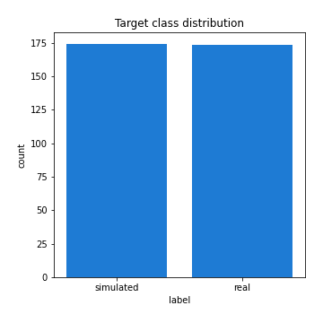
## Feature : mean1
- **Feature type** : continous
- **Missing** : 0.0%
- **Unique** : 347
- **Count** :347.0
- **Mean** :0.0772536871550049
- **Std** :0.08285660053388935
- **Min** :-0.22632637961920957
- **25%th Percentile** : 0.024698966948289817
- **50%th Percentile** : 0.07632338603253574
- **75%th Percentile** : 0.12341863079405324
- **Max** :0.37175100008111034

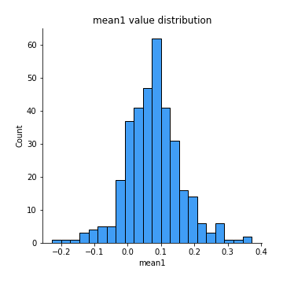
## Feature : mean2
- **Feature type** : continous
- **Missing** : 0.0%
- **Unique** : 347
- **Count** :347.0
- **Mean** :0.0884845204371965
- **Std** :0.08903004185495055
- **Min** :-0.24205418062825398
- **25%th Percentile** : 0.041535083016219054
- **50%th Percentile** : 0.09369849364798792
- **75%th Percentile** : 0.15010435465013816
- **Max** :0.31562159045349353

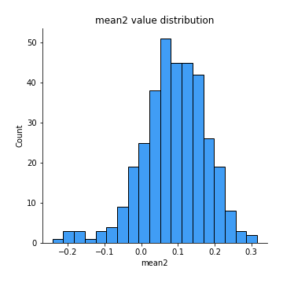
## Feature : sd1
- **Feature type** : continous
- **Missing** : 0.0%
- **Unique** : 347
- **Count** :347.0
- **Mean** :2.1152533027050895
- **Std** :0.8206273321423617
- **Min** :0.7470080772831957
- **25%th Percentile** : 1.6053718444089542
- **50%th Percentile** : 2.084997655060979
- **75%th Percentile** : 2.4452943935314737
- **Max** :9.236766377527575

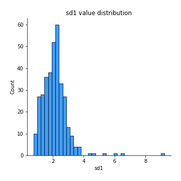
## Feature : sd2
- **Feature type** : continous
- **Missing** : 0.0%
- **Unique** : 347
- **Count** :347.0
- **Mean** :1.983884117972485
- **Std** :0.7506828013183553
- **Min** :0.8455946193085045
- **25%th Percentile** : 1.4636759552253658
- **50%th Percentile** : 1.8923413229008192
- **75%th Percentile** : 2.266921634566935
- **Max** :6.737618636746393

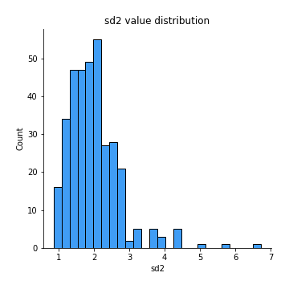
## Feature : skewness1
- **Feature type** : continous
- **Missing** : 0.0%
- **Unique** : 347
- **Count** :347.0
- **Mean** :-0.1536910916343045
- **Std** :0.5635878880169797
- **Min** :-3.453087436558107
- **25%th Percentile** : -0.31898759635846363
- **50%th Percentile** : -0.13488239631423365
- **75%th Percentile** : 0.05040935030433159
- **Max** :2.224942816365292

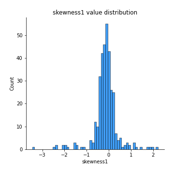
## Feature : skewness2
- **Feature type** : continous
- **Missing** : 0.0%
- **Unique** : 347
- **Count** :347.0
- **Mean** :-0.27113669283291875
- **Std** :0.8129490265765149
- **Min** :-8.801502855292393
- **25%th Percentile** : -0.3743195281774706
- **50%th Percentile** : -0.16078657049169964
- **75%th Percentile** : 0.004792855684313801
- **Max** :2.2606839051517187

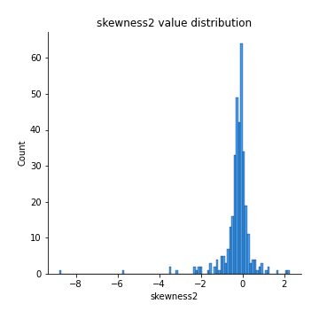
## Feature : kurtosis1
- **Feature type** : continous
- **Missing** : 0.0%
- **Unique** : 347
- **Count** :347.0
- **Mean** :3.924464443295154
- **Std** :5.684334227245481
- **Min** :0.010307392529393944
- **25%th Percentile** : 1.108283666326996
- **50%th Percentile** : 1.8965871268780155
- **75%th Percentile** : 4.012632798069458
- **Max** :46.07507808162177

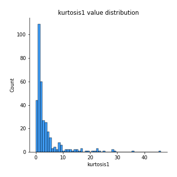
## Feature : kurtosis2
- **Feature type** : continous
- **Missing** : 0.0%
- **Unique** : 347
- **Count** :347.0
- **Mean** :4.755240524989639
- **Std** :10.341601331028363
- **Min** :0.009021804171025938
- **25%th Percentile** : 1.1965717790609913
- **50%th Percentile** : 1.9817138790794373
- **75%th Percentile** : 4.2221241429233665
- **Max** :143.10871011533666

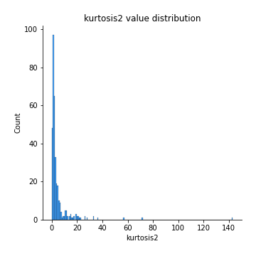
## Feature : return_autocorrelation_1_lag1
- **Feature type** : continous
- **Missing** : 0.0%
- **Unique** : 347
- **Count** :347.0
- **Mean** :-0.01538495775660301
- **Std** :0.061897343992590226
- **Min** :-0.2135576224968752
- **25%th Percentile** : -0.05165254416642128
- **50%th Percentile** : -0.010336437766352837
- **75%th Percentile** : 0.02396454949613703
- **Max** :0.1253959753011446

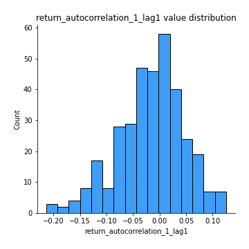
## Feature : return_autocorrelation_1_lag2
- **Feature type** : continous
- **Missing** : 0.0%
- **Unique** : 347
- **Count** :347.0
- **Mean** :-0.005804953416122203
- **Std** :0.05484900362185337
- **Min** :-0.14785601615978639
- **25%th Percentile** : -0.039563323528704314
- **50%th Percentile** : -0.0036118734350910806
- **75%th Percentile** : 0.02775717285961156
- **Max** :0.15865858723199663

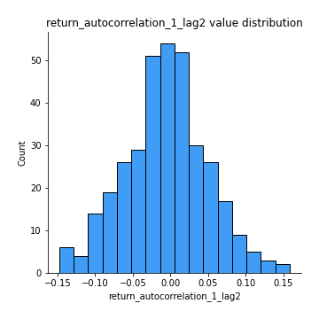
## Feature : return_autocorrelation_1_lag3
- **Feature type** : continous
- **Missing** : 0.0%
- **Unique** : 347
- **Count** :347.0
- **Mean** :-0.0057715105879916654
- **Std** :0.05598408840364824
- **Min** :-0.1940836867390813
- **25%th Percentile** : -0.041212596069877455
- **50%th Percentile** : -0.005230672627303844
- **75%th Percentile** : 0.033919311660496804
- **Max** :0.14471411673147772

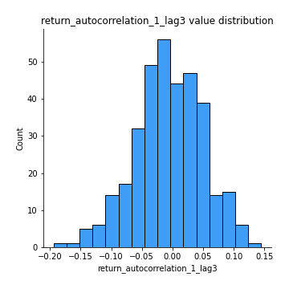
## Feature : return_autocorrelation_2_lag1
- **Feature type** : continous
- **Missing** : 0.0%
- **Unique** : 347
- **Count** :347.0
- **Mean** :-0.016198282431578136
- **Std** :0.06315727298197568
- **Min** :-0.25075531010123286
- **25%th Percentile** : -0.05419332050716595
- **50%th Percentile** : -0.01835025355332008
- **75%th Percentile** : 0.021091073893791543
- **Max** :0.31863413537898483

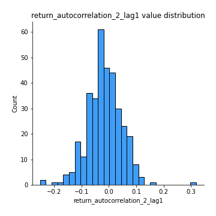
## Feature : return_autocorrelation_2_lag2
- **Feature type** : continous
- **Missing** : 0.0%
- **Unique** : 347
- **Count** :347.0
- **Mean** :-0.007089147555706159
- **Std** :0.05904026248249648
- **Min** :-0.1495113937562178
- **25%th Percentile** : -0.046002017099800604
- **50%th Percentile** : -0.010366054130496724
- **75%th Percentile** : 0.03240592899396656
- **Max** :0.20974504043791217

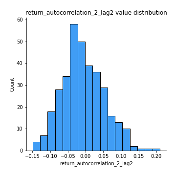
## Feature : return_autocorrelation_2_lag3
- **Feature type** : continous
- **Missing** : 0.0%
- **Unique** : 347
- **Count** :347.0
- **Mean** :-0.006660793947361455
- **Std** :0.05418026211433552
- **Min** :-0.1546702187611125
- **25%th Percentile** : -0.04396616618612789
- **50%th Percentile** : -0.004229406036457601
- **75%th Percentile** : 0.02724372892394067
- **Max** :0.17155901627840234

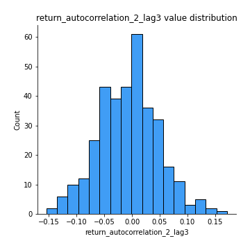
## Feature : return_correlation_ts1_lag_0
- **Feature type** : continous
- **Missing** : 0.0%
- **Unique** : 347
- **Count** :347.0
- **Mean** :0.3352413479755927
- **Std** :0.11228851414197318
- **Min** :-0.027089510445801036
- **25%th Percentile** : 0.28412352901913207
- **50%th Percentile** : 0.34024799488102053
- **75%th Percentile** : 0.3893101427891808
- **Max** :0.7041861626832071

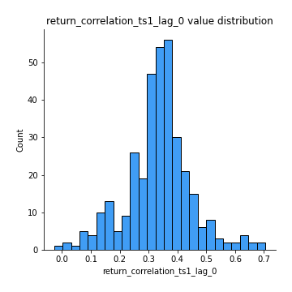
## Feature : return_correlation_ts1_lag_1
- **Feature type** : continous
- **Missing** : 0.0%
- **Unique** : 347
- **Count** :347.0
- **Mean** :-0.011700133694149241
- **Std** :0.05427072137777495
- **Min** :-0.16985510949917193
- **25%th Percentile** : -0.04703420450988564
- **50%th Percentile** : -0.005926717274740921
- **75%th Percentile** : 0.02461852235018995
- **Max** :0.1602212599144529

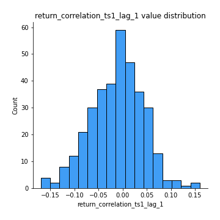
## Feature : return_correlation_ts1_lag_2
- **Feature type** : continous
- **Missing** : 0.0%
- **Unique** : 347
- **Count** :347.0
- **Mean** :-0.0024306985421205093
- **Std** :0.055222525272801866
- **Min** :-0.21653581047581763
- **25%th Percentile** : -0.04235973980019023
- **50%th Percentile** : -0.0020126584596116674
- **75%th Percentile** : 0.03753777827503324
- **Max** :0.14078013106899348

## Feature : return_correlation_ts1_lag_3
- **Feature type** : continous
- **Missing** : 0.0%
- **Unique** : 347
- **Count** :347.0
- **Mean** :-0.006443878652001154
- **Std** :0.05682503456794493
- **Min** :-0.17272052638437208
- **25%th Percentile** : -0.04270203878932628
- **50%th Percentile** : -0.006833316947276784
- **75%th Percentile** : 0.029561540850091342
- **Max** :0.1636773216468148

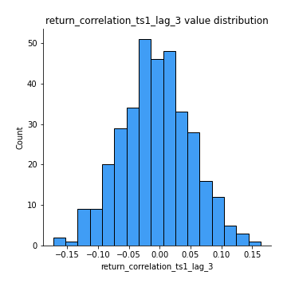
## Feature : return_correlation_ts2_lag_1
- **Feature type** : continous
- **Missing** : 0.0%
- **Unique** : 347
- **Count** :347.0
- **Mean** :-0.005750657583034513
- **Std** :0.05612236376065539
- **Min** :-0.20093919236581337
- **25%th Percentile** : -0.04298439107396672
- **50%th Percentile** : -0.007029328054122237
- **75%th Percentile** : 0.027514735536939644
- **Max** :0.21619851272771046

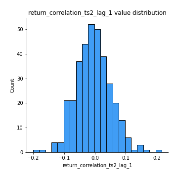
## Feature : return_correlation_ts2_lag_2
- **Feature type** : continous
- **Missing** : 0.0%
- **Unique** : 347
- **Count** :347.0
- **Mean** :-0.004074509155365994
- **Std** :0.05862888688419581
- **Min** :-0.23751835475804678
- **25%th Percentile** : -0.04274141274359669
- **50%th Percentile** : -0.0034192822174415553
- **75%th Percentile** : 0.03280395152959949
- **Max** :0.20772887392904255

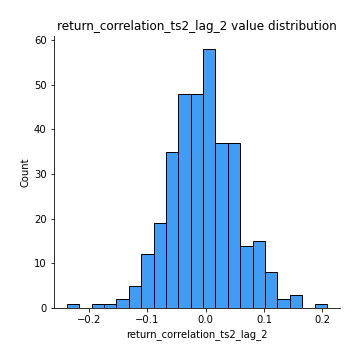
## Feature : return_correlation_ts2_lag_3
- **Feature type** : continous
- **Missing** : 0.0%
- **Unique** : 347
- **Count** :347.0
- **Mean** :-0.003359650313310227
- **Std** :0.056266827745510326
- **Min** :-0.17564076057312866
- **25%th Percentile** : -0.03520437813738165
- **50%th Percentile** : -0.00195398859043715
- **75%th Percentile** : 0.03277619454418376
- **Max** :0.13248096489568614

## Feature : sqreturn_autocorrelation_ts1_lag1
- **Feature type** : continous
- **Missing** : 0.0%
- **Unique** : 347
- **Count** :347.0
- **Mean** :0.11857666387240205
- **Std** :0.08942683893043388
- **Min** :-0.052978649713557625
- **25%th Percentile** : 0.05369579003583498
- **50%th Percentile** : 0.10469704237335442
- **75%th Percentile** : 0.16717604370900696
- **Max** :0.49414293176447355

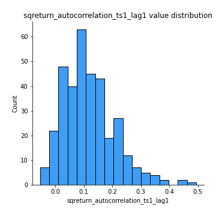
## Feature : sqreturn_autocorrelation_ts1_lag2
- **Feature type** : continous
- **Missing** : 0.0%
- **Unique** : 347
- **Count** :347.0
- **Mean** :0.10620314556841272
- **Std** :0.09241166392222332
- **Min** :-0.05419304650062953
- **25%th Percentile** : 0.03331579086139479
- **50%th Percentile** : 0.09426114116017689
- **75%th Percentile** : 0.15849731811304232
- **Max** :0.540735851444759

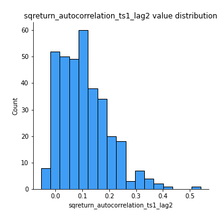
## Feature : sqreturn_autocorrelation_ts1_lag3
- **Feature type** : continous
- **Missing** : 0.0%
- **Unique** : 347
- **Count** :347.0
- **Mean** :0.10186061439411177
- **Std** :0.08631557727884925
- **Min** :-0.06486026764840777
- **25%th Percentile** : 0.03759951556650042
- **50%th Percentile** : 0.0886299932861544
- **75%th Percentile** : 0.15421548740378915
- **Max** :0.34857575772959026

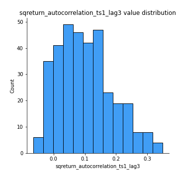
## Feature : sqreturn_autocorrelation_ts2_lag1
- **Feature type** : continous
- **Missing** : 0.0%
- **Unique** : 347
- **Count** :347.0
- **Mean** :0.12540977602811215
- **Std** :0.09015292276603781
- **Min** :-0.08520586663750691
- **25%th Percentile** : 0.05384190850295016
- **50%th Percentile** : 0.1162868013485731
- **75%th Percentile** : 0.1789484261553873
- **Max** :0.510085647437958

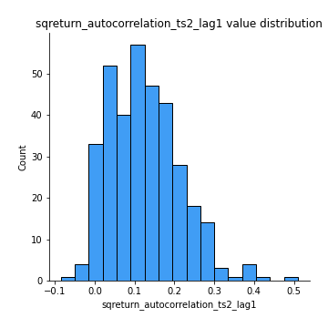
## Feature : sqreturn_autocorrelation_ts2_lag2
- **Feature type** : continous
- **Missing** : 0.0%
- **Unique** : 347
- **Count** :347.0
- **Mean** :0.10737553022243314
- **Std** :0.09463308350617539
- **Min** :-0.04424883229120365
- **25%th Percentile** : 0.03342501435600666
- **50%th Percentile** : 0.09598922623805332
- **75%th Percentile** : 0.1558583564094217
- **Max** :0.5373432415582473

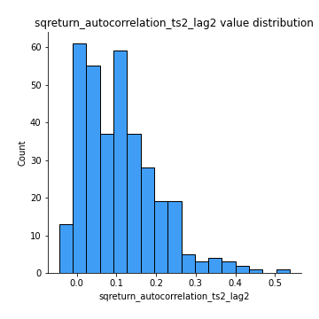
## Feature : sqreturn_autocorrelation_ts2_lag3
- **Feature type** : continous
- **Missing** : 0.0%
- **Unique** : 347
- **Count** :347.0
- **Mean** :0.09770283757996454
- **Std** :0.08469167939895725
- **Min** :-0.06082766359524085
- **25%th Percentile** : 0.02768985674568271
- **50%th Percentile** : 0.08992103143944848
- **75%th Percentile** : 0.1545595089036894
- **Max** :0.34754970649080974

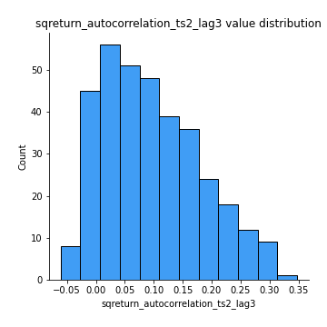
## Feature : sqreturn_correlation_ts1_lag_0
- **Feature type** : continous
- **Missing** : 0.0%
- **Unique** : 347
- **Count** :347.0
- **Mean** :0.3352413479755927
- **Std** :0.11228851414197318
- **Min** :-0.027089510445801036
- **25%th Percentile** : 0.28412352901913207
- **50%th Percentile** : 0.34024799488102053
- **75%th Percentile** : 0.3893101427891808
- **Max** :0.7041861626832071

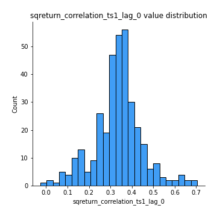
## Feature : sqreturn_correlation_ts1_lag_1
- **Feature type** : continous
- **Missing** : 0.0%
- **Unique** : 347
- **Count** :347.0
- **Mean** :-0.011700133694149241
- **Std** :0.05427072137777495
- **Min** :-0.16985510949917193
- **25%th Percentile** : -0.04703420450988564
- **50%th Percentile** : -0.005926717274740921
- **75%th Percentile** : 0.02461852235018995
- **Max** :0.1602212599144529

## Feature : sqreturn_correlation_ts1_lag_2
- **Feature type** : continous
- **Missing** : 0.0%
- **Unique** : 347
- **Count** :347.0
- **Mean** :-0.0024306985421205093
- **Std** :0.055222525272801866
- **Min** :-0.21653581047581763
- **25%th Percentile** : -0.04235973980019023
- **50%th Percentile** : -0.0020126584596116674
- **75%th Percentile** : 0.03753777827503324
- **Max** :0.14078013106899348

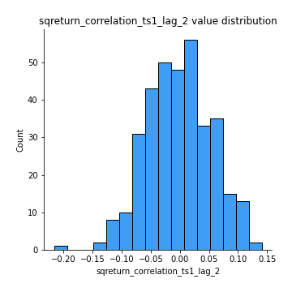
## Feature : sqreturn_correlation_ts1_lag_3
- **Feature type** : continous
- **Missing** : 0.0%
- **Unique** : 347
- **Count** :347.0
- **Mean** :-0.006443878652001154
- **Std** :0.05682503456794493
- **Min** :-0.17272052638437208
- **25%th Percentile** : -0.04270203878932628
- **50%th Percentile** : -0.006833316947276784
- **75%th Percentile** : 0.029561540850091342
- **Max** :0.1636773216468148

## Feature : sqreturn_correlation_ts2_lag_1
- **Feature type** : continous
- **Missing** : 0.0%
- **Unique** : 347
- **Count** :347.0
- **Mean** :-0.005750657583034513
- **Std** :0.05612236376065539
- **Min** :-0.20093919236581337
- **25%th Percentile** : -0.04298439107396672
- **50%th Percentile** : -0.007029328054122237
- **75%th Percentile** : 0.027514735536939644
- **Max** :0.21619851272771046

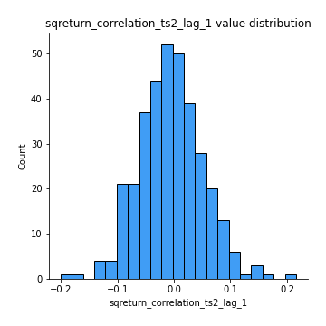
## Feature : sqreturn_correlation_ts2_lag_2
- **Feature type** : continous
- **Missing** : 0.0%
- **Unique** : 347
- **Count** :347.0
- **Mean** :-0.004074509155365994
- **Std** :0.05862888688419581
- **Min** :-0.23751835475804678
- **25%th Percentile** : -0.04274141274359669
- **50%th Percentile** : -0.0034192822174415553
- **75%th Percentile** : 0.03280395152959949
- **Max** :0.20772887392904255

## Feature : sqreturn_correlation_ts2_lag_3
- **Feature type** : continous
- **Missing** : 0.0%
- **Unique** : 347
- **Count** :347.0
- **Mean** :-0.003359650313310227
- **Std** :0.056266827745510326
- **Min** :-0.17564076057312866
- **25%th Percentile** : -0.03520437813738165
- **50%th Percentile** : -0.00195398859043715
- **75%th Percentile** : 0.03277619454418376
- **Max** :0.13248096489568614

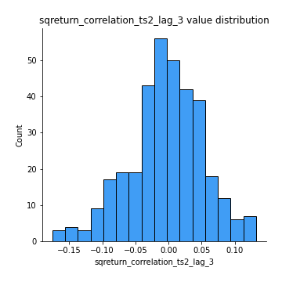
## Feature : price2_granger_cause_price1
- **Feature type** : continous
- **Missing** : 0.0%
- **Unique** : 347
- **Count** :347.0
- **Mean** :0.321186525538215
- **Std** :0.3002677883904134
- **Min** :7.875685907769154e-15
- **25%th Percentile** : 0.04440362654644366
- **50%th Percentile** : 0.2511225954919176
- **75%th Percentile** : 0.5523745463082851
- **Max** :0.9853666024514321

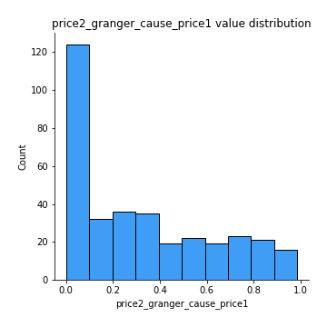
## Feature : price1_granger_cause_price2
- **Feature type** : continous
- **Missing** : 0.0%
- **Unique** : 347
- **Count** :347.0
- **Mean** :0.2961420172233259
- **Std** :0.2824704809129633
- **Min** :7.478155497141662e-17
- **25%th Percentile** : 0.04390812493580021
- **50%th Percentile** : 0.2176774341783571
- **75%th Percentile** : 0.5000185955607497
- **Max** :0.9951398266867577

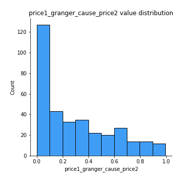

[<< Go back](../README.md)
