# Summary of 2_DecisionTree

[<< Go back](../README.md)

## Decision Tree
- **n_jobs**: -1
- **criterion**: gini
- **max_depth**: 3
- **explain_level**: 2

## Validation
 - **validation_type**: split
 - **train_ratio**: 0.75
 - **shuffle**: True
 - **stratify**: True

## Optimized metric
accuracy

## Training time

14.7 seconds

## Metric details
|           |    score |   threshold |
|:----------|---------:|------------:|
| logloss   | 1.04211  |  nan        |
| auc       | 0.775899 |  nan        |
| f1        | 0.808081 |    0.424138 |
| accuracy  | 0.781609 |    0.424138 |
| precision | 0.727273 |    0.424138 |
| recall    | 0.909091 |    0        |
| mcc       | 0.580883 |    0.424138 |

## Confusion matrix (at threshold=0.424138)
|                      |   Predicted as real |   Predicted as simulated |
|:---------------------|--------------------:|-------------------------:|
| Labeled as real      |                  28 |                       15 |
| Labeled as simulated |                   4 |                       40 |

## Learning curves
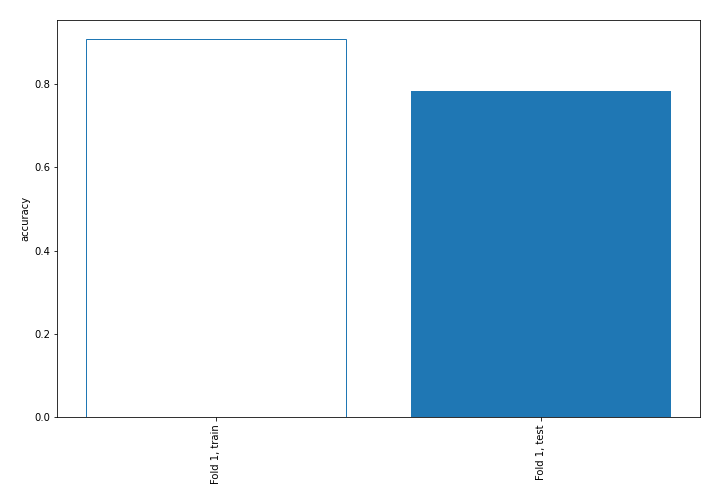

## Decision Tree 

### Tree #1
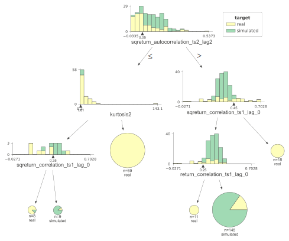

### Rules

if (sqreturn_autocorrelation_ts2_lag2 > 0.051) and (sqreturn_correlation_ts1_lag_0 <= 0.451) and (return_correlation_ts1_lag_0 > 0.251) then class: simulated (proba: 84.83%) | based on 145 samples

if (sqreturn_autocorrelation_ts2_lag2 <= 0.051) and (kurtosis2 > 1.612) then class: real (proba: 100.0%) | based on 69 samples

if (sqreturn_autocorrelation_ts2_lag2 > 0.051) and (sqreturn_correlation_ts1_lag_0 > 0.451) then class: real (proba: 100.0%) | based on 18 samples

if (sqreturn_autocorrelation_ts2_lag2 > 0.051) and (sqreturn_correlation_ts1_lag_0 <= 0.451) and (return_correlation_ts1_lag_0 <= 0.251) then class: real (proba: 100.0%) | based on 11 samples

if (sqreturn_autocorrelation_ts2_lag2 <= 0.051) and (kurtosis2 <= 1.612) and (sqreturn_correlation_ts1_lag_0 > 0.354) then class: simulated (proba: 88.89%) | based on 9 samples

if (sqreturn_autocorrelation_ts2_lag2 <= 0.051) and (kurtosis2 <= 1.612) and (sqreturn_correlation_ts1_lag_0 <= 0.354) then class: real (proba: 87.5%) | based on 8 samples

## Permutation-based Importance
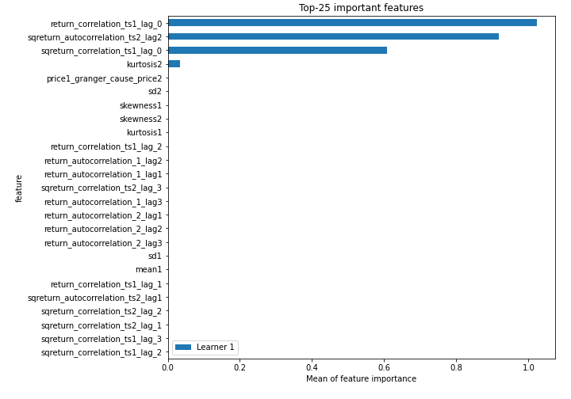
## Confusion Matrix

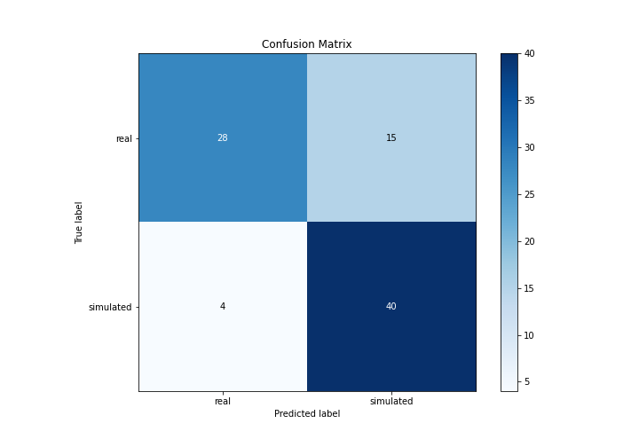

## Normalized Confusion Matrix

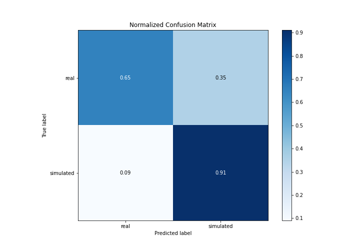

## ROC Curve

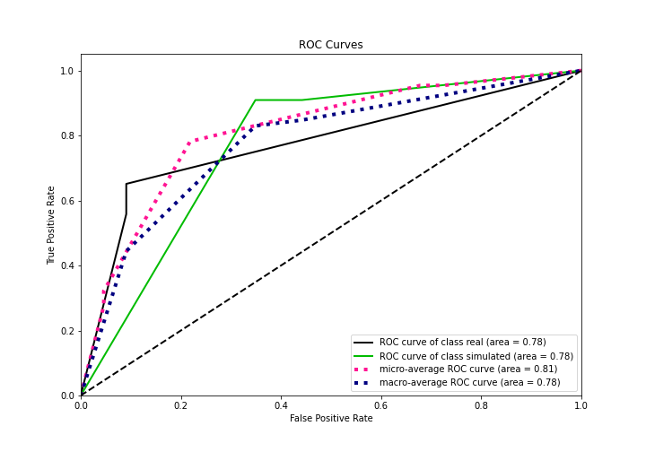

## Kolmogorov-Smirnov Statistic

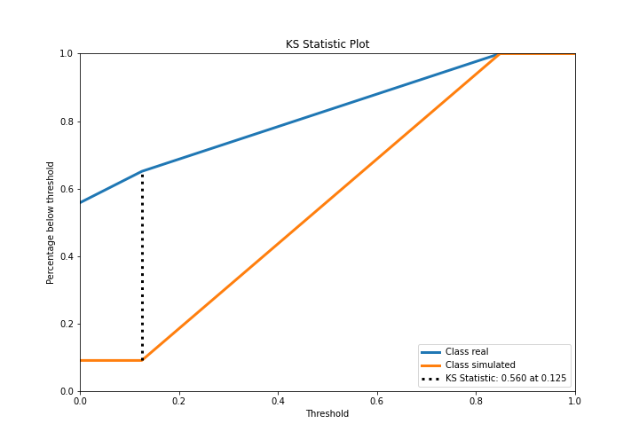

## Precision-Recall Curve

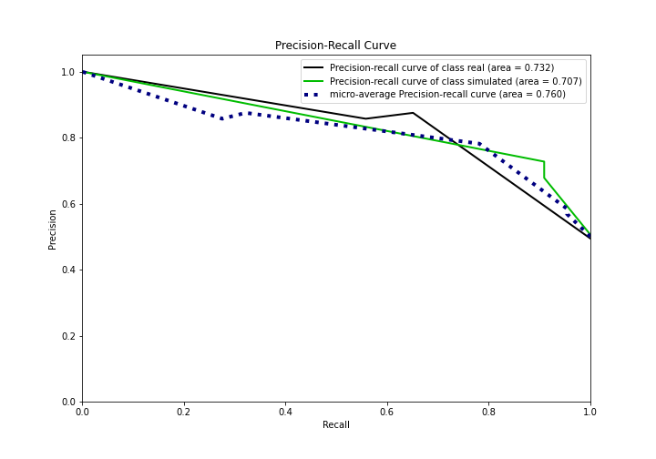

## Calibration Curve

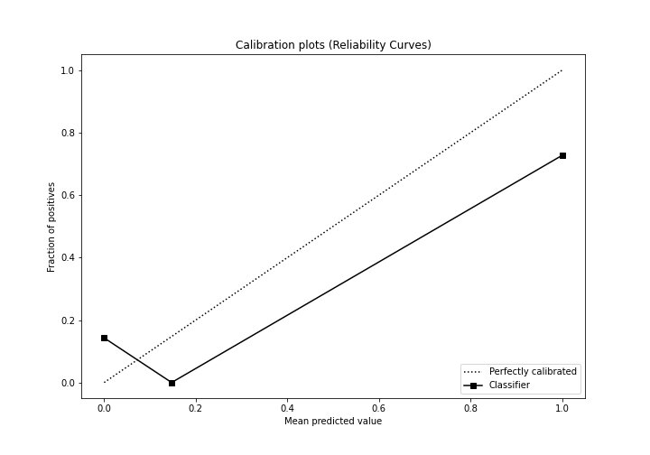

## Cumulative Gains Curve

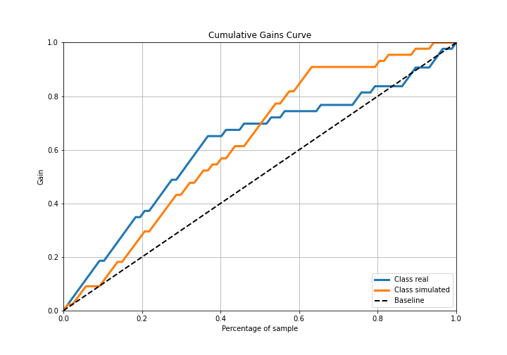

## Lift Curve

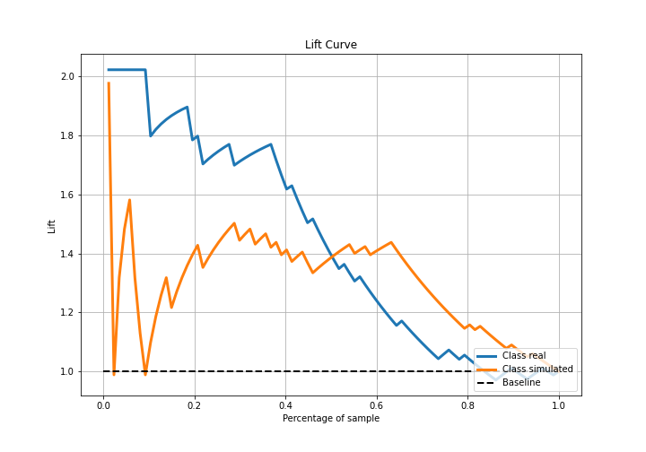

## SHAP Importance
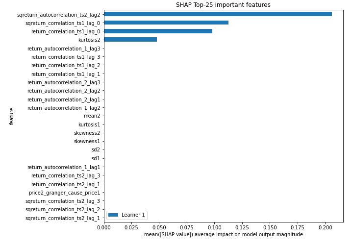

## SHAP Dependence plots

### Dependence (Fold 1)
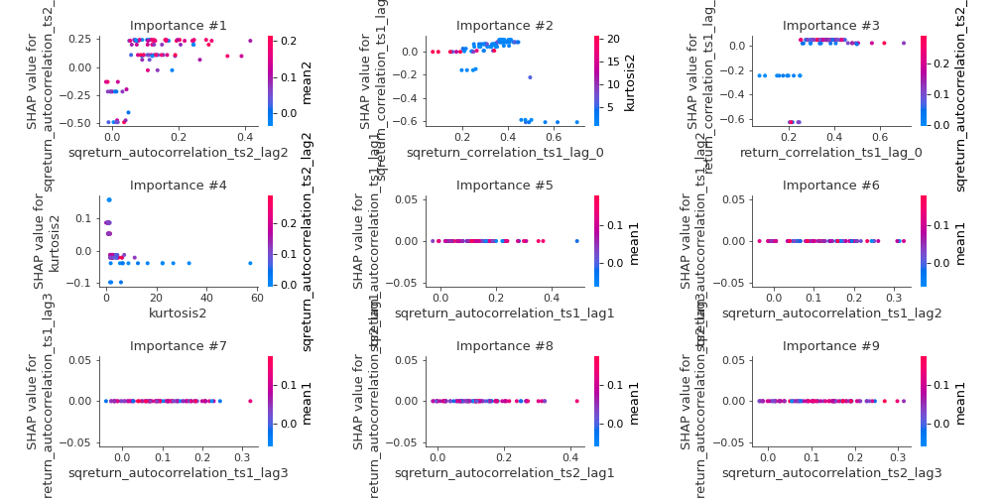

## SHAP Decision plots

### Top-10 Worst decisions for class 0 (Fold 1)
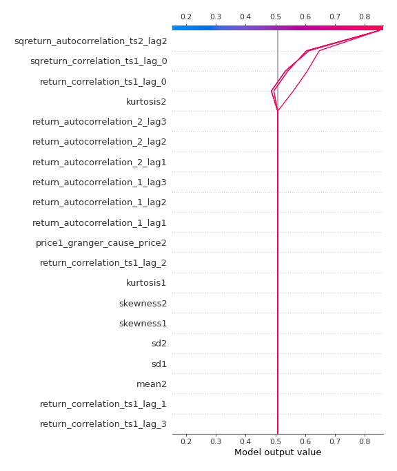
### Top-10 Best decisions for class 0 (Fold 1)
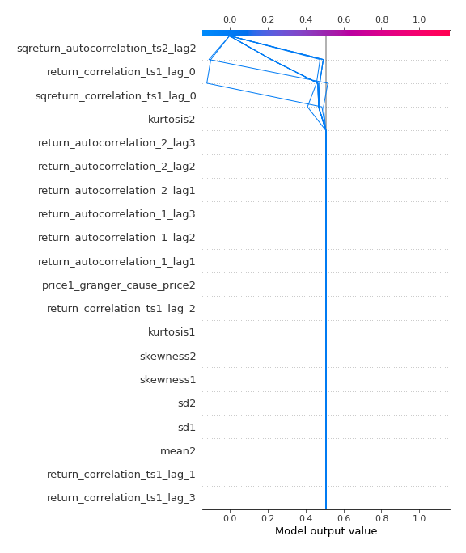
### Top-10 Worst decisions for class 1 (Fold 1)
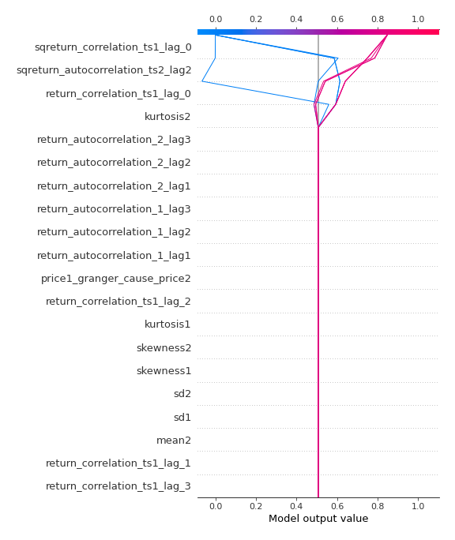
### Top-10 Best decisions for class 1 (Fold 1)

[<< Go back](../README.md)
