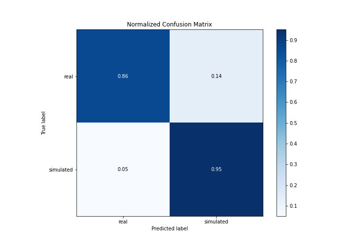

# Summary of 3_Linear

[<< Go back](../README.md)

## Logistic Regression (Linear)
- **n_jobs**: -1
- **explain_level**: 2

## Validation
 - **validation_type**: split
 - **train_ratio**: 0.75
 - **shuffle**: True
 - **stratify**: True

## Optimized metric
accuracy

## Training time

13.4 seconds

## Metric details
|           |    score |     threshold |
|:----------|---------:|--------------:|
| logloss   | 0.354352 | nan           |
| auc       | 0.951374 | nan           |
| f1        | 0.913043 |   0.566739    |
| accuracy  | 0.908046 |   0.566739    |
| precision | 1        |   0.848284    |
| recall    | 1        |   3.89431e-13 |
| mcc       | 0.819353 |   0.566739    |

## Confusion matrix (at threshold=0.566739)
|                      |   Predicted as real |   Predicted as simulated |
|:---------------------|--------------------:|-------------------------:|
| Labeled as real      |                  37 |                        6 |
| Labeled as simulated |                   2 |                       42 |

## Learning curves

## Coefficients
| feature                           |   Learner_1 |
|:----------------------------------|------------:|
| mean2                             |   1.89388   |
| sqreturn_autocorrelation_ts1_lag3 |   1.53128   |
| sqreturn_autocorrelation_ts2_lag3 |   1.47052   |
| mean1                             |   1.42041   |
| sqreturn_autocorrelation_ts2_lag1 |   1.05613   |
| sqreturn_autocorrelation_ts2_lag2 |   1.01192   |
| sqreturn_autocorrelation_ts1_lag1 |   0.811242  |
| return_correlation_ts1_lag_1      |   0.66658   |
| sqreturn_correlation_ts1_lag_1    |   0.66658   |
| sqreturn_autocorrelation_ts1_lag2 |   0.648663  |
| return_autocorrelation_1_lag3     |   0.605252  |
| return_autocorrelation_2_lag1     |   0.554319  |
| return_autocorrelation_1_lag1     |   0.546187  |
| sd1                               |   0.498682  |
| sqreturn_correlation_ts1_lag_3    |   0.430099  |
| return_correlation_ts1_lag_3      |   0.430099  |
| return_autocorrelation_2_lag3     |   0.35343   |
| sqreturn_correlation_ts2_lag_3    |   0.289333  |
| return_correlation_ts2_lag_3      |   0.289333  |
| sqreturn_correlation_ts2_lag_1    |   0.280355  |
| return_correlation_ts2_lag_1      |   0.280355  |
| sqreturn_correlation_ts1_lag_2    |   0.158821  |
| return_correlation_ts1_lag_2      |   0.158821  |
| price1_granger_cause_price2       |   0.0693263 |
| return_autocorrelation_2_lag2     |   0.0502314 |
| return_autocorrelation_1_lag2     |   0.0375338 |
| return_correlation_ts2_lag_2      |  -0.142053  |
| sqreturn_correlation_ts2_lag_2    |  -0.142053  |
| return_correlation_ts1_lag_0      |  -0.30056   |
| sqreturn_correlation_ts1_lag_0    |  -0.30056   |
| price2_granger_cause_price1       |  -0.445253  |
| sd2                               |  -0.474629  |
| skewness2                         |  -0.666566  |
| skewness1                         |  -0.965614  |
| intercept                         |  -1.68944   |
| kurtosis1                         |  -2.22294   |
| kurtosis2                         |  -2.61838   |

## Permutation-based Importance

## Confusion Matrix

## Normalized Confusion Matrix

## ROC Curve

## Kolmogorov-Smirnov Statistic

## Precision-Recall Curve

## Calibration Curve

## Cumulative Gains Curve

## Lift Curve

## SHAP Importance

## SHAP Dependence plots

### Dependence (Fold 1)

## SHAP Decision plots

### Top-10 Worst decisions for class 0 (Fold 1)

### Top-10 Best decisions for class 0 (Fold 1)

### Top-10 Worst decisions for class 1 (Fold 1)

### Top-10 Best decisions for class 1 (Fold 1)

[<< Go back](../README.md)
