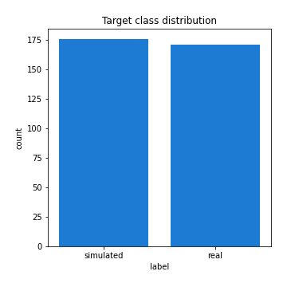
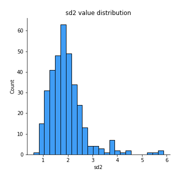
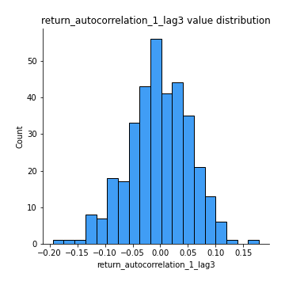
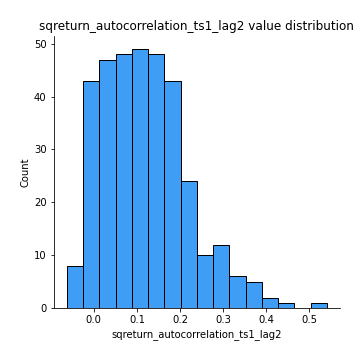

# Exploratory Data Analysis

[<< Go back](../README.md)
## Feature : target
- **Feature type** : categorical
- **Missing** : 0.0%
- **Unique** : 2
- **Count** :347
- **Unique** :2
- **Top** :simulated
- **Freq** :176

## Feature : mean1
- **Feature type** : continous
- **Missing** : 0.0%
- **Unique** : 347
- **Count** :347.0
- **Mean** :0.0769318942955907
- **Std** :0.07840673350261433
- **Min** :-0.22632637961920957
- **25%th Percentile** : 0.033117162793130234
- **50%th Percentile** : 0.07769478015255134
- **75%th Percentile** : 0.12111922945205318
- **Max** :0.37175100008111034

## Feature : mean2
- **Feature type** : continous
- **Missing** : 0.0%
- **Unique** : 347
- **Count** :347.0
- **Mean** :0.09095941896080459
- **Std** :0.08742918484250246
- **Min** :-0.24205418062825398
- **25%th Percentile** : 0.03816453811691925
- **50%th Percentile** : 0.09191216230344779
- **75%th Percentile** : 0.14687206226402177
- **Max** :0.37616608147096464

## Feature : sd1
- **Feature type** : continous
- **Missing** : 0.0%
- **Unique** : 347
- **Count** :347.0
- **Mean** :2.068546207598099
- **Std** :0.8132858824895356
- **Min** :0.7138235088650245
- **25%th Percentile** : 1.5776513229002362
- **50%th Percentile** : 1.9997514171741797
- **75%th Percentile** : 2.402464986381668
- **Max** :9.236766377527575

## Feature : sd2
- **Feature type** : continous
- **Missing** : 0.0%
- **Unique** : 347
- **Count** :347.0
- **Mean** :1.9488570418385314
- **Std** :0.7573445099488997
- **Min** :0.6046457498478687
- **25%th Percentile** : 1.4761043958697377
- **50%th Percentile** : 1.8289547494343743
- **75%th Percentile** : 2.2514961944567577
- **Max** :5.872800253666788

## Feature : skewness1
- **Feature type** : continous
- **Missing** : 0.0%
- **Unique** : 347
- **Count** :347.0
- **Mean** :-0.1581038660372597
- **Std** :0.6177699919238202
- **Min** :-3.530116233761814
- **25%th Percentile** : -0.3223151391034291
- **50%th Percentile** : -0.1266749335676343
- **75%th Percentile** : 0.05282364476950803
- **Max** :2.224942816365292

## Feature : skewness2
- **Feature type** : continous
- **Missing** : 0.0%
- **Unique** : 347
- **Count** :347.0
- **Mean** :-0.22510019704932838
- **Std** :0.7731573519451298
- **Min** :-8.801502855292393
- **25%th Percentile** : -0.3674465734419843
- **50%th Percentile** : -0.16071432098139332
- **75%th Percentile** : 0.016636961407461077
- **Max** :2.2606839051517187

## Feature : kurtosis1
- **Feature type** : continous
- **Missing** : 0.0%
- **Unique** : 347
- **Count** :347.0
- **Mean** :3.943252828253079
- **Std** :5.67255299293254
- **Min** :0.07149361823522637
- **25%th Percentile** : 1.1075518452911446
- **50%th Percentile** : 1.9799269187070894
- **75%th Percentile** : 4.003906323095945
- **Max** :46.07507808162177

## Feature : kurtosis2
- **Feature type** : continous
- **Missing** : 0.0%
- **Unique** : 347
- **Count** :347.0
- **Mean** :4.595537203619287
- **Std** :9.614097435473228
- **Min** :0.03477901990230814
- **25%th Percentile** : 1.2388908495453417
- **50%th Percentile** : 2.0106191432397673
- **75%th Percentile** : 4.479344862927411
- **Max** :143.10871011533666

## Feature : return_autocorrelation_1_lag1
- **Feature type** : continous
- **Missing** : 0.0%
- **Unique** : 347
- **Count** :347.0
- **Mean** :-0.014106723634492316
- **Std** :0.06069174092504105
- **Min** :-0.2135576224968752
- **25%th Percentile** : -0.049267066963959154
- **50%th Percentile** : -0.009760223158649127
- **75%th Percentile** : 0.023902415928454747
- **Max** :0.1836219982722047

## Feature : return_autocorrelation_1_lag2
- **Feature type** : continous
- **Missing** : 0.0%
- **Unique** : 347
- **Count** :347.0
- **Mean** :-0.007748995027144873
- **Std** :0.05489036155465475
- **Min** :-0.16502824344964753
- **25%th Percentile** : -0.04151480727243401
- **50%th Percentile** : -0.009043088888686804
- **75%th Percentile** : 0.02708670862140679
- **Max** :0.14530014011899423

## Feature : return_autocorrelation_1_lag3
- **Feature type** : continous
- **Missing** : 0.0%
- **Unique** : 347
- **Count** :347.0
- **Mean** :-0.0027539658299670865
- **Std** :0.05575777394224052
- **Min** :-0.1940836867390813
- **25%th Percentile** : -0.03696630186685869
- **50%th Percentile** : -0.001593208013365921
- **75%th Percentile** : 0.034698244961083244
- **Max** :0.17805869530681923

## Feature : return_autocorrelation_2_lag1
- **Feature type** : continous
- **Missing** : 0.0%
- **Unique** : 347
- **Count** :347.0
- **Mean** :-0.019624500803084532
- **Std** :0.06298962741040562
- **Min** :-0.25075531010123286
- **25%th Percentile** : -0.061226911122622865
- **50%th Percentile** : -0.013881835331502288
- **75%th Percentile** : 0.022867472451004407
- **Max** :0.15422548367677708

## Feature : return_autocorrelation_2_lag2
- **Feature type** : continous
- **Missing** : 0.0%
- **Unique** : 347
- **Count** :347.0
- **Mean** :-0.007531359538230099
- **Std** :0.055131739151973676
- **Min** :-0.15323211089747296
- **25%th Percentile** : -0.04596159739535724
- **50%th Percentile** : -0.007521628340500333
- **75%th Percentile** : 0.029970581565601985
- **Max** :0.1735398560230086

## Feature : return_autocorrelation_2_lag3
- **Feature type** : continous
- **Missing** : 0.0%
- **Unique** : 347
- **Count** :347.0
- **Mean** :-0.0017885203149208071
- **Std** :0.056952672725488554
- **Min** :-0.14200107169559698
- **25%th Percentile** : -0.043364988314530895
- **50%th Percentile** : -0.0007954854322127135
- **75%th Percentile** : 0.038522734425834274
- **Max** :0.14706195396412272

## Feature : return_correlation_ts1_lag_0
- **Feature type** : continous
- **Missing** : 0.0%
- **Unique** : 347
- **Count** :347.0
- **Mean** :0.33842269712675094
- **Std** :0.10955957393548038
- **Min** :-0.027089510445801036
- **25%th Percentile** : 0.28233282677506016
- **50%th Percentile** : 0.3516504309064393
- **75%th Percentile** : 0.39423180819198267
- **Max** :0.7041861626832071

## Feature : return_correlation_ts1_lag_1
- **Feature type** : continous
- **Missing** : 0.0%
- **Unique** : 347
- **Count** :347.0
- **Mean** :-0.010360729786069183
- **Std** :0.05340886944144782
- **Min** :-0.16985510949917193
- **25%th Percentile** : -0.04595609286605576
- **50%th Percentile** : -0.0065492445847118745
- **75%th Percentile** : 0.024792008564782114
- **Max** :0.15499424718508623

## Feature : return_correlation_ts1_lag_2
- **Feature type** : continous
- **Missing** : 0.0%
- **Unique** : 347
- **Count** :347.0
- **Mean** :-0.0024078426081975126
- **Std** :0.05371911572044777
- **Min** :-0.21653581047581763
- **25%th Percentile** : -0.03804215270233348
- **50%th Percentile** : -0.00018333386598916331
- **75%th Percentile** : 0.03574585317485377
- **Max** :0.1507129735226079

## Feature : return_correlation_ts1_lag_3
- **Feature type** : continous
- **Missing** : 0.0%
- **Unique** : 347
- **Count** :347.0
- **Mean** :-0.002267980725012766
- **Std** :0.05428905429502557
- **Min** :-0.12398661128348018
- **25%th Percentile** : -0.038951200995201524
- **50%th Percentile** : -0.0056861818805511236
- **75%th Percentile** : 0.036323149646627514
- **Max** :0.1636773216468148

## Feature : return_correlation_ts2_lag_1
- **Feature type** : continous
- **Missing** : 0.0%
- **Unique** : 347
- **Count** :347.0
- **Mean** :-0.01033461469084115
- **Std** :0.056996589318506284
- **Min** :-0.2081139431093261
- **25%th Percentile** : -0.04747052170412771
- **50%th Percentile** : -0.011779214569462437
- **75%th Percentile** : 0.02494000585690604
- **Max** :0.17208763791364762

## Feature : return_correlation_ts2_lag_2
- **Feature type** : continous
- **Missing** : 0.0%
- **Unique** : 347
- **Count** :347.0
- **Mean** :-0.005562636649497011
- **Std** :0.053630000324745734
- **Min** :-0.23751835475804678
- **25%th Percentile** : -0.04305982249865989
- **50%th Percentile** : -0.007151235237470172
- **75%th Percentile** : 0.027728574621702813
- **Max** :0.15388933426238696

## Feature : return_correlation_ts2_lag_3
- **Feature type** : continous
- **Missing** : 0.0%
- **Unique** : 347
- **Count** :347.0
- **Mean** :-0.006186739038791312
- **Std** :0.05520408744935401
- **Min** :-0.17137667783397895
- **25%th Percentile** : -0.037262999732804565
- **50%th Percentile** : -0.004399611847170813
- **75%th Percentile** : 0.031254435776264064
- **Max** :0.1696049136382582

## Feature : sqreturn_autocorrelation_ts1_lag1
- **Feature type** : continous
- **Missing** : 0.0%
- **Unique** : 347
- **Count** :347.0
- **Mean** :0.12557954364380783
- **Std** :0.08823134140894794
- **Min** :-0.052978649713557625
- **25%th Percentile** : 0.06371561391465505
- **50%th Percentile** : 0.11037151433790987
- **75%th Percentile** : 0.1756491063445779
- **Max** :0.49414293176447355

## Feature : sqreturn_autocorrelation_ts1_lag2
- **Feature type** : continous
- **Missing** : 0.0%
- **Unique** : 347
- **Count** :347.0
- **Mean** :0.11900313006510818
- **Std** :0.0990916501092575
- **Min** :-0.06277202333649679
- **25%th Percentile** : 0.041766314637092
- **50%th Percentile** : 0.11281960814754216
- **75%th Percentile** : 0.17607788419474718
- **Max** :0.540735851444759

## Feature : sqreturn_autocorrelation_ts1_lag3
- **Feature type** : continous
- **Missing** : 0.0%
- **Unique** : 347
- **Count** :347.0
- **Mean** :0.10936698628728127
- **Std** :0.08831831317290799
- **Min** :-0.06486026764840777
- **25%th Percentile** : 0.03945154868107501
- **50%th Percentile** : 0.10767428021860706
- **75%th Percentile** : 0.16538454630917288
- **Max** :0.44755937369538146

## Feature : sqreturn_autocorrelation_ts2_lag1
- **Feature type** : continous
- **Missing** : 0.0%
- **Unique** : 347
- **Count** :347.0
- **Mean** :0.11984998967443361
- **Std** :0.08399360023268235
- **Min** :-0.08520586663750691
- **25%th Percentile** : 0.05474737605625209
- **50%th Percentile** : 0.11140113291673732
- **75%th Percentile** : 0.17424340209191558
- **Max** :0.4190090519891419

## Feature : sqreturn_autocorrelation_ts2_lag2
- **Feature type** : continous
- **Missing** : 0.0%
- **Unique** : 347
- **Count** :347.0
- **Mean** :0.11220630807379663
- **Std** :0.09236622490838112
- **Min** :-0.033516679666994106
- **25%th Percentile** : 0.040147287179445615
- **50%th Percentile** : 0.1045196848777715
- **75%th Percentile** : 0.1696187660310207
- **Max** :0.5373432415582473

## Feature : sqreturn_autocorrelation_ts2_lag3
- **Feature type** : continous
- **Missing** : 0.0%
- **Unique** : 347
- **Count** :347.0
- **Mean** :0.1024613370711558
- **Std** :0.08433728502500891
- **Min** :-0.06065894750062144
- **25%th Percentile** : 0.03285592317681589
- **50%th Percentile** : 0.09466762874931561
- **75%th Percentile** : 0.16542414172922243
- **Max** :0.37033078879198267

## Feature : sqreturn_correlation_ts1_lag_0
- **Feature type** : continous
- **Missing** : 0.0%
- **Unique** : 347
- **Count** :347.0
- **Mean** :0.33842269712675094
- **Std** :0.10955957393548038
- **Min** :-0.027089510445801036
- **25%th Percentile** : 0.28233282677506016
- **50%th Percentile** : 0.3516504309064393
- **75%th Percentile** : 0.39423180819198267
- **Max** :0.7041861626832071

## Feature : sqreturn_correlation_ts1_lag_1
- **Feature type** : continous
- **Missing** : 0.0%
- **Unique** : 347
- **Count** :347.0
- **Mean** :-0.010360729786069183
- **Std** :0.05340886944144782
- **Min** :-0.16985510949917193
- **25%th Percentile** : -0.04595609286605576
- **50%th Percentile** : -0.0065492445847118745
- **75%th Percentile** : 0.024792008564782114
- **Max** :0.15499424718508623

## Feature : sqreturn_correlation_ts1_lag_2
- **Feature type** : continous
- **Missing** : 0.0%
- **Unique** : 347
- **Count** :347.0
- **Mean** :-0.0024078426081975126
- **Std** :0.05371911572044777
- **Min** :-0.21653581047581763
- **25%th Percentile** : -0.03804215270233348
- **50%th Percentile** : -0.00018333386598916331
- **75%th Percentile** : 0.03574585317485377
- **Max** :0.1507129735226079

## Feature : sqreturn_correlation_ts1_lag_3
- **Feature type** : continous
- **Missing** : 0.0%
- **Unique** : 347
- **Count** :347.0
- **Mean** :-0.002267980725012766
- **Std** :0.05428905429502557
- **Min** :-0.12398661128348018
- **25%th Percentile** : -0.038951200995201524
- **50%th Percentile** : -0.0056861818805511236
- **75%th Percentile** : 0.036323149646627514
- **Max** :0.1636773216468148

## Feature : sqreturn_correlation_ts2_lag_1
- **Feature type** : continous
- **Missing** : 0.0%
- **Unique** : 347
- **Count** :347.0
- **Mean** :-0.01033461469084115
- **Std** :0.056996589318506284
- **Min** :-0.2081139431093261
- **25%th Percentile** : -0.04747052170412771
- **50%th Percentile** : -0.011779214569462437
- **75%th Percentile** : 0.02494000585690604
- **Max** :0.17208763791364762

## Feature : sqreturn_correlation_ts2_lag_2
- **Feature type** : continous
- **Missing** : 0.0%
- **Unique** : 347
- **Count** :347.0
- **Mean** :-0.005562636649497011
- **Std** :0.053630000324745734
- **Min** :-0.23751835475804678
- **25%th Percentile** : -0.04305982249865989
- **50%th Percentile** : -0.007151235237470172
- **75%th Percentile** : 0.027728574621702813
- **Max** :0.15388933426238696

## Feature : sqreturn_correlation_ts2_lag_3
- **Feature type** : continous
- **Missing** : 0.0%
- **Unique** : 347
- **Count** :347.0
- **Mean** :-0.006186739038791312
- **Std** :0.05520408744935401
- **Min** :-0.17137667783397895
- **25%th Percentile** : -0.037262999732804565
- **50%th Percentile** : -0.004399611847170813
- **75%th Percentile** : 0.031254435776264064
- **Max** :0.1696049136382582

## Feature : price2_granger_cause_price1
- **Feature type** : continous
- **Missing** : 0.0%
- **Unique** : 347
- **Count** :347.0
- **Mean** :0.31540417680825616
- **Std** :0.30490487197536925
- **Min** :9.692300514458835e-07
- **25%th Percentile** : 0.037510430445644824
- **50%th Percentile** : 0.2070573536597632
- **75%th Percentile** : 0.550263593470958
- **Max** :0.9872521546835397

## Feature : price1_granger_cause_price2
- **Feature type** : continous
- **Missing** : 0.0%
- **Unique** : 347
- **Count** :347.0
- **Mean** :0.3001173115375676
- **Std** :0.2816215973461754
- **Min** :2.0209691973189193e-17
- **25%th Percentile** : 0.04320676228379948
- **50%th Percentile** : 0.2176774341783571
- **75%th Percentile** : 0.5232955663571262
- **Max** :0.9845551250403185

[<< Go back](../README.md)
