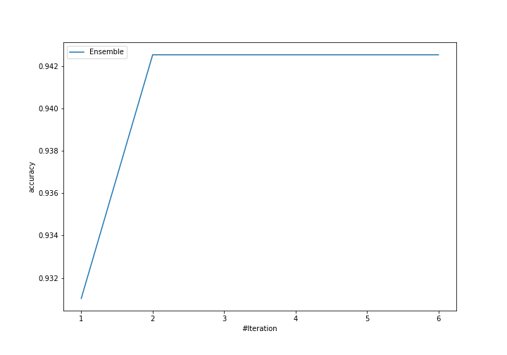
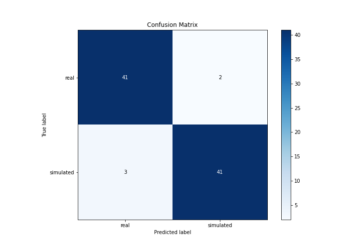
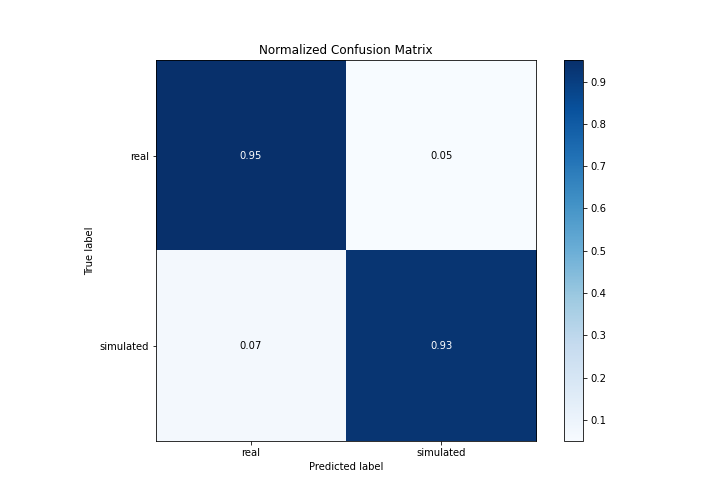
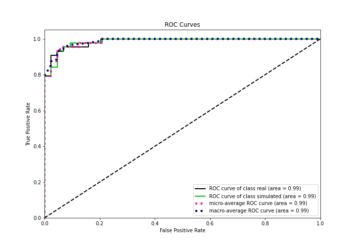
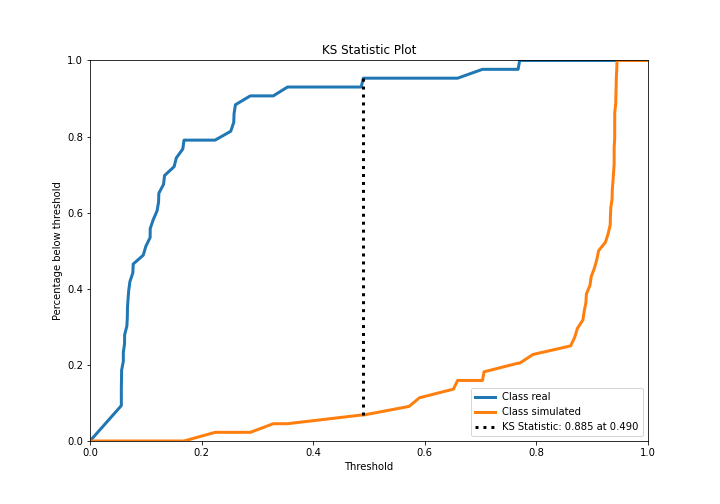
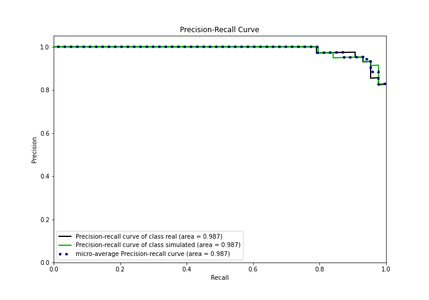
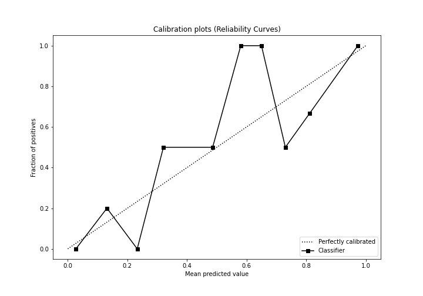
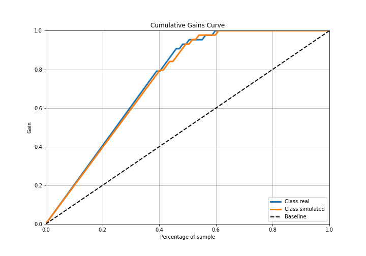
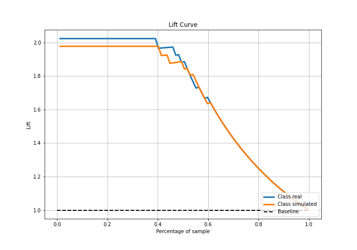

# Summary of Ensemble

[<< Go back](../README.md)

## Ensemble structure
| Model                   |   Weight |
|:------------------------|---------:|
| 4_Default_Xgboost       |        1 |
| 5_Default_NeuralNetwork |        1 |

## Metric details
|           |    score |   threshold |
|:----------|---------:|------------:|
| logloss   | 0.200866 | nan         |
| auc       | 0.986258 | nan         |
| f1        | 0.945055 |   0.323293  |
| accuracy  | 0.942529 |   0.51881   |
| precision | 1        |   0.938759  |
| recall    | 1        |   0.0505353 |
| mcc       | 0.887067 |   0.323293  |

## Confusion matrix (at threshold=0.51881)
|                      |   Predicted as real |   Predicted as simulated |
|:---------------------|--------------------:|-------------------------:|
| Labeled as real      |                  41 |                        2 |
| Labeled as simulated |                   3 |                       41 |

## Learning curves

## Confusion Matrix

## Normalized Confusion Matrix

## ROC Curve

## Kolmogorov-Smirnov Statistic

## Precision-Recall Curve

## Calibration Curve

## Cumulative Gains Curve

## Lift Curve

[<< Go back](../README.md)
