# Summary of 2_DecisionTree

[<< Go back](../README.md)

## Decision Tree
- **n_jobs**: -1
- **criterion**: gini
- **max_depth**: 3
- **explain_level**: 2

## Validation
 - **validation_type**: split
 - **train_ratio**: 0.75
 - **shuffle**: True
 - **stratify**: True

## Optimized metric
accuracy

## Training time

8.6 seconds

## Metric details
|           |    score |   threshold |
|:----------|---------:|------------:|
| logloss   | 0.416059 |  nan        |
| auc       | 0.862315 |  nan        |
| f1        | 0.863158 |    0.461864 |
| accuracy  | 0.850575 |    0.461864 |
| precision | 1        |    0.923729 |
| recall    | 1        |    0        |
| mcc       | 0.709844 |    0.461864 |

## Confusion matrix (at threshold=0.461864)
|                      |   Predicted as real |   Predicted as simulated |
|:---------------------|--------------------:|-------------------------:|
| Labeled as real      |                  33 |                       10 |
| Labeled as simulated |                   3 |                       41 |

## Learning curves
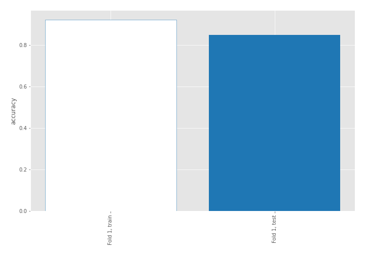

## Decision Tree 

### Tree #1
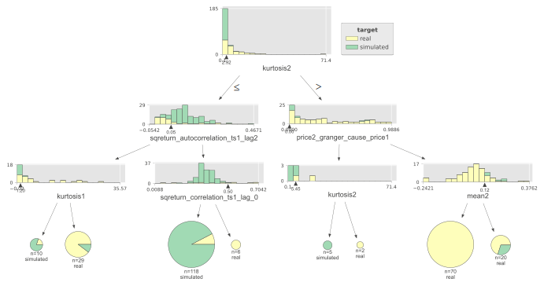

### Rules

if (kurtosis2 <= 2.923) and (sqreturn_autocorrelation_ts1_lag2 > 0.054) and (sqreturn_correlation_ts1_lag_0 <= 0.5) then class: simulated (proba: 92.37%) | based on 118 samples

if (kurtosis2 > 2.923) and (price2_granger_cause_price1 > 0.002) and (mean2 <= 0.116) then class: real (proba: 100.0%) | based on 70 samples

if (kurtosis2 <= 2.923) and (sqreturn_autocorrelation_ts1_lag2 <= 0.054) and (kurtosis1 > 1.199) then class: real (proba: 89.66%) | based on 29 samples

if (kurtosis2 > 2.923) and (price2_granger_cause_price1 > 0.002) and (mean2 > 0.116) then class: real (proba: 70.0%) | based on 20 samples

if (kurtosis2 <= 2.923) and (sqreturn_autocorrelation_ts1_lag2 <= 0.054) and (kurtosis1 <= 1.199) then class: simulated (proba: 80.0%) | based on 10 samples

if (kurtosis2 <= 2.923) and (sqreturn_autocorrelation_ts1_lag2 > 0.054) and (sqreturn_correlation_ts1_lag_0 > 0.5) then class: real (proba: 100.0%) | based on 6 samples

if (kurtosis2 > 2.923) and (price2_granger_cause_price1 <= 0.002) and (kurtosis2 <= 5.446) then class: simulated (proba: 100.0%) | based on 5 samples

if (kurtosis2 > 2.923) and (price2_granger_cause_price1 <= 0.002) and (kurtosis2 > 5.446) then class: real (proba: 100.0%) | based on 2 samples

## Permutation-based Importance
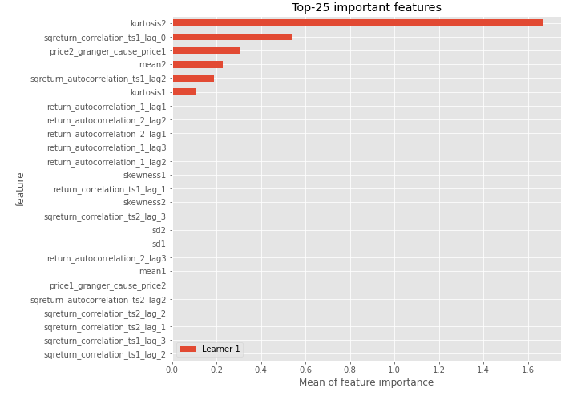
## Confusion Matrix

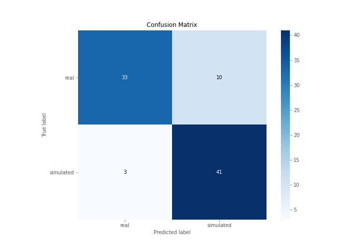

## Normalized Confusion Matrix

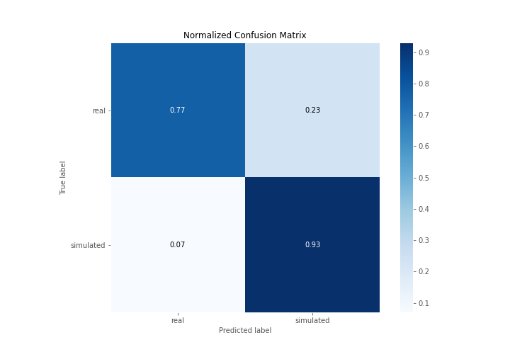

## ROC Curve

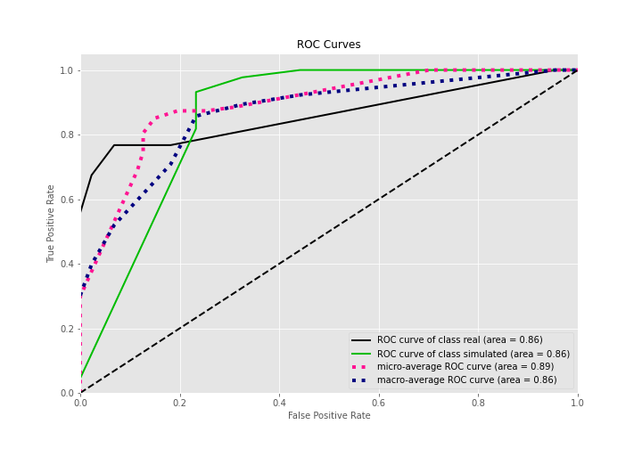

## Kolmogorov-Smirnov Statistic

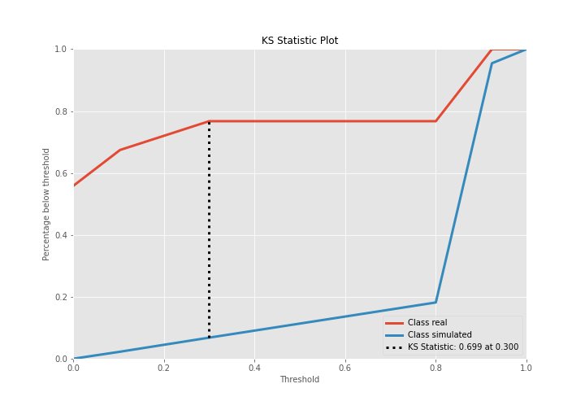

## Precision-Recall Curve

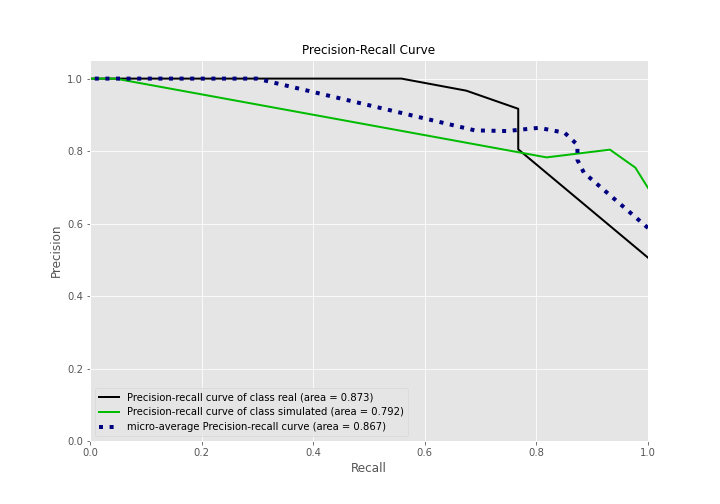

## Calibration Curve

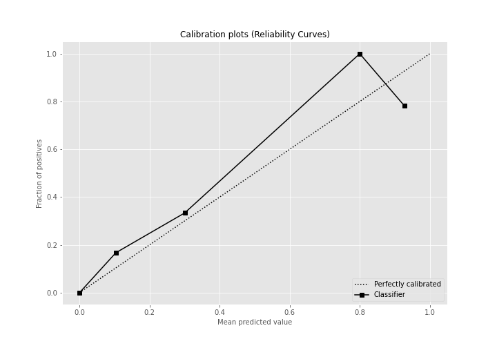

## Cumulative Gains Curve

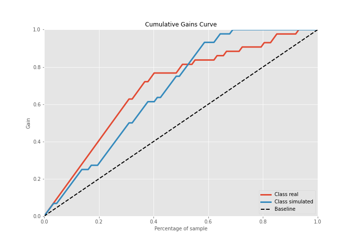

## Lift Curve

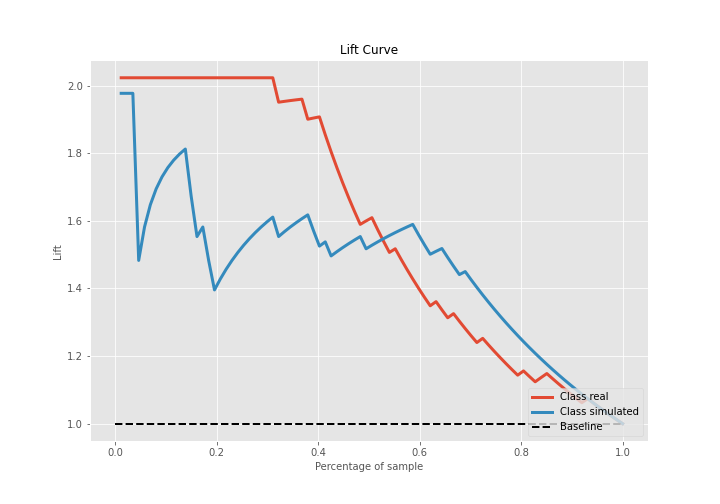

## SHAP Importance
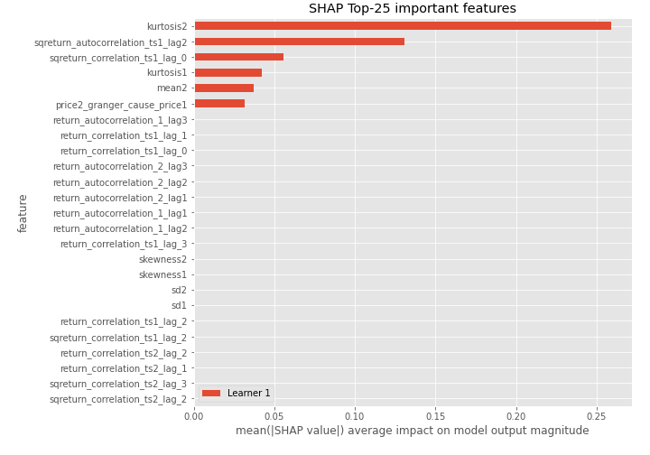

## SHAP Dependence plots

### Dependence (Fold 1)
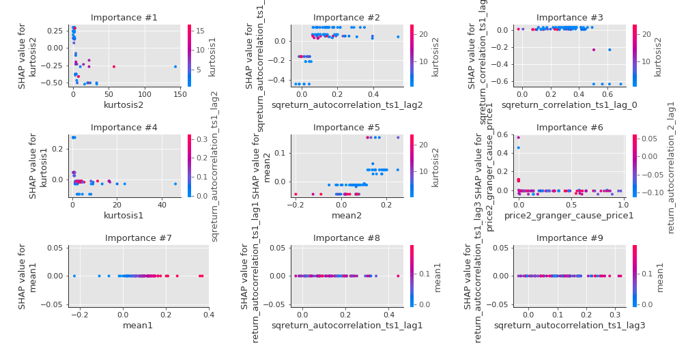

## SHAP Decision plots

### Top-10 Worst decisions for class 0 (Fold 1)
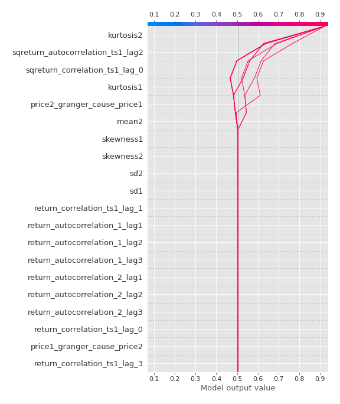
### Top-10 Best decisions for class 0 (Fold 1)
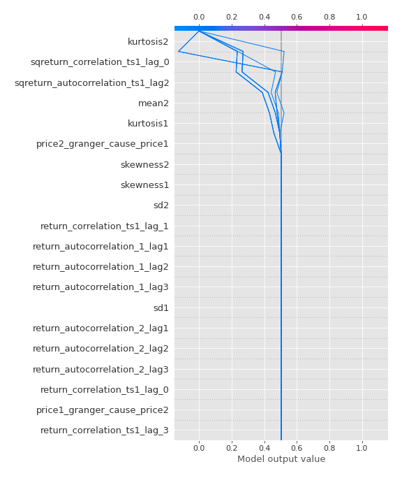
### Top-10 Worst decisions for class 1 (Fold 1)
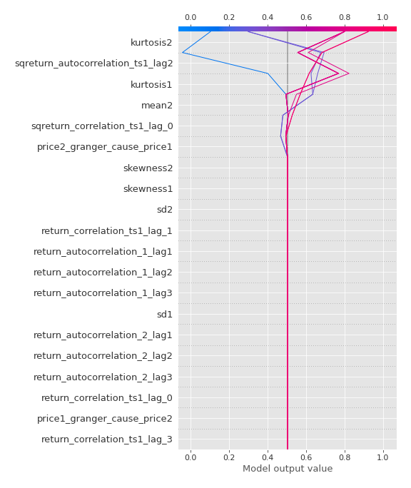
### Top-10 Best decisions for class 1 (Fold 1)
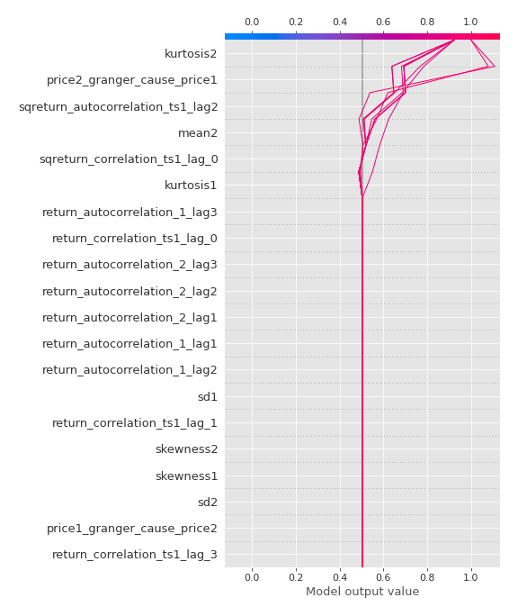

[<< Go back](../README.md)
