# Summary of 3_Linear

[<< Go back](../README.md)

## Logistic Regression (Linear)
- **n_jobs**: -1
- **explain_level**: 2

## Validation
 - **validation_type**: split
 - **train_ratio**: 0.75
 - **shuffle**: True
 - **stratify**: True

## Optimized metric
accuracy

## Training time

2.9 seconds

## Metric details
|           |    score |     threshold |
|:----------|---------:|--------------:|
| logloss   | 0.281357 | nan           |
| auc       | 0.974101 | nan           |
| f1        | 0.926316 |   0.497424    |
| accuracy  | 0.91954  |   0.497424    |
| precision | 1        |   0.841447    |
| recall    | 1        |   5.37604e-23 |
| mcc       | 0.849881 |   0.497424    |

## Confusion matrix (at threshold=0.497424)
|                      |   Predicted as real |   Predicted as simulated |
|:---------------------|--------------------:|-------------------------:|
| Labeled as real      |                  36 |                        7 |
| Labeled as simulated |                   0 |                       44 |

## Learning curves
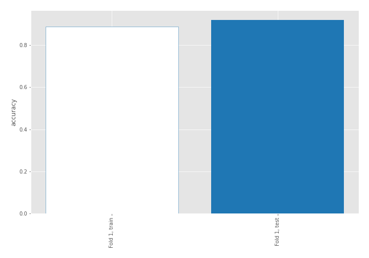

## Coefficients
| feature                           |   Learner_1 |
|:----------------------------------|------------:|
| mean2                             |   1.66654   |
| sqreturn_autocorrelation_ts2_lag3 |   1.55621   |
| mean1                             |   1.37692   |
| sqreturn_autocorrelation_ts1_lag3 |   1.09328   |
| sqreturn_autocorrelation_ts2_lag2 |   1.08678   |
| sqreturn_autocorrelation_ts1_lag2 |   1.06996   |
| sqreturn_autocorrelation_ts1_lag1 |   0.921154  |
| sqreturn_autocorrelation_ts2_lag1 |   0.768701  |
| return_correlation_ts2_lag_1      |   0.750259  |
| sqreturn_correlation_ts2_lag_1    |   0.750259  |
| return_autocorrelation_2_lag1     |   0.673321  |
| sqreturn_correlation_ts1_lag_1    |   0.522559  |
| return_correlation_ts1_lag_1      |   0.522559  |
| return_correlation_ts2_lag_3      |   0.452663  |
| sqreturn_correlation_ts2_lag_3    |   0.452663  |
| return_autocorrelation_1_lag2     |   0.371324  |
| return_autocorrelation_1_lag1     |   0.370651  |
| sd1                               |   0.300321  |
| return_autocorrelation_2_lag3     |   0.191369  |
| return_autocorrelation_1_lag3     |   0.079642  |
| sqreturn_correlation_ts1_lag_2    |   0.0680067 |
| return_correlation_ts1_lag_2      |   0.0680067 |
| return_correlation_ts1_lag_3      |   0.0402191 |
| sqreturn_correlation_ts1_lag_3    |   0.0402191 |
| return_autocorrelation_2_lag2     |  -0.0780247 |
| return_correlation_ts2_lag_2      |  -0.0983226 |
| sqreturn_correlation_ts2_lag_2    |  -0.0983226 |
| sd2                               |  -0.222618  |
| sqreturn_correlation_ts1_lag_0    |  -0.276878  |
| return_correlation_ts1_lag_0      |  -0.276878  |
| price1_granger_cause_price2       |  -0.305736  |
| skewness1                         |  -0.470894  |
| price2_granger_cause_price1       |  -0.675781  |
| skewness2                         |  -0.708645  |
| intercept                         |  -1.87245   |
| kurtosis2                         |  -2.64913   |
| kurtosis1                         |  -2.75276   |

## Permutation-based Importance
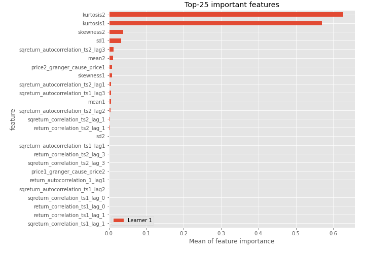
## Confusion Matrix

## Normalized Confusion Matrix

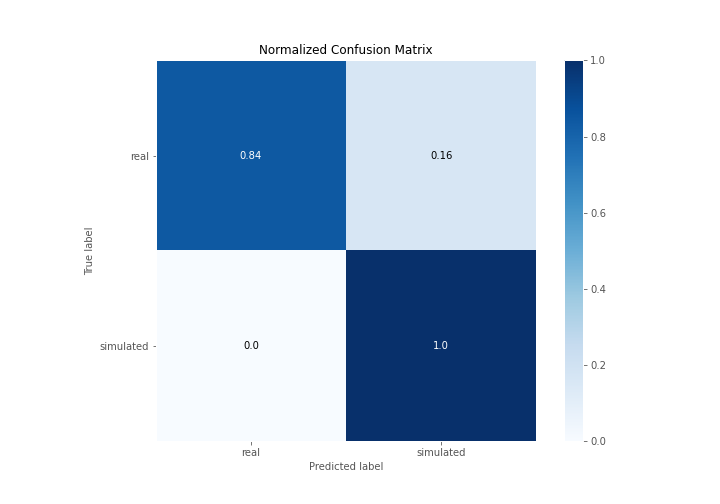

## ROC Curve

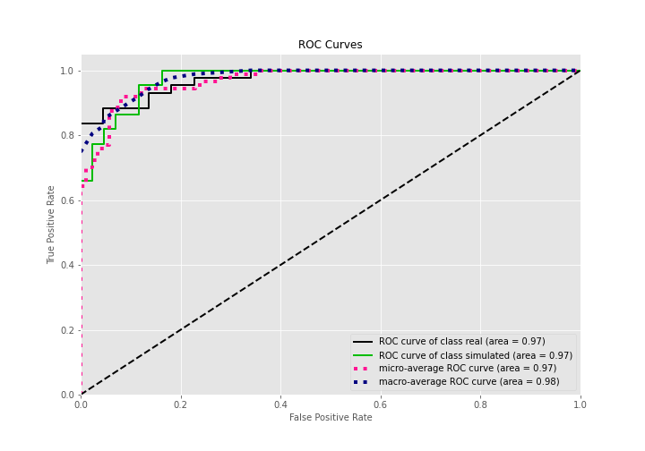

## Kolmogorov-Smirnov Statistic

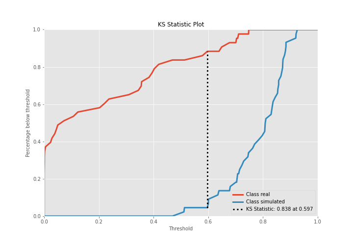

## Precision-Recall Curve

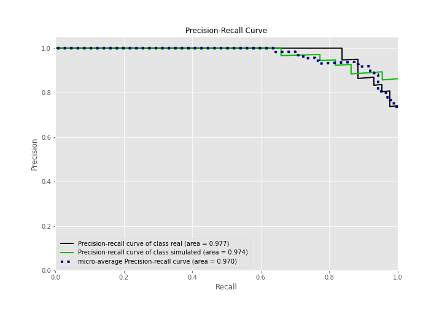

## Calibration Curve

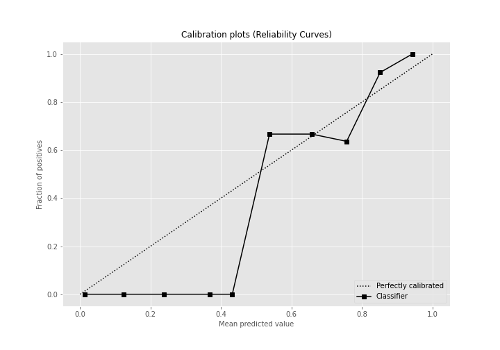

## Cumulative Gains Curve

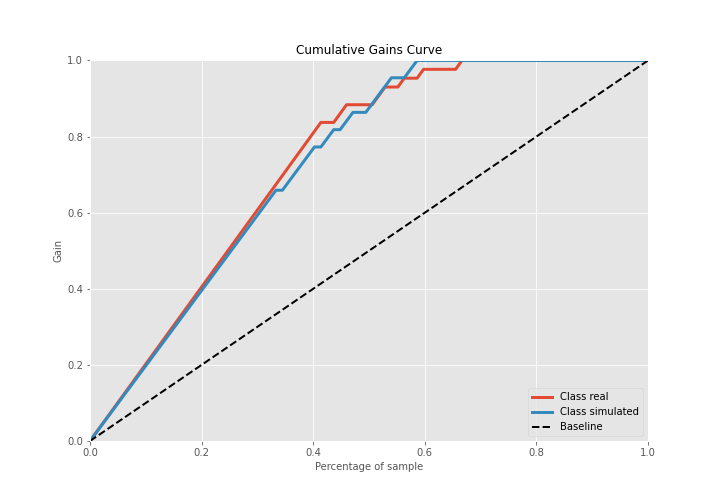

## Lift Curve

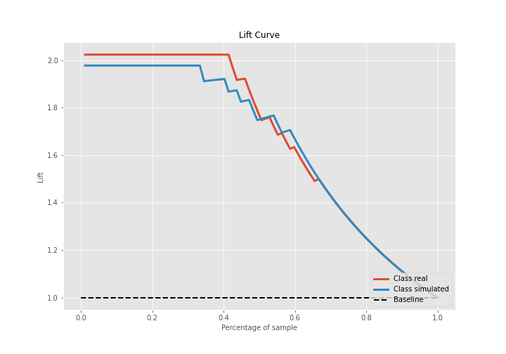

## SHAP Importance
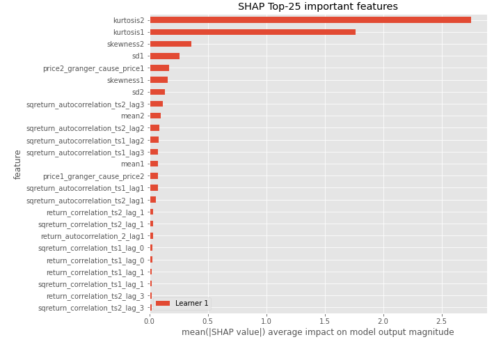

## SHAP Dependence plots

### Dependence (Fold 1)
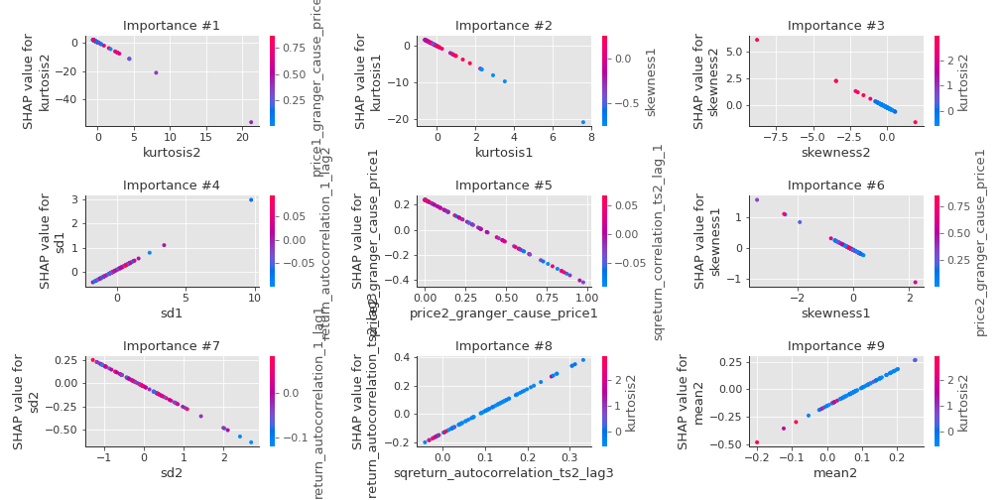

## SHAP Decision plots

### Top-10 Worst decisions for class 0 (Fold 1)
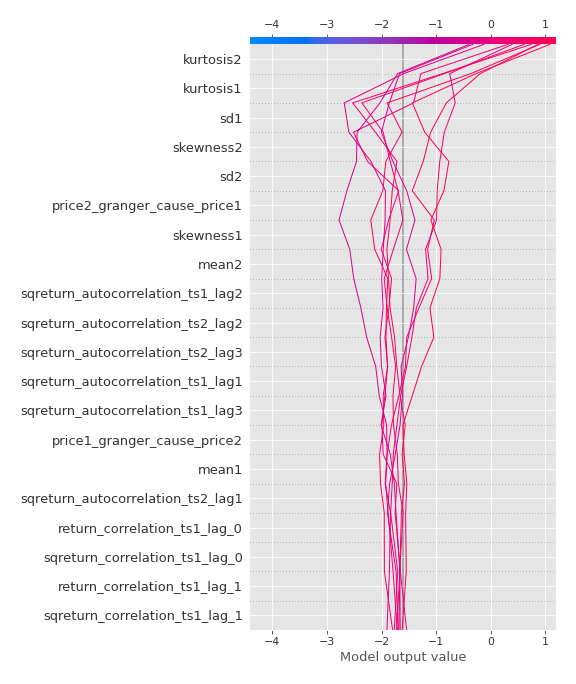
### Top-10 Best decisions for class 0 (Fold 1)
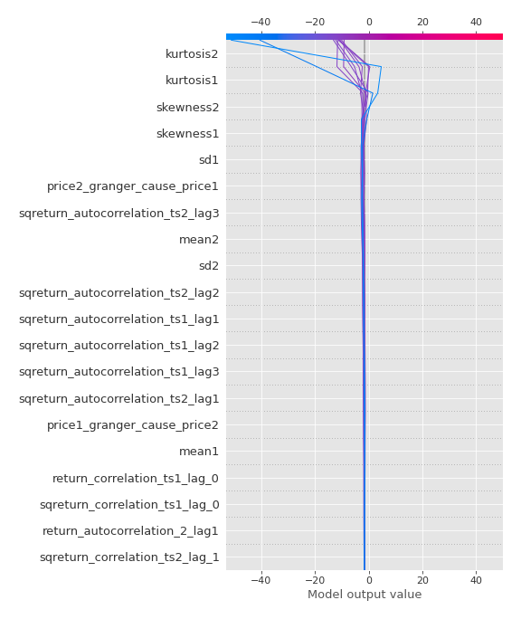
### Top-10 Worst decisions for class 1 (Fold 1)
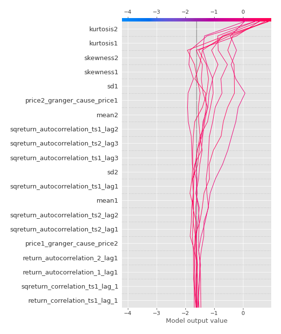
### Top-10 Best decisions for class 1 (Fold 1)
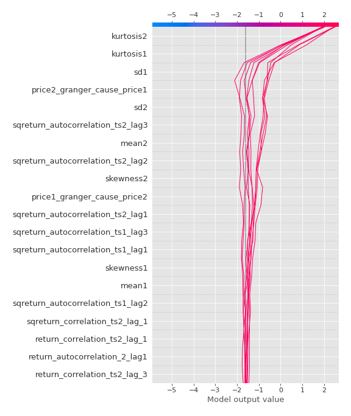

[<< Go back](../README.md)
