# Exploratory Data Analysis

[<< Go back](../README.md)
## Feature : target
- **Feature type** : categorical
- **Missing** : 0.0%
- **Unique** : 2
- **Count** :347
- **Unique** :2
- **Top** :simulated
- **Freq** :175

## Feature : mean1
- **Feature type** : continous
- **Missing** : 0.0%
- **Unique** : 347
- **Count** :347.0
- **Mean** :0.08150737196088156
- **Std** :0.08094980202193199
- **Min** :-0.22632637961920957
- **25%th Percentile** : 0.03192420461424872
- **50%th Percentile** : 0.07789381809473012
- **75%th Percentile** : 0.12542770116234386
- **Max** :0.37175100008111034

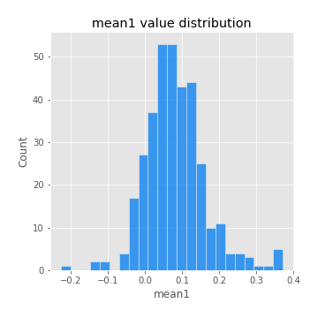
## Feature : mean2
- **Feature type** : continous
- **Missing** : 0.0%
- **Unique** : 347
- **Count** :347.0
- **Mean** :0.09117298980209235
- **Std** :0.0864758357415738
- **Min** :-0.24205418062825398
- **25%th Percentile** : 0.04722601803080484
- **50%th Percentile** : 0.0846143781910857
- **75%th Percentile** : 0.1463870128523494
- **Max** :0.37616608147096464

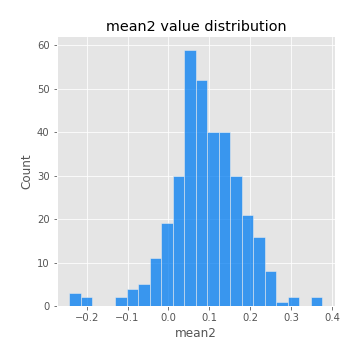
## Feature : sd1
- **Feature type** : continous
- **Missing** : 0.0%
- **Unique** : 347
- **Count** :347.0
- **Mean** :2.050103230954531
- **Std** :0.8207960592854333
- **Min** :0.7470080772831957
- **25%th Percentile** : 1.5674722669745973
- **50%th Percentile** : 1.9785063351205887
- **75%th Percentile** : 2.4315359048355343
- **Max** :9.236766377527575

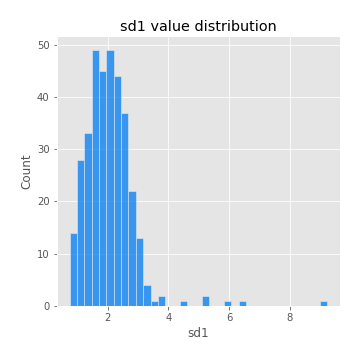
## Feature : sd2
- **Feature type** : continous
- **Missing** : 0.0%
- **Unique** : 347
- **Count** :347.0
- **Mean** :1.9760771508194461
- **Std** :0.8111110221474404
- **Min** :0.8455946193085045
- **25%th Percentile** : 1.4926009281132255
- **50%th Percentile** : 1.8181445969238603
- **75%th Percentile** : 2.2851209298111126
- **Max** :6.737618636746393

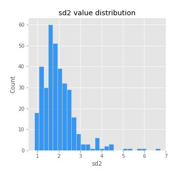
## Feature : skewness1
- **Feature type** : continous
- **Missing** : 0.0%
- **Unique** : 347
- **Count** :347.0
- **Mean** :-0.14566636269241204
- **Std** :0.6261214900869222
- **Min** :-3.530116233761814
- **25%th Percentile** : -0.2977378462898129
- **50%th Percentile** : -0.11990673255082643
- **75%th Percentile** : 0.07130326553520855
- **Max** :2.5845963767725557

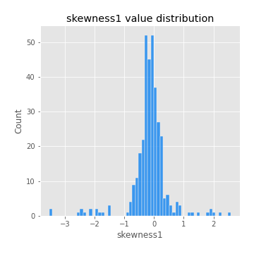
## Feature : skewness2
- **Feature type** : continous
- **Missing** : 0.0%
- **Unique** : 347
- **Count** :347.0
- **Mean** :-0.24500254330107687
- **Std** :0.8342130502074356
- **Min** :-8.801502855292393
- **25%th Percentile** : -0.39471543526476827
- **50%th Percentile** : -0.1628740951158545
- **75%th Percentile** : 0.06336098609868304
- **Max** :2.242019525651531

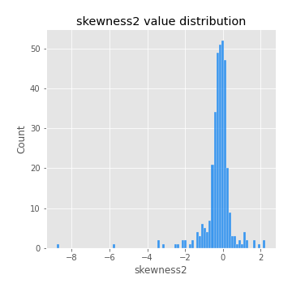
## Feature : kurtosis1
- **Feature type** : continous
- **Missing** : 0.0%
- **Unique** : 347
- **Count** :347.0
- **Mean** :3.944142703379371
- **Std** :5.793663608565784
- **Min** :-0.015964935641140432
- **25%th Percentile** : 1.1154209018553964
- **50%th Percentile** : 1.944689024166537
- **75%th Percentile** : 3.691890626635947
- **Max** :46.07507808162177

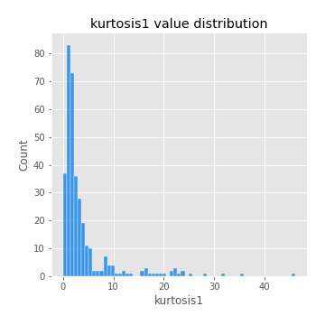
## Feature : kurtosis2
- **Feature type** : continous
- **Missing** : 0.0%
- **Unique** : 347
- **Count** :347.0
- **Mean** :4.9248850863011375
- **Std** :10.363845083365744
- **Min** :0.10350962718972889
- **25%th Percentile** : 1.263631467776758
- **50%th Percentile** : 2.054048061520302
- **75%th Percentile** : 4.40507914533392
- **Max** :143.10871011533666

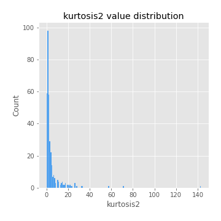
## Feature : return_autocorrelation_1_lag1
- **Feature type** : continous
- **Missing** : 0.0%
- **Unique** : 347
- **Count** :347.0
- **Mean** :-0.008102064522987326
- **Std** :0.06343067989629608
- **Min** :-0.19339575314049967
- **25%th Percentile** : -0.04965434743252916
- **50%th Percentile** : -0.003295314054212405
- **75%th Percentile** : 0.035076098409044534
- **Max** :0.15016386657245898

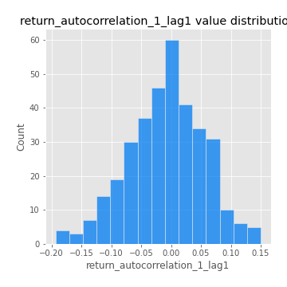
## Feature : return_autocorrelation_1_lag2
- **Feature type** : continous
- **Missing** : 0.0%
- **Unique** : 347
- **Count** :347.0
- **Mean** :-0.005046161958261937
- **Std** :0.054765813804253854
- **Min** :-0.18597601771793257
- **25%th Percentile** : -0.03928437632863113
- **50%th Percentile** : -0.005583441304546397
- **75%th Percentile** : 0.03319038999174416
- **Max** :0.1561488228015672

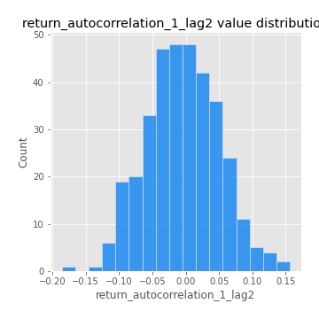
## Feature : return_autocorrelation_1_lag3
- **Feature type** : continous
- **Missing** : 0.0%
- **Unique** : 347
- **Count** :347.0
- **Mean** :-0.006327081821248653
- **Std** :0.0535823377320847
- **Min** :-0.1940836867390813
- **25%th Percentile** : -0.0430568011338445
- **50%th Percentile** : -0.003878243389144608
- **75%th Percentile** : 0.03073933952315299
- **Max** :0.17805869530681923

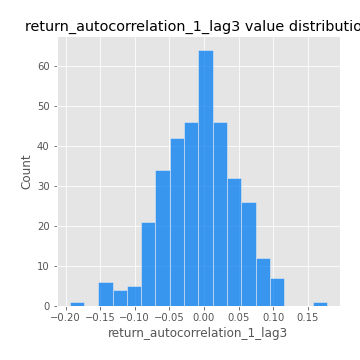
## Feature : return_autocorrelation_2_lag1
- **Feature type** : continous
- **Missing** : 0.0%
- **Unique** : 347
- **Count** :347.0
- **Mean** :-0.015348512445132832
- **Std** :0.06154969792510957
- **Min** :-0.25075531010123286
- **25%th Percentile** : -0.053882140934681785
- **50%th Percentile** : -0.015188397979172737
- **75%th Percentile** : 0.0244003536774313
- **Max** :0.31863413537898483

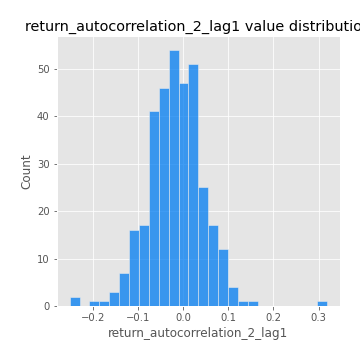
## Feature : return_autocorrelation_2_lag2
- **Feature type** : continous
- **Missing** : 0.0%
- **Unique** : 347
- **Count** :347.0
- **Mean** :-0.008829240625917792
- **Std** :0.056802988833213684
- **Min** :-0.15323211089747296
- **25%th Percentile** : -0.04559586017886737
- **50%th Percentile** : -0.01178588954582788
- **75%th Percentile** : 0.02465711482809103
- **Max** :0.20974504043791217

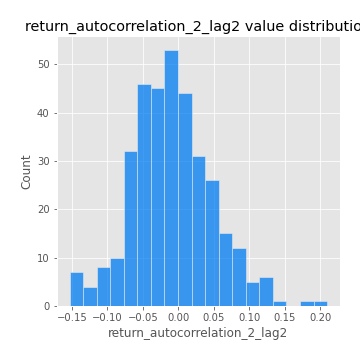
## Feature : return_autocorrelation_2_lag3
- **Feature type** : continous
- **Missing** : 0.0%
- **Unique** : 347
- **Count** :347.0
- **Mean** :-0.009952711925476953
- **Std** :0.053805973258603944
- **Min** :-0.22479777346941204
- **25%th Percentile** : -0.042349841153705575
- **50%th Percentile** : -0.009996277544050374
- **75%th Percentile** : 0.024211939201486524
- **Max** :0.1419999376914021

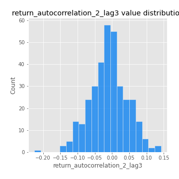
## Feature : return_correlation_ts1_lag_0
- **Feature type** : continous
- **Missing** : 0.0%
- **Unique** : 347
- **Count** :347.0
- **Mean** :0.33151568864100583
- **Std** :0.11277072566396873
- **Min** :-0.027089510445801036
- **25%th Percentile** : 0.2800250495420903
- **50%th Percentile** : 0.3360967841242831
- **75%th Percentile** : 0.38047311544060003
- **Max** :0.7041861626832071

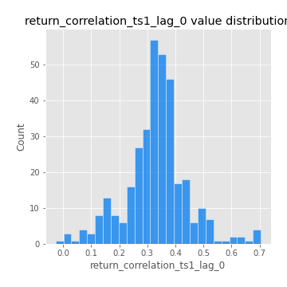
## Feature : return_correlation_ts1_lag_1
- **Feature type** : continous
- **Missing** : 0.0%
- **Unique** : 347
- **Count** :347.0
- **Mean** :-0.0049163421228683255
- **Std** :0.057231152342881585
- **Min** :-0.15776193292681923
- **25%th Percentile** : -0.045291228820137086
- **50%th Percentile** : -0.005253861036988567
- **75%th Percentile** : 0.03734917780677016
- **Max** :0.1554869103046138

## Feature : return_correlation_ts1_lag_2
- **Feature type** : continous
- **Missing** : 0.0%
- **Unique** : 347
- **Count** :347.0
- **Mean** :-0.002210924559526685
- **Std** :0.051998092748923
- **Min** :-0.1535387500153061
- **25%th Percentile** : -0.03985023805091138
- **50%th Percentile** : -0.002090362468606236
- **75%th Percentile** : 0.03523156413268526
- **Max** :0.11738887298567731

## Feature : return_correlation_ts1_lag_3
- **Feature type** : continous
- **Missing** : 0.0%
- **Unique** : 347
- **Count** :347.0
- **Mean** :-0.0030419288657825044
- **Std** :0.05428496943092806
- **Min** :-0.14223809647681565
- **25%th Percentile** : -0.03918261104864602
- **50%th Percentile** : -0.005746348646003496
- **75%th Percentile** : 0.03185805671629449
- **Max** :0.1636773216468148

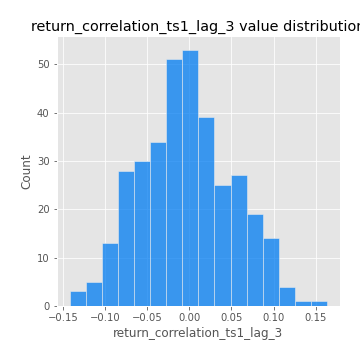
## Feature : return_correlation_ts2_lag_1
- **Feature type** : continous
- **Missing** : 0.0%
- **Unique** : 347
- **Count** :347.0
- **Mean** :-0.006310553714387567
- **Std** :0.05521825054689634
- **Min** :-0.20093919236581337
- **25%th Percentile** : -0.04119192704195976
- **50%th Percentile** : -0.006749812525102796
- **75%th Percentile** : 0.03094863357673777
- **Max** :0.17208763791364762

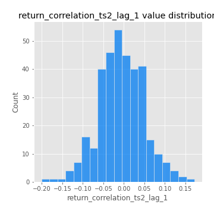
## Feature : return_correlation_ts2_lag_2
- **Feature type** : continous
- **Missing** : 0.0%
- **Unique** : 347
- **Count** :347.0
- **Mean** :-0.004561723897877198
- **Std** :0.0552919889514129
- **Min** :-0.23751835475804678
- **25%th Percentile** : -0.04449272936789272
- **50%th Percentile** : -0.006487152117528097
- **75%th Percentile** : 0.026884475109236007
- **Max** :0.20772887392904255

## Feature : return_correlation_ts2_lag_3
- **Feature type** : continous
- **Missing** : 0.0%
- **Unique** : 347
- **Count** :347.0
- **Mean** :-0.0054651878924908215
- **Std** :0.05638759527596476
- **Min** :-0.17564076057312866
- **25%th Percentile** : -0.03753872470480772
- **50%th Percentile** : -0.007723071184022401
- **75%th Percentile** : 0.034459539849671886
- **Max** :0.156979385575628

## Feature : sqreturn_autocorrelation_ts1_lag1
- **Feature type** : continous
- **Missing** : 0.0%
- **Unique** : 347
- **Count** :347.0
- **Mean** :0.12000976993840841
- **Std** :0.09011102278571902
- **Min** :-0.052978649713557625
- **25%th Percentile** : 0.05381190068197903
- **50%th Percentile** : 0.10988969016037198
- **75%th Percentile** : 0.1691113059142373
- **Max** :0.49414293176447355

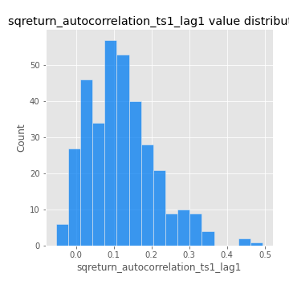
## Feature : sqreturn_autocorrelation_ts1_lag2
- **Feature type** : continous
- **Missing** : 0.0%
- **Unique** : 347
- **Count** :347.0
- **Mean** :0.1099818875692931
- **Std** :0.09366282264468097
- **Min** :-0.05419304650062953
- **25%th Percentile** : 0.04198104766777181
- **50%th Percentile** : 0.09687555901431541
- **75%th Percentile** : 0.1569207548910275
- **Max** :0.540735851444759

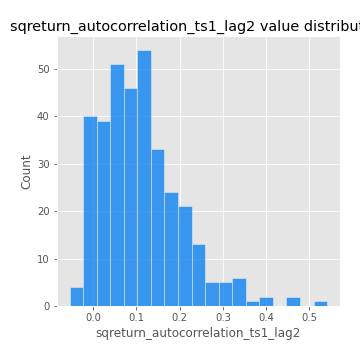
## Feature : sqreturn_autocorrelation_ts1_lag3
- **Feature type** : continous
- **Missing** : 0.0%
- **Unique** : 347
- **Count** :347.0
- **Mean** :0.10293840808965192
- **Std** :0.08633312114466801
- **Min** :-0.044565249834063285
- **25%th Percentile** : 0.033256352431890374
- **50%th Percentile** : 0.09642828111323568
- **75%th Percentile** : 0.15201325234944052
- **Max** :0.4294949517146351

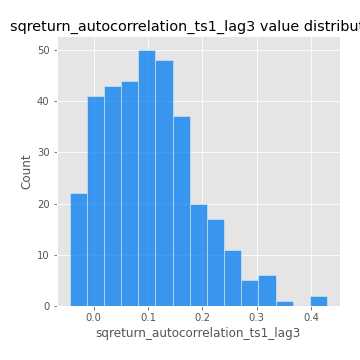
## Feature : sqreturn_autocorrelation_ts2_lag1
- **Feature type** : continous
- **Missing** : 0.0%
- **Unique** : 347
- **Count** :347.0
- **Mean** :0.121169045416615
- **Std** :0.09220440951627241
- **Min** :-0.08520586663750691
- **25%th Percentile** : 0.05303966038979665
- **50%th Percentile** : 0.11227573874941303
- **75%th Percentile** : 0.16825619550539334
- **Max** :0.510085647437958

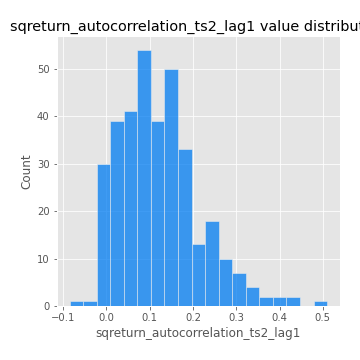
## Feature : sqreturn_autocorrelation_ts2_lag2
- **Feature type** : continous
- **Missing** : 0.0%
- **Unique** : 347
- **Count** :347.0
- **Mean** :0.111234489112873
- **Std** :0.09421742713649435
- **Min** :-0.051523884196217395
- **25%th Percentile** : 0.03934105277789826
- **50%th Percentile** : 0.09659932810276028
- **75%th Percentile** : 0.1688588545556704
- **Max** :0.45676817892778204

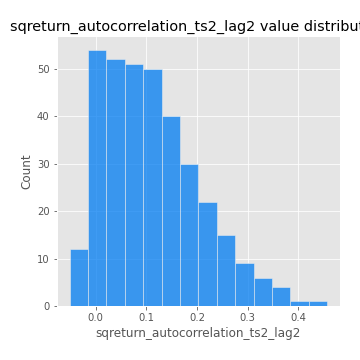
## Feature : sqreturn_autocorrelation_ts2_lag3
- **Feature type** : continous
- **Missing** : 0.0%
- **Unique** : 347
- **Count** :347.0
- **Mean** :0.09707825812971109
- **Std** :0.08422790190157757
- **Min** :-0.06082766359524085
- **25%th Percentile** : 0.02771020795069479
- **50%th Percentile** : 0.091219241488523
- **75%th Percentile** : 0.15115165907389247
- **Max** :0.3317029833023055

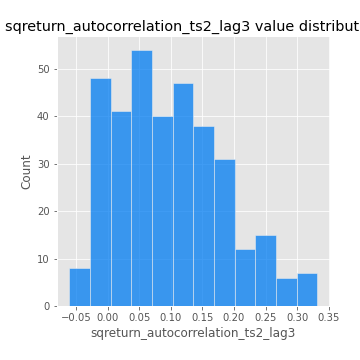
## Feature : sqreturn_correlation_ts1_lag_0
- **Feature type** : continous
- **Missing** : 0.0%
- **Unique** : 347
- **Count** :347.0
- **Mean** :0.33151568864100583
- **Std** :0.11277072566396873
- **Min** :-0.027089510445801036
- **25%th Percentile** : 0.2800250495420903
- **50%th Percentile** : 0.3360967841242831
- **75%th Percentile** : 0.38047311544060003
- **Max** :0.7041861626832071

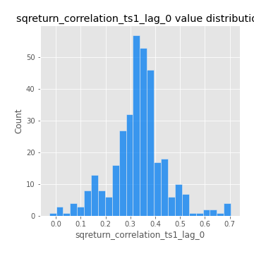
## Feature : sqreturn_correlation_ts1_lag_1
- **Feature type** : continous
- **Missing** : 0.0%
- **Unique** : 347
- **Count** :347.0
- **Mean** :-0.0049163421228683255
- **Std** :0.057231152342881585
- **Min** :-0.15776193292681923
- **25%th Percentile** : -0.045291228820137086
- **50%th Percentile** : -0.005253861036988567
- **75%th Percentile** : 0.03734917780677016
- **Max** :0.1554869103046138

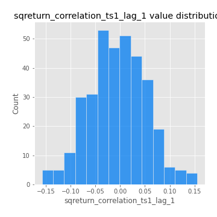
## Feature : sqreturn_correlation_ts1_lag_2
- **Feature type** : continous
- **Missing** : 0.0%
- **Unique** : 347
- **Count** :347.0
- **Mean** :-0.002210924559526685
- **Std** :0.051998092748923
- **Min** :-0.1535387500153061
- **25%th Percentile** : -0.03985023805091138
- **50%th Percentile** : -0.002090362468606236
- **75%th Percentile** : 0.03523156413268526
- **Max** :0.11738887298567731

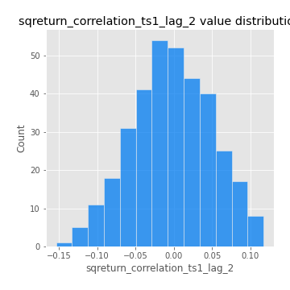
## Feature : sqreturn_correlation_ts1_lag_3
- **Feature type** : continous
- **Missing** : 0.0%
- **Unique** : 347
- **Count** :347.0
- **Mean** :-0.0030419288657825044
- **Std** :0.05428496943092806
- **Min** :-0.14223809647681565
- **25%th Percentile** : -0.03918261104864602
- **50%th Percentile** : -0.005746348646003496
- **75%th Percentile** : 0.03185805671629449
- **Max** :0.1636773216468148

## Feature : sqreturn_correlation_ts2_lag_1
- **Feature type** : continous
- **Missing** : 0.0%
- **Unique** : 347
- **Count** :347.0
- **Mean** :-0.006310553714387567
- **Std** :0.05521825054689634
- **Min** :-0.20093919236581337
- **25%th Percentile** : -0.04119192704195976
- **50%th Percentile** : -0.006749812525102796
- **75%th Percentile** : 0.03094863357673777
- **Max** :0.17208763791364762

## Feature : sqreturn_correlation_ts2_lag_2
- **Feature type** : continous
- **Missing** : 0.0%
- **Unique** : 347
- **Count** :347.0
- **Mean** :-0.004561723897877198
- **Std** :0.0552919889514129
- **Min** :-0.23751835475804678
- **25%th Percentile** : -0.04449272936789272
- **50%th Percentile** : -0.006487152117528097
- **75%th Percentile** : 0.026884475109236007
- **Max** :0.20772887392904255

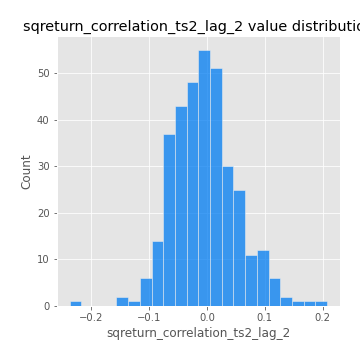
## Feature : sqreturn_correlation_ts2_lag_3
- **Feature type** : continous
- **Missing** : 0.0%
- **Unique** : 347
- **Count** :347.0
- **Mean** :-0.0054651878924908215
- **Std** :0.05638759527596476
- **Min** :-0.17564076057312866
- **25%th Percentile** : -0.03753872470480772
- **50%th Percentile** : -0.007723071184022401
- **75%th Percentile** : 0.034459539849671886
- **Max** :0.156979385575628

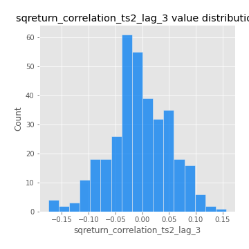
## Feature : price2_granger_cause_price1
- **Feature type** : continous
- **Missing** : 0.0%
- **Unique** : 347
- **Count** :347.0
- **Mean** :0.3251491673776451
- **Std** :0.30707179102766047
- **Min** :1.48448462635975e-07
- **25%th Percentile** : 0.04741403209169979
- **50%th Percentile** : 0.23198108295778244
- **75%th Percentile** : 0.5745653835210777
- **Max** :0.9885712803689185

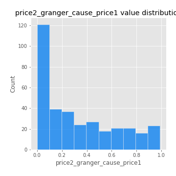
## Feature : price1_granger_cause_price2
- **Feature type** : continous
- **Missing** : 0.0%
- **Unique** : 347
- **Count** :347.0
- **Mean** :0.29869033030523684
- **Std** :0.28160248388668324
- **Min** :6.207428750512306e-10
- **25%th Percentile** : 0.04357712511267771
- **50%th Percentile** : 0.2176774341783571
- **75%th Percentile** : 0.47784579945691014
- **Max** :0.9986985883911866

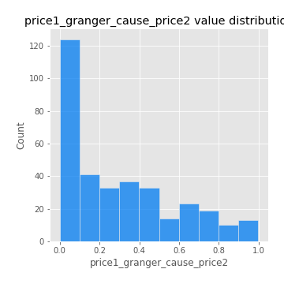

[<< Go back](../README.md)
