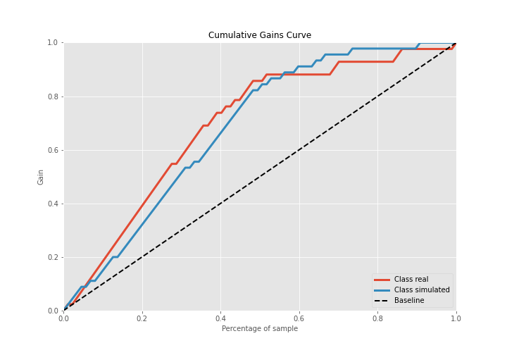
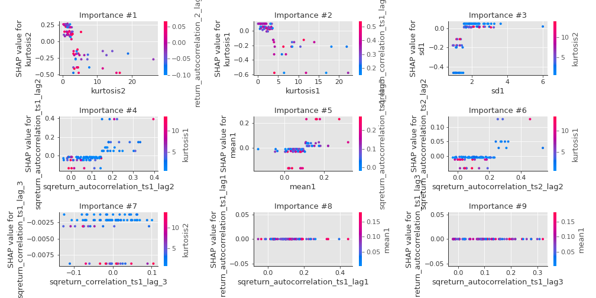

# Summary of 2_DecisionTree

[<< Go back](../README.md)

## Decision Tree
- **n_jobs**: -1
- **criterion**: gini
- **max_depth**: 3
- **explain_level**: 2

## Validation
 - **validation_type**: split
 - **train_ratio**: 0.75
 - **shuffle**: True
 - **stratify**: True

## Optimized metric
accuracy

## Training time

4.5 seconds

## Metric details
|           |    score |   threshold |
|:----------|---------:|------------:|
| logloss   | 0.763238 |  nan        |
| auc       | 0.884656 |  nan        |
| f1        | 0.850575 |    0.442308 |
| accuracy  | 0.850575 |    0.442308 |
| precision | 0.880952 |    0.442308 |
| recall    | 0.955556 |    0        |
| mcc       | 0.703175 |    0.442308 |

## Confusion matrix (at threshold=0.442308)
|                      |   Predicted as real |   Predicted as simulated |
|:---------------------|--------------------:|-------------------------:|
| Labeled as real      |                  37 |                        5 |
| Labeled as simulated |                   8 |                       37 |

## Learning curves

## Decision Tree 

### Tree #1

### Rules

if (kurtosis2 <= 2.956) and (kurtosis1 <= 3.743) and (sd1 > 1.532) then class: simulated (proba: 88.46%) | based on 130 samples

if (kurtosis2 > 2.956) and (sqreturn_autocorrelation_ts1_lag2 <= 0.147) and (sqreturn_correlation_ts1_lag_3 > -0.136) then class: real (proba: 100.0%) | based on 67 samples

if (kurtosis2 <= 2.956) and (kurtosis1 > 3.743) and (sqreturn_autocorrelation_ts2_lag2 <= 0.234) then class: real (proba: 100.0%) | based on 22 samples

if (kurtosis2 > 2.956) and (sqreturn_autocorrelation_ts1_lag2 > 0.147) and (mean1 <= 0.104) then class: real (proba: 85.71%) | based on 14 samples

if (kurtosis2 <= 2.956) and (kurtosis1 <= 3.743) and (sd1 <= 1.532) then class: real (proba: 78.57%) | based on 14 samples

if (kurtosis2 > 2.956) and (sqreturn_autocorrelation_ts1_lag2 > 0.147) and (mean1 > 0.104) then class: simulated (proba: 100.0%) | based on 10 samples

if (kurtosis2 <= 2.956) and (kurtosis1 > 3.743) and (sqreturn_autocorrelation_ts2_lag2 > 0.234) then class: simulated (proba: 100.0%) | based on 2 samples

if (kurtosis2 > 2.956) and (sqreturn_autocorrelation_ts1_lag2 <= 0.147) and (sqreturn_correlation_ts1_lag_3 <= -0.136) then class: simulated (proba: 100.0%) | based on 1 samples

## Permutation-based Importance

## Confusion Matrix

## Normalized Confusion Matrix

## ROC Curve

## Kolmogorov-Smirnov Statistic

## Precision-Recall Curve

## Calibration Curve

## Cumulative Gains Curve

## Lift Curve

## SHAP Importance

## SHAP Dependence plots

### Dependence (Fold 1)

## SHAP Decision plots

### Top-10 Worst decisions for class 0 (Fold 1)

### Top-10 Best decisions for class 0 (Fold 1)

### Top-10 Worst decisions for class 1 (Fold 1)

### Top-10 Best decisions for class 1 (Fold 1)

[<< Go back](../README.md)
