# Summary of 3_Linear

[<< Go back](../README.md)

## Logistic Regression (Linear)
- **n_jobs**: -1
- **explain_level**: 2

## Validation
 - **validation_type**: split
 - **train_ratio**: 0.75
 - **shuffle**: True
 - **stratify**: True

## Optimized metric
accuracy

## Training time

2.9 seconds

## Metric details
|           |    score |     threshold |
|:----------|---------:|--------------:|
| logloss   | 0.373373 | nan           |
| auc       | 0.946561 | nan           |
| f1        | 0.883721 |   0.644762    |
| accuracy  | 0.885057 |   0.658854    |
| precision | 1        |   0.80343     |
| recall    | 1        |   1.15431e-05 |
| mcc       | 0.778318 |   0.658854    |

## Confusion matrix (at threshold=0.658854)
|                      |   Predicted as real |   Predicted as simulated |
|:---------------------|--------------------:|-------------------------:|
| Labeled as real      |                  40 |                        2 |
| Labeled as simulated |                   8 |                       37 |

## Learning curves
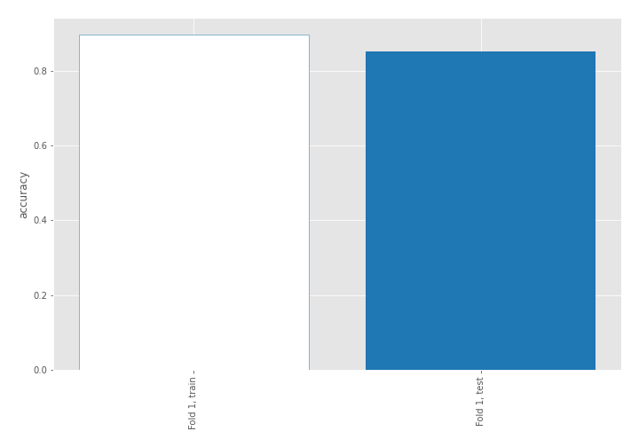

## Coefficients
| feature                           |   Learner_1 |
|:----------------------------------|------------:|
| mean2                             |   1.69701   |
| mean1                             |   1.62571   |
| sqreturn_autocorrelation_ts2_lag3 |   1.59821   |
| sqreturn_autocorrelation_ts1_lag3 |   1.1656    |
| sqreturn_autocorrelation_ts2_lag1 |   1.0492    |
| sqreturn_autocorrelation_ts1_lag2 |   1.01237   |
| sqreturn_autocorrelation_ts2_lag2 |   0.82294   |
| return_correlation_ts1_lag_1      |   0.671229  |
| sqreturn_correlation_ts1_lag_1    |   0.671229  |
| return_autocorrelation_1_lag1     |   0.617799  |
| sqreturn_autocorrelation_ts1_lag1 |   0.504484  |
| return_autocorrelation_2_lag3     |   0.477593  |
| return_autocorrelation_2_lag1     |   0.461434  |
| return_autocorrelation_1_lag3     |   0.436565  |
| return_autocorrelation_2_lag2     |   0.372502  |
| sqreturn_correlation_ts1_lag_3    |   0.36667   |
| return_correlation_ts1_lag_3      |   0.36667   |
| return_correlation_ts2_lag_3      |   0.325326  |
| sqreturn_correlation_ts2_lag_3    |   0.325326  |
| sqreturn_correlation_ts2_lag_1    |   0.274513  |
| return_correlation_ts2_lag_1      |   0.274513  |
| price1_granger_cause_price2       |   0.263668  |
| sd1                               |   0.177861  |
| return_correlation_ts2_lag_2      |   0.118958  |
| sqreturn_correlation_ts2_lag_2    |   0.118958  |
| return_autocorrelation_1_lag2     |   0.0201996 |
| return_correlation_ts1_lag_2      |  -0.085917  |
| sqreturn_correlation_ts1_lag_2    |  -0.085917  |
| sd2                               |  -0.0989666 |
| return_correlation_ts1_lag_0      |  -0.702601  |
| sqreturn_correlation_ts1_lag_0    |  -0.702601  |
| price2_granger_cause_price1       |  -0.746301  |
| skewness2                         |  -0.780261  |
| skewness1                         |  -1.20275   |
| intercept                         |  -1.55449   |
| kurtosis2                         |  -2.73144   |
| kurtosis1                         |  -2.74122   |

## Permutation-based Importance
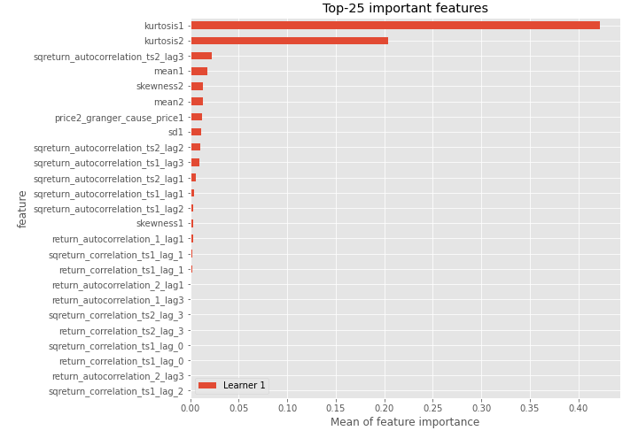
## Confusion Matrix

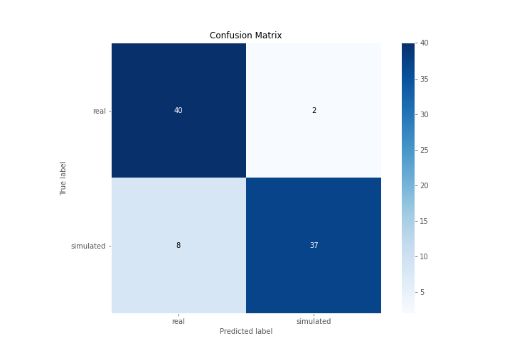

## Normalized Confusion Matrix

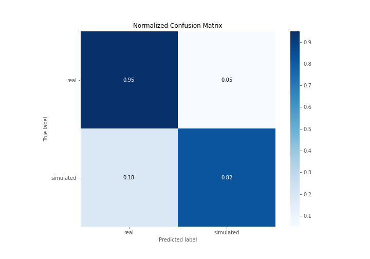

## ROC Curve

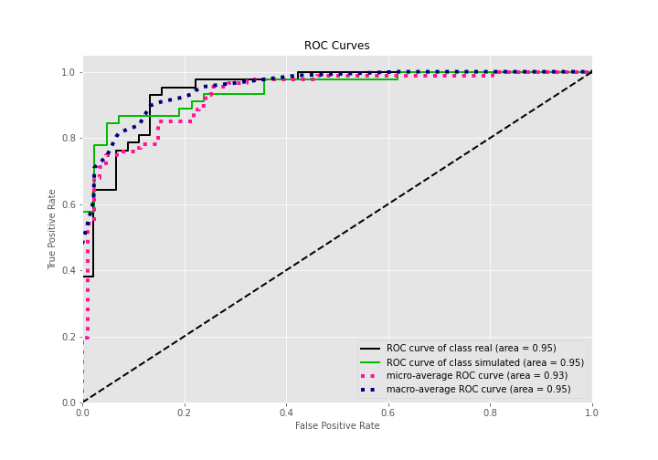

## Kolmogorov-Smirnov Statistic

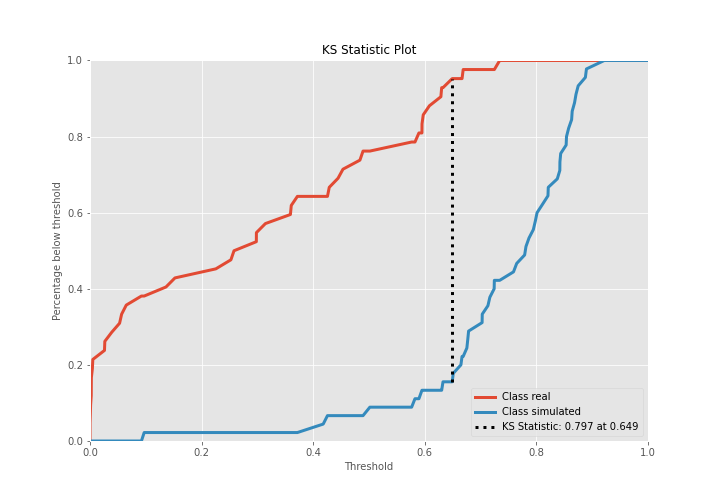

## Precision-Recall Curve

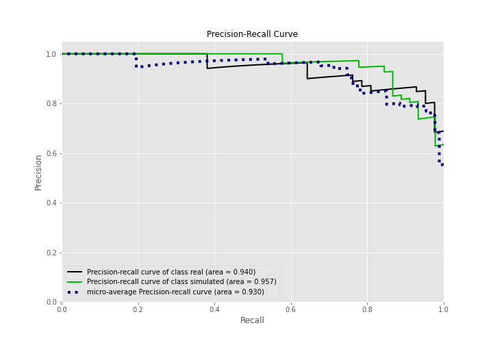

## Calibration Curve

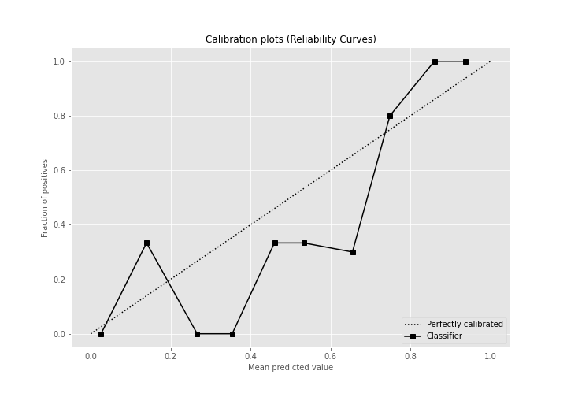

## Cumulative Gains Curve

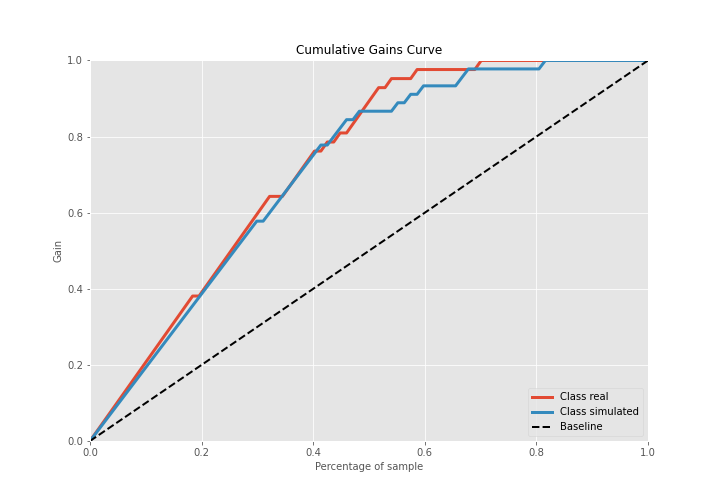

## Lift Curve

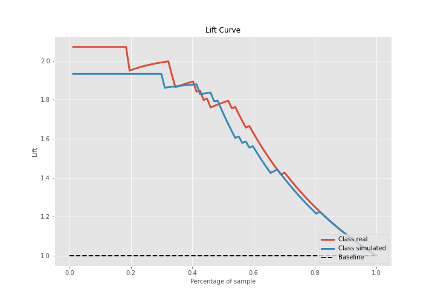

## SHAP Importance
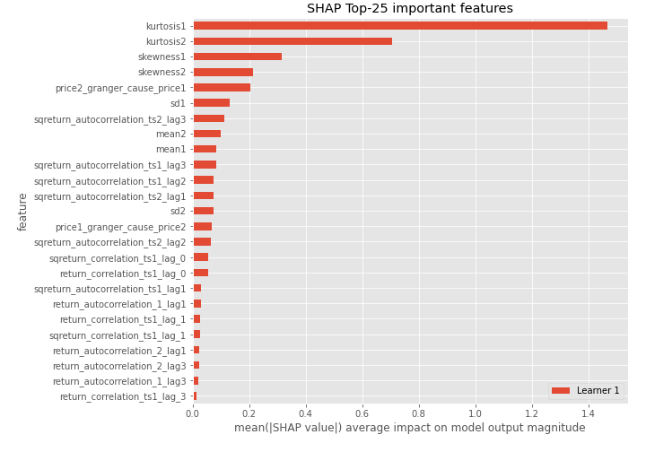

## SHAP Dependence plots

### Dependence (Fold 1)
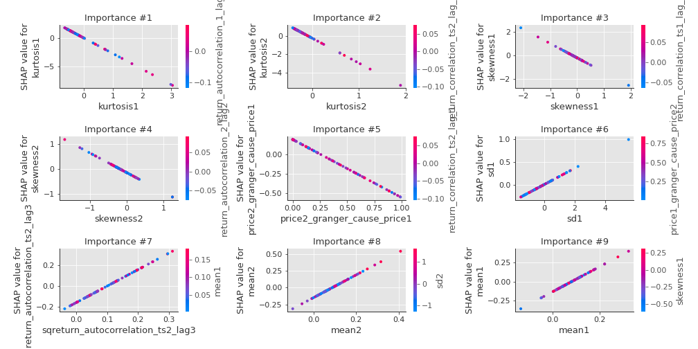

## SHAP Decision plots

### Top-10 Worst decisions for class 0 (Fold 1)
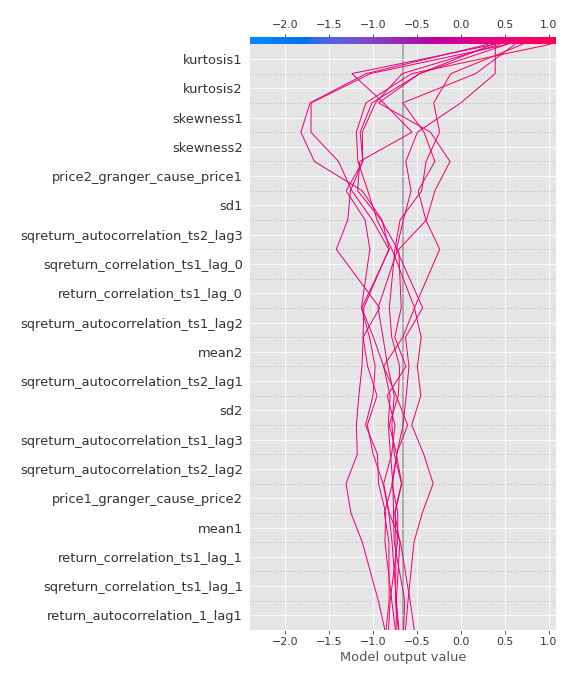
### Top-10 Best decisions for class 0 (Fold 1)
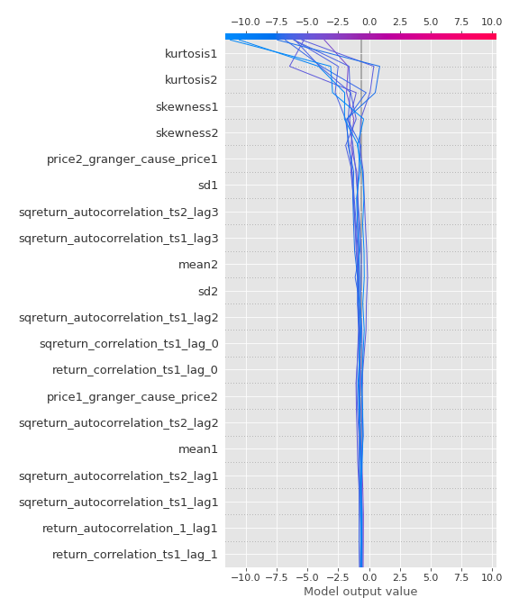
### Top-10 Worst decisions for class 1 (Fold 1)
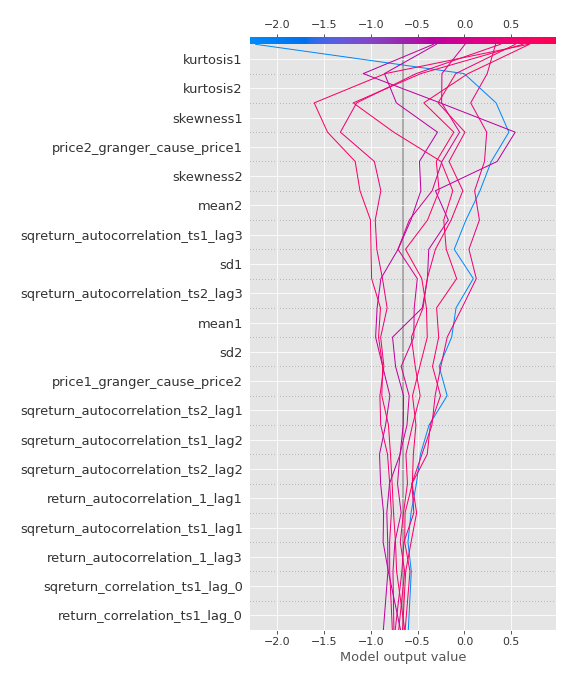
### Top-10 Best decisions for class 1 (Fold 1)
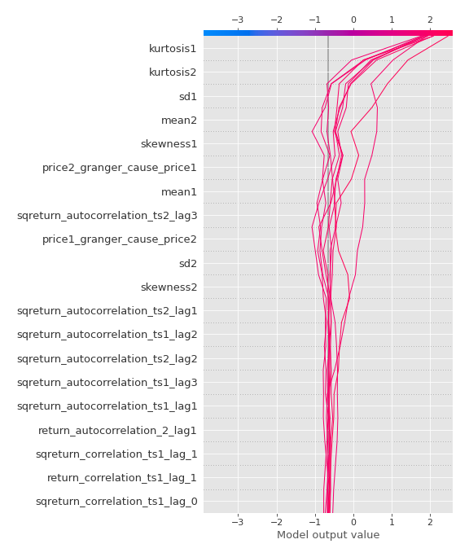

[<< Go back](../README.md)
