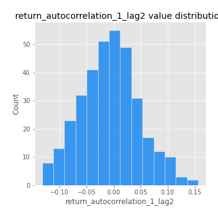

# Exploratory Data Analysis

[<< Go back](../README.md)
## Feature : target
- **Feature type** : categorical
- **Missing** : 0.0%
- **Unique** : 2
- **Count** :347
- **Unique** :2
- **Top** :simulated
- **Freq** :178

## Feature : mean1
- **Feature type** : continous
- **Missing** : 0.0%
- **Unique** : 347
- **Count** :347.0
- **Mean** :0.07949669180751204
- **Std** :0.07617106073115254
- **Min** :-0.17686457077756634
- **25%th Percentile** : 0.0322283100642963
- **50%th Percentile** : 0.08062698403393469
- **75%th Percentile** : 0.12147872437498455
- **Max** :0.37175100008111034

## Feature : mean2
- **Feature type** : continous
- **Missing** : 0.0%
- **Unique** : 347
- **Count** :347.0
- **Mean** :0.08697978857231861
- **Std** :0.08942388337838744
- **Min** :-0.21818165578778434
- **25%th Percentile** : 0.04167918596463484
- **50%th Percentile** : 0.0846143781910857
- **75%th Percentile** : 0.1391313237493016
- **Max** :0.4077004878436144

## Feature : sd1
- **Feature type** : continous
- **Missing** : 0.0%
- **Unique** : 347
- **Count** :347.0
- **Mean** :2.020036977078036
- **Std** :0.719425900985325
- **Min** :0.7470080772831957
- **25%th Percentile** : 1.5610672376708177
- **50%th Percentile** : 1.9344398078432008
- **75%th Percentile** : 2.3784693678514235
- **Max** :6.495661311240861

## Feature : sd2
- **Feature type** : continous
- **Missing** : 0.0%
- **Unique** : 347
- **Count** :347.0
- **Mean** :1.897196844716463
- **Std** :0.6432113489119552
- **Min** :0.8249470095354728
- **25%th Percentile** : 1.4558094613390737
- **50%th Percentile** : 1.8385346126338982
- **75%th Percentile** : 2.1586244395306897
- **Max** :5.042707010333888

## Feature : skewness1
- **Feature type** : continous
- **Missing** : 0.0%
- **Unique** : 347
- **Count** :347.0
- **Mean** :-0.15027485122261514
- **Std** :0.6111097908808568
- **Min** :-3.530116233761814
- **25%th Percentile** : -0.3011372915542132
- **50%th Percentile** : -0.12246960672728274
- **75%th Percentile** : 0.04122679855847849
- **Max** :2.5845963767725557

## Feature : skewness2
- **Feature type** : continous
- **Missing** : 0.0%
- **Unique** : 347
- **Count** :347.0
- **Mean** :-0.2546742646282081
- **Std** :0.8104420063668266
- **Min** :-8.801502855292393
- **25%th Percentile** : -0.38463955506996855
- **50%th Percentile** : -0.19036870139215922
- **75%th Percentile** : 0.011760142230360291
- **Max** :2.2606839051517187

## Feature : kurtosis1
- **Feature type** : continous
- **Missing** : 0.0%
- **Unique** : 347
- **Count** :347.0
- **Mean** :3.944507903687487
- **Std** :5.664504434234283
- **Min** :0.09721053908126542
- **25%th Percentile** : 1.0827468538682066
- **50%th Percentile** : 1.9891369225857924
- **75%th Percentile** : 3.9610334873312083
- **Max** :46.07507808162177

## Feature : kurtosis2
- **Feature type** : continous
- **Missing** : 0.0%
- **Unique** : 347
- **Count** :347.0
- **Mean** :4.607311036810132
- **Std** :10.0277674568448
- **Min** :0.015339185493670637
- **25%th Percentile** : 1.2902266318189555
- **50%th Percentile** : 2.117619435423666
- **75%th Percentile** : 4.3612884611668505
- **Max** :143.10871011533666

## Feature : return_autocorrelation_1_lag1
- **Feature type** : continous
- **Missing** : 0.0%
- **Unique** : 347
- **Count** :347.0
- **Mean** :-0.01266030599445886
- **Std** :0.06221290505244552
- **Min** :-0.2135576224968752
- **25%th Percentile** : -0.046351612214358344
- **50%th Percentile** : -0.009778201957527875
- **75%th Percentile** : 0.027520953978110343
- **Max** :0.1470584030082172

## Feature : return_autocorrelation_1_lag2
- **Feature type** : continous
- **Missing** : 0.0%
- **Unique** : 347
- **Count** :347.0
- **Mean** :-0.006468016113714841
- **Std** :0.05417138936673016
- **Min** :-0.1320585219709854
- **25%th Percentile** : -0.04465080838038428
- **50%th Percentile** : -0.005583441304546397
- **75%th Percentile** : 0.028324738073919317
- **Max** :0.1561488228015672

## Feature : return_autocorrelation_1_lag3
- **Feature type** : continous
- **Missing** : 0.0%
- **Unique** : 347
- **Count** :347.0
- **Mean** :-0.0036691892762002556
- **Std** :0.054656321642488695
- **Min** :-0.15806635192103805
- **25%th Percentile** : -0.042744890800437634
- **50%th Percentile** : -0.0009904272475469572
- **75%th Percentile** : 0.03415776400637664
- **Max** :0.13444405719156288

## Feature : return_autocorrelation_2_lag1
- **Feature type** : continous
- **Missing** : 0.0%
- **Unique** : 347
- **Count** :347.0
- **Mean** :-0.013944333387766529
- **Std** :0.06335777146168624
- **Min** :-0.25075531010123286
- **25%th Percentile** : -0.05769357242451935
- **50%th Percentile** : -0.012996777165257826
- **75%th Percentile** : 0.027089258990411
- **Max** :0.31863413537898483

## Feature : return_autocorrelation_2_lag2
- **Feature type** : continous
- **Missing** : 0.0%
- **Unique** : 347
- **Count** :347.0
- **Mean** :-0.0038569543231428472
- **Std** :0.05374171639666924
- **Min** :-0.15320925657409595
- **25%th Percentile** : -0.0408329396488674
- **50%th Percentile** : -0.004081427935014871
- **75%th Percentile** : 0.03421373825339713
- **Max** :0.20974504043791217

## Feature : return_autocorrelation_2_lag3
- **Feature type** : continous
- **Missing** : 0.0%
- **Unique** : 347
- **Count** :347.0
- **Mean** :-0.006499847868429854
- **Std** :0.05188721753946314
- **Min** :-0.14200107169559698
- **25%th Percentile** : -0.04327840086965758
- **50%th Percentile** : -0.00984330975468724
- **75%th Percentile** : 0.030640314082212152
- **Max** :0.1419999376914021

## Feature : return_correlation_ts1_lag_0
- **Feature type** : continous
- **Missing** : 0.0%
- **Unique** : 347
- **Count** :347.0
- **Mean** :0.33762115020501055
- **Std** :0.11069769743546773
- **Min** :0.005136598099876001
- **25%th Percentile** : 0.28380706908883946
- **50%th Percentile** : 0.34171689479883377
- **75%th Percentile** : 0.3883113984733676
- **Max** :0.7028422087350163

## Feature : return_correlation_ts1_lag_1
- **Feature type** : continous
- **Missing** : 0.0%
- **Unique** : 347
- **Count** :347.0
- **Mean** :-0.009974225630538501
- **Std** :0.05537247763859607
- **Min** :-0.16985510949917193
- **25%th Percentile** : -0.04607113676088209
- **50%th Percentile** : -0.00600845653891347
- **75%th Percentile** : 0.029252679780493406
- **Max** :0.13959238435311086

## Feature : return_correlation_ts1_lag_2
- **Feature type** : continous
- **Missing** : 0.0%
- **Unique** : 347
- **Count** :347.0
- **Mean** :0.0002124987845835537
- **Std** :0.0552117390535797
- **Min** :-0.21653581047581763
- **25%th Percentile** : -0.032305183146504865
- **50%th Percentile** : -0.0020126584596116674
- **75%th Percentile** : 0.03643271791844538
- **Max** :0.14071730745800723

## Feature : return_correlation_ts1_lag_3
- **Feature type** : continous
- **Missing** : 0.0%
- **Unique** : 347
- **Count** :347.0
- **Mean** :-0.004375018437071424
- **Std** :0.05356467821203051
- **Min** :-0.14851434364935537
- **25%th Percentile** : -0.041751155673226376
- **50%th Percentile** : -0.003251010962625478
- **75%th Percentile** : 0.031293145097148464
- **Max** :0.1422809271770942

## Feature : return_correlation_ts2_lag_1
- **Feature type** : continous
- **Missing** : 0.0%
- **Unique** : 347
- **Count** :347.0
- **Mean** :-0.00765154928278865
- **Std** :0.05561231455444743
- **Min** :-0.2081139431093261
- **25%th Percentile** : -0.04187470657345026
- **50%th Percentile** : -0.006749812525102796
- **75%th Percentile** : 0.02866091084478143
- **Max** :0.17208763791364762

## Feature : return_correlation_ts2_lag_2
- **Feature type** : continous
- **Missing** : 0.0%
- **Unique** : 347
- **Count** :347.0
- **Mean** :-0.002605188358533575
- **Std** :0.05810067524131595
- **Min** :-0.23751835475804678
- **25%th Percentile** : -0.040836403571776335
- **50%th Percentile** : -0.0036835229366234297
- **75%th Percentile** : 0.032225356735910704
- **Max** :0.20772887392904255

## Feature : return_correlation_ts2_lag_3
- **Feature type** : continous
- **Missing** : 0.0%
- **Unique** : 347
- **Count** :347.0
- **Mean** :-0.0026419943506610527
- **Std** :0.05342470986124884
- **Min** :-0.17564076057312866
- **25%th Percentile** : -0.033435705024344564
- **50%th Percentile** : -0.0031696992515712744
- **75%th Percentile** : 0.03371080700591164
- **Max** :0.15777052225707328

## Feature : sqreturn_autocorrelation_ts1_lag1
- **Feature type** : continous
- **Missing** : 0.0%
- **Unique** : 347
- **Count** :347.0
- **Mean** :0.11444091950977406
- **Std** :0.086191666950665
- **Min** :-0.06532118872798363
- **25%th Percentile** : 0.04881272514347491
- **50%th Percentile** : 0.10386235527377823
- **75%th Percentile** : 0.16053680690406488
- **Max** :0.4439086285737898

## Feature : sqreturn_autocorrelation_ts1_lag2
- **Feature type** : continous
- **Missing** : 0.0%
- **Unique** : 347
- **Count** :347.0
- **Mean** :0.1081829557316065
- **Std** :0.09248061263806444
- **Min** :-0.05419304650062953
- **25%th Percentile** : 0.04329772290226765
- **50%th Percentile** : 0.09351448994535175
- **75%th Percentile** : 0.16300399958797762
- **Max** :0.540735851444759

## Feature : sqreturn_autocorrelation_ts1_lag3
- **Feature type** : continous
- **Missing** : 0.0%
- **Unique** : 347
- **Count** :347.0
- **Mean** :0.10027558324018186
- **Std** :0.0870346997339152
- **Min** :-0.06486026764840777
- **25%th Percentile** : 0.02854069490670872
- **50%th Percentile** : 0.09129308939442847
- **75%th Percentile** : 0.15888085082895398
- **Max** :0.4141083134190243

## Feature : sqreturn_autocorrelation_ts2_lag1
- **Feature type** : continous
- **Missing** : 0.0%
- **Unique** : 347
- **Count** :347.0
- **Mean** :0.12158272231251123
- **Std** :0.08711329571396224
- **Min** :-0.04997282481431907
- **25%th Percentile** : 0.05251676913815924
- **50%th Percentile** : 0.11144897354644093
- **75%th Percentile** : 0.17561187641305792
- **Max** :0.3965571120415088

## Feature : sqreturn_autocorrelation_ts2_lag2
- **Feature type** : continous
- **Missing** : 0.0%
- **Unique** : 347
- **Count** :347.0
- **Mean** :0.11396970498501573
- **Std** :0.09311937889114046
- **Min** :-0.04424883229120365
- **25%th Percentile** : 0.04031476033969834
- **50%th Percentile** : 0.10089300857435468
- **75%th Percentile** : 0.17461828407780047
- **Max** :0.5373432415582473

## Feature : sqreturn_autocorrelation_ts2_lag3
- **Feature type** : continous
- **Missing** : 0.0%
- **Unique** : 347
- **Count** :347.0
- **Mean** :0.1042537664890391
- **Std** :0.0865608226350132
- **Min** :-0.06082766359524085
- **25%th Percentile** : 0.03759245855032631
- **50%th Percentile** : 0.09824127172324966
- **75%th Percentile** : 0.17367761933973516
- **Max** :0.45985608340908424

## Feature : sqreturn_correlation_ts1_lag_0
- **Feature type** : continous
- **Missing** : 0.0%
- **Unique** : 347
- **Count** :347.0
- **Mean** :0.33762115020501055
- **Std** :0.11069769743546773
- **Min** :0.005136598099876001
- **25%th Percentile** : 0.28380706908883946
- **50%th Percentile** : 0.34171689479883377
- **75%th Percentile** : 0.3883113984733676
- **Max** :0.7028422087350163

## Feature : sqreturn_correlation_ts1_lag_1
- **Feature type** : continous
- **Missing** : 0.0%
- **Unique** : 347
- **Count** :347.0
- **Mean** :-0.009974225630538501
- **Std** :0.05537247763859607
- **Min** :-0.16985510949917193
- **25%th Percentile** : -0.04607113676088209
- **50%th Percentile** : -0.00600845653891347
- **75%th Percentile** : 0.029252679780493406
- **Max** :0.13959238435311086

## Feature : sqreturn_correlation_ts1_lag_2
- **Feature type** : continous
- **Missing** : 0.0%
- **Unique** : 347
- **Count** :347.0
- **Mean** :0.0002124987845835537
- **Std** :0.0552117390535797
- **Min** :-0.21653581047581763
- **25%th Percentile** : -0.032305183146504865
- **50%th Percentile** : -0.0020126584596116674
- **75%th Percentile** : 0.03643271791844538
- **Max** :0.14071730745800723

## Feature : sqreturn_correlation_ts1_lag_3
- **Feature type** : continous
- **Missing** : 0.0%
- **Unique** : 347
- **Count** :347.0
- **Mean** :-0.004375018437071424
- **Std** :0.05356467821203051
- **Min** :-0.14851434364935537
- **25%th Percentile** : -0.041751155673226376
- **50%th Percentile** : -0.003251010962625478
- **75%th Percentile** : 0.031293145097148464
- **Max** :0.1422809271770942

## Feature : sqreturn_correlation_ts2_lag_1
- **Feature type** : continous
- **Missing** : 0.0%
- **Unique** : 347
- **Count** :347.0
- **Mean** :-0.00765154928278865
- **Std** :0.05561231455444743
- **Min** :-0.2081139431093261
- **25%th Percentile** : -0.04187470657345026
- **50%th Percentile** : -0.006749812525102796
- **75%th Percentile** : 0.02866091084478143
- **Max** :0.17208763791364762

## Feature : sqreturn_correlation_ts2_lag_2
- **Feature type** : continous
- **Missing** : 0.0%
- **Unique** : 347
- **Count** :347.0
- **Mean** :-0.002605188358533575
- **Std** :0.05810067524131595
- **Min** :-0.23751835475804678
- **25%th Percentile** : -0.040836403571776335
- **50%th Percentile** : -0.0036835229366234297
- **75%th Percentile** : 0.032225356735910704
- **Max** :0.20772887392904255

## Feature : sqreturn_correlation_ts2_lag_3
- **Feature type** : continous
- **Missing** : 0.0%
- **Unique** : 347
- **Count** :347.0
- **Mean** :-0.0026419943506610527
- **Std** :0.05342470986124884
- **Min** :-0.17564076057312866
- **25%th Percentile** : -0.033435705024344564
- **50%th Percentile** : -0.0031696992515712744
- **75%th Percentile** : 0.03371080700591164
- **Max** :0.15777052225707328

## Feature : price2_granger_cause_price1
- **Feature type** : continous
- **Missing** : 0.0%
- **Unique** : 347
- **Count** :347.0
- **Mean** :0.29219591567547154
- **Std** :0.29571464709347206
- **Min** :4.757756973243661e-11
- **25%th Percentile** : 0.029285933296412717
- **50%th Percentile** : 0.18776109740392508
- **75%th Percentile** : 0.5085421201737246
- **Max** :0.9901412445765007

## Feature : price1_granger_cause_price2
- **Feature type** : continous
- **Missing** : 0.0%
- **Unique** : 347
- **Count** :347.0
- **Mean** :0.32486698426021243
- **Std** :0.3010512596306945
- **Min** :8.855937198121601e-13
- **25%th Percentile** : 0.03904722923568625
- **50%th Percentile** : 0.26350280431484907
- **75%th Percentile** : 0.554214122531887
- **Max** :0.9951398266867577

[<< Go back](../README.md)
