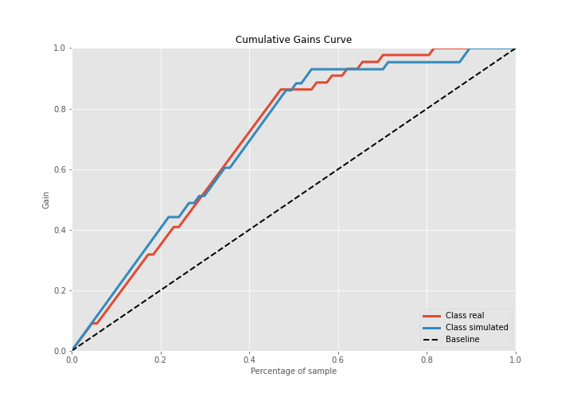

# Summary of 2_DecisionTree

[<< Go back](../README.md)

## Decision Tree
- **n_jobs**: -1
- **criterion**: gini
- **max_depth**: 3
- **explain_level**: 2

## Validation
 - **validation_type**: split
 - **train_ratio**: 0.75
 - **shuffle**: True
 - **stratify**: True

## Optimized metric
accuracy

## Training time

4.6 seconds

## Metric details
|           |    score |   threshold |
|:----------|---------:|------------:|
| logloss   | 0.386819 |  nan        |
| auc       | 0.884514 |  nan        |
| f1        | 0.888889 |    0.448439 |
| accuracy  | 0.885057 |    0.448439 |
| precision | 0.863636 |    0.75436  |
| recall    | 1        |    0        |
| mcc       | 0.773599 |    0.448439 |

## Confusion matrix (at threshold=0.448439)
|                      |   Predicted as real |   Predicted as simulated |
|:---------------------|--------------------:|-------------------------:|
| Labeled as real      |                  37 |                        7 |
| Labeled as simulated |                   3 |                       40 |

## Learning curves

## Decision Tree 

### Tree #1

### Rules

if (sqreturn_autocorrelation_ts2_lag3 > 0.053) and (kurtosis1 <= 3.73) and (return_correlation_ts1_lag_0 <= 0.458) then class: simulated (proba: 88.37%) | based on 129 samples

if (sqreturn_autocorrelation_ts2_lag3 <= 0.053) and (kurtosis1 > 0.986) and (return_autocorrelation_1_lag1 <= 0.08) then class: real (proba: 98.68%) | based on 76 samples

if (sqreturn_autocorrelation_ts2_lag3 > 0.053) and (kurtosis1 > 3.73) and (mean2 <= 0.13) then class: real (proba: 95.83%) | based on 24 samples

if (sqreturn_autocorrelation_ts2_lag3 > 0.053) and (kurtosis1 <= 3.73) and (return_correlation_ts1_lag_0 > 0.458) then class: real (proba: 88.89%) | based on 9 samples

if (sqreturn_autocorrelation_ts2_lag3 > 0.053) and (kurtosis1 > 3.73) and (mean2 > 0.13) then class: simulated (proba: 62.5%) | based on 8 samples

if (sqreturn_autocorrelation_ts2_lag3 <= 0.053) and (kurtosis1 > 0.986) and (return_autocorrelation_1_lag1 > 0.08) then class: real (proba: 66.67%) | based on 6 samples

if (sqreturn_autocorrelation_ts2_lag3 <= 0.053) and (kurtosis1 <= 0.986) and (sqreturn_autocorrelation_ts2_lag1 > 0.054) then class: simulated (proba: 100.0%) | based on 5 samples

if (sqreturn_autocorrelation_ts2_lag3 <= 0.053) and (kurtosis1 <= 0.986) and (sqreturn_autocorrelation_ts2_lag1 <= 0.054) then class: real (proba: 100.0%) | based on 3 samples

## Permutation-based Importance

## Confusion Matrix

## Normalized Confusion Matrix

## ROC Curve

## Kolmogorov-Smirnov Statistic

## Precision-Recall Curve

## Calibration Curve

## Cumulative Gains Curve

## Lift Curve

## SHAP Importance

## SHAP Dependence plots

### Dependence (Fold 1)

## SHAP Decision plots

### Top-10 Worst decisions for class 0 (Fold 1)

### Top-10 Best decisions for class 0 (Fold 1)

### Top-10 Worst decisions for class 1 (Fold 1)

### Top-10 Best decisions for class 1 (Fold 1)

[<< Go back](../README.md)
