# Summary of 3_Linear

[<< Go back](../README.md)

## Logistic Regression (Linear)
- **n_jobs**: -1
- **explain_level**: 2

## Validation
 - **validation_type**: split
 - **train_ratio**: 0.75
 - **shuffle**: True
 - **stratify**: True

## Optimized metric
accuracy

## Training time

3.3 seconds

## Metric details
|           |    score |     threshold |
|:----------|---------:|--------------:|
| logloss   | 0.35733  | nan           |
| auc       | 0.947146 | nan           |
| f1        | 0.893617 |   0.459092    |
| accuracy  | 0.885057 |   0.459092    |
| precision | 1        |   0.813464    |
| recall    | 1        |   8.60608e-06 |
| mcc       | 0.783887 |   0.459092    |

## Confusion matrix (at threshold=0.459092)
|                      |   Predicted as real |   Predicted as simulated |
|:---------------------|--------------------:|-------------------------:|
| Labeled as real      |                  35 |                        9 |
| Labeled as simulated |                   1 |                       42 |

## Learning curves
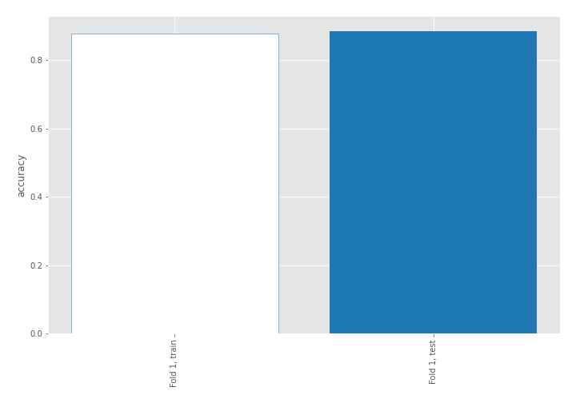

## Coefficients
| feature                           |   Learner_1 |
|:----------------------------------|------------:|
| mean2                             |   1.96909   |
| sqreturn_autocorrelation_ts2_lag3 |   1.7367    |
| mean1                             |   1.45145   |
| sqreturn_autocorrelation_ts1_lag3 |   1.32373   |
| return_autocorrelation_2_lag1     |   0.915313  |
| sqreturn_autocorrelation_ts2_lag2 |   0.850717  |
| sqreturn_autocorrelation_ts1_lag2 |   0.768614  |
| sqreturn_autocorrelation_ts2_lag1 |   0.728463  |
| return_autocorrelation_1_lag1     |   0.633688  |
| sqreturn_correlation_ts1_lag_1    |   0.621265  |
| return_correlation_ts1_lag_1      |   0.621265  |
| return_correlation_ts2_lag_1      |   0.549992  |
| sqreturn_correlation_ts2_lag_1    |   0.549992  |
| sqreturn_autocorrelation_ts1_lag1 |   0.537911  |
| return_autocorrelation_2_lag2     |   0.517966  |
| return_autocorrelation_2_lag3     |   0.43187   |
| return_correlation_ts2_lag_3      |   0.390707  |
| sqreturn_correlation_ts2_lag_3    |   0.390707  |
| sd1                               |   0.322128  |
| price1_granger_cause_price2       |   0.303199  |
| return_autocorrelation_1_lag3     |   0.21831   |
| return_autocorrelation_1_lag2     |   0.134174  |
| sqreturn_correlation_ts1_lag_3    |   0.0466577 |
| return_correlation_ts1_lag_3      |   0.0466577 |
| return_correlation_ts2_lag_2      |  -0.0760928 |
| sqreturn_correlation_ts2_lag_2    |  -0.0760928 |
| return_correlation_ts1_lag_0      |  -0.0886719 |
| sqreturn_correlation_ts1_lag_0    |  -0.0886719 |
| sd2                               |  -0.131883  |
| return_correlation_ts1_lag_2      |  -0.326395  |
| sqreturn_correlation_ts1_lag_2    |  -0.326395  |
| price2_granger_cause_price1       |  -0.858192  |
| skewness2                         |  -0.875452  |
| skewness1                         |  -0.932964  |
| intercept                         |  -1.97761   |
| kurtosis1                         |  -2.47052   |
| kurtosis2                         |  -2.72663   |

## Permutation-based Importance
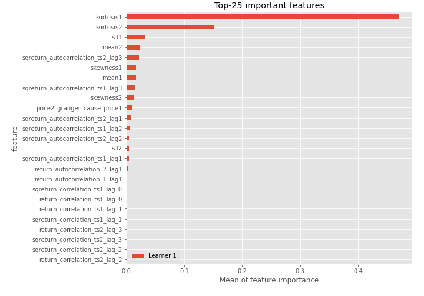
## Confusion Matrix

## Normalized Confusion Matrix

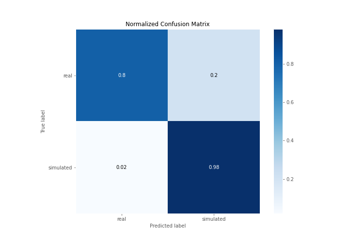

## ROC Curve

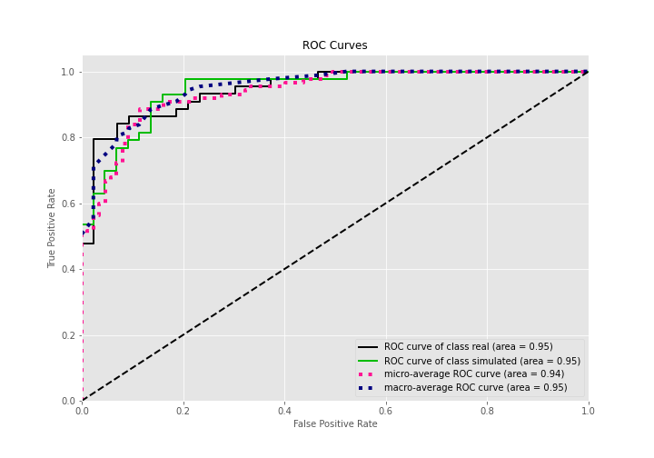

## Kolmogorov-Smirnov Statistic

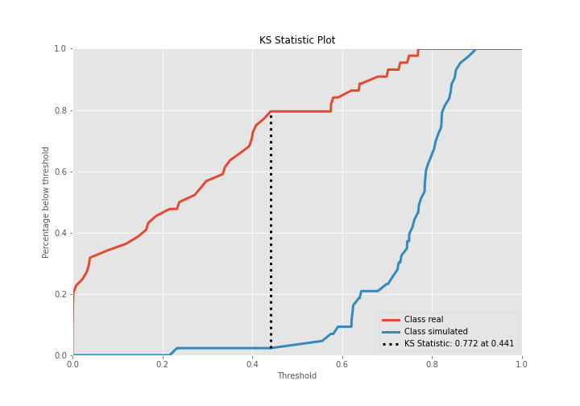

## Precision-Recall Curve

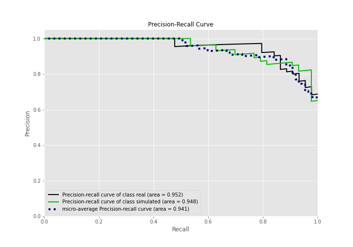

## Calibration Curve

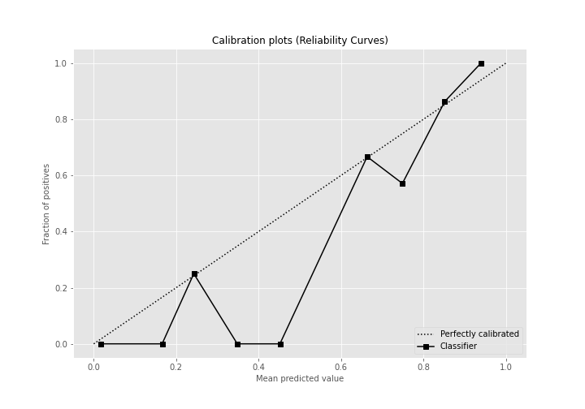

## Cumulative Gains Curve

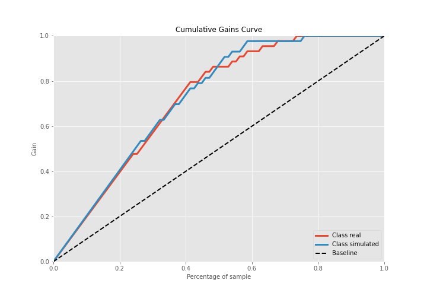

## Lift Curve

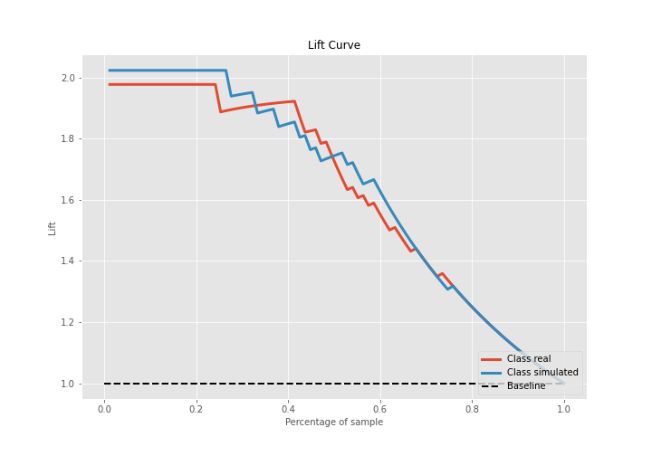

## SHAP Importance
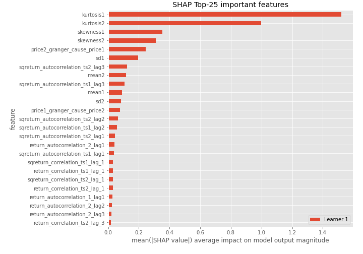

## SHAP Dependence plots

### Dependence (Fold 1)
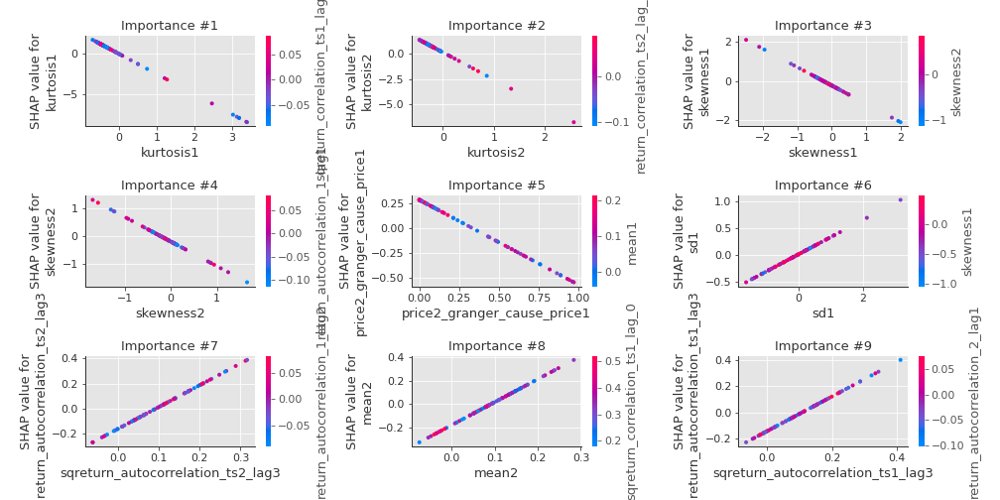

## SHAP Decision plots

### Top-10 Worst decisions for class 0 (Fold 1)
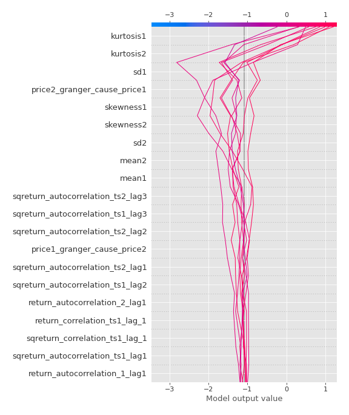
### Top-10 Best decisions for class 0 (Fold 1)
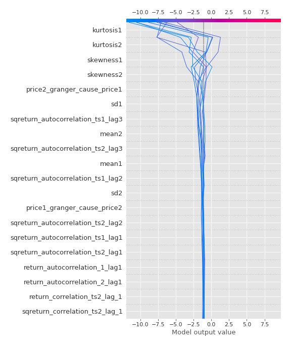
### Top-10 Worst decisions for class 1 (Fold 1)
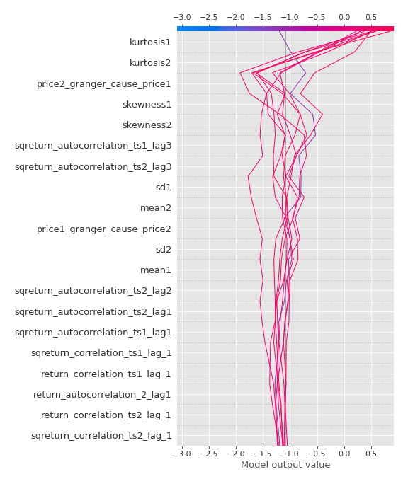
### Top-10 Best decisions for class 1 (Fold 1)
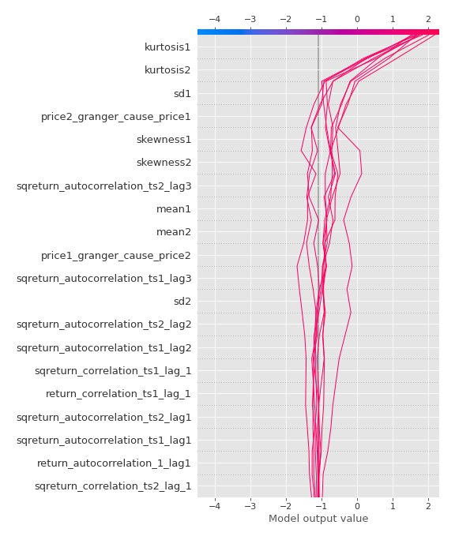

[<< Go back](../README.md)
