# Exploratory Data Analysis

[<< Go back](../README.md)
## Feature : target
- **Feature type** : categorical
- **Missing** : 0.0%
- **Unique** : 2
- **Count** :347
- **Unique** :2
- **Top** :real
- **Freq** :175

## Feature : mean1
- **Feature type** : continous
- **Missing** : 0.0%
- **Unique** : 347
- **Count** :347.0
- **Mean** :0.07654451753059986
- **Std** :0.0737597717728524
- **Min** :-0.22632637961920957
- **25%th Percentile** : 0.03207650456590408
- **50%th Percentile** : 0.0788486348433133
- **75%th Percentile** : 0.11658052380555092
- **Max** :0.3612366374600757

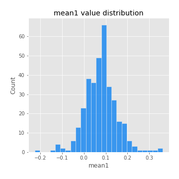
## Feature : mean2
- **Feature type** : continous
- **Missing** : 0.0%
- **Unique** : 347
- **Count** :347.0
- **Mean** :0.09692017478540299
- **Std** :0.08731890826164371
- **Min** :-0.24205418062825398
- **25%th Percentile** : 0.05017100659219246
- **50%th Percentile** : 0.09522934132083541
- **75%th Percentile** : 0.1472058992478339
- **Max** :0.37616608147096464

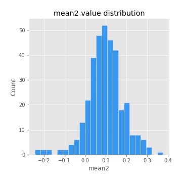
## Feature : sd1
- **Feature type** : continous
- **Missing** : 0.0%
- **Unique** : 347
- **Count** :347.0
- **Mean** :2.0326491386153682
- **Std** :0.7629286399326572
- **Min** :0.7616892806547367
- **25%th Percentile** : 1.576812036343811
- **50%th Percentile** : 1.979109707697495
- **75%th Percentile** : 2.3928227550511467
- **Max** :9.236766377527575

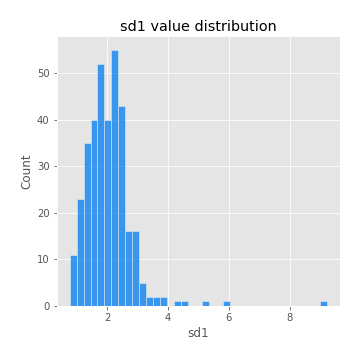
## Feature : sd2
- **Feature type** : continous
- **Missing** : 0.0%
- **Unique** : 347
- **Count** :347.0
- **Mean** :1.926162931313163
- **Std** :0.7249811759937612
- **Min** :0.7661212363020862
- **25%th Percentile** : 1.4468633383307385
- **50%th Percentile** : 1.8248602452877782
- **75%th Percentile** : 2.2171272557111688
- **Max** :5.872800253666788

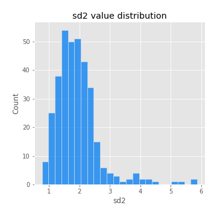
## Feature : skewness1
- **Feature type** : continous
- **Missing** : 0.0%
- **Unique** : 347
- **Count** :347.0
- **Mean** :-0.1772640674127907
- **Std** :0.6011232777511648
- **Min** :-3.530116233761814
- **25%th Percentile** : -0.32451991206900227
- **50%th Percentile** : -0.15670377084621462
- **75%th Percentile** : 0.06932689700958619
- **Max** :1.989411030028313

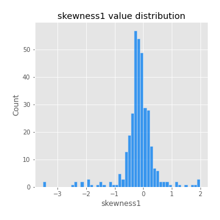
## Feature : skewness2
- **Feature type** : continous
- **Missing** : 0.0%
- **Unique** : 347
- **Count** :347.0
- **Mean** :-0.22149347638890687
- **Std** :0.797663164961603
- **Min** :-8.801502855292393
- **25%th Percentile** : -0.3674656360837718
- **50%th Percentile** : -0.15280711446830372
- **75%th Percentile** : 0.03486610139455383
- **Max** :2.2606839051517187

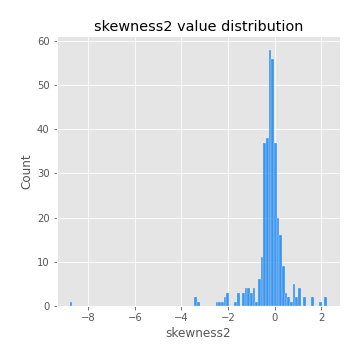
## Feature : kurtosis1
- **Feature type** : continous
- **Missing** : 0.0%
- **Unique** : 347
- **Count** :347.0
- **Mean** :4.033267913166329
- **Std** :5.694499576752703
- **Min** :0.07149361823522637
- **25%th Percentile** : 1.2307728857844582
- **50%th Percentile** : 1.972605861911401
- **75%th Percentile** : 3.993451978511259
- **Max** :46.07507808162177

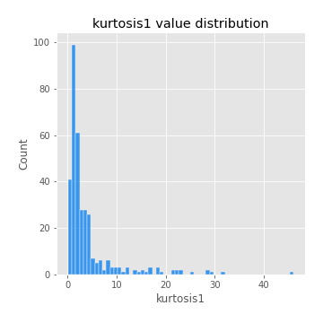
## Feature : kurtosis2
- **Feature type** : continous
- **Missing** : 0.0%
- **Unique** : 347
- **Count** :347.0
- **Mean** :4.726816127564957
- **Std** :9.769686378039811
- **Min** :0.07310662619529884
- **25%th Percentile** : 1.358949512278953
- **50%th Percentile** : 2.1781026492540474
- **75%th Percentile** : 4.355776830325502
- **Max** :143.10871011533666

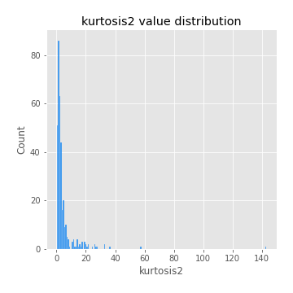
## Feature : return_autocorrelation_1_lag1
- **Feature type** : continous
- **Missing** : 0.0%
- **Unique** : 347
- **Count** :347.0
- **Mean** :-0.010834195880738091
- **Std** :0.060582493417234276
- **Min** :-0.20673896439036124
- **25%th Percentile** : -0.045542301171028796
- **50%th Percentile** : -0.006409484352182746
- **75%th Percentile** : 0.026981765861373214
- **Max** :0.2001295074173872

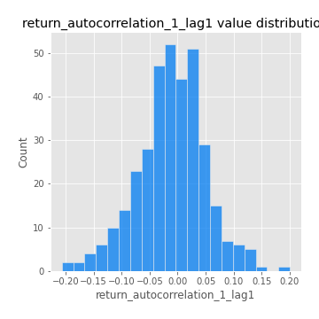
## Feature : return_autocorrelation_1_lag2
- **Feature type** : continous
- **Missing** : 0.0%
- **Unique** : 347
- **Count** :347.0
- **Mean** :-0.00533290373281182
- **Std** :0.053068943163002764
- **Min** :-0.1575994143020104
- **25%th Percentile** : -0.03734548498321995
- **50%th Percentile** : -0.007363567998604444
- **75%th Percentile** : 0.02528448756164907
- **Max** :0.15733647469543802

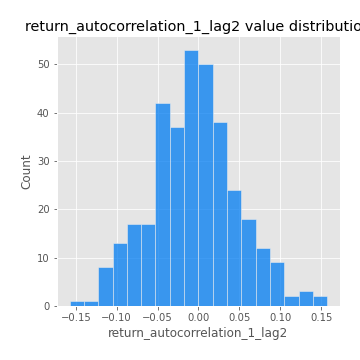
## Feature : return_autocorrelation_1_lag3
- **Feature type** : continous
- **Missing** : 0.0%
- **Unique** : 347
- **Count** :347.0
- **Mean** :-0.004737577508239478
- **Std** :0.05636427023175448
- **Min** :-0.15806635192103805
- **25%th Percentile** : -0.04471015920357824
- **50%th Percentile** : -0.00502637606969931
- **75%th Percentile** : 0.03411036411238788
- **Max** :0.17805869530681923

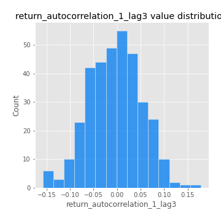
## Feature : return_autocorrelation_2_lag1
- **Feature type** : continous
- **Missing** : 0.0%
- **Unique** : 347
- **Count** :347.0
- **Mean** :-0.010706891489206921
- **Std** :0.06155347604376195
- **Min** :-0.25075531010123286
- **25%th Percentile** : -0.044068808863765525
- **50%th Percentile** : -0.010655092631735046
- **75%th Percentile** : 0.026340308578790647
- **Max** :0.17239461054777047

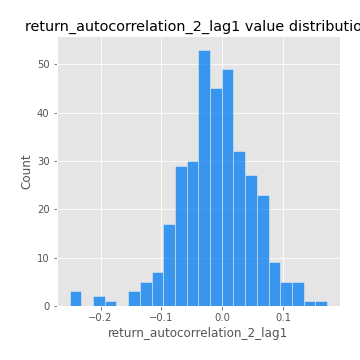
## Feature : return_autocorrelation_2_lag2
- **Feature type** : continous
- **Missing** : 0.0%
- **Unique** : 347
- **Count** :347.0
- **Mean** :-0.003931001060826592
- **Std** :0.055669618030398826
- **Min** :-0.15514401808058897
- **25%th Percentile** : -0.04142676149465491
- **50%th Percentile** : -0.007521628340500333
- **75%th Percentile** : 0.03292558883560536
- **Max** :0.17665259869843394

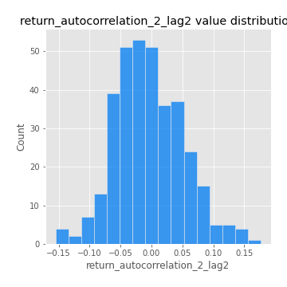
## Feature : return_autocorrelation_2_lag3
- **Feature type** : continous
- **Missing** : 0.0%
- **Unique** : 347
- **Count** :347.0
- **Mean** :-0.011236457764635643
- **Std** :0.0527842695726992
- **Min** :-0.1806211423015981
- **25%th Percentile** : -0.04732746450314252
- **50%th Percentile** : -0.01221031819096808
- **75%th Percentile** : 0.02472097345065617
- **Max** :0.14310764276729915

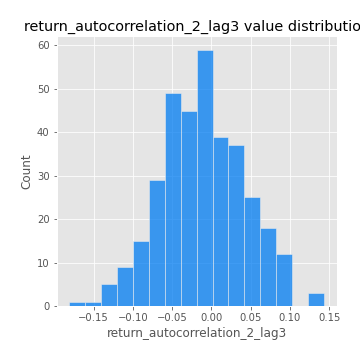
## Feature : return_correlation_ts1_lag_0
- **Feature type** : continous
- **Missing** : 0.0%
- **Unique** : 347
- **Count** :347.0
- **Mean** :0.33248604126550463
- **Std** :0.10818744073016964
- **Min** :-0.027089510445801036
- **25%th Percentile** : 0.27403890670039144
- **50%th Percentile** : 0.34113619823267904
- **75%th Percentile** : 0.3868489961501747
- **Max** :0.7041861626832071

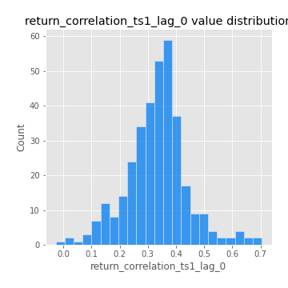
## Feature : return_correlation_ts1_lag_1
- **Feature type** : continous
- **Missing** : 0.0%
- **Unique** : 347
- **Count** :347.0
- **Mean** :-0.012590587568264611
- **Std** :0.057521923427450966
- **Min** :-0.15776193292681923
- **25%th Percentile** : -0.0514087508069599
- **50%th Percentile** : -0.011334651557055693
- **75%th Percentile** : 0.024792008564782114
- **Max** :0.15499424718508623

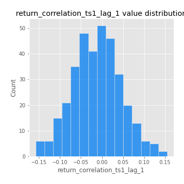
## Feature : return_correlation_ts1_lag_2
- **Feature type** : continous
- **Missing** : 0.0%
- **Unique** : 347
- **Count** :347.0
- **Mean** :-0.00529623885015517
- **Std** :0.054102676923556074
- **Min** :-0.12972649134353487
- **25%th Percentile** : -0.041524133905437105
- **50%th Percentile** : -0.006371401773435915
- **75%th Percentile** : 0.03629996296671194
- **Max** :0.1491386861180032

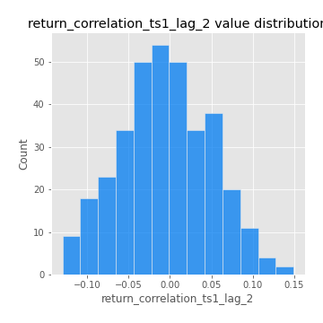
## Feature : return_correlation_ts1_lag_3
- **Feature type** : continous
- **Missing** : 0.0%
- **Unique** : 347
- **Count** :347.0
- **Mean** :-0.00670061646811511
- **Std** :0.05508131475515077
- **Min** :-0.12921635672392842
- **25%th Percentile** : -0.04270985573508832
- **50%th Percentile** : -0.007344467411456866
- **75%th Percentile** : 0.029628363686532398
- **Max** :0.1636773216468148

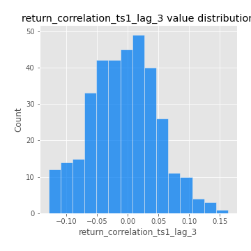
## Feature : return_correlation_ts2_lag_1
- **Feature type** : continous
- **Missing** : 0.0%
- **Unique** : 347
- **Count** :347.0
- **Mean** :-0.004038705099639315
- **Std** :0.058566687541143816
- **Min** :-0.2081139431093261
- **25%th Percentile** : -0.038264459596460965
- **50%th Percentile** : -0.004876884790633577
- **75%th Percentile** : 0.03331421421590906
- **Max** :0.17208763791364762

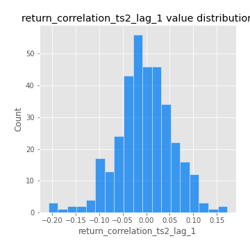
## Feature : return_correlation_ts2_lag_2
- **Feature type** : continous
- **Missing** : 0.0%
- **Unique** : 347
- **Count** :347.0
- **Mean** :0.0011418557284658128
- **Std** :0.05402505411479044
- **Min** :-0.15299951737180204
- **25%th Percentile** : -0.03164019901610411
- **50%th Percentile** : -0.0018983140823789228
- **75%th Percentile** : 0.03058201224554132
- **Max** :0.20772887392904255

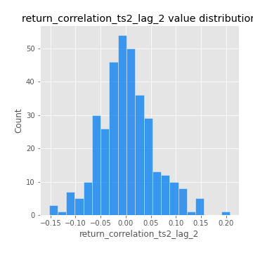
## Feature : return_correlation_ts2_lag_3
- **Feature type** : continous
- **Missing** : 0.0%
- **Unique** : 347
- **Count** :347.0
- **Mean** :-0.00461017070909432
- **Std** :0.05563322643038589
- **Min** :-0.17564076057312866
- **25%th Percentile** : -0.04212432454557899
- **50%th Percentile** : -0.006528307581784235
- **75%th Percentile** : 0.036606426533325645
- **Max** :0.1583505040510603

## Feature : sqreturn_autocorrelation_ts1_lag1
- **Feature type** : continous
- **Missing** : 0.0%
- **Unique** : 347
- **Count** :347.0
- **Mean** :0.12212437507313516
- **Std** :0.09349588116025234
- **Min** :-0.06532118872798363
- **25%th Percentile** : 0.04918950337756184
- **50%th Percentile** : 0.10596561261617857
- **75%th Percentile** : 0.17153982203688167
- **Max** :0.49414293176447355

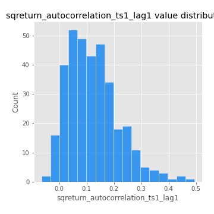
## Feature : sqreturn_autocorrelation_ts1_lag2
- **Feature type** : continous
- **Missing** : 0.0%
- **Unique** : 347
- **Count** :347.0
- **Mean** :0.11305339765303353
- **Std** :0.09141990200400525
- **Min** :-0.05165593255897504
- **25%th Percentile** : 0.04376806453264771
- **50%th Percentile** : 0.105543099683734
- **75%th Percentile** : 0.16426640563123956
- **Max** :0.4522162366773919

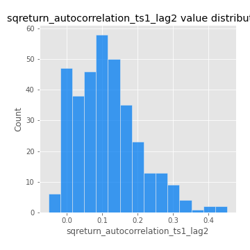
## Feature : sqreturn_autocorrelation_ts1_lag3
- **Feature type** : continous
- **Missing** : 0.0%
- **Unique** : 347
- **Count** :347.0
- **Mean** :0.09949179385743713
- **Std** :0.08977787554975093
- **Min** :-0.06486026764840777
- **25%th Percentile** : 0.028851669514010855
- **50%th Percentile** : 0.08563585856267536
- **75%th Percentile** : 0.15345655067574682
- **Max** :0.41030914918857014

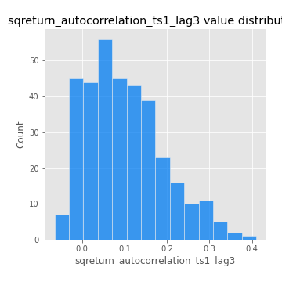
## Feature : sqreturn_autocorrelation_ts2_lag1
- **Feature type** : continous
- **Missing** : 0.0%
- **Unique** : 347
- **Count** :347.0
- **Mean** :0.1230792133986832
- **Std** :0.08568994153532483
- **Min** :-0.026917159862871694
- **25%th Percentile** : 0.054514980320579304
- **50%th Percentile** : 0.11764369484200467
- **75%th Percentile** : 0.17493388264413018
- **Max** :0.510085647437958

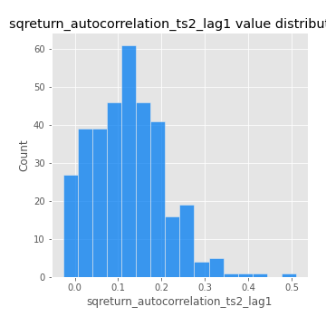
## Feature : sqreturn_autocorrelation_ts2_lag2
- **Feature type** : continous
- **Missing** : 0.0%
- **Unique** : 347
- **Count** :347.0
- **Mean** :0.1093213861567185
- **Std** :0.08927113318458595
- **Min** :-0.033377693228870714
- **25%th Percentile** : 0.03524500216023401
- **50%th Percentile** : 0.1045196848777715
- **75%th Percentile** : 0.16246891129897617
- **Max** :0.45676817892778204

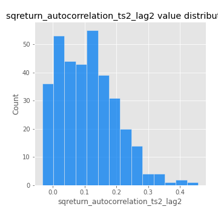
## Feature : sqreturn_autocorrelation_ts2_lag3
- **Feature type** : continous
- **Missing** : 0.0%
- **Unique** : 347
- **Count** :347.0
- **Mean** :0.09791330174249575
- **Std** :0.08324735239647134
- **Min** :-0.06082766359524085
- **25%th Percentile** : 0.034599402868232355
- **50%th Percentile** : 0.08345533675722205
- **75%th Percentile** : 0.15337847710562513
- **Max** :0.31831752578935646

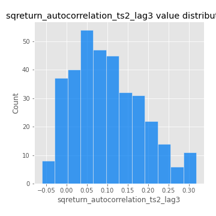
## Feature : sqreturn_correlation_ts1_lag_0
- **Feature type** : continous
- **Missing** : 0.0%
- **Unique** : 347
- **Count** :347.0
- **Mean** :0.33248604126550463
- **Std** :0.10818744073016964
- **Min** :-0.027089510445801036
- **25%th Percentile** : 0.27403890670039144
- **50%th Percentile** : 0.34113619823267904
- **75%th Percentile** : 0.3868489961501747
- **Max** :0.7041861626832071

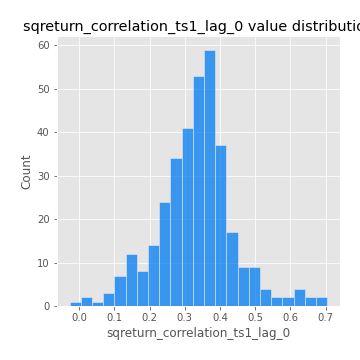
## Feature : sqreturn_correlation_ts1_lag_1
- **Feature type** : continous
- **Missing** : 0.0%
- **Unique** : 347
- **Count** :347.0
- **Mean** :-0.012590587568264611
- **Std** :0.057521923427450966
- **Min** :-0.15776193292681923
- **25%th Percentile** : -0.0514087508069599
- **50%th Percentile** : -0.011334651557055693
- **75%th Percentile** : 0.024792008564782114
- **Max** :0.15499424718508623

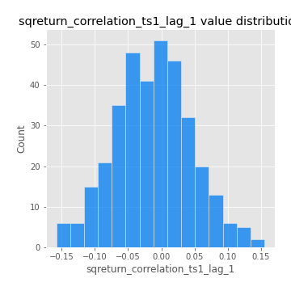
## Feature : sqreturn_correlation_ts1_lag_2
- **Feature type** : continous
- **Missing** : 0.0%
- **Unique** : 347
- **Count** :347.0
- **Mean** :-0.00529623885015517
- **Std** :0.054102676923556074
- **Min** :-0.12972649134353487
- **25%th Percentile** : -0.041524133905437105
- **50%th Percentile** : -0.006371401773435915
- **75%th Percentile** : 0.03629996296671194
- **Max** :0.1491386861180032

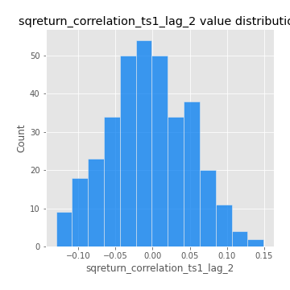
## Feature : sqreturn_correlation_ts1_lag_3
- **Feature type** : continous
- **Missing** : 0.0%
- **Unique** : 347
- **Count** :347.0
- **Mean** :-0.00670061646811511
- **Std** :0.05508131475515077
- **Min** :-0.12921635672392842
- **25%th Percentile** : -0.04270985573508832
- **50%th Percentile** : -0.007344467411456866
- **75%th Percentile** : 0.029628363686532398
- **Max** :0.1636773216468148

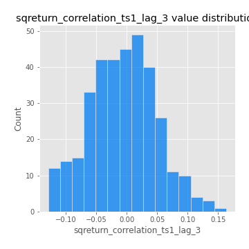
## Feature : sqreturn_correlation_ts2_lag_1
- **Feature type** : continous
- **Missing** : 0.0%
- **Unique** : 347
- **Count** :347.0
- **Mean** :-0.004038705099639315
- **Std** :0.058566687541143816
- **Min** :-0.2081139431093261
- **25%th Percentile** : -0.038264459596460965
- **50%th Percentile** : -0.004876884790633577
- **75%th Percentile** : 0.03331421421590906
- **Max** :0.17208763791364762

## Feature : sqreturn_correlation_ts2_lag_2
- **Feature type** : continous
- **Missing** : 0.0%
- **Unique** : 347
- **Count** :347.0
- **Mean** :0.0011418557284658128
- **Std** :0.05402505411479044
- **Min** :-0.15299951737180204
- **25%th Percentile** : -0.03164019901610411
- **50%th Percentile** : -0.0018983140823789228
- **75%th Percentile** : 0.03058201224554132
- **Max** :0.20772887392904255

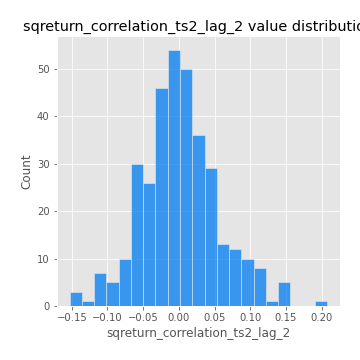
## Feature : sqreturn_correlation_ts2_lag_3
- **Feature type** : continous
- **Missing** : 0.0%
- **Unique** : 347
- **Count** :347.0
- **Mean** :-0.00461017070909432
- **Std** :0.05563322643038589
- **Min** :-0.17564076057312866
- **25%th Percentile** : -0.04212432454557899
- **50%th Percentile** : -0.006528307581784235
- **75%th Percentile** : 0.036606426533325645
- **Max** :0.1583505040510603

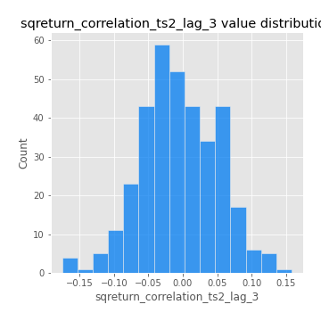
## Feature : price2_granger_cause_price1
- **Feature type** : continous
- **Missing** : 0.0%
- **Unique** : 347
- **Count** :347.0
- **Mean** :0.29976106108215755
- **Std** :0.2999753650437087
- **Min** :2.9450850039018573e-11
- **25%th Percentile** : 0.04008527844977394
- **50%th Percentile** : 0.17833525032429323
- **75%th Percentile** : 0.5147757293737734
- **Max** :0.9922690017977964

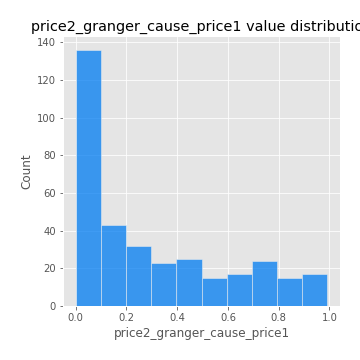
## Feature : price1_granger_cause_price2
- **Feature type** : continous
- **Missing** : 0.0%
- **Unique** : 347
- **Count** :347.0
- **Mean** :0.3245203797227785
- **Std** :0.29716447472509677
- **Min** :8.262834457477539e-07
- **25%th Percentile** : 0.05248695059365886
- **50%th Percentile** : 0.2522032175067385
- **75%th Percentile** : 0.5560308173040347
- **Max** :0.9951398266867577

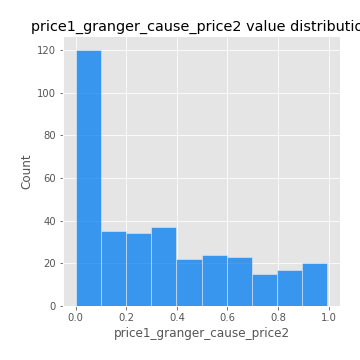

[<< Go back](../README.md)
