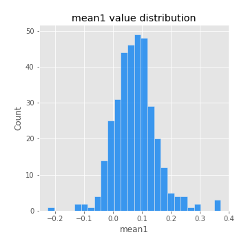

# Exploratory Data Analysis

[<< Go back](../README.md)
## Feature : target
- **Feature type** : categorical
- **Missing** : 0.0%
- **Unique** : 2
- **Count** :347
- **Unique** :2
- **Top** :real
- **Freq** :183

## Feature : mean1
- **Feature type** : continous
- **Missing** : 0.0%
- **Unique** : 347
- **Count** :347.0
- **Mean** :0.0759366127872913
- **Std** :0.07397011023194108
- **Min** :-0.22632637961920957
- **25%th Percentile** : 0.03127946559660705
- **50%th Percentile** : 0.07497714768438417
- **75%th Percentile** : 0.11503377954468293
- **Max** :0.37175100008111034

## Feature : mean2
- **Feature type** : continous
- **Missing** : 0.0%
- **Unique** : 347
- **Count** :347.0
- **Mean** :0.08735185634663596
- **Std** :0.08738893835992033
- **Min** :-0.24205418062825398
- **25%th Percentile** : 0.04133353233758141
- **50%th Percentile** : 0.0862360659769564
- **75%th Percentile** : 0.13978442026058313
- **Max** :0.37616608147096464

## Feature : sd1
- **Feature type** : continous
- **Missing** : 0.0%
- **Unique** : 347
- **Count** :347.0
- **Mean** :2.02257723172169
- **Std** :0.8183341031524795
- **Min** :0.7470080772831957
- **25%th Percentile** : 1.4777829238041522
- **50%th Percentile** : 1.93662999402709
- **75%th Percentile** : 2.4202948855373796
- **Max** :9.236766377527575

## Feature : sd2
- **Feature type** : continous
- **Missing** : 0.0%
- **Unique** : 347
- **Count** :347.0
- **Mean** :1.9719963975959114
- **Std** :0.8180032079151328
- **Min** :0.8592887433004143
- **25%th Percentile** : 1.434027851391183
- **50%th Percentile** : 1.8114310782757608
- **75%th Percentile** : 2.260540525898283
- **Max** :6.737618636746393

## Feature : skewness1
- **Feature type** : continous
- **Missing** : 0.0%
- **Unique** : 347
- **Count** :347.0
- **Mean** :-0.17832428394213895
- **Std** :0.5797443945625099
- **Min** :-3.530116233761814
- **25%th Percentile** : -0.3208802751604645
- **50%th Percentile** : -0.147080827170084
- **75%th Percentile** : 0.03315606429830598
- **Max** :2.224942816365292

## Feature : skewness2
- **Feature type** : continous
- **Missing** : 0.0%
- **Unique** : 347
- **Count** :347.0
- **Mean** :-0.15390650646638956
- **Std** :0.5786613976938874
- **Min** :-2.5169062744473636
- **25%th Percentile** : -0.34535336458825444
- **50%th Percentile** : -0.15031955117815285
- **75%th Percentile** : 0.06811067877386325
- **Max** :2.2606839051517187

## Feature : kurtosis1
- **Feature type** : continous
- **Missing** : 0.0%
- **Unique** : 347
- **Count** :347.0
- **Mean** :4.05684641182951
- **Std** :5.685539376453198
- **Min** :0.03477879299249054
- **25%th Percentile** : 1.2184144776129817
- **50%th Percentile** : 2.1093892309153275
- **75%th Percentile** : 4.114204628448306
- **Max** :36.91113889081053

## Feature : kurtosis2
- **Feature type** : continous
- **Missing** : 0.0%
- **Unique** : 347
- **Count** :347.0
- **Mean** :4.2488126919505325
- **Std** :5.4392816959748185
- **Min** :0.12447910097964199
- **25%th Percentile** : 1.3265475693162374
- **50%th Percentile** : 2.1847405755274774
- **75%th Percentile** : 4.45777438765429
- **Max** :36.023880269969645

## Feature : return_autocorrelation_1_lag1
- **Feature type** : continous
- **Missing** : 0.0%
- **Unique** : 347
- **Count** :347.0
- **Mean** :-0.011072619308598087
- **Std** :0.06358424650394884
- **Min** :-0.20673896439036124
- **25%th Percentile** : -0.05167175548697303
- **50%th Percentile** : -0.0069089598187218
- **75%th Percentile** : 0.03320353732557228
- **Max** :0.14628237717165576

## Feature : return_autocorrelation_1_lag2
- **Feature type** : continous
- **Missing** : 0.0%
- **Unique** : 347
- **Count** :347.0
- **Mean** :-0.0077316548330783495
- **Std** :0.05699006321834826
- **Min** :-0.14688972564448474
- **25%th Percentile** : -0.04478945015532418
- **50%th Percentile** : -0.006407172740631561
- **75%th Percentile** : 0.030986452347494267
- **Max** :0.17767029906923656

## Feature : return_autocorrelation_1_lag3
- **Feature type** : continous
- **Missing** : 0.0%
- **Unique** : 347
- **Count** :347.0
- **Mean** :-0.006492757896621298
- **Std** :0.053850679384016706
- **Min** :-0.1940836867390813
- **25%th Percentile** : -0.038949977266411064
- **50%th Percentile** : -0.004972695540344021
- **75%th Percentile** : 0.027948617720415035
- **Max** :0.12624365538719637

## Feature : return_autocorrelation_2_lag1
- **Feature type** : continous
- **Missing** : 0.0%
- **Unique** : 347
- **Count** :347.0
- **Mean** :-0.01337565807877132
- **Std** :0.06036397937672601
- **Min** :-0.25075531010123286
- **25%th Percentile** : -0.045087890516029544
- **50%th Percentile** : -0.00955231111966098
- **75%th Percentile** : 0.026986358082839626
- **Max** :0.16349871797309318

## Feature : return_autocorrelation_2_lag2
- **Feature type** : continous
- **Missing** : 0.0%
- **Unique** : 347
- **Count** :347.0
- **Mean** :-0.0060070118733475605
- **Std** :0.05451531474546974
- **Min** :-0.17929815286900216
- **25%th Percentile** : -0.04098698774462437
- **50%th Percentile** : -0.010366054130496724
- **75%th Percentile** : 0.02808139452473671
- **Max** :0.18405752515952215

## Feature : return_autocorrelation_2_lag3
- **Feature type** : continous
- **Missing** : 0.0%
- **Unique** : 347
- **Count** :347.0
- **Mean** :-0.009868911523844955
- **Std** :0.05058566869969187
- **Min** :-0.14338026727567216
- **25%th Percentile** : -0.043433709585619575
- **50%th Percentile** : -0.010123437035954672
- **75%th Percentile** : 0.024654612646187013
- **Max** :0.16093485130706225

## Feature : return_correlation_ts1_lag_0
- **Feature type** : continous
- **Missing** : 0.0%
- **Unique** : 347
- **Count** :347.0
- **Mean** :0.33231109461125724
- **Std** :0.11304695364689038
- **Min** :-0.027089510445801036
- **25%th Percentile** : 0.26797225590621354
- **50%th Percentile** : 0.34070550769122315
- **75%th Percentile** : 0.38807311332137434
- **Max** :0.6949986865664105

## Feature : return_correlation_ts1_lag_1
- **Feature type** : continous
- **Missing** : 0.0%
- **Unique** : 347
- **Count** :347.0
- **Mean** :-0.008077742885100575
- **Std** :0.05492665784053301
- **Min** :-0.15776193292681923
- **25%th Percentile** : -0.04262587755099782
- **50%th Percentile** : -0.0065776061526431175
- **75%th Percentile** : 0.03236191570712668
- **Max** :0.17435795385481134

## Feature : return_correlation_ts1_lag_2
- **Feature type** : continous
- **Missing** : 0.0%
- **Unique** : 347
- **Count** :347.0
- **Mean** :-0.0067620045880381514
- **Std** :0.05058167252084704
- **Min** :-0.1335109245571856
- **25%th Percentile** : -0.041524133905437105
- **50%th Percentile** : -0.006534974289627955
- **75%th Percentile** : 0.027676815096896214
- **Max** :0.1734770910329997

## Feature : return_correlation_ts1_lag_3
- **Feature type** : continous
- **Missing** : 0.0%
- **Unique** : 347
- **Count** :347.0
- **Mean** :-0.006177115663943616
- **Std** :0.0541515147055254
- **Min** :-0.16334772849411272
- **25%th Percentile** : -0.042428289324021554
- **50%th Percentile** : -0.006208204199992201
- **75%th Percentile** : 0.028127010962129006
- **Max** :0.1636773216468148

## Feature : return_correlation_ts2_lag_1
- **Feature type** : continous
- **Missing** : 0.0%
- **Unique** : 347
- **Count** :347.0
- **Mean** :-0.004336731501799591
- **Std** :0.056411620966078234
- **Min** :-0.2081139431093261
- **25%th Percentile** : -0.039458196187727446
- **50%th Percentile** : -0.004657628226243506
- **75%th Percentile** : 0.028968566922127684
- **Max** :0.17208763791364762

## Feature : return_correlation_ts2_lag_2
- **Feature type** : continous
- **Missing** : 0.0%
- **Unique** : 347
- **Count** :347.0
- **Mean** :-0.0010353526791795494
- **Std** :0.055799270206681614
- **Min** :-0.23751835475804678
- **25%th Percentile** : -0.03869105515912109
- **50%th Percentile** : -0.0027358749519114604
- **75%th Percentile** : 0.034130651819782434
- **Max** :0.15388933426238696

## Feature : return_correlation_ts2_lag_3
- **Feature type** : continous
- **Missing** : 0.0%
- **Unique** : 347
- **Count** :347.0
- **Mean** :-0.005323309660872208
- **Std** :0.05642445878989258
- **Min** :-0.16212823605110202
- **25%th Percentile** : -0.0426203751331609
- **50%th Percentile** : -0.007518278994166902
- **75%th Percentile** : 0.034732086735001694
- **Max** :0.1555559608020329

## Feature : sqreturn_autocorrelation_ts1_lag1
- **Feature type** : continous
- **Missing** : 0.0%
- **Unique** : 347
- **Count** :347.0
- **Mean** :0.11566248727552207
- **Std** :0.08857169478971944
- **Min** :-0.06532118872798363
- **25%th Percentile** : 0.04904422684587228
- **50%th Percentile** : 0.10287720570219114
- **75%th Percentile** : 0.16443213281919944
- **Max** :0.49414293176447355

## Feature : sqreturn_autocorrelation_ts1_lag2
- **Feature type** : continous
- **Missing** : 0.0%
- **Unique** : 347
- **Count** :347.0
- **Mean** :0.10763954614938401
- **Std** :0.08955974209368649
- **Min** :-0.036488613749476824
- **25%th Percentile** : 0.03721709104751733
- **50%th Percentile** : 0.10014241467969807
- **75%th Percentile** : 0.15923135304828878
- **Max** :0.540735851444759

## Feature : sqreturn_autocorrelation_ts1_lag3
- **Feature type** : continous
- **Missing** : 0.0%
- **Unique** : 347
- **Count** :347.0
- **Mean** :0.10015599223243815
- **Std** :0.08848805680489012
- **Min** :-0.06486026764840777
- **25%th Percentile** : 0.031238146244005012
- **50%th Percentile** : 0.09059665849785074
- **75%th Percentile** : 0.15891378938753503
- **Max** :0.47574572235281926

## Feature : sqreturn_autocorrelation_ts2_lag1
- **Feature type** : continous
- **Missing** : 0.0%
- **Unique** : 347
- **Count** :347.0
- **Mean** :0.11330738863213999
- **Std** :0.08843492002587332
- **Min** :-0.08520586663750691
- **25%th Percentile** : 0.04238117702863928
- **50%th Percentile** : 0.1020382943946035
- **75%th Percentile** : 0.16992128900500547
- **Max** :0.510085647437958

## Feature : sqreturn_autocorrelation_ts2_lag2
- **Feature type** : continous
- **Missing** : 0.0%
- **Unique** : 347
- **Count** :347.0
- **Mean** :0.10797646055295526
- **Std** :0.09684513448451333
- **Min** :-0.051523884196217395
- **25%th Percentile** : 0.030103760548713533
- **50%th Percentile** : 0.09366634425047159
- **75%th Percentile** : 0.17122298084550758
- **Max** :0.5373432415582473

## Feature : sqreturn_autocorrelation_ts2_lag3
- **Feature type** : continous
- **Missing** : 0.0%
- **Unique** : 347
- **Count** :347.0
- **Mean** :0.09214360383762625
- **Std** :0.08590579909629187
- **Min** :-0.06082766359524085
- **25%th Percentile** : 0.02294829342457335
- **50%th Percentile** : 0.07558601251338158
- **75%th Percentile** : 0.14975882778144728
- **Max** :0.3980574030573471

## Feature : sqreturn_correlation_ts1_lag_0
- **Feature type** : continous
- **Missing** : 0.0%
- **Unique** : 347
- **Count** :347.0
- **Mean** :0.33231109461125724
- **Std** :0.11304695364689038
- **Min** :-0.027089510445801036
- **25%th Percentile** : 0.26797225590621354
- **50%th Percentile** : 0.34070550769122315
- **75%th Percentile** : 0.38807311332137434
- **Max** :0.6949986865664105

## Feature : sqreturn_correlation_ts1_lag_1
- **Feature type** : continous
- **Missing** : 0.0%
- **Unique** : 347
- **Count** :347.0
- **Mean** :-0.008077742885100575
- **Std** :0.05492665784053301
- **Min** :-0.15776193292681923
- **25%th Percentile** : -0.04262587755099782
- **50%th Percentile** : -0.0065776061526431175
- **75%th Percentile** : 0.03236191570712668
- **Max** :0.17435795385481134

## Feature : sqreturn_correlation_ts1_lag_2
- **Feature type** : continous
- **Missing** : 0.0%
- **Unique** : 347
- **Count** :347.0
- **Mean** :-0.0067620045880381514
- **Std** :0.05058167252084704
- **Min** :-0.1335109245571856
- **25%th Percentile** : -0.041524133905437105
- **50%th Percentile** : -0.006534974289627955
- **75%th Percentile** : 0.027676815096896214
- **Max** :0.1734770910329997

## Feature : sqreturn_correlation_ts1_lag_3
- **Feature type** : continous
- **Missing** : 0.0%
- **Unique** : 347
- **Count** :347.0
- **Mean** :-0.006177115663943616
- **Std** :0.0541515147055254
- **Min** :-0.16334772849411272
- **25%th Percentile** : -0.042428289324021554
- **50%th Percentile** : -0.006208204199992201
- **75%th Percentile** : 0.028127010962129006
- **Max** :0.1636773216468148

## Feature : sqreturn_correlation_ts2_lag_1
- **Feature type** : continous
- **Missing** : 0.0%
- **Unique** : 347
- **Count** :347.0
- **Mean** :-0.004336731501799591
- **Std** :0.056411620966078234
- **Min** :-0.2081139431093261
- **25%th Percentile** : -0.039458196187727446
- **50%th Percentile** : -0.004657628226243506
- **75%th Percentile** : 0.028968566922127684
- **Max** :0.17208763791364762

## Feature : sqreturn_correlation_ts2_lag_2
- **Feature type** : continous
- **Missing** : 0.0%
- **Unique** : 347
- **Count** :347.0
- **Mean** :-0.0010353526791795494
- **Std** :0.055799270206681614
- **Min** :-0.23751835475804678
- **25%th Percentile** : -0.03869105515912109
- **50%th Percentile** : -0.0027358749519114604
- **75%th Percentile** : 0.034130651819782434
- **Max** :0.15388933426238696

## Feature : sqreturn_correlation_ts2_lag_3
- **Feature type** : continous
- **Missing** : 0.0%
- **Unique** : 347
- **Count** :347.0
- **Mean** :-0.005323309660872208
- **Std** :0.05642445878989258
- **Min** :-0.16212823605110202
- **25%th Percentile** : -0.0426203751331609
- **50%th Percentile** : -0.007518278994166902
- **75%th Percentile** : 0.034732086735001694
- **Max** :0.1555559608020329

## Feature : price2_granger_cause_price1
- **Feature type** : continous
- **Missing** : 0.0%
- **Unique** : 347
- **Count** :347.0
- **Mean** :0.31426708616122034
- **Std** :0.29716307245264223
- **Min** :9.601331357470778e-10
- **25%th Percentile** : 0.03973897375451156
- **50%th Percentile** : 0.2369928032318464
- **75%th Percentile** : 0.5208008236848263
- **Max** :0.9900742239286224

## Feature : price1_granger_cause_price2
- **Feature type** : continous
- **Missing** : 0.0%
- **Unique** : 347
- **Count** :347.0
- **Mean** :0.310723807456272
- **Std** :0.2965877210384436
- **Min** :4.0263693648370974e-11
- **25%th Percentile** : 0.04396828418310028
- **50%th Percentile** : 0.2187486483332056
- **75%th Percentile** : 0.5302528116253826
- **Max** :0.999575197710458

[<< Go back](../README.md)
