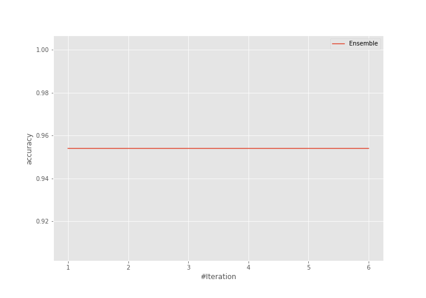
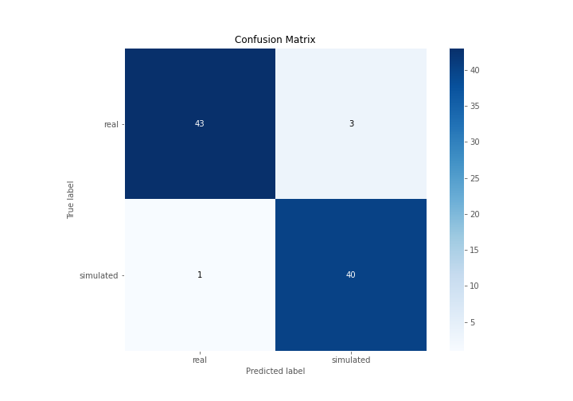
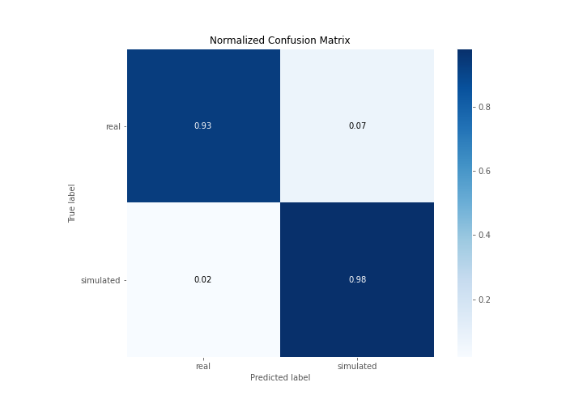
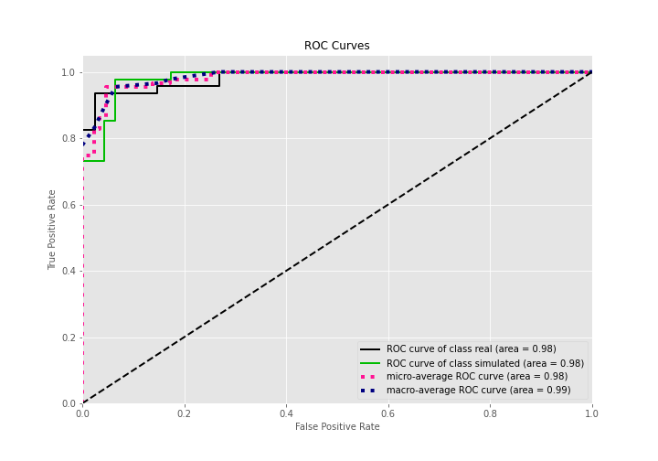
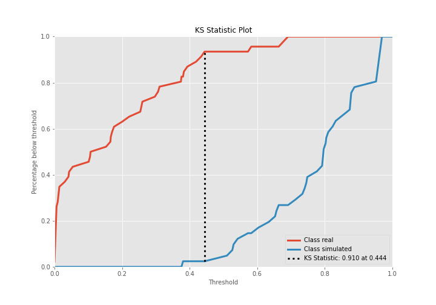
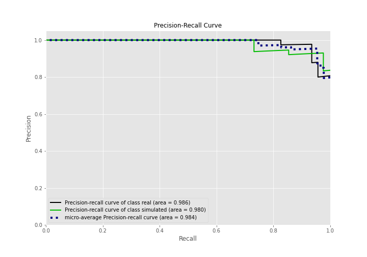
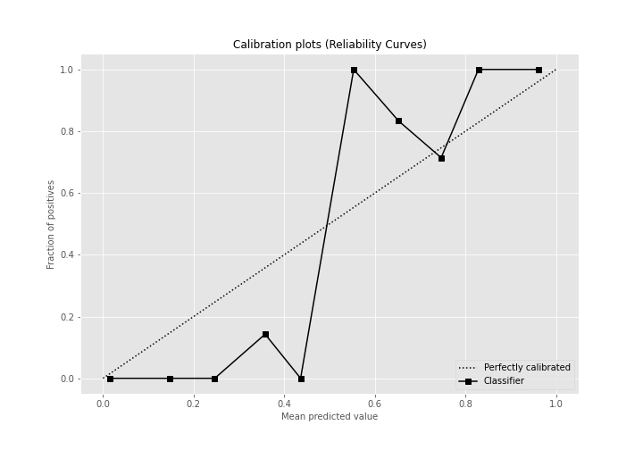
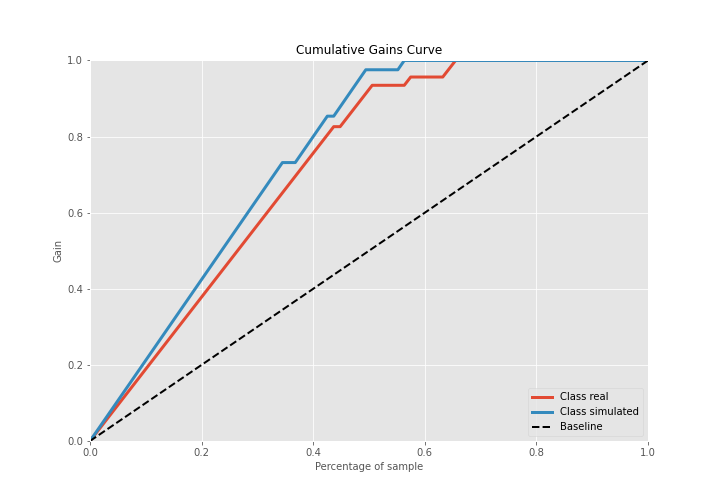
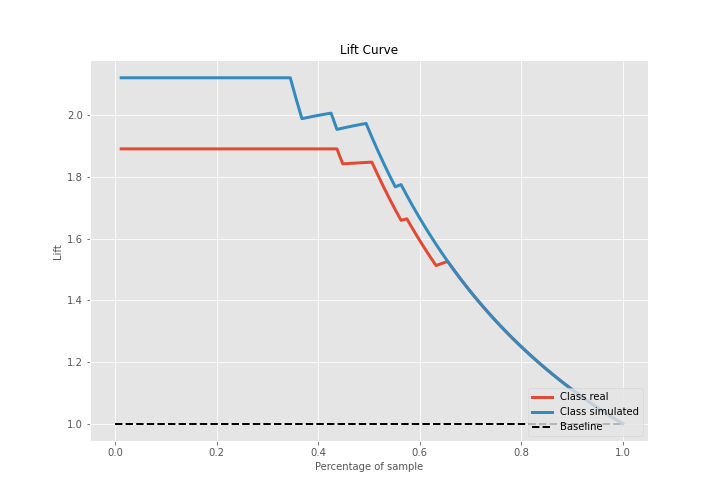

# Summary of Ensemble

[<< Go back](../README.md)

## Ensemble structure
| Model                  |   Weight |
|:-----------------------|---------:|
| 6_Default_RandomForest |        1 |

## Metric details
|           |    score |   threshold |
|:----------|---------:|------------:|
| logloss   | 0.252193 |  nan        |
| auc       | 0.982503 |  nan        |
| f1        | 0.952381 |    0.491705 |
| accuracy  | 0.954023 |    0.491705 |
| precision | 1        |    0.740077 |
| recall    | 1        |    0        |
| mcc       | 0.908948 |    0.491705 |

## Confusion matrix (at threshold=0.491705)
|                      |   Predicted as real |   Predicted as simulated |
|:---------------------|--------------------:|-------------------------:|
| Labeled as real      |                  43 |                        3 |
| Labeled as simulated |                   1 |                       40 |

## Learning curves

## Confusion Matrix

## Normalized Confusion Matrix

## ROC Curve

## Kolmogorov-Smirnov Statistic

## Precision-Recall Curve

## Calibration Curve

## Cumulative Gains Curve

## Lift Curve

[<< Go back](../README.md)
