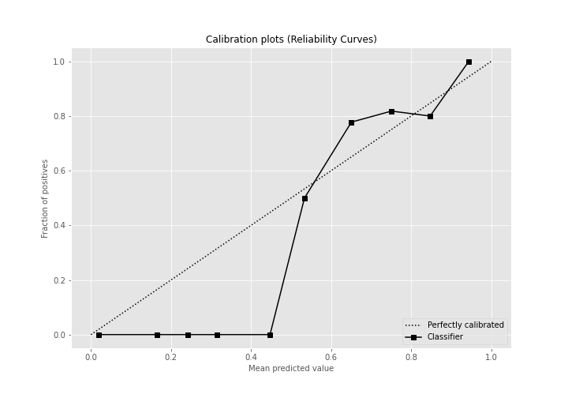

# Summary of 3_Linear

[<< Go back](../README.md)

## Logistic Regression (Linear)
- **n_jobs**: -1
- **explain_level**: 2

## Validation
 - **validation_type**: split
 - **train_ratio**: 0.75
 - **shuffle**: True
 - **stratify**: True

## Optimized metric
accuracy

## Training time

4.3 seconds

## Metric details
|           |    score |     threshold |
|:----------|---------:|--------------:|
| logloss   | 0.340166 | nan           |
| auc       | 0.94186  | nan           |
| f1        | 0.903226 |   0.515904    |
| accuracy  | 0.896552 |   0.515904    |
| precision | 1        |   0.855929    |
| recall    | 1        |   2.62309e-10 |
| mcc       | 0.798108 |   0.515904    |

## Confusion matrix (at threshold=0.515904)
|                      |   Predicted as real |   Predicted as simulated |
|:---------------------|--------------------:|-------------------------:|
| Labeled as real      |                  36 |                        7 |
| Labeled as simulated |                   2 |                       42 |

## Learning curves

## Coefficients
| feature                           |   Learner_1 |
|:----------------------------------|------------:|
| mean2                             |   1.75263   |
| sqreturn_autocorrelation_ts2_lag3 |   1.75166   |
| mean1                             |   1.38174   |
| sqreturn_autocorrelation_ts1_lag3 |   1.25452   |
| return_autocorrelation_2_lag1     |   0.963297  |
| sqreturn_autocorrelation_ts1_lag1 |   0.713034  |
| sqreturn_correlation_ts1_lag_1    |   0.644684  |
| return_correlation_ts1_lag_1      |   0.644684  |
| sqreturn_autocorrelation_ts1_lag2 |   0.600917  |
| sqreturn_autocorrelation_ts2_lag2 |   0.587512  |
| sd1                               |   0.574461  |
| sqreturn_correlation_ts2_lag_3    |   0.540757  |
| return_correlation_ts2_lag_3      |   0.540757  |
| sqreturn_autocorrelation_ts2_lag1 |   0.528317  |
| return_autocorrelation_1_lag1     |   0.500971  |
| return_autocorrelation_2_lag2     |   0.478507  |
| return_autocorrelation_2_lag3     |   0.467484  |
| return_autocorrelation_1_lag3     |   0.400577  |
| return_correlation_ts2_lag_1      |   0.244332  |
| sqreturn_correlation_ts2_lag_1    |   0.244332  |
| price1_granger_cause_price2       |   0.203287  |
| sqreturn_correlation_ts1_lag_3    |   0.10402   |
| return_correlation_ts1_lag_3      |   0.10402   |
| return_autocorrelation_1_lag2     |   0.098358  |
| return_correlation_ts1_lag_2      |  -0.0234708 |
| sqreturn_correlation_ts1_lag_2    |  -0.0234708 |
| return_correlation_ts2_lag_2      |  -0.19851   |
| sqreturn_correlation_ts2_lag_2    |  -0.19851   |
| sd2                               |  -0.315865  |
| skewness2                         |  -0.573747  |
| return_correlation_ts1_lag_0      |  -0.582823  |
| sqreturn_correlation_ts1_lag_0    |  -0.582823  |
| price2_granger_cause_price1       |  -0.703031  |
| skewness1                         |  -1.23281   |
| intercept                         |  -1.55316   |
| kurtosis2                         |  -2.02464   |
| kurtosis1                         |  -2.80692   |

## Permutation-based Importance

## Confusion Matrix

## Normalized Confusion Matrix

## ROC Curve

## Kolmogorov-Smirnov Statistic

## Precision-Recall Curve

## Calibration Curve

## Cumulative Gains Curve

## Lift Curve

## SHAP Importance

## SHAP Dependence plots

### Dependence (Fold 1)

## SHAP Decision plots

### Top-10 Worst decisions for class 0 (Fold 1)

### Top-10 Best decisions for class 0 (Fold 1)

### Top-10 Worst decisions for class 1 (Fold 1)

### Top-10 Best decisions for class 1 (Fold 1)

[<< Go back](../README.md)
