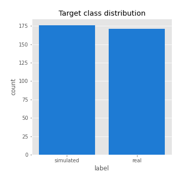
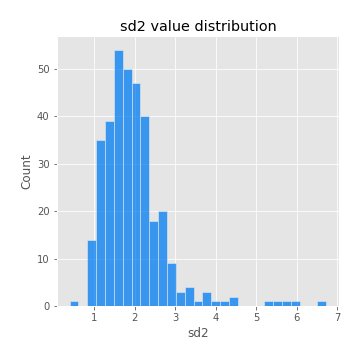
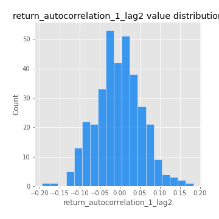

# Exploratory Data Analysis

[<< Go back](../README.md)
## Feature : target
- **Feature type** : categorical
- **Missing** : 0.0%
- **Unique** : 2
- **Count** :347
- **Unique** :2
- **Top** :simulated
- **Freq** :176

## Feature : mean1
- **Feature type** : continous
- **Missing** : 0.0%
- **Unique** : 347
- **Count** :347.0
- **Mean** :0.08502563357744782
- **Std** :0.07810667385407274
- **Min** :-0.17686457077756634
- **25%th Percentile** : 0.041584116023261355
- **50%th Percentile** : 0.08106546589209986
- **75%th Percentile** : 0.12367460085183006
- **Max** :0.37175100008111034

## Feature : mean2
- **Feature type** : continous
- **Missing** : 0.0%
- **Unique** : 347
- **Count** :347.0
- **Mean** :0.08931421934066863
- **Std** :0.08724503277003333
- **Min** :-0.24205418062825398
- **25%th Percentile** : 0.04567497531694649
- **50%th Percentile** : 0.0903724795030077
- **75%th Percentile** : 0.13998858403682773
- **Max** :0.37616608147096464

## Feature : sd1
- **Feature type** : continous
- **Missing** : 0.0%
- **Unique** : 347
- **Count** :347.0
- **Mean** :2.017071372611762
- **Std** :0.6622858344487738
- **Min** :0.7470080772831957
- **25%th Percentile** : 1.5826250106022477
- **50%th Percentile** : 1.977227515015615
- **75%th Percentile** : 2.360335432998772
- **Max** :6.495661311240861

## Feature : sd2
- **Feature type** : continous
- **Missing** : 0.0%
- **Unique** : 347
- **Count** :347.0
- **Mean** :1.955936035147222
- **Std** :0.7806188286591526
- **Min** :0.39092771505818674
- **25%th Percentile** : 1.4672781951634537
- **50%th Percentile** : 1.8385346126338982
- **75%th Percentile** : 2.258321695131857
- **Max** :6.737618636746393

## Feature : skewness1
- **Feature type** : continous
- **Missing** : 0.0%
- **Unique** : 347
- **Count** :347.0
- **Mean** :-0.14242841744129542
- **Std** :0.5900587468128279
- **Min** :-3.530116233761814
- **25%th Percentile** : -0.2947592387504375
- **50%th Percentile** : -0.12976950524905387
- **75%th Percentile** : 0.04159486532354767
- **Max** :2.5845963767725557

## Feature : skewness2
- **Feature type** : continous
- **Missing** : 0.0%
- **Unique** : 347
- **Count** :347.0
- **Mean** :-0.24747988047313105
- **Std** :0.6312001409511587
- **Min** :-5.778144124281153
- **25%th Percentile** : -0.394509068739562
- **50%th Percentile** : -0.1823108218119259
- **75%th Percentile** : -0.013696701613211227
- **Max** :2.242019525651531

## Feature : kurtosis1
- **Feature type** : continous
- **Missing** : 0.0%
- **Unique** : 347
- **Count** :347.0
- **Mean** :3.8984926583657016
- **Std** :5.6438483003414515
- **Min** :0.03477879299249054
- **25%th Percentile** : 1.1451705404162311
- **50%th Percentile** : 1.9142470172872241
- **75%th Percentile** : 3.6512465710229476
- **Max** :36.91113889081053

## Feature : kurtosis2
- **Feature type** : continous
- **Missing** : 0.0%
- **Unique** : 347
- **Count** :347.0
- **Mean** :4.119002384960233
- **Std** :6.458061433482232
- **Min** :-0.025968788589814107
- **25%th Percentile** : 1.151942224400805
- **50%th Percentile** : 2.1326282545523827
- **75%th Percentile** : 4.259122866012727
- **Max** :71.39844769176813

## Feature : return_autocorrelation_1_lag1
- **Feature type** : continous
- **Missing** : 0.0%
- **Unique** : 347
- **Count** :347.0
- **Mean** :-0.011496468081440399
- **Std** :0.06029891073057815
- **Min** :-0.2135576224968752
- **25%th Percentile** : -0.05027512358582557
- **50%th Percentile** : -0.0073825539194493014
- **75%th Percentile** : 0.026058774409069105
- **Max** :0.1620933726144782

## Feature : return_autocorrelation_1_lag2
- **Feature type** : continous
- **Missing** : 0.0%
- **Unique** : 347
- **Count** :347.0
- **Mean** :-0.0037577013113115703
- **Std** :0.057046173724102346
- **Min** :-0.19353095736121081
- **25%th Percentile** : -0.038702534555138036
- **50%th Percentile** : -0.003362474849857754
- **75%th Percentile** : 0.032595657009215774
- **Max** :0.1836754784979163

## Feature : return_autocorrelation_1_lag3
- **Feature type** : continous
- **Missing** : 0.0%
- **Unique** : 347
- **Count** :347.0
- **Mean** :-0.007860414422371977
- **Std** :0.05909278946714449
- **Min** :-0.1940836867390813
- **25%th Percentile** : -0.04917322142957051
- **50%th Percentile** : -0.004378360399060465
- **75%th Percentile** : 0.033079271495671345
- **Max** :0.17805869530681923

## Feature : return_autocorrelation_2_lag1
- **Feature type** : continous
- **Missing** : 0.0%
- **Unique** : 347
- **Count** :347.0
- **Mean** :-0.012323124069897596
- **Std** :0.06560164770905215
- **Min** :-0.25075531010123286
- **25%th Percentile** : -0.04931426678100943
- **50%th Percentile** : -0.010642927201152745
- **75%th Percentile** : 0.02598477149429745
- **Max** :0.31863413537898483

## Feature : return_autocorrelation_2_lag2
- **Feature type** : continous
- **Missing** : 0.0%
- **Unique** : 347
- **Count** :347.0
- **Mean** :0.000628568467024048
- **Std** :0.055151360030510285
- **Min** :-0.15323211089747296
- **25%th Percentile** : -0.03468910488752999
- **50%th Percentile** : -0.00346818367425317
- **75%th Percentile** : 0.03832848315130636
- **Max** :0.20974504043791217

## Feature : return_autocorrelation_2_lag3
- **Feature type** : continous
- **Missing** : 0.0%
- **Unique** : 347
- **Count** :347.0
- **Mean** :-0.0018227231065701033
- **Std** :0.05166437040754823
- **Min** :-0.14060863949700397
- **25%th Percentile** : -0.03632334204534619
- **50%th Percentile** : -0.0012155251283715214
- **75%th Percentile** : 0.032982537570318105
- **Max** :0.1419999376914021

## Feature : return_correlation_ts1_lag_0
- **Feature type** : continous
- **Missing** : 0.0%
- **Unique** : 347
- **Count** :347.0
- **Mean** :0.3305076452956198
- **Std** :0.1140085351833724
- **Min** :-0.027089510445801036
- **25%th Percentile** : 0.2797012111972227
- **50%th Percentile** : 0.33706918714232953
- **75%th Percentile** : 0.3772840031767325
- **Max** :0.7041861626832071

## Feature : return_correlation_ts1_lag_1
- **Feature type** : continous
- **Missing** : 0.0%
- **Unique** : 347
- **Count** :347.0
- **Mean** :-0.010828774240040796
- **Std** :0.05626574998884628
- **Min** :-0.16985510949917193
- **25%th Percentile** : -0.04704849972859992
- **50%th Percentile** : -0.0065776061526431175
- **75%th Percentile** : 0.02906962576554699
- **Max** :0.14455914496913688

## Feature : return_correlation_ts1_lag_2
- **Feature type** : continous
- **Missing** : 0.0%
- **Unique** : 347
- **Count** :347.0
- **Mean** :-0.0013732330111099831
- **Std** :0.05330709697484743
- **Min** :-0.21653581047581763
- **25%th Percentile** : -0.03369504544354586
- **50%th Percentile** : -0.0037917112102554803
- **75%th Percentile** : 0.03372993833905409
- **Max** :0.13435563073128684

## Feature : return_correlation_ts1_lag_3
- **Feature type** : continous
- **Missing** : 0.0%
- **Unique** : 347
- **Count** :347.0
- **Mean** :-0.007190175005822222
- **Std** :0.05282438647185097
- **Min** :-0.14764668066679906
- **25%th Percentile** : -0.046175836183511954
- **50%th Percentile** : -0.011607725632210589
- **75%th Percentile** : 0.02962796713929649
- **Max** :0.1636773216468148

## Feature : return_correlation_ts2_lag_1
- **Feature type** : continous
- **Missing** : 0.0%
- **Unique** : 347
- **Count** :347.0
- **Mean** :-0.010489955038484107
- **Std** :0.05585434362063757
- **Min** :-0.2081139431093261
- **25%th Percentile** : -0.0468706795165587
- **50%th Percentile** : -0.010931293311635705
- **75%th Percentile** : 0.02663441892874121
- **Max** :0.17208763791364762

## Feature : return_correlation_ts2_lag_2
- **Feature type** : continous
- **Missing** : 0.0%
- **Unique** : 347
- **Count** :347.0
- **Mean** :0.0019331778524179044
- **Std** :0.05279396815529556
- **Min** :-0.1480214401858035
- **25%th Percentile** : -0.03567981458162209
- **50%th Percentile** : 0.0017326205389438876
- **75%th Percentile** : 0.03363063051896503
- **Max** :0.20772887392904255

## Feature : return_correlation_ts2_lag_3
- **Feature type** : continous
- **Missing** : 0.0%
- **Unique** : 347
- **Count** :347.0
- **Mean** :-0.00573004844340306
- **Std** :0.05296845102704445
- **Min** :-0.17564076057312866
- **25%th Percentile** : -0.03807774882974524
- **50%th Percentile** : -0.003193582045855753
- **75%th Percentile** : 0.03122158802414733
- **Max** :0.12721128987446217

## Feature : sqreturn_autocorrelation_ts1_lag1
- **Feature type** : continous
- **Missing** : 0.0%
- **Unique** : 347
- **Count** :347.0
- **Mean** :0.11727536913805575
- **Std** :0.088168893842826
- **Min** :-0.06532118872798363
- **25%th Percentile** : 0.05036413297507253
- **50%th Percentile** : 0.10505155741540462
- **75%th Percentile** : 0.16797884023434706
- **Max** :0.4439086285737898

## Feature : sqreturn_autocorrelation_ts1_lag2
- **Feature type** : continous
- **Missing** : 0.0%
- **Unique** : 347
- **Count** :347.0
- **Mean** :0.1119831279808355
- **Std** :0.09435532459061356
- **Min** :-0.055285289132807856
- **25%th Percentile** : 0.04198104766777181
- **50%th Percentile** : 0.09555421675874715
- **75%th Percentile** : 0.17011579495482043
- **Max** :0.540735851444759

## Feature : sqreturn_autocorrelation_ts1_lag3
- **Feature type** : continous
- **Missing** : 0.0%
- **Unique** : 347
- **Count** :347.0
- **Mean** :0.10209515419864078
- **Std** :0.0893645240533854
- **Min** :-0.06486026764840777
- **25%th Percentile** : 0.03259894383123589
- **50%th Percentile** : 0.09001799626474519
- **75%th Percentile** : 0.15521128924303956
- **Max** :0.44755937369538146

## Feature : sqreturn_autocorrelation_ts2_lag1
- **Feature type** : continous
- **Missing** : 0.0%
- **Unique** : 347
- **Count** :347.0
- **Mean** :0.12235385294177079
- **Std** :0.08778809494334694
- **Min** :-0.08520586663750691
- **25%th Percentile** : 0.055328431389251934
- **50%th Percentile** : 0.11356228736365123
- **75%th Percentile** : 0.1730817230748422
- **Max** :0.4635604006414372

## Feature : sqreturn_autocorrelation_ts2_lag2
- **Feature type** : continous
- **Missing** : 0.0%
- **Unique** : 347
- **Count** :347.0
- **Mean** :0.11164405916434915
- **Std** :0.09517315071322405
- **Min** :-0.051523884196217395
- **25%th Percentile** : 0.03842017948544524
- **50%th Percentile** : 0.09940042939158586
- **75%th Percentile** : 0.16629889087888158
- **Max** :0.5373432415582473

## Feature : sqreturn_autocorrelation_ts2_lag3
- **Feature type** : continous
- **Missing** : 0.0%
- **Unique** : 347
- **Count** :347.0
- **Mean** :0.10013241579253677
- **Std** :0.09053680169962822
- **Min** :-0.06082766359524085
- **25%th Percentile** : 0.02540516688011514
- **50%th Percentile** : 0.08232680562105213
- **75%th Percentile** : 0.1652463910276284
- **Max** :0.3987912957313735

## Feature : sqreturn_correlation_ts1_lag_0
- **Feature type** : continous
- **Missing** : 0.0%
- **Unique** : 347
- **Count** :347.0
- **Mean** :0.3305076452956198
- **Std** :0.1140085351833724
- **Min** :-0.027089510445801036
- **25%th Percentile** : 0.2797012111972227
- **50%th Percentile** : 0.33706918714232953
- **75%th Percentile** : 0.3772840031767325
- **Max** :0.7041861626832071

## Feature : sqreturn_correlation_ts1_lag_1
- **Feature type** : continous
- **Missing** : 0.0%
- **Unique** : 347
- **Count** :347.0
- **Mean** :-0.010828774240040796
- **Std** :0.05626574998884628
- **Min** :-0.16985510949917193
- **25%th Percentile** : -0.04704849972859992
- **50%th Percentile** : -0.0065776061526431175
- **75%th Percentile** : 0.02906962576554699
- **Max** :0.14455914496913688

## Feature : sqreturn_correlation_ts1_lag_2
- **Feature type** : continous
- **Missing** : 0.0%
- **Unique** : 347
- **Count** :347.0
- **Mean** :-0.0013732330111099831
- **Std** :0.05330709697484743
- **Min** :-0.21653581047581763
- **25%th Percentile** : -0.03369504544354586
- **50%th Percentile** : -0.0037917112102554803
- **75%th Percentile** : 0.03372993833905409
- **Max** :0.13435563073128684

## Feature : sqreturn_correlation_ts1_lag_3
- **Feature type** : continous
- **Missing** : 0.0%
- **Unique** : 347
- **Count** :347.0
- **Mean** :-0.007190175005822222
- **Std** :0.05282438647185097
- **Min** :-0.14764668066679906
- **25%th Percentile** : -0.046175836183511954
- **50%th Percentile** : -0.011607725632210589
- **75%th Percentile** : 0.02962796713929649
- **Max** :0.1636773216468148

## Feature : sqreturn_correlation_ts2_lag_1
- **Feature type** : continous
- **Missing** : 0.0%
- **Unique** : 347
- **Count** :347.0
- **Mean** :-0.010489955038484107
- **Std** :0.05585434362063757
- **Min** :-0.2081139431093261
- **25%th Percentile** : -0.0468706795165587
- **50%th Percentile** : -0.010931293311635705
- **75%th Percentile** : 0.02663441892874121
- **Max** :0.17208763791364762

## Feature : sqreturn_correlation_ts2_lag_2
- **Feature type** : continous
- **Missing** : 0.0%
- **Unique** : 347
- **Count** :347.0
- **Mean** :0.0019331778524179044
- **Std** :0.05279396815529556
- **Min** :-0.1480214401858035
- **25%th Percentile** : -0.03567981458162209
- **50%th Percentile** : 0.0017326205389438876
- **75%th Percentile** : 0.03363063051896503
- **Max** :0.20772887392904255

## Feature : sqreturn_correlation_ts2_lag_3
- **Feature type** : continous
- **Missing** : 0.0%
- **Unique** : 347
- **Count** :347.0
- **Mean** :-0.00573004844340306
- **Std** :0.05296845102704445
- **Min** :-0.17564076057312866
- **25%th Percentile** : -0.03807774882974524
- **50%th Percentile** : -0.003193582045855753
- **75%th Percentile** : 0.03122158802414733
- **Max** :0.12721128987446217

## Feature : price2_granger_cause_price1
- **Feature type** : continous
- **Missing** : 0.0%
- **Unique** : 347
- **Count** :347.0
- **Mean** :0.3228126432668651
- **Std** :0.3012270740535713
- **Min** :5.4754589817392686e-11
- **25%th Percentile** : 0.04759442563019707
- **50%th Percentile** : 0.2284290991659397
- **75%th Percentile** : 0.5777350684624777
- **Max** :0.9885712803689185

## Feature : price1_granger_cause_price2
- **Feature type** : continous
- **Missing** : 0.0%
- **Unique** : 347
- **Count** :347.0
- **Mean** :0.3282850754320885
- **Std** :0.2960908993643693
- **Min** :2.1141806938399104e-06
- **25%th Percentile** : 0.05133323334499186
- **50%th Percentile** : 0.25865993604004966
- **75%th Percentile** : 0.5719703964974248
- **Max** :0.998691273536967

[<< Go back](../README.md)
