# Summary of 3_Linear

[<< Go back](../README.md)

## Logistic Regression (Linear)
- **n_jobs**: -1
- **explain_level**: 2

## Validation
 - **validation_type**: split
 - **train_ratio**: 0.75
 - **shuffle**: True
 - **stratify**: True

## Optimized metric
accuracy

## Training time

4.5 seconds

## Metric details
|           |    score |     threshold |
|:----------|---------:|--------------:|
| logloss   | 0.292453 | nan           |
| auc       | 0.968816 | nan           |
| f1        | 0.933333 |   0.584672    |
| accuracy  | 0.931034 |   0.584672    |
| precision | 1        |   0.799686    |
| recall    | 1        |   1.87728e-06 |
| mcc       | 0.865858 |   0.584672    |

## Confusion matrix (at threshold=0.584672)
|                      |   Predicted as real |   Predicted as simulated |
|:---------------------|--------------------:|-------------------------:|
| Labeled as real      |                  39 |                        5 |
| Labeled as simulated |                   1 |                       42 |

## Learning curves
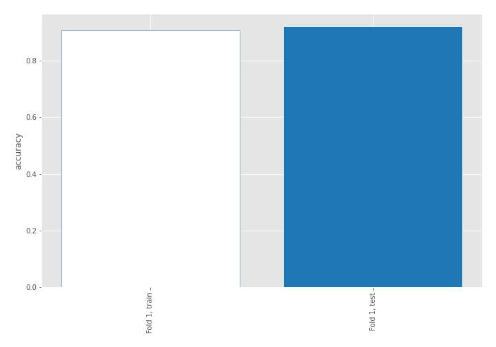

## Coefficients
| feature                           |   Learner_1 |
|:----------------------------------|------------:|
| sqreturn_autocorrelation_ts2_lag3 |   1.97313   |
| sqreturn_autocorrelation_ts1_lag3 |   1.67582   |
| sqreturn_autocorrelation_ts2_lag2 |   1.67487   |
| mean2                             |   1.55299   |
| mean1                             |   1.50775   |
| sqreturn_autocorrelation_ts1_lag2 |   1.38399   |
| return_autocorrelation_2_lag1     |   1.12242   |
| sqreturn_autocorrelation_ts1_lag1 |   0.71559   |
| sqreturn_autocorrelation_ts2_lag1 |   0.609087  |
| sqreturn_correlation_ts1_lag_1    |   0.56488   |
| return_correlation_ts1_lag_1      |   0.56488   |
| return_autocorrelation_1_lag1     |   0.496669  |
| sqreturn_correlation_ts2_lag_1    |   0.4512    |
| return_correlation_ts2_lag_1      |   0.4512    |
| sd1                               |   0.369815  |
| return_autocorrelation_1_lag2     |   0.355369  |
| return_autocorrelation_2_lag3     |   0.330577  |
| return_correlation_ts1_lag_3      |   0.151802  |
| sqreturn_correlation_ts1_lag_3    |   0.151802  |
| return_correlation_ts2_lag_2      |   0.0972488 |
| sqreturn_correlation_ts2_lag_2    |   0.0972488 |
| return_autocorrelation_2_lag2     |   0.0867896 |
| return_correlation_ts1_lag_2      |   0.0806768 |
| sqreturn_correlation_ts1_lag_2    |   0.0806768 |
| sd2                               |  -0.0542361 |
| return_autocorrelation_1_lag3     |  -0.0837344 |
| sqreturn_correlation_ts1_lag_0    |  -0.0850362 |
| return_correlation_ts1_lag_0      |  -0.0850362 |
| return_correlation_ts2_lag_3      |  -0.201732  |
| sqreturn_correlation_ts2_lag_3    |  -0.201732  |
| price1_granger_cause_price2       |  -0.316759  |
| skewness2                         |  -0.52089   |
| price2_granger_cause_price1       |  -0.743618  |
| skewness1                         |  -0.923777  |
| intercept                         |  -2.05704   |
| kurtosis2                         |  -2.52239   |
| kurtosis1                         |  -2.85835   |

## Permutation-based Importance
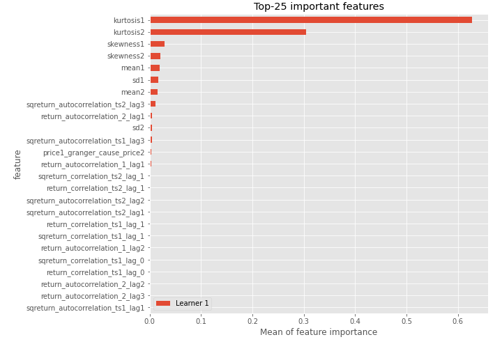
## Confusion Matrix

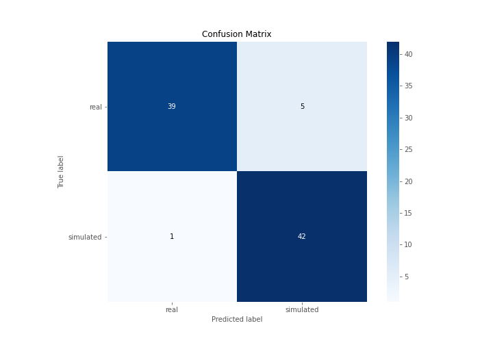

## Normalized Confusion Matrix

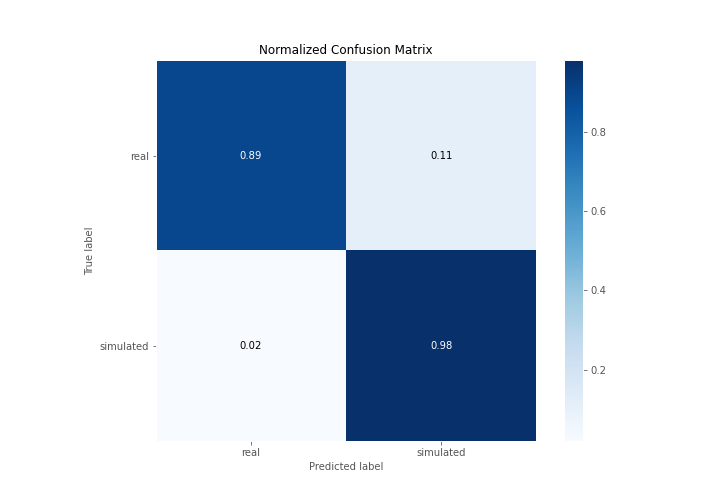

## ROC Curve

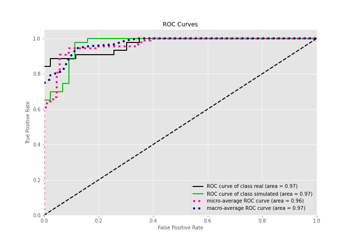

## Kolmogorov-Smirnov Statistic

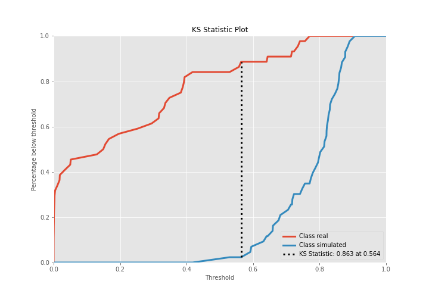

## Precision-Recall Curve

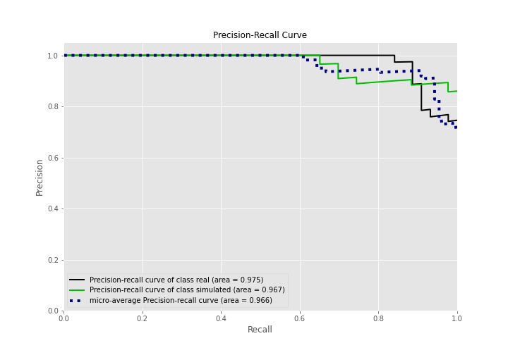

## Calibration Curve

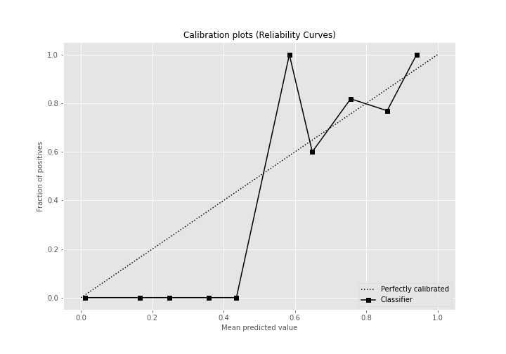

## Cumulative Gains Curve

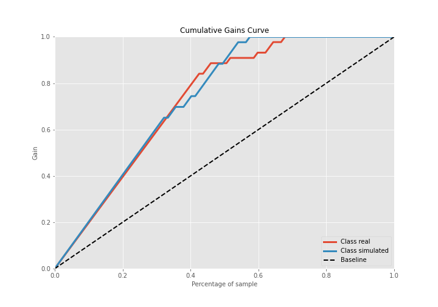

## Lift Curve

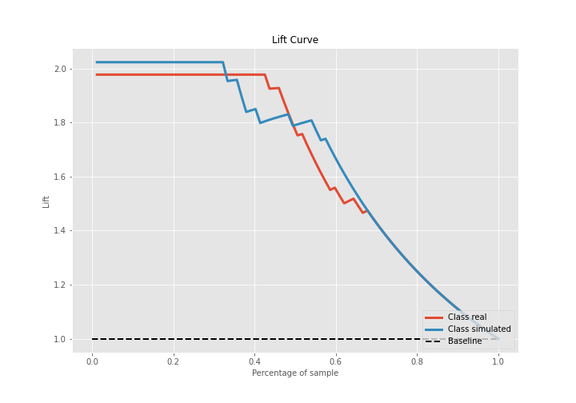

## SHAP Importance
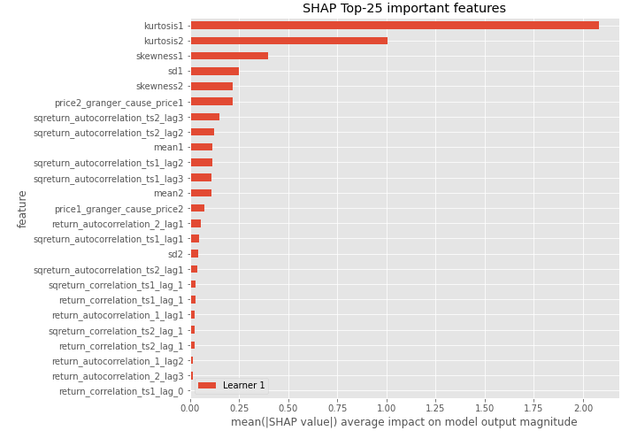

## SHAP Dependence plots

### Dependence (Fold 1)
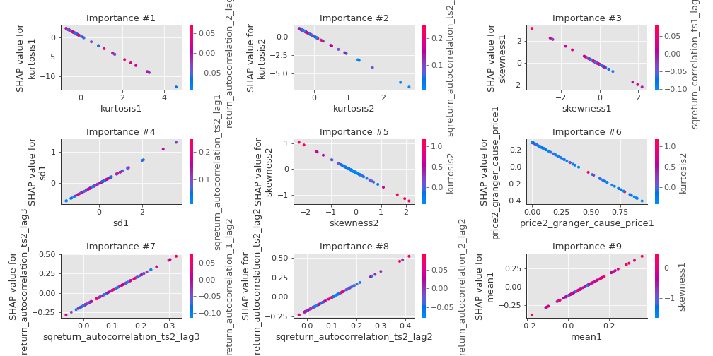

## SHAP Decision plots

### Top-10 Worst decisions for class 0 (Fold 1)
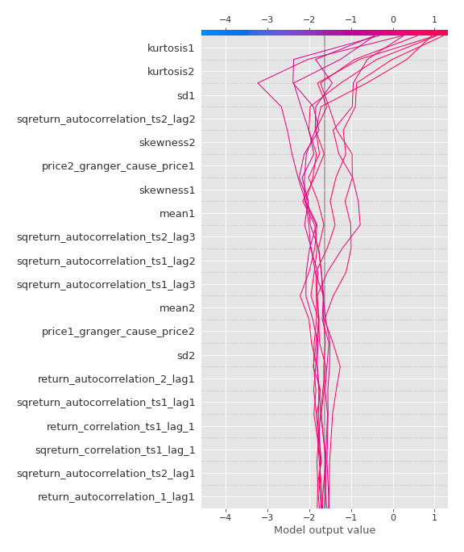
### Top-10 Best decisions for class 0 (Fold 1)
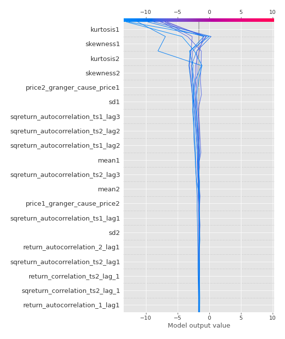
### Top-10 Worst decisions for class 1 (Fold 1)
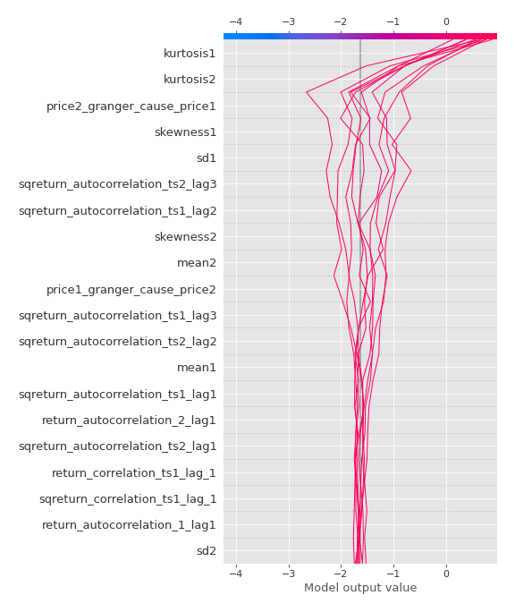
### Top-10 Best decisions for class 1 (Fold 1)
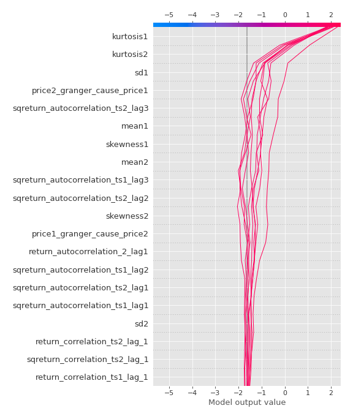

[<< Go back](../README.md)
