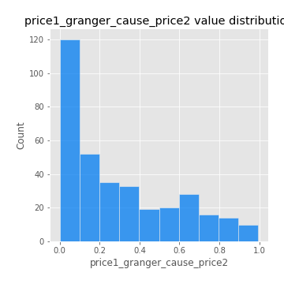

# Exploratory Data Analysis

[<< Go back](../README.md)
## Feature : target
- **Feature type** : categorical
- **Missing** : 0.0%
- **Unique** : 2
- **Count** :347
- **Unique** :2
- **Top** :real
- **Freq** :176

## Feature : mean1
- **Feature type** : continous
- **Missing** : 0.0%
- **Unique** : 347
- **Count** :347.0
- **Mean** :0.08171202293697513
- **Std** :0.08577151790307122
- **Min** :-0.22632637961920957
- **25%th Percentile** : 0.03129679693445407
- **50%th Percentile** : 0.0779216330041561
- **75%th Percentile** : 0.12846356527057864
- **Max** :0.37175100008111034

## Feature : mean2
- **Feature type** : continous
- **Missing** : 0.0%
- **Unique** : 347
- **Count** :347.0
- **Mean** :0.08897854540932683
- **Std** :0.08497146806232168
- **Min** :-0.24205418062825398
- **25%th Percentile** : 0.05017100659219246
- **50%th Percentile** : 0.08721735976515822
- **75%th Percentile** : 0.1422043651706987
- **Max** :0.37616608147096464

## Feature : sd1
- **Feature type** : continous
- **Missing** : 0.0%
- **Unique** : 347
- **Count** :347.0
- **Mean** :2.0527963088436714
- **Std** :0.8289045907022138
- **Min** :0.6093720749414175
- **25%th Percentile** : 1.5371588593520027
- **50%th Percentile** : 1.9420561780537462
- **75%th Percentile** : 2.427919100580179
- **Max** :9.236766377527575

## Feature : sd2
- **Feature type** : continous
- **Missing** : 0.0%
- **Unique** : 347
- **Count** :347.0
- **Mean** :1.9521380270795017
- **Std** :0.8219750956474352
- **Min** :0.5432624290064598
- **25%th Percentile** : 1.4067995502255246
- **50%th Percentile** : 1.8046470151729446
- **75%th Percentile** : 2.280298012409956
- **Max** :6.737618636746393

## Feature : skewness1
- **Feature type** : continous
- **Missing** : 0.0%
- **Unique** : 347
- **Count** :347.0
- **Mean** :-0.14844628519874545
- **Std** :0.6214673576779657
- **Min** :-3.530116233761814
- **25%th Percentile** : -0.316561358792806
- **50%th Percentile** : -0.13107176165467854
- **75%th Percentile** : 0.05517495043569781
- **Max** :2.5845963767725557

## Feature : skewness2
- **Feature type** : continous
- **Missing** : 0.0%
- **Unique** : 347
- **Count** :347.0
- **Mean** :-0.2587498026143176
- **Std** :0.8207325858086854
- **Min** :-8.801502855292393
- **25%th Percentile** : -0.4157688361613973
- **50%th Percentile** : -0.19456491228457856
- **75%th Percentile** : -0.006388453206596809
- **Max** :2.2606839051517187

## Feature : kurtosis1
- **Feature type** : continous
- **Missing** : 0.0%
- **Unique** : 347
- **Count** :347.0
- **Mean** :4.182956149453022
- **Std** :6.075855617473416
- **Min** :0.03477879299249054
- **25%th Percentile** : 1.2209583982443069
- **50%th Percentile** : 1.9985837325712406
- **75%th Percentile** : 3.9672030656784054
- **Max** :46.07507808162177

## Feature : kurtosis2
- **Feature type** : continous
- **Missing** : 0.0%
- **Unique** : 347
- **Count** :347.0
- **Mean** :4.905605836649198
- **Std** :10.249166535022821
- **Min** :0.15044486626750198
- **25%th Percentile** : 1.2649297406757447
- **50%th Percentile** : 2.433294934901666
- **75%th Percentile** : 4.554197422813971
- **Max** :143.10871011533666

## Feature : return_autocorrelation_1_lag1
- **Feature type** : continous
- **Missing** : 0.0%
- **Unique** : 347
- **Count** :347.0
- **Mean** :-0.01118527254001628
- **Std** :0.05835040201401391
- **Min** :-0.19339575314049967
- **25%th Percentile** : -0.05195793672509204
- **50%th Percentile** : -0.0069089598187218
- **75%th Percentile** : 0.026689057013083103
- **Max** :0.12810656890648087

## Feature : return_autocorrelation_1_lag2
- **Feature type** : continous
- **Missing** : 0.0%
- **Unique** : 347
- **Count** :347.0
- **Mean** :-0.011095279027571318
- **Std** :0.053298439169488364
- **Min** :-0.16456384857197423
- **25%th Percentile** : -0.04764407548842124
- **50%th Percentile** : -0.00987046159196397
- **75%th Percentile** : 0.02459744074597782
- **Max** :0.1561488228015672

## Feature : return_autocorrelation_1_lag3
- **Feature type** : continous
- **Missing** : 0.0%
- **Unique** : 347
- **Count** :347.0
- **Mean** :-0.00434694819861387
- **Std** :0.05212792842055789
- **Min** :-0.15117275786205733
- **25%th Percentile** : -0.041068981028996046
- **50%th Percentile** : -0.0024657075700327993
- **75%th Percentile** : 0.030042009488189872
- **Max** :0.17805869530681923

## Feature : return_autocorrelation_2_lag1
- **Feature type** : continous
- **Missing** : 0.0%
- **Unique** : 347
- **Count** :347.0
- **Mean** :-0.013140759686127709
- **Std** :0.06643628907064221
- **Min** :-0.25075531010123286
- **25%th Percentile** : -0.05167349315530319
- **50%th Percentile** : -0.01110607129012973
- **75%th Percentile** : 0.02784863917248155
- **Max** :0.31863413537898483

## Feature : return_autocorrelation_2_lag2
- **Feature type** : continous
- **Missing** : 0.0%
- **Unique** : 347
- **Count** :347.0
- **Mean** :-0.006273355638220786
- **Std** :0.05695757027592609
- **Min** :-0.15323211089747296
- **25%th Percentile** : -0.04154134535827722
- **50%th Percentile** : -0.013183113640094817
- **75%th Percentile** : 0.03191416074324217
- **Max** :0.20974504043791217

## Feature : return_autocorrelation_2_lag3
- **Feature type** : continous
- **Missing** : 0.0%
- **Unique** : 347
- **Count** :347.0
- **Mean** :-0.008477738241215319
- **Std** :0.05265201980790759
- **Min** :-0.1677097102973354
- **25%th Percentile** : -0.043433709585619575
- **50%th Percentile** : -0.010327098165824666
- **75%th Percentile** : 0.026037839356679644
- **Max** :0.1455912331041845

## Feature : return_correlation_ts1_lag_0
- **Feature type** : continous
- **Missing** : 0.0%
- **Unique** : 347
- **Count** :347.0
- **Mean** :0.329234360996004
- **Std** :0.11365240560391925
- **Min** :-0.027089510445801036
- **25%th Percentile** : 0.2717003006426104
- **50%th Percentile** : 0.338614609002168
- **75%th Percentile** : 0.3840519451271823
- **Max** :0.7041861626832071

## Feature : return_correlation_ts1_lag_1
- **Feature type** : continous
- **Missing** : 0.0%
- **Unique** : 347
- **Count** :347.0
- **Mean** :-0.009097800381217092
- **Std** :0.05405999518212103
- **Min** :-0.15776193292681923
- **25%th Percentile** : -0.045763252511493435
- **50%th Percentile** : -0.006700590876969218
- **75%th Percentile** : 0.026158415581016628
- **Max** :0.15499424718508623

## Feature : return_correlation_ts1_lag_2
- **Feature type** : continous
- **Missing** : 0.0%
- **Unique** : 347
- **Count** :347.0
- **Mean** :-0.002487331188700333
- **Std** :0.049925364669578316
- **Min** :-0.1256723645531583
- **25%th Percentile** : -0.03896546027819575
- **50%th Percentile** : -0.0019888473958396247
- **75%th Percentile** : 0.027676815096896214
- **Max** :0.14808877656173536

## Feature : return_correlation_ts1_lag_3
- **Feature type** : continous
- **Missing** : 0.0%
- **Unique** : 347
- **Count** :347.0
- **Mean** :-0.0029827748132939596
- **Std** :0.05246951179682649
- **Min** :-0.1270218498974763
- **25%th Percentile** : -0.03692047352300411
- **50%th Percentile** : -0.004179797020357867
- **75%th Percentile** : 0.030299078292672973
- **Max** :0.179624346576964

## Feature : return_correlation_ts2_lag_1
- **Feature type** : continous
- **Missing** : 0.0%
- **Unique** : 347
- **Count** :347.0
- **Mean** :-0.007527954362487372
- **Std** :0.05815863655394579
- **Min** :-0.20487206001777264
- **25%th Percentile** : -0.04521305414366585
- **50%th Percentile** : -0.010502912867097602
- **75%th Percentile** : 0.03349302970252101
- **Max** :0.1694951524039845

## Feature : return_correlation_ts2_lag_2
- **Feature type** : continous
- **Missing** : 0.0%
- **Unique** : 347
- **Count** :347.0
- **Mean** :-0.00877169978411207
- **Std** :0.05457564511986218
- **Min** :-0.15299951737180204
- **25%th Percentile** : -0.042402651326413895
- **50%th Percentile** : -0.010042547829849644
- **75%th Percentile** : 0.023178880073735305
- **Max** :0.20772887392904255

## Feature : return_correlation_ts2_lag_3
- **Feature type** : continous
- **Missing** : 0.0%
- **Unique** : 347
- **Count** :347.0
- **Mean** :-0.008936214968955221
- **Std** :0.05313555827118007
- **Min** :-0.17564076057312866
- **25%th Percentile** : -0.04372074456361906
- **50%th Percentile** : -0.006217413026152115
- **75%th Percentile** : 0.02781350175938286
- **Max** :0.13128380114518473

## Feature : sqreturn_autocorrelation_ts1_lag1
- **Feature type** : continous
- **Missing** : 0.0%
- **Unique** : 347
- **Count** :347.0
- **Mean** :0.11625545239591015
- **Std** :0.0884587832320384
- **Min** :-0.028894705175070787
- **25%th Percentile** : 0.04879691869487986
- **50%th Percentile** : 0.1046471983769949
- **75%th Percentile** : 0.16761629373364584
- **Max** :0.4439086285737898

## Feature : sqreturn_autocorrelation_ts1_lag2
- **Feature type** : continous
- **Missing** : 0.0%
- **Unique** : 347
- **Count** :347.0
- **Mean** :0.10894321129766213
- **Std** :0.09160087832400722
- **Min** :-0.05419304650062953
- **25%th Percentile** : 0.0320898268198862
- **50%th Percentile** : 0.09687555901431541
- **75%th Percentile** : 0.16522984577318972
- **Max** :0.4522162366773919

## Feature : sqreturn_autocorrelation_ts1_lag3
- **Feature type** : continous
- **Missing** : 0.0%
- **Unique** : 347
- **Count** :347.0
- **Mean** :0.09779732513979882
- **Std** :0.08278002006156689
- **Min** :-0.06486026764840777
- **25%th Percentile** : 0.03310134209085794
- **50%th Percentile** : 0.09288621004930046
- **75%th Percentile** : 0.15218224454561946
- **Max** :0.41030914918857014

## Feature : sqreturn_autocorrelation_ts2_lag1
- **Feature type** : continous
- **Missing** : 0.0%
- **Unique** : 347
- **Count** :347.0
- **Mean** :0.11865061649943599
- **Std** :0.08835924076891685
- **Min** :-0.04997282481431907
- **25%th Percentile** : 0.051571262019732556
- **50%th Percentile** : 0.11227573874941303
- **75%th Percentile** : 0.1680714298311758
- **Max** :0.510085647437958

## Feature : sqreturn_autocorrelation_ts2_lag2
- **Feature type** : continous
- **Missing** : 0.0%
- **Unique** : 347
- **Count** :347.0
- **Mean** :0.1094670771950412
- **Std** :0.09311697271342403
- **Min** :-0.051523884196217395
- **25%th Percentile** : 0.035036070014686435
- **50%th Percentile** : 0.09767619972602877
- **75%th Percentile** : 0.16214771101997522
- **Max** :0.45676817892778204

## Feature : sqreturn_autocorrelation_ts2_lag3
- **Feature type** : continous
- **Missing** : 0.0%
- **Unique** : 347
- **Count** :347.0
- **Mean** :0.10086892056778628
- **Std** :0.08918946935025229
- **Min** :-0.06082766359524085
- **25%th Percentile** : 0.024818168763829994
- **50%th Percentile** : 0.09946001256561968
- **75%th Percentile** : 0.1566166297897385
- **Max** :0.3682552328022417

## Feature : sqreturn_correlation_ts1_lag_0
- **Feature type** : continous
- **Missing** : 0.0%
- **Unique** : 347
- **Count** :347.0
- **Mean** :0.329234360996004
- **Std** :0.11365240560391925
- **Min** :-0.027089510445801036
- **25%th Percentile** : 0.2717003006426104
- **50%th Percentile** : 0.338614609002168
- **75%th Percentile** : 0.3840519451271823
- **Max** :0.7041861626832071

## Feature : sqreturn_correlation_ts1_lag_1
- **Feature type** : continous
- **Missing** : 0.0%
- **Unique** : 347
- **Count** :347.0
- **Mean** :-0.009097800381217092
- **Std** :0.05405999518212103
- **Min** :-0.15776193292681923
- **25%th Percentile** : -0.045763252511493435
- **50%th Percentile** : -0.006700590876969218
- **75%th Percentile** : 0.026158415581016628
- **Max** :0.15499424718508623

## Feature : sqreturn_correlation_ts1_lag_2
- **Feature type** : continous
- **Missing** : 0.0%
- **Unique** : 347
- **Count** :347.0
- **Mean** :-0.002487331188700333
- **Std** :0.049925364669578316
- **Min** :-0.1256723645531583
- **25%th Percentile** : -0.03896546027819575
- **50%th Percentile** : -0.0019888473958396247
- **75%th Percentile** : 0.027676815096896214
- **Max** :0.14808877656173536

## Feature : sqreturn_correlation_ts1_lag_3
- **Feature type** : continous
- **Missing** : 0.0%
- **Unique** : 347
- **Count** :347.0
- **Mean** :-0.0029827748132939596
- **Std** :0.05246951179682649
- **Min** :-0.1270218498974763
- **25%th Percentile** : -0.03692047352300411
- **50%th Percentile** : -0.004179797020357867
- **75%th Percentile** : 0.030299078292672973
- **Max** :0.179624346576964

## Feature : sqreturn_correlation_ts2_lag_1
- **Feature type** : continous
- **Missing** : 0.0%
- **Unique** : 347
- **Count** :347.0
- **Mean** :-0.007527954362487372
- **Std** :0.05815863655394579
- **Min** :-0.20487206001777264
- **25%th Percentile** : -0.04521305414366585
- **50%th Percentile** : -0.010502912867097602
- **75%th Percentile** : 0.03349302970252101
- **Max** :0.1694951524039845

## Feature : sqreturn_correlation_ts2_lag_2
- **Feature type** : continous
- **Missing** : 0.0%
- **Unique** : 347
- **Count** :347.0
- **Mean** :-0.00877169978411207
- **Std** :0.05457564511986218
- **Min** :-0.15299951737180204
- **25%th Percentile** : -0.042402651326413895
- **50%th Percentile** : -0.010042547829849644
- **75%th Percentile** : 0.023178880073735305
- **Max** :0.20772887392904255

## Feature : sqreturn_correlation_ts2_lag_3
- **Feature type** : continous
- **Missing** : 0.0%
- **Unique** : 347
- **Count** :347.0
- **Mean** :-0.008936214968955221
- **Std** :0.05313555827118007
- **Min** :-0.17564076057312866
- **25%th Percentile** : -0.04372074456361906
- **50%th Percentile** : -0.006217413026152115
- **75%th Percentile** : 0.02781350175938286
- **Max** :0.13128380114518473

## Feature : price2_granger_cause_price1
- **Feature type** : continous
- **Missing** : 0.0%
- **Unique** : 347
- **Count** :347.0
- **Mean** :0.3239679983093271
- **Std** :0.30560246483025283
- **Min** :2.68063262987372e-14
- **25%th Percentile** : 0.04616323627180034
- **50%th Percentile** : 0.23680568797527643
- **75%th Percentile** : 0.5798550192443188
- **Max** :0.9885712803689185

## Feature : price1_granger_cause_price2
- **Feature type** : continous
- **Missing** : 0.0%
- **Unique** : 347
- **Count** :347.0
- **Mean** :0.29367384490651577
- **Std** :0.28074780896548124
- **Min** :7.041588925802157e-11
- **25%th Percentile** : 0.042923591102685274
- **50%th Percentile** : 0.2050962711887762
- **75%th Percentile** : 0.5017011553639239
- **Max** :0.9951398266867577

[<< Go back](../README.md)
