# Summary of 2_DecisionTree

[<< Go back](../README.md)

## Decision Tree
- **n_jobs**: -1
- **criterion**: gini
- **max_depth**: 3
- **explain_level**: 2

## Validation
 - **validation_type**: split
 - **train_ratio**: 0.75
 - **shuffle**: True
 - **stratify**: True

## Optimized metric
accuracy

## Training time

4.3 seconds

## Metric details
|           |    score |   threshold |
|:----------|---------:|------------:|
| logloss   | 0.65799  | nan         |
| auc       | 0.895349 | nan         |
| f1        | 0.924731 |   0.468673  |
| accuracy  | 0.91954  |   0.468673  |
| precision | 0.877551 |   0.468673  |
| recall    | 1        |   0.0111111 |
| mcc       | 0.84446  |   0.468673  |

## Confusion matrix (at threshold=0.468673)
|                      |   Predicted as real |   Predicted as simulated |
|:---------------------|--------------------:|-------------------------:|
| Labeled as real      |                  37 |                        6 |
| Labeled as simulated |                   1 |                       43 |

## Learning curves
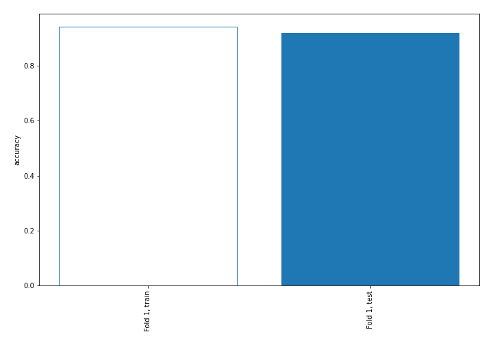

## Decision Tree 

### Tree #1
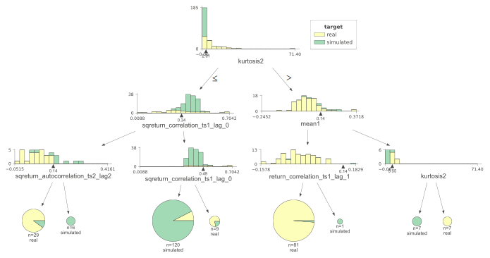

### Rules

if (kurtosis2 <= 2.905) and (sqreturn_correlation_ts1_lag_0 > 0.343) and (sqreturn_correlation_ts1_lag_0 <= 0.486) then class: simulated (proba: 92.5%) | based on 120 samples

if (kurtosis2 > 2.905) and (mean1 <= 0.139) and (return_correlation_ts1_lag_1 <= 0.138) then class: real (proba: 98.77%) | based on 81 samples

if (kurtosis2 <= 2.905) and (sqreturn_correlation_ts1_lag_0 <= 0.343) and (sqreturn_autocorrelation_ts2_lag2 <= 0.142) then class: real (proba: 89.66%) | based on 29 samples

if (kurtosis2 <= 2.905) and (sqreturn_correlation_ts1_lag_0 > 0.343) and (sqreturn_correlation_ts1_lag_0 > 0.486) then class: real (proba: 77.78%) | based on 9 samples

if (kurtosis2 > 2.905) and (mean1 > 0.139) and (kurtosis2 > 5.55) then class: real (proba: 100.0%) | based on 7 samples

if (kurtosis2 > 2.905) and (mean1 > 0.139) and (kurtosis2 <= 5.55) then class: simulated (proba: 100.0%) | based on 7 samples

if (kurtosis2 <= 2.905) and (sqreturn_correlation_ts1_lag_0 <= 0.343) and (sqreturn_autocorrelation_ts2_lag2 > 0.142) then class: simulated (proba: 100.0%) | based on 6 samples

if (kurtosis2 > 2.905) and (mean1 <= 0.139) and (return_correlation_ts1_lag_1 > 0.138) then class: simulated (proba: 100.0%) | based on 1 samples

## Permutation-based Importance
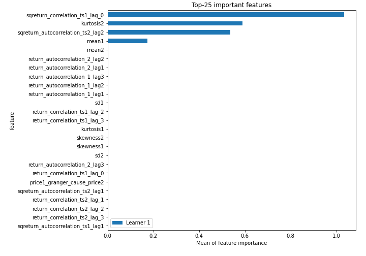
## Confusion Matrix

## Normalized Confusion Matrix

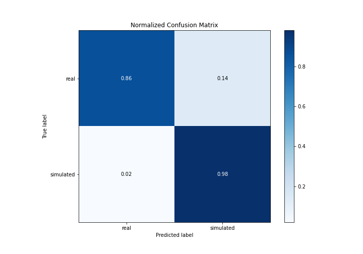

## ROC Curve

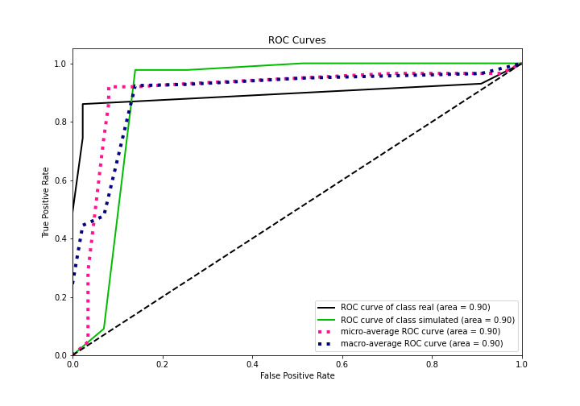

## Kolmogorov-Smirnov Statistic

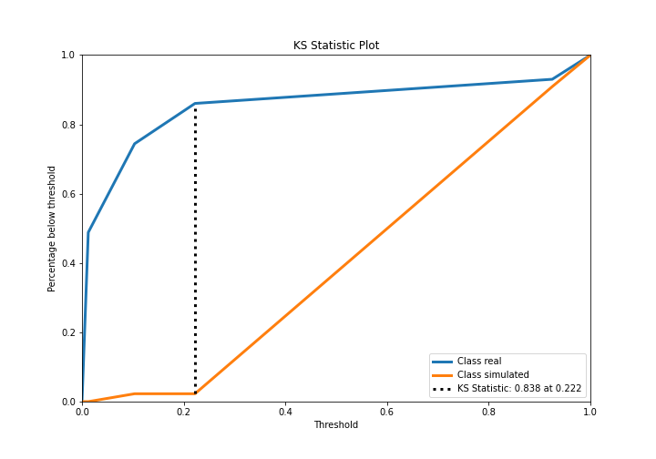

## Precision-Recall Curve

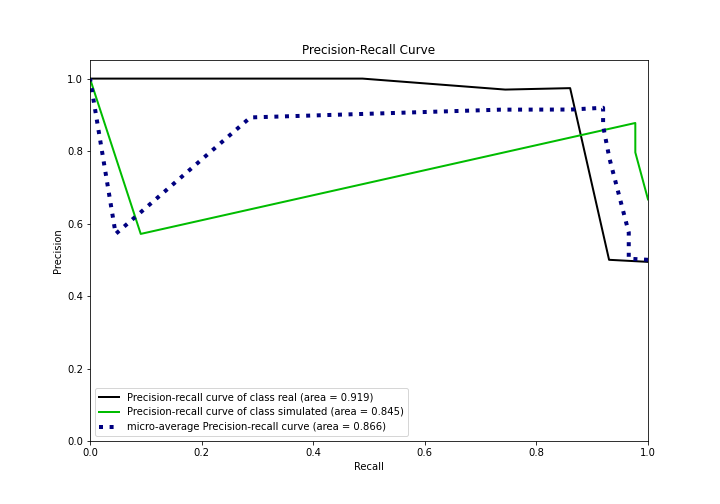

## Calibration Curve

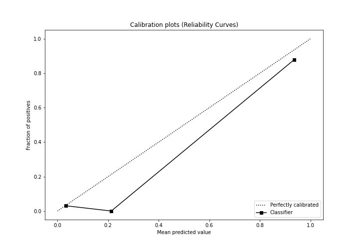

## Cumulative Gains Curve

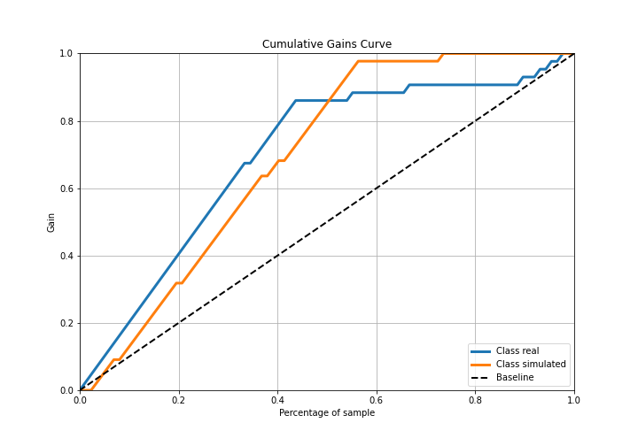

## Lift Curve

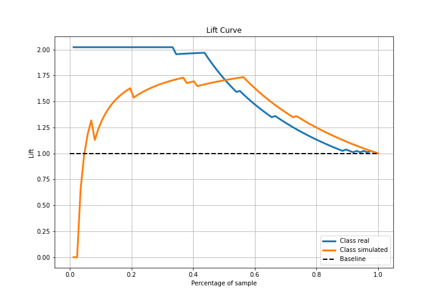

## SHAP Importance
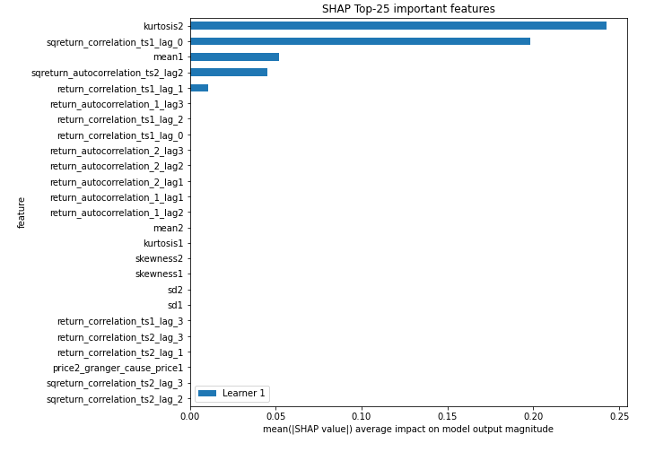

## SHAP Dependence plots

### Dependence (Fold 1)
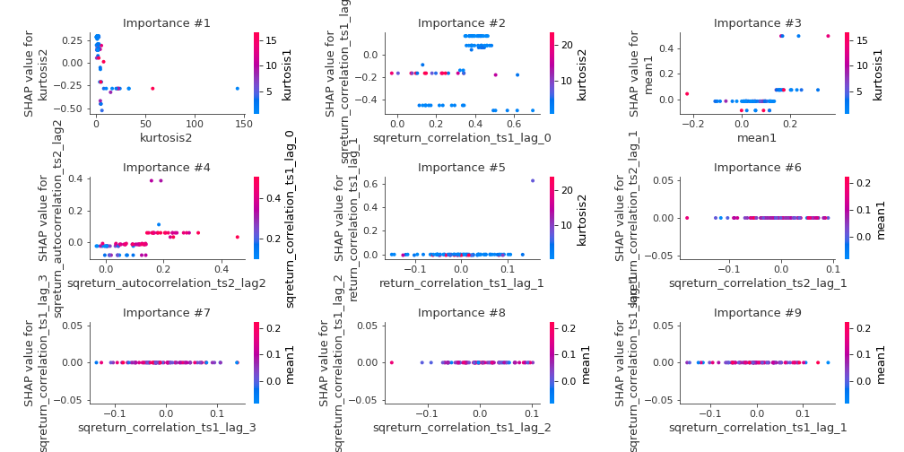

## SHAP Decision plots

### Top-10 Worst decisions for class 0 (Fold 1)
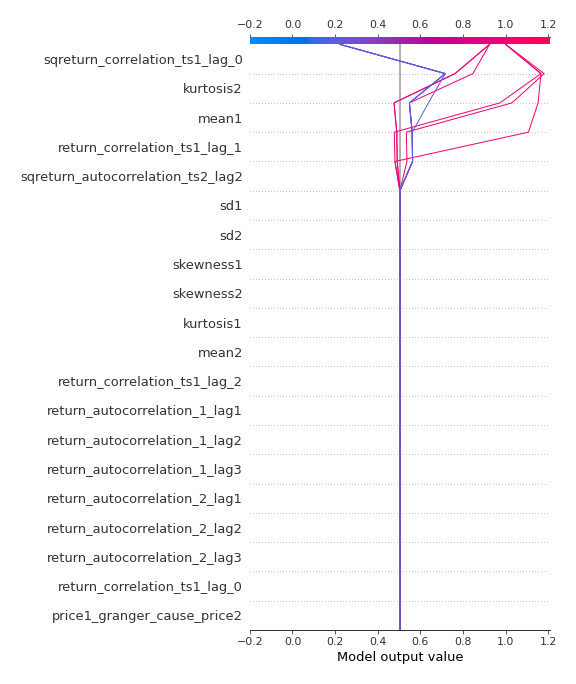
### Top-10 Best decisions for class 0 (Fold 1)
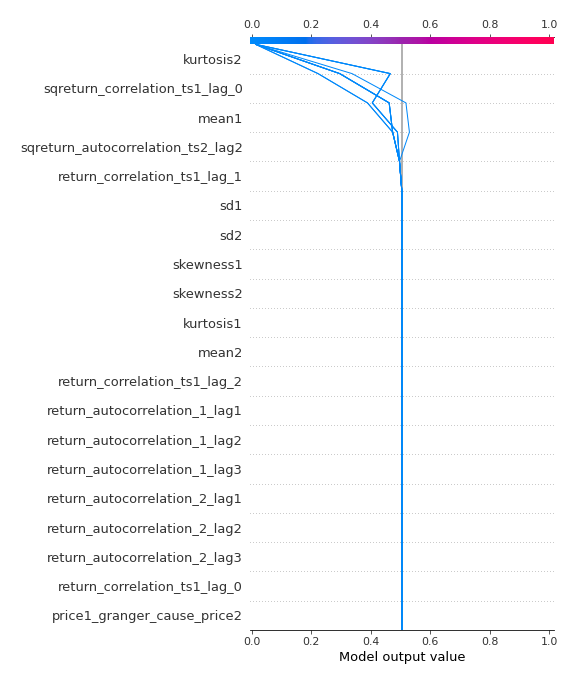
### Top-10 Worst decisions for class 1 (Fold 1)
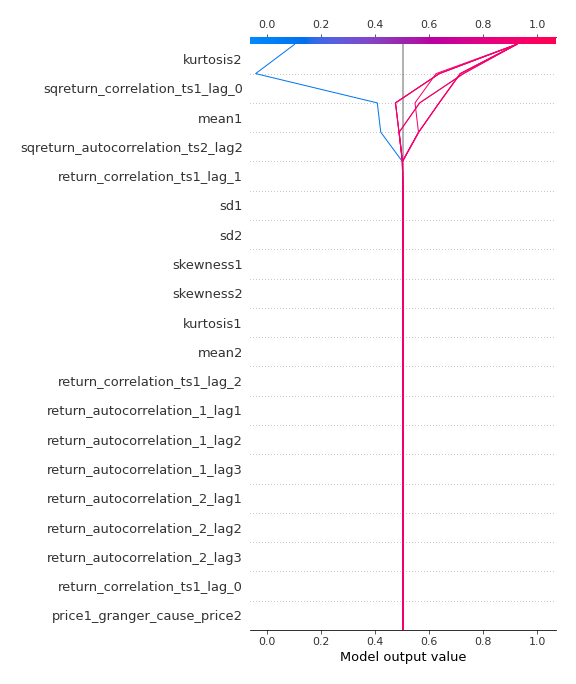
### Top-10 Best decisions for class 1 (Fold 1)
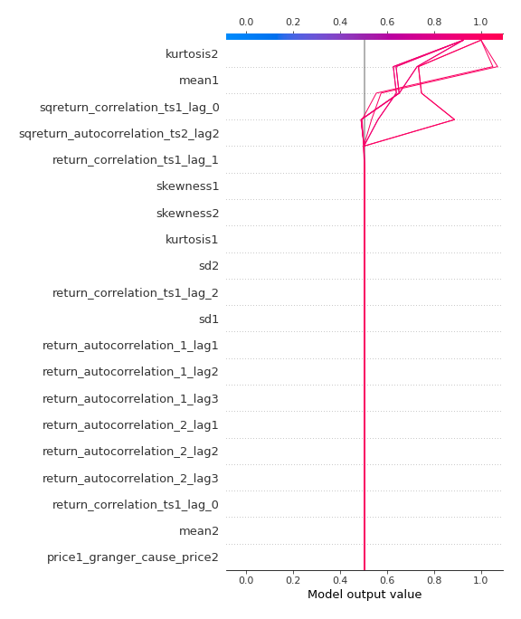

[<< Go back](../README.md)
