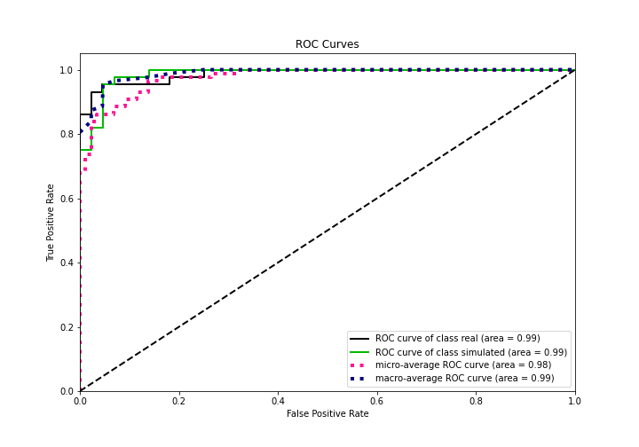

# Summary of 3_Linear

[<< Go back](../README.md)

## Logistic Regression (Linear)
- **n_jobs**: -1
- **explain_level**: 2

## Validation
 - **validation_type**: split
 - **train_ratio**: 0.75
 - **shuffle**: True
 - **stratify**: True

## Optimized metric
accuracy

## Training time

2.8 seconds

## Metric details
|           |    score |     threshold |
|:----------|---------:|--------------:|
| logloss   | 0.251359 | nan           |
| auc       | 0.987315 | nan           |
| f1        | 0.945055 |   0.674637    |
| accuracy  | 0.942529 |   0.694984    |
| precision | 1        |   0.856768    |
| recall    | 1        |   7.81959e-27 |
| mcc       | 0.887067 |   0.674637    |

## Confusion matrix (at threshold=0.694984)
|                      |   Predicted as real |   Predicted as simulated |
|:---------------------|--------------------:|-------------------------:|
| Labeled as real      |                  40 |                        3 |
| Labeled as simulated |                   2 |                       42 |

## Learning curves

## Coefficients
| feature                           |   Learner_1 |
|:----------------------------------|------------:|
| sqreturn_autocorrelation_ts2_lag3 |  1.59731    |
| mean1                             |  1.46911    |
| sqreturn_autocorrelation_ts2_lag2 |  1.00847    |
| sqreturn_autocorrelation_ts1_lag3 |  0.978246   |
| return_autocorrelation_2_lag1     |  0.768937   |
| return_correlation_ts2_lag_1      |  0.756685   |
| sqreturn_correlation_ts2_lag_1    |  0.756685   |
| sqreturn_autocorrelation_ts2_lag1 |  0.653423   |
| sqreturn_correlation_ts1_lag_0    |  0.634967   |
| return_correlation_ts1_lag_0      |  0.634967   |
| sqreturn_autocorrelation_ts1_lag2 |  0.616373   |
| sqreturn_correlation_ts1_lag_1    |  0.543343   |
| return_correlation_ts1_lag_1      |  0.543343   |
| sqreturn_autocorrelation_ts1_lag1 |  0.487366   |
| return_correlation_ts2_lag_3      |  0.472415   |
| sqreturn_correlation_ts2_lag_3    |  0.472415   |
| return_autocorrelation_1_lag1     |  0.389111   |
| sd1                               |  0.269109   |
| return_autocorrelation_1_lag3     |  0.255921   |
| return_autocorrelation_2_lag2     |  0.240296   |
| return_autocorrelation_1_lag2     |  0.237451   |
| return_autocorrelation_2_lag3     |  0.208145   |
| return_correlation_ts1_lag_2      |  0.208025   |
| sqreturn_correlation_ts1_lag_2    |  0.208025   |
| return_correlation_ts2_lag_2      |  0.104135   |
| sqreturn_correlation_ts2_lag_2    |  0.104135   |
| sqreturn_correlation_ts1_lag_3    | -0.00488811 |
| return_correlation_ts1_lag_3      | -0.00488811 |
| price1_granger_cause_price2       | -0.299867   |
| sd2                               | -0.341962   |
| price2_granger_cause_price1       | -0.645803   |
| skewness2                         | -0.647523   |
| mean2                             | -0.830152   |
| skewness1                         | -1.71738    |
| kurtosis1                         | -2.60472    |
| intercept                         | -2.62142    |
| kurtosis2                         | -3.05508    |

## Permutation-based Importance

## Confusion Matrix

## Normalized Confusion Matrix

## ROC Curve

## Kolmogorov-Smirnov Statistic

## Precision-Recall Curve

## Calibration Curve

## Cumulative Gains Curve

## Lift Curve

## SHAP Importance

## SHAP Dependence plots

### Dependence (Fold 1)

## SHAP Decision plots

### Top-10 Worst decisions for class 0 (Fold 1)

### Top-10 Best decisions for class 0 (Fold 1)

### Top-10 Worst decisions for class 1 (Fold 1)

### Top-10 Best decisions for class 1 (Fold 1)

[<< Go back](../README.md)
