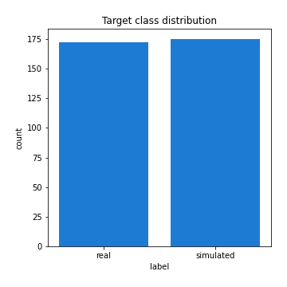

# Exploratory Data Analysis

[<< Go back](../README.md)
## Feature : target
- **Feature type** : categorical
- **Missing** : 0.0%
- **Unique** : 2
- **Count** :347
- **Unique** :2
- **Top** :simulated
- **Freq** :175

## Feature : mean1
- **Feature type** : continous
- **Missing** : 0.0%
- **Unique** : 347
- **Count** :347.0
- **Mean** :0.07587453488716302
- **Std** :0.0930411655924854
- **Min** :-0.24517264437302339
- **25%th Percentile** : 0.01963408256014059
- **50%th Percentile** : 0.0728167122486299
- **75%th Percentile** : 0.1368903618289818
- **Max** :0.37175100008111034

## Feature : mean2
- **Feature type** : continous
- **Missing** : 0.0%
- **Unique** : 347
- **Count** :347.0
- **Mean** :0.031997166785648595
- **Std** :0.08659621324619146
- **Min** :-0.25315932911380123
- **25%th Percentile** : -0.016528787154315164
- **50%th Percentile** : 0.03797264447540565
- **75%th Percentile** : 0.08530380732972381
- **Max** :0.37616608147096464

## Feature : sd1
- **Feature type** : continous
- **Missing** : 0.0%
- **Unique** : 347
- **Count** :347.0
- **Mean** :1.9847958603065303
- **Std** :0.8233644180875752
- **Min** :0.7470080772831957
- **25%th Percentile** : 1.5157996077774383
- **50%th Percentile** : 1.8717668518067776
- **75%th Percentile** : 2.3846364157993034
- **Max** :9.236766377527575

## Feature : sd2
- **Feature type** : continous
- **Missing** : 0.0%
- **Unique** : 347
- **Count** :347.0
- **Mean** :1.9281107312515395
- **Std** :0.8034839786652614
- **Min** :0.7614757689590247
- **25%th Percentile** : 1.4493592074770731
- **50%th Percentile** : 1.7690549378630431
- **75%th Percentile** : 2.151697638944049
- **Max** :6.737618636746393

## Feature : skewness1
- **Feature type** : continous
- **Missing** : 0.0%
- **Unique** : 347
- **Count** :347.0
- **Mean** :-0.2160989147039928
- **Std** :0.6252070555048278
- **Min** :-3.530116233761814
- **25%th Percentile** : -0.4101100232307005
- **50%th Percentile** : -0.20900110916587258
- **75%th Percentile** : -0.00478052629858044
- **Max** :2.5845963767725557

## Feature : skewness2
- **Feature type** : continous
- **Missing** : 0.0%
- **Unique** : 347
- **Count** :347.0
- **Mean** :-0.2693667271968064
- **Std** :0.8290867009091962
- **Min** :-8.801502855292393
- **25%th Percentile** : -0.39668208675980265
- **50%th Percentile** : -0.21885867517714408
- **75%th Percentile** : 0.010803761270877687
- **Max** :2.242019525651531

## Feature : kurtosis1
- **Feature type** : continous
- **Missing** : 0.0%
- **Unique** : 347
- **Count** :347.0
- **Mean** :3.972563313850779
- **Std** :5.786743388840352
- **Min** :0.03477879299249054
- **25%th Percentile** : 1.1769159897645332
- **50%th Percentile** : 1.9409283096722132
- **75%th Percentile** : 3.787172929908004
- **Max** :46.07507808162177

## Feature : kurtosis2
- **Feature type** : continous
- **Missing** : 0.0%
- **Unique** : 347
- **Count** :347.0
- **Mean** :4.8629282129247136
- **Std** :10.371335329184495
- **Min** :-0.0567138679335768
- **25%th Percentile** : 1.185644677367339
- **50%th Percentile** : 2.0353469447070185
- **75%th Percentile** : 4.3612884611668505
- **Max** :143.10871011533666

## Feature : return_autocorrelation_1_lag1
- **Feature type** : continous
- **Missing** : 0.0%
- **Unique** : 347
- **Count** :347.0
- **Mean** :-0.004827369869605871
- **Std** :0.06135704516531361
- **Min** :-0.19339575314049967
- **25%th Percentile** : -0.03953294542983633
- **50%th Percentile** : -0.0003986500096667489
- **75%th Percentile** : 0.03406873109692973
- **Max** :0.18840914438855033

## Feature : return_autocorrelation_1_lag2
- **Feature type** : continous
- **Missing** : 0.0%
- **Unique** : 347
- **Count** :347.0
- **Mean** :-0.003998289333286203
- **Std** :0.056518706376211536
- **Min** :-0.18327696797612222
- **25%th Percentile** : -0.03928437632863113
- **50%th Percentile** : -0.0038388720029335246
- **75%th Percentile** : 0.030427817721266112
- **Max** :0.1561488228015672

## Feature : return_autocorrelation_1_lag3
- **Feature type** : continous
- **Missing** : 0.0%
- **Unique** : 347
- **Count** :347.0
- **Mean** :-0.0021612346729758952
- **Std** :0.05408175285442212
- **Min** :-0.1940836867390813
- **25%th Percentile** : -0.03654912267914673
- **50%th Percentile** : -0.0031591317712452043
- **75%th Percentile** : 0.03298604734296007
- **Max** :0.17805869530681923

## Feature : return_autocorrelation_2_lag1
- **Feature type** : continous
- **Missing** : 0.0%
- **Unique** : 347
- **Count** :347.0
- **Mean** :-0.009115041772066164
- **Std** :0.06344027524809079
- **Min** :-0.25075531010123286
- **25%th Percentile** : -0.05008926858460275
- **50%th Percentile** : -0.009093526285071941
- **75%th Percentile** : 0.030664137525191343
- **Max** :0.31863413537898483

## Feature : return_autocorrelation_2_lag2
- **Feature type** : continous
- **Missing** : 0.0%
- **Unique** : 347
- **Count** :347.0
- **Mean** :-0.0031894222209070495
- **Std** :0.056875845793099095
- **Min** :-0.15323211089747296
- **25%th Percentile** : -0.04095726530824771
- **50%th Percentile** : -0.006295213126508631
- **75%th Percentile** : 0.0343079954814821
- **Max** :0.20974504043791217

## Feature : return_autocorrelation_2_lag3
- **Feature type** : continous
- **Missing** : 0.0%
- **Unique** : 347
- **Count** :347.0
- **Mean** :-0.003502724644728327
- **Std** :0.0543018488113552
- **Min** :-0.17334423908046695
- **25%th Percentile** : -0.040522984243205384
- **50%th Percentile** : -0.0012155251283715214
- **75%th Percentile** : 0.036171599060062135
- **Max** :0.1419999376914021

## Feature : return_correlation_ts1_lag_0
- **Feature type** : continous
- **Missing** : 0.0%
- **Unique** : 347
- **Count** :347.0
- **Mean** :0.3624246487317541
- **Std** :0.12061951587506131
- **Min** :-0.027089510445801036
- **25%th Percentile** : 0.2981317922726725
- **50%th Percentile** : 0.38311380905562586
- **75%th Percentile** : 0.43481893632553914
- **Max** :0.7041861626832071

## Feature : return_correlation_ts1_lag_1
- **Feature type** : continous
- **Missing** : 0.0%
- **Unique** : 347
- **Count** :347.0
- **Mean** :-0.0018741200327525652
- **Std** :0.059071654809089276
- **Min** :-0.15776193292681923
- **25%th Percentile** : -0.03898310429816068
- **50%th Percentile** : -0.0012378286264939182
- **75%th Percentile** : 0.03762047200401461
- **Max** :0.1828599861309754

## Feature : return_correlation_ts1_lag_2
- **Feature type** : continous
- **Missing** : 0.0%
- **Unique** : 347
- **Count** :347.0
- **Mean** :-0.00036523767018395637
- **Std** :0.05366377513837993
- **Min** :-0.1684004679368819
- **25%th Percentile** : -0.03739178783839951
- **50%th Percentile** : -0.0017794383097623461
- **75%th Percentile** : 0.03753777827503324
- **Max** :0.15111264292562412

## Feature : return_correlation_ts1_lag_3
- **Feature type** : continous
- **Missing** : 0.0%
- **Unique** : 347
- **Count** :347.0
- **Mean** :-0.00022246300412096982
- **Std** :0.05549925371368393
- **Min** :-0.20556599890055005
- **25%th Percentile** : -0.038951200995201524
- **50%th Percentile** : 0.0005085061733351187
- **75%th Percentile** : 0.03733551383826425
- **Max** :0.1636773216468148

## Feature : return_correlation_ts2_lag_1
- **Feature type** : continous
- **Missing** : 0.0%
- **Unique** : 347
- **Count** :347.0
- **Mean** :-0.003957835304222722
- **Std** :0.0566028074742779
- **Min** :-0.20093919236581337
- **25%th Percentile** : -0.038780429005462386
- **50%th Percentile** : -0.006749812525102796
- **75%th Percentile** : 0.033495351411458055
- **Max** :0.17208763791364762

## Feature : return_correlation_ts2_lag_2
- **Feature type** : continous
- **Missing** : 0.0%
- **Unique** : 347
- **Count** :347.0
- **Mean** :0.001475735522353141
- **Std** :0.05610661107398824
- **Min** :-0.23751835475804678
- **25%th Percentile** : -0.03648965537160845
- **50%th Percentile** : -0.003402654728604418
- **75%th Percentile** : 0.03448304161873626
- **Max** :0.20772887392904255

## Feature : return_correlation_ts2_lag_3
- **Feature type** : continous
- **Missing** : 0.0%
- **Unique** : 347
- **Count** :347.0
- **Mean** :-0.0011214348787775706
- **Std** :0.05627811880313685
- **Min** :-0.17564076057312866
- **25%th Percentile** : -0.036379669030183734
- **50%th Percentile** : 0.0008612111538867322
- **75%th Percentile** : 0.040331123036752056
- **Max** :0.14097132432592396

## Feature : sqreturn_autocorrelation_ts1_lag1
- **Feature type** : continous
- **Missing** : 0.0%
- **Unique** : 347
- **Count** :347.0
- **Mean** :0.11600023040242376
- **Std** :0.08917524143411674
- **Min** :-0.052978649713557625
- **25%th Percentile** : 0.0468660661474565
- **50%th Percentile** : 0.10457298564407584
- **75%th Percentile** : 0.16514794920014025
- **Max** :0.49414293176447355

## Feature : sqreturn_autocorrelation_ts1_lag2
- **Feature type** : continous
- **Missing** : 0.0%
- **Unique** : 347
- **Count** :347.0
- **Mean** :0.10900494715246035
- **Std** :0.09119692172891428
- **Min** :-0.05419304650062953
- **25%th Percentile** : 0.04061213297023869
- **50%th Percentile** : 0.09687555901431541
- **75%th Percentile** : 0.1646684640464714
- **Max** :0.540735851444759

## Feature : sqreturn_autocorrelation_ts1_lag3
- **Feature type** : continous
- **Missing** : 0.0%
- **Unique** : 347
- **Count** :347.0
- **Mean** :0.10113623824016033
- **Std** :0.08191802508994145
- **Min** :-0.044565249834063285
- **25%th Percentile** : 0.03364623159747884
- **50%th Percentile** : 0.0991965825488756
- **75%th Percentile** : 0.15072279343916203
- **Max** :0.41030914918857014

## Feature : sqreturn_autocorrelation_ts2_lag1
- **Feature type** : continous
- **Missing** : 0.0%
- **Unique** : 347
- **Count** :347.0
- **Mean** :0.11769122903668071
- **Std** :0.08689873980142865
- **Min** :-0.08520586663750691
- **25%th Percentile** : 0.05251676913815924
- **50%th Percentile** : 0.11041126228657461
- **75%th Percentile** : 0.1646972815392733
- **Max** :0.510085647437958

## Feature : sqreturn_autocorrelation_ts2_lag2
- **Feature type** : continous
- **Missing** : 0.0%
- **Unique** : 347
- **Count** :347.0
- **Mean** :0.11161492195564379
- **Std** :0.09080661256204917
- **Min** :-0.051523884196217395
- **25%th Percentile** : 0.039483770721967126
- **50%th Percentile** : 0.10471972316034253
- **75%th Percentile** : 0.1642141642284769
- **Max** :0.45676817892778204

## Feature : sqreturn_autocorrelation_ts2_lag3
- **Feature type** : continous
- **Missing** : 0.0%
- **Unique** : 347
- **Count** :347.0
- **Mean** :0.09759020247691644
- **Std** :0.0865394567129311
- **Min** :-0.06082766359524085
- **25%th Percentile** : 0.026772814646103045
- **50%th Percentile** : 0.0883177191228652
- **75%th Percentile** : 0.14827837818482664
- **Max** :0.32446289023655156

## Feature : sqreturn_correlation_ts1_lag_0
- **Feature type** : continous
- **Missing** : 0.0%
- **Unique** : 347
- **Count** :347.0
- **Mean** :0.3624246487317541
- **Std** :0.12061951587506131
- **Min** :-0.027089510445801036
- **25%th Percentile** : 0.2981317922726725
- **50%th Percentile** : 0.38311380905562586
- **75%th Percentile** : 0.43481893632553914
- **Max** :0.7041861626832071

## Feature : sqreturn_correlation_ts1_lag_1
- **Feature type** : continous
- **Missing** : 0.0%
- **Unique** : 347
- **Count** :347.0
- **Mean** :-0.0018741200327525652
- **Std** :0.059071654809089276
- **Min** :-0.15776193292681923
- **25%th Percentile** : -0.03898310429816068
- **50%th Percentile** : -0.0012378286264939182
- **75%th Percentile** : 0.03762047200401461
- **Max** :0.1828599861309754

## Feature : sqreturn_correlation_ts1_lag_2
- **Feature type** : continous
- **Missing** : 0.0%
- **Unique** : 347
- **Count** :347.0
- **Mean** :-0.00036523767018395637
- **Std** :0.05366377513837993
- **Min** :-0.1684004679368819
- **25%th Percentile** : -0.03739178783839951
- **50%th Percentile** : -0.0017794383097623461
- **75%th Percentile** : 0.03753777827503324
- **Max** :0.15111264292562412

## Feature : sqreturn_correlation_ts1_lag_3
- **Feature type** : continous
- **Missing** : 0.0%
- **Unique** : 347
- **Count** :347.0
- **Mean** :-0.00022246300412096982
- **Std** :0.05549925371368393
- **Min** :-0.20556599890055005
- **25%th Percentile** : -0.038951200995201524
- **50%th Percentile** : 0.0005085061733351187
- **75%th Percentile** : 0.03733551383826425
- **Max** :0.1636773216468148

## Feature : sqreturn_correlation_ts2_lag_1
- **Feature type** : continous
- **Missing** : 0.0%
- **Unique** : 347
- **Count** :347.0
- **Mean** :-0.003957835304222722
- **Std** :0.0566028074742779
- **Min** :-0.20093919236581337
- **25%th Percentile** : -0.038780429005462386
- **50%th Percentile** : -0.006749812525102796
- **75%th Percentile** : 0.033495351411458055
- **Max** :0.17208763791364762

## Feature : sqreturn_correlation_ts2_lag_2
- **Feature type** : continous
- **Missing** : 0.0%
- **Unique** : 347
- **Count** :347.0
- **Mean** :0.001475735522353141
- **Std** :0.05610661107398824
- **Min** :-0.23751835475804678
- **25%th Percentile** : -0.03648965537160845
- **50%th Percentile** : -0.003402654728604418
- **75%th Percentile** : 0.03448304161873626
- **Max** :0.20772887392904255

## Feature : sqreturn_correlation_ts2_lag_3
- **Feature type** : continous
- **Missing** : 0.0%
- **Unique** : 347
- **Count** :347.0
- **Mean** :-0.0011214348787775706
- **Std** :0.05627811880313685
- **Min** :-0.17564076057312866
- **25%th Percentile** : -0.036379669030183734
- **50%th Percentile** : 0.0008612111538867322
- **75%th Percentile** : 0.040331123036752056
- **Max** :0.14097132432592396

## Feature : price2_granger_cause_price1
- **Feature type** : continous
- **Missing** : 0.0%
- **Unique** : 347
- **Count** :347.0
- **Mean** :0.3225758836225719
- **Std** :0.3018376555224802
- **Min** :3.216191951103598e-08
- **25%th Percentile** : 0.04253247226795477
- **50%th Percentile** : 0.256145266221416
- **75%th Percentile** : 0.5659488925850213
- **Max** :0.994243159294597

## Feature : price1_granger_cause_price2
- **Feature type** : continous
- **Missing** : 0.0%
- **Unique** : 347
- **Count** :347.0
- **Mean** :0.2684579724524911
- **Std** :0.28345566392227256
- **Min** :9.849614002551929e-07
- **25%th Percentile** : 0.023663178746475493
- **50%th Percentile** : 0.16789979219803364
- **75%th Percentile** : 0.44191114660717384
- **Max** :0.9951398266867577

[<< Go back](../README.md)
