## Bivariate analysis of return_correlation_ts2_lag_3 feature with target

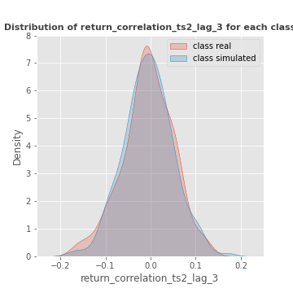

------------------------------------------------------
## Bivariate analysis of sqreturn_autocorrelation_ts1_lag1 feature with target

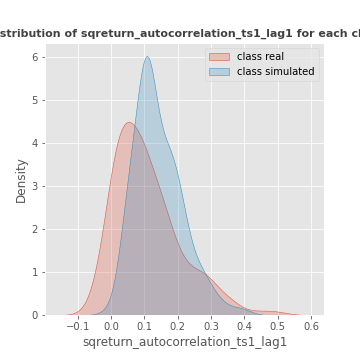

------------------------------------------------------
## Bivariate analysis of sqreturn_autocorrelation_ts1_lag2 feature with target

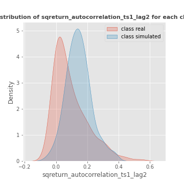

------------------------------------------------------
## Bivariate analysis of sqreturn_autocorrelation_ts1_lag3 feature with target

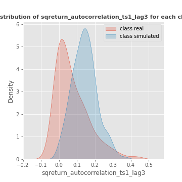

------------------------------------------------------
## Bivariate analysis of sqreturn_autocorrelation_ts2_lag1 feature with target

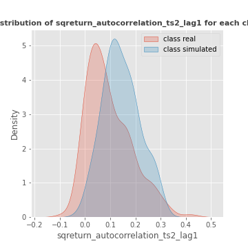

------------------------------------------------------
## Bivariate analysis of sqreturn_autocorrelation_ts2_lag2 feature with target

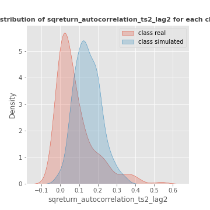

------------------------------------------------------
## Bivariate analysis of sqreturn_autocorrelation_ts2_lag3 feature with target

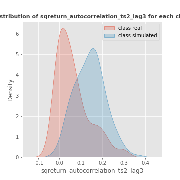

------------------------------------------------------
## Bivariate analysis of sqreturn_correlation_ts1_lag_0 feature with target

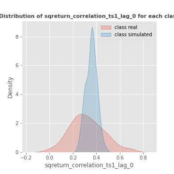

------------------------------------------------------
## Bivariate analysis of sqreturn_correlation_ts1_lag_1 feature with target

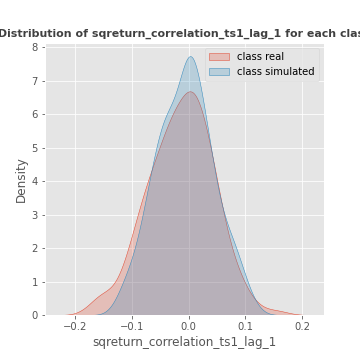

------------------------------------------------------
## Bivariate analysis of sqreturn_correlation_ts1_lag_2 feature with target

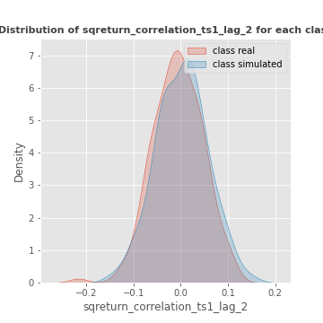

------------------------------------------------------
## Bivariate analysis of sqreturn_correlation_ts1_lag_3 feature with target

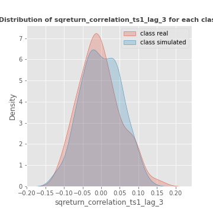

------------------------------------------------------
## Bivariate analysis of sqreturn_correlation_ts2_lag_1 feature with target

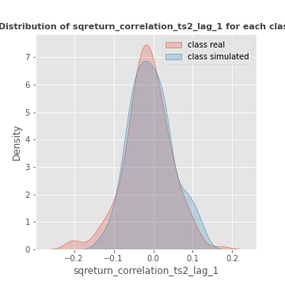

------------------------------------------------------
## Bivariate analysis of sqreturn_correlation_ts2_lag_2 feature with target

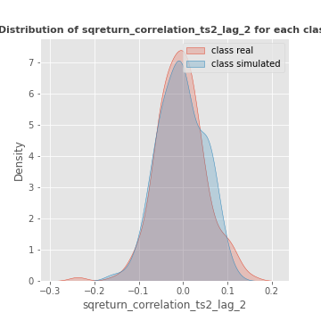

------------------------------------------------------
## Bivariate analysis of sqreturn_correlation_ts2_lag_3 feature with target

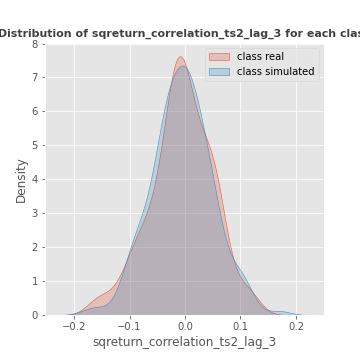

------------------------------------------------------
## Bivariate analysis of price2_granger_cause_price1 feature with target

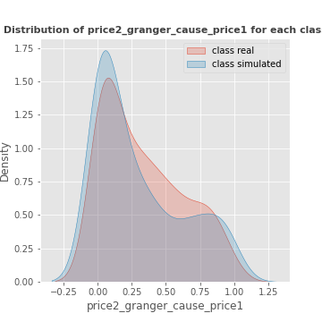

------------------------------------------------------
## Bivariate analysis of price1_granger_cause_price2 feature with target

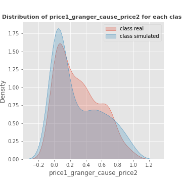

------------------------------------------------------
## Heatmap
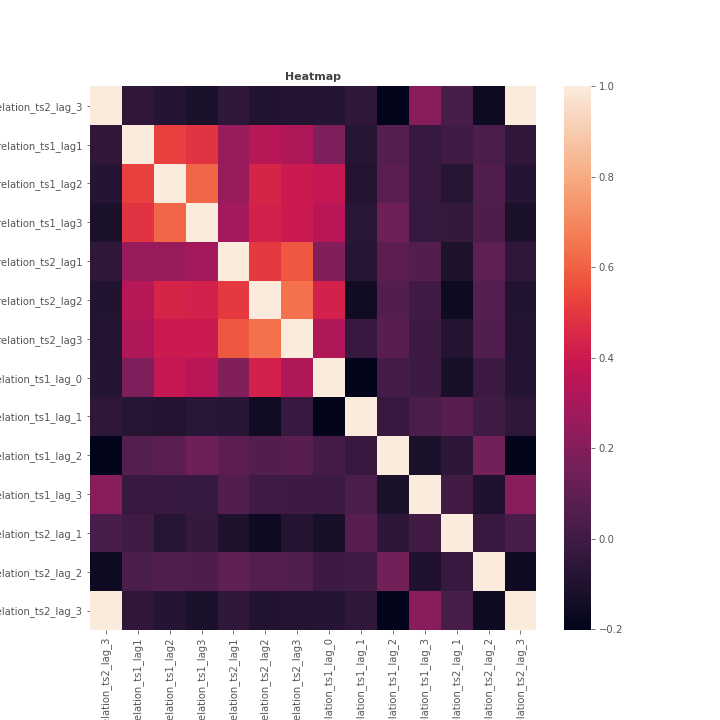

------------------------------------------------------
