# Summary of 3_Linear

[<< Go back](../README.md)

## Logistic Regression (Linear)
- **n_jobs**: -1
- **explain_level**: 2

## Validation
 - **validation_type**: split
 - **train_ratio**: 0.75
 - **shuffle**: True
 - **stratify**: True

## Optimized metric
accuracy

## Training time

3.0 seconds

## Metric details
|           |    score |   threshold |
|:----------|---------:|------------:|
| logloss   | 0.174836 | nan         |
| auc       | 0.996825 | nan         |
| f1        | 0.989011 |   0.744933  |
| accuracy  | 0.988506 |   0.744933  |
| precision | 1        |   0.883784  |
| recall    | 1        |   1.891e-07 |
| mcc       | 0.977225 |   0.744933  |

## Confusion matrix (at threshold=0.744933)
|                      |   Predicted as real |   Predicted as simulated |
|:---------------------|--------------------:|-------------------------:|
| Labeled as real      |                  41 |                        1 |
| Labeled as simulated |                   0 |                       45 |

## Learning curves
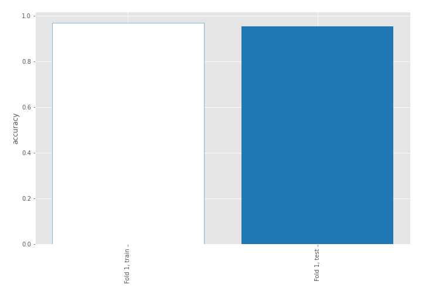

## Coefficients
| feature                           |   Learner_1 |
|:----------------------------------|------------:|
| return_skew2                      |   0.410423  |
| return_autocorrelation_2_lag1     |   0.408451  |
| return_autocorrelation_2_lag2     |   0.377309  |
| return_autocorrelation_2_lag3     |   0.309905  |
| price2_granger_cause_price1       |   0.235831  |
| sqreturn_correlation_ts1_lag_1    |   0.232399  |
| return_correlation_ts1_lag_1      |   0.232399  |
| return_correlation_ts2_lag_1      |   0.223103  |
| sqreturn_correlation_ts2_lag_1    |   0.223103  |
| return_autocorrelation_1_lag3     |   0.216597  |
| return_correlation_ts1_lag_3      |   0.194561  |
| sqreturn_correlation_ts1_lag_3    |   0.194561  |
| return_correlation_ts2_lag_2      |   0.136668  |
| sqreturn_correlation_ts2_lag_2    |   0.136668  |
| return_autocorrelation_1_lag1     |   0.129715  |
| return_autocorrelation_1_lag2     |   0.0577253 |
| return_correlation_ts2_lag_3      |   0.0360819 |
| sqreturn_correlation_ts2_lag_3    |   0.0360819 |
| sqreturn_correlation_ts1_lag_2    |   0.0116146 |
| return_correlation_ts1_lag_2      |   0.0116146 |
| return_skew1                      |  -0.0192381 |
| price1_granger_cause_price2       |  -0.234755  |
| return_sd2                        |  -0.292232  |
| return_mean1                      |  -0.311684  |
| return_sd1                        |  -0.31694   |
| sqreturn_correlation_ts1_lag_0    |  -0.323694  |
| return_correlation_ts1_lag_0      |  -0.323694  |
| return_mean2                      |  -0.362521  |
| sqreturn_autocorrelation_ts2_lag3 |  -0.788426  |
| sqreturn_autocorrelation_ts1_lag3 |  -0.897522  |
| sqreturn_autocorrelation_ts2_lag2 |  -0.999261  |
| sqreturn_autocorrelation_ts1_lag2 |  -1.07312   |
| sqreturn_autocorrelation_ts2_lag1 |  -1.10179   |
| sqreturn_autocorrelation_ts1_lag1 |  -1.25302   |
| intercept                         |  -1.36103   |
| return_kurtosis2                  |  -3.47087   |
| return_kurtosis1                  |  -4.4975    |

## Permutation-based Importance
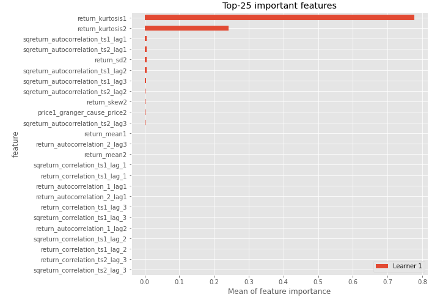
## Confusion Matrix

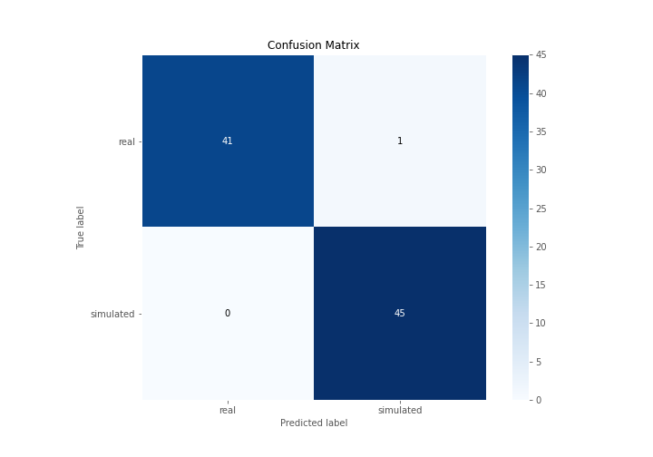

## Normalized Confusion Matrix

## ROC Curve

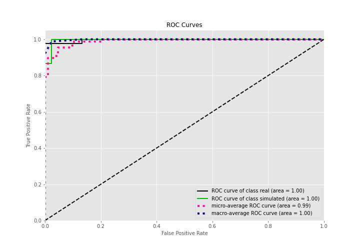

## Kolmogorov-Smirnov Statistic

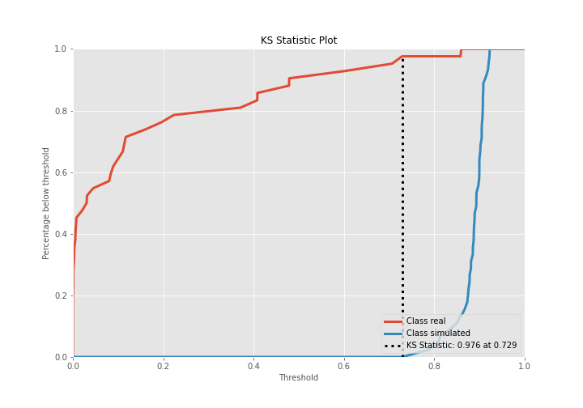

## Precision-Recall Curve

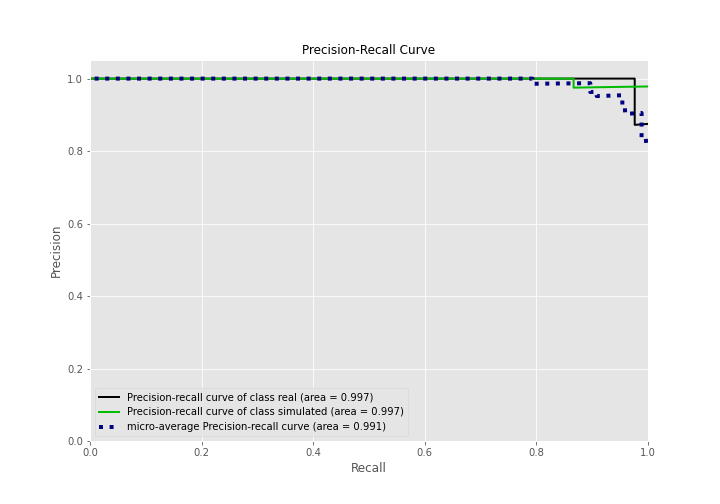

## Calibration Curve

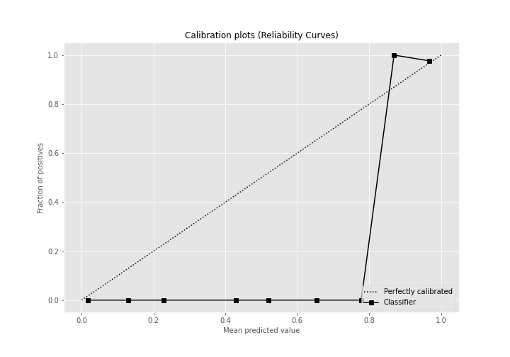

## Cumulative Gains Curve

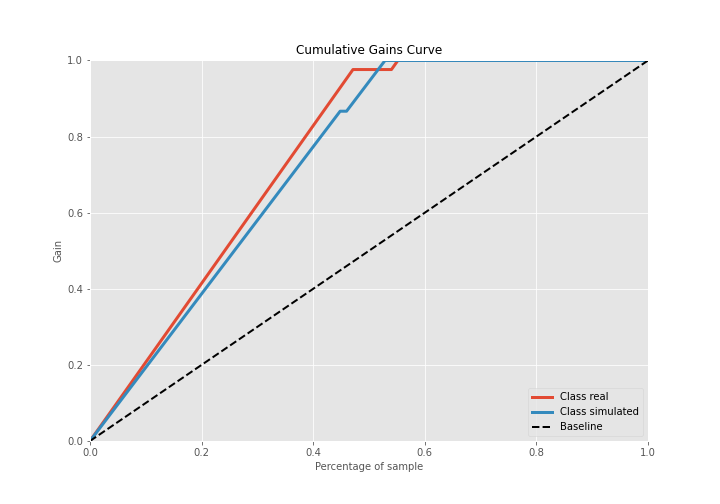

## Lift Curve

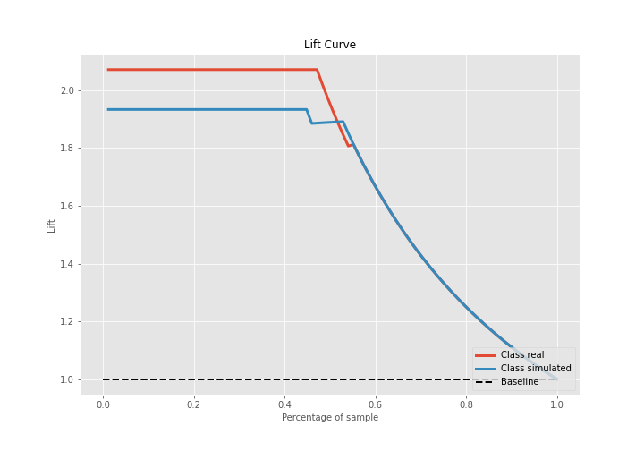

## SHAP Importance
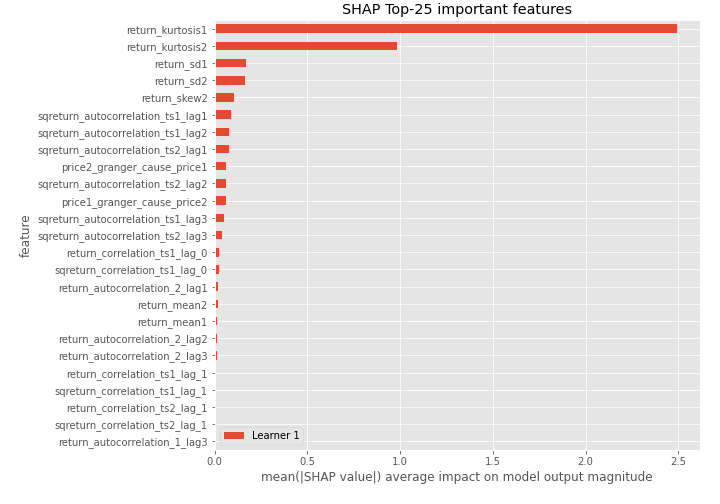

## SHAP Dependence plots

### Dependence (Fold 1)
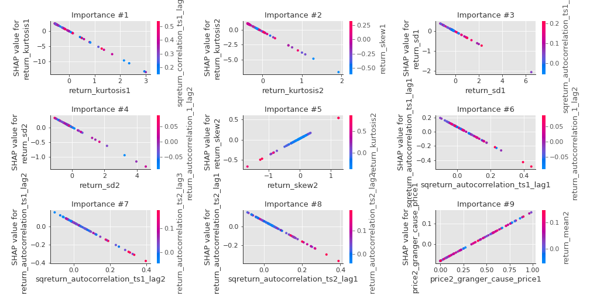

## SHAP Decision plots

### Top-10 Worst decisions for class 0 (Fold 1)
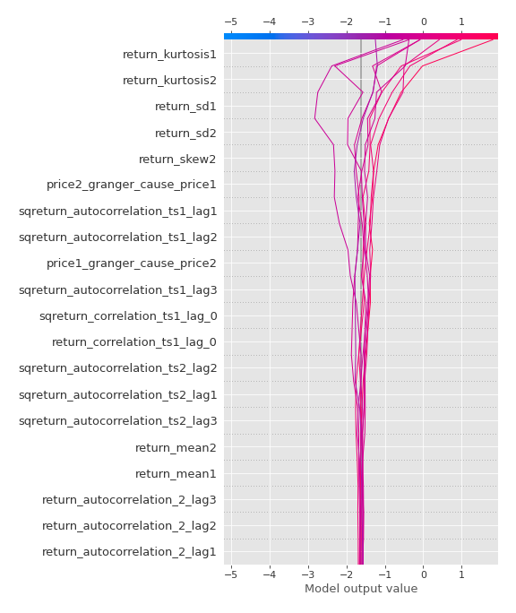
### Top-10 Best decisions for class 0 (Fold 1)
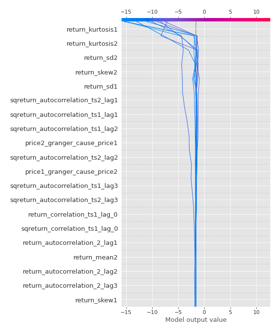
### Top-10 Worst decisions for class 1 (Fold 1)
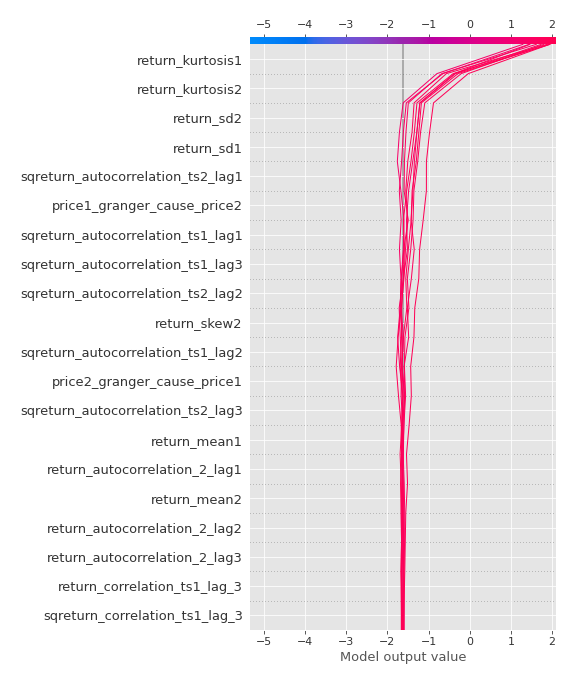
### Top-10 Best decisions for class 1 (Fold 1)
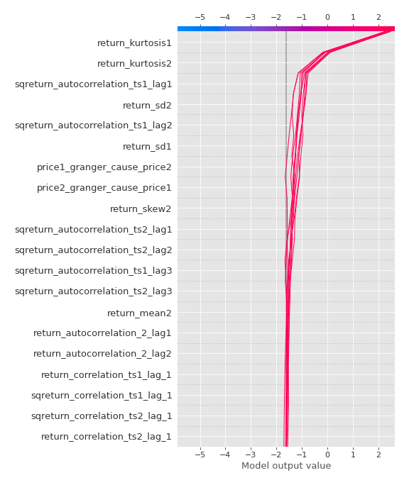

[<< Go back](../README.md)
