# Exploratory Data Analysis

[<< Go back](../README.md)
## Feature : target
- **Feature type** : categorical
- **Missing** : 0.0%
- **Unique** : 2
- **Count** :347
- **Unique** :2
- **Top** :simulated
- **Freq** :178

## Feature : return_mean1
- **Feature type** : continous
- **Missing** : 0.0%
- **Unique** : 347
- **Count** :347.0
- **Mean** :0.047039768413277505
- **Std** :0.07172268795071322
- **Min** :-0.17686457077756634
- **25%th Percentile** : 0.0013426647055598696
- **50%th Percentile** : 0.04596343863881343
- **75%th Percentile** : 0.09123759020812355
- **Max** :0.37175100008111034

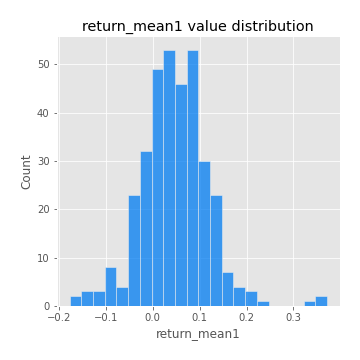
## Feature : return_mean2
- **Feature type** : continous
- **Missing** : 0.0%
- **Unique** : 347
- **Count** :347.0
- **Mean** :0.04833255003541725
- **Std** :0.08509978781894308
- **Min** :-0.21818165578778434
- **25%th Percentile** : 0.006804886859318017
- **50%th Percentile** : 0.05443053277736165
- **75%th Percentile** : 0.09780903131991214
- **Max** :0.37616608147096464

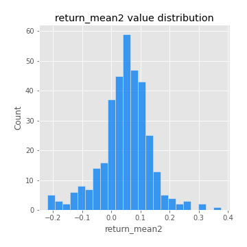
## Feature : return_sd1
- **Feature type** : continous
- **Missing** : 0.0%
- **Unique** : 347
- **Count** :347.0
- **Mean** :1.7504224667814767
- **Std** :0.6479555609423954
- **Min** :0.7470080772831957
- **25%th Percentile** : 1.5406856040949124
- **50%th Percentile** : 1.5961287842212077
- **75%th Percentile** : 1.6902017658202082
- **Max** :6.495661311240861

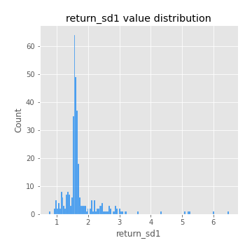
## Feature : return_sd2
- **Feature type** : continous
- **Missing** : 0.0%
- **Unique** : 347
- **Count** :347.0
- **Mean** :1.7182791854943658
- **Std** :0.5850179887177132
- **Min** :0.8455946193085045
- **25%th Percentile** : 1.5163293156851505
- **50%th Percentile** : 1.5844422345220113
- **75%th Percentile** : 1.6733568203935967
- **Max** :5.042707010333888

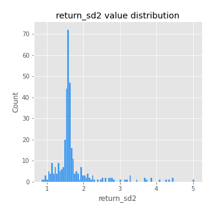
## Feature : return_skew1
- **Feature type** : continous
- **Missing** : 0.0%
- **Unique** : 347
- **Count** :347.0
- **Mean** :-0.08218116978089664
- **Std** :0.6068496716077255
- **Min** :-3.530116233761814
- **25%th Percentile** : -0.15630380903968077
- **50%th Percentile** : -0.017118985188127007
- **75%th Percentile** : 0.09062441466661922
- **Max** :2.5845963767725557

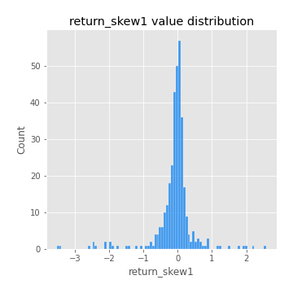
## Feature : return_skew2
- **Feature type** : continous
- **Missing** : 0.0%
- **Unique** : 347
- **Count** :347.0
- **Mean** :-0.1545674126171745
- **Std** :0.8112244152948608
- **Min** :-8.801502855292393
- **25%th Percentile** : -0.21317492365343765
- **50%th Percentile** : -0.02664427449577668
- **75%th Percentile** : 0.10155266685466058
- **Max** :2.2606839051517187

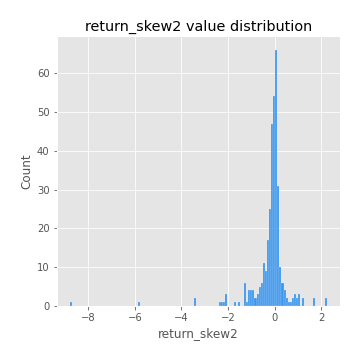
## Feature : return_kurtosis1
- **Feature type** : continous
- **Missing** : 0.0%
- **Unique** : 347
- **Count** :347.0
- **Mean** :3.1305170214080147
- **Std** :5.986628204469323
- **Min** :-0.4134860967752383
- **25%th Percentile** : -0.04318472223900671
- **50%th Percentile** : 0.47194791491044796
- **75%th Percentile** : 3.6269952348430596
- **Max** :46.07507808162177

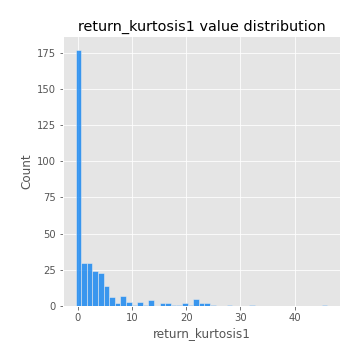
## Feature : return_kurtosis2
- **Feature type** : continous
- **Missing** : 0.0%
- **Unique** : 347
- **Count** :347.0
- **Mean** :3.6982693983404284
- **Std** :10.280668779810622
- **Min** :-0.4551383783877574
- **25%th Percentile** : -0.019149566839283816
- **50%th Percentile** : 0.4834523361737584
- **75%th Percentile** : 3.910854938310223
- **Max** :143.10871011533666

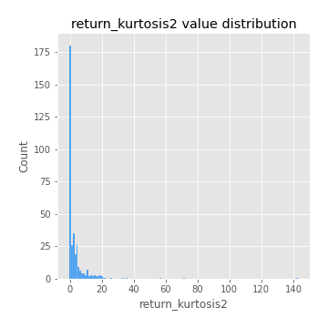
## Feature : return_autocorrelation_1_lag1
- **Feature type** : continous
- **Missing** : 0.0%
- **Unique** : 347
- **Count** :347.0
- **Mean** :-0.013731401141689286
- **Std** :0.0567488875675812
- **Min** :-0.2135576224968752
- **25%th Percentile** : -0.04118630758495478
- **50%th Percentile** : -0.007594049124978584
- **75%th Percentile** : 0.023800255486596096
- **Max** :0.10556057684359459

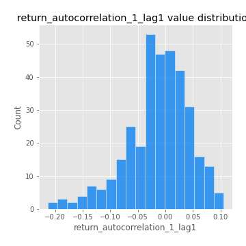
## Feature : return_autocorrelation_1_lag2
- **Feature type** : continous
- **Missing** : 0.0%
- **Unique** : 347
- **Count** :347.0
- **Mean** :-0.007563767100119838
- **Std** :0.050438212190325266
- **Min** :-0.1464183112928496
- **25%th Percentile** : -0.0394931894419432
- **50%th Percentile** : -0.005583441304546397
- **75%th Percentile** : 0.025106759505868402
- **Max** :0.1561488228015672

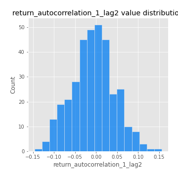
## Feature : return_autocorrelation_1_lag3
- **Feature type** : continous
- **Missing** : 0.0%
- **Unique** : 347
- **Count** :347.0
- **Mean** :-0.005067958381349586
- **Std** :0.04642621843439863
- **Min** :-0.15806635192103805
- **25%th Percentile** : -0.03441435531150845
- **50%th Percentile** : -0.004442906180555039
- **75%th Percentile** : 0.026419620571454548
- **Max** :0.11611275889458952

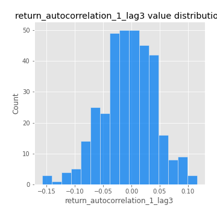
## Feature : return_autocorrelation_2_lag1
- **Feature type** : continous
- **Missing** : 0.0%
- **Unique** : 347
- **Count** :347.0
- **Mean** :-0.004837641605411099
- **Std** :0.059539294750483154
- **Min** :-0.25075531010123286
- **25%th Percentile** : -0.037509771952711934
- **50%th Percentile** : -0.0026863359402601347
- **75%th Percentile** : 0.032758772712152925
- **Max** :0.31863413537898483

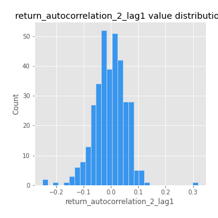
## Feature : return_autocorrelation_2_lag2
- **Feature type** : continous
- **Missing** : 0.0%
- **Unique** : 347
- **Count** :347.0
- **Mean** :-0.0001726056924319578
- **Std** :0.05085062237749284
- **Min** :-0.1495113937562178
- **25%th Percentile** : -0.034254087967485664
- **50%th Percentile** : -0.0008688113858027592
- **75%th Percentile** : 0.033107417598368494
- **Max** :0.20974504043791217

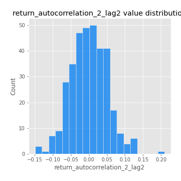
## Feature : return_autocorrelation_2_lag3
- **Feature type** : continous
- **Missing** : 0.0%
- **Unique** : 347
- **Count** :347.0
- **Mean** :0.0006098439579322905
- **Std** :0.04934566581470396
- **Min** :-0.14200107169559698
- **25%th Percentile** : -0.03177238216796128
- **50%th Percentile** : 0.0018177420575466333
- **75%th Percentile** : 0.0338683916136112
- **Max** :0.1419999376914021

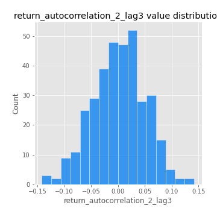
## Feature : return_correlation_ts1_lag_0
- **Feature type** : continous
- **Missing** : 0.0%
- **Unique** : 347
- **Count** :347.0
- **Mean** :0.3282538747995444
- **Std** :0.10921951401377812
- **Min** :0.005136598099876001
- **25%th Percentile** : 0.27366757792341034
- **50%th Percentile** : 0.3292574441158892
- **75%th Percentile** : 0.36999621520631154
- **Max** :0.7028422087350163

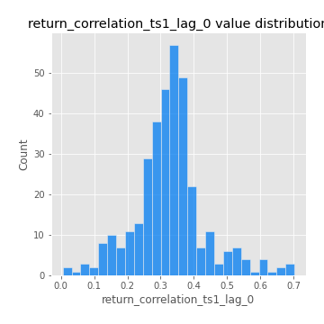
## Feature : return_correlation_ts1_lag_1
- **Feature type** : continous
- **Missing** : 0.0%
- **Unique** : 347
- **Count** :347.0
- **Mean** :-0.009309720372166841
- **Std** :0.05204839424862535
- **Min** :-0.16985510949917193
- **25%th Percentile** : -0.042086469263715676
- **50%th Percentile** : -0.006547141088951226
- **75%th Percentile** : 0.027558621045087182
- **Max** :0.12834359430195305

## Feature : return_correlation_ts1_lag_2
- **Feature type** : continous
- **Missing** : 0.0%
- **Unique** : 347
- **Count** :347.0
- **Mean** :-0.001710581362564804
- **Std** :0.04851629320465643
- **Min** :-0.21653581047581763
- **25%th Percentile** : -0.03358359257880604
- **50%th Percentile** : -0.002361900159584634
- **75%th Percentile** : 0.03653149962364305
- **Max** :0.11448758795392355

## Feature : return_correlation_ts1_lag_3
- **Feature type** : continous
- **Missing** : 0.0%
- **Unique** : 347
- **Count** :347.0
- **Mean** :-0.0008601744254020693
- **Std** :0.04838702947492067
- **Min** :-0.1270218498974763
- **25%th Percentile** : -0.03283332360604757
- **50%th Percentile** : 0.0035975265554300468
- **75%th Percentile** : 0.030734633271938358
- **Max** :0.1422809271770942

## Feature : return_correlation_ts2_lag_1
- **Feature type** : continous
- **Missing** : 0.0%
- **Unique** : 347
- **Count** :347.0
- **Mean** :-0.003841485909248366
- **Std** :0.05094187658475188
- **Min** :-0.2081139431093261
- **25%th Percentile** : -0.034525448568656567
- **50%th Percentile** : -0.008008843453569291
- **75%th Percentile** : 0.028438914807949515
- **Max** :0.17208763791364762

## Feature : return_correlation_ts2_lag_2
- **Feature type** : continous
- **Missing** : 0.0%
- **Unique** : 347
- **Count** :347.0
- **Mean** :-0.00015274499993085045
- **Std** :0.05178542725630419
- **Min** :-0.23751835475804678
- **25%th Percentile** : -0.03378030375320881
- **50%th Percentile** : -0.003186316216567342
- **75%th Percentile** : 0.0333067921754948
- **Max** :0.20772887392904255

## Feature : return_correlation_ts2_lag_3
- **Feature type** : continous
- **Missing** : 0.0%
- **Unique** : 347
- **Count** :347.0
- **Mean** :-0.0040400143961067956
- **Std** :0.04990337815435416
- **Min** :-0.17564076057312866
- **25%th Percentile** : -0.03306805165854038
- **50%th Percentile** : -0.005562867684544915
- **75%th Percentile** : 0.027659060227187667
- **Max** :0.13128380114518473

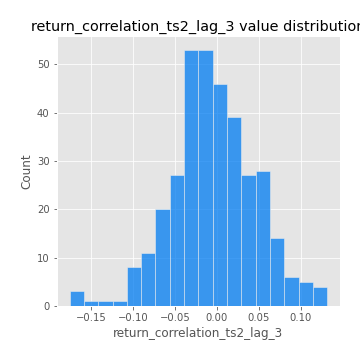
## Feature : sqreturn_autocorrelation_ts1_lag1
- **Feature type** : continous
- **Missing** : 0.0%
- **Unique** : 347
- **Count** :347.0
- **Mean** :0.044051004293858824
- **Std** :0.08673104907807792
- **Min** :-0.11548000691061562
- **25%th Percentile** : -0.012997977888421906
- **50%th Percentile** : 0.023102393654911572
- **75%th Percentile** : 0.07863050577929664
- **Max** :0.4439086285737898

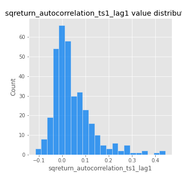
## Feature : sqreturn_autocorrelation_ts1_lag2
- **Feature type** : continous
- **Missing** : 0.0%
- **Unique** : 347
- **Count** :347.0
- **Mean** :0.03812936522418296
- **Std** :0.0890592986389206
- **Min** :-0.11751111594220008
- **25%th Percentile** : -0.014733626342951037
- **50%th Percentile** : 0.013038300359564844
- **75%th Percentile** : 0.06377953816815046
- **Max** :0.540735851444759

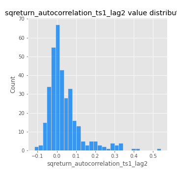
## Feature : sqreturn_autocorrelation_ts1_lag3
- **Feature type** : continous
- **Missing** : 0.0%
- **Unique** : 347
- **Count** :347.0
- **Mean** :0.0319671733131486
- **Std** :0.07553573044946457
- **Min** :-0.12216053669973814
- **25%th Percentile** : -0.013610144209871545
- **50%th Percentile** : 0.00971777459966
- **75%th Percentile** : 0.05334359184301675
- **Max** :0.3457940197475473

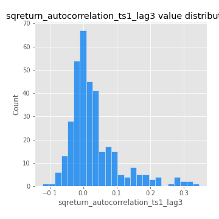
## Feature : sqreturn_autocorrelation_ts2_lag1
- **Feature type** : continous
- **Missing** : 0.0%
- **Unique** : 347
- **Count** :347.0
- **Mean** :0.04810721642930762
- **Std** :0.0842244185220564
- **Min** :-0.10203494362734077
- **25%th Percentile** : -0.008642236853056456
- **50%th Percentile** : 0.028977213924497654
- **75%th Percentile** : 0.0742046900877477
- **Max** :0.3965571120415088

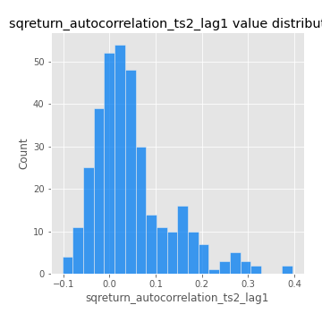
## Feature : sqreturn_autocorrelation_ts2_lag2
- **Feature type** : continous
- **Missing** : 0.0%
- **Unique** : 347
- **Count** :347.0
- **Mean** :0.04094054607733551
- **Std** :0.08773799557766598
- **Min** :-0.08919946432505571
- **25%th Percentile** : -0.011010815181033385
- **50%th Percentile** : 0.015185213759964006
- **75%th Percentile** : 0.06660271585987568
- **Max** :0.5373432415582473

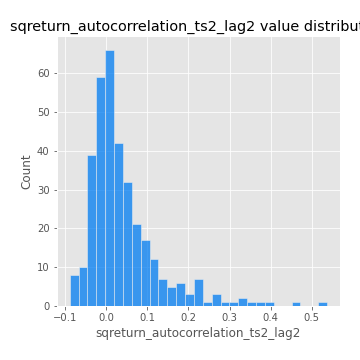
## Feature : sqreturn_autocorrelation_ts2_lag3
- **Feature type** : continous
- **Missing** : 0.0%
- **Unique** : 347
- **Count** :347.0
- **Mean** :0.03069812446779011
- **Std** :0.07169853137465408
- **Min** :-0.1076934601131107
- **25%th Percentile** : -0.01453726816705219
- **50%th Percentile** : 0.015621388449919312
- **75%th Percentile** : 0.05989674556120412
- **Max** :0.31225727797735664

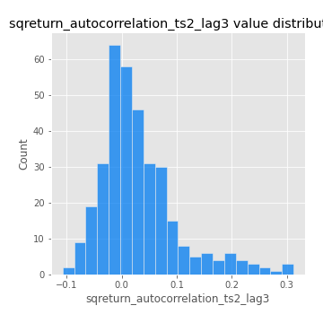
## Feature : sqreturn_correlation_ts1_lag_0
- **Feature type** : continous
- **Missing** : 0.0%
- **Unique** : 347
- **Count** :347.0
- **Mean** :0.3282538747995444
- **Std** :0.10921951401377812
- **Min** :0.005136598099876001
- **25%th Percentile** : 0.27366757792341034
- **50%th Percentile** : 0.3292574441158892
- **75%th Percentile** : 0.36999621520631154
- **Max** :0.7028422087350163

## Feature : sqreturn_correlation_ts1_lag_1
- **Feature type** : continous
- **Missing** : 0.0%
- **Unique** : 347
- **Count** :347.0
- **Mean** :-0.009309720372166841
- **Std** :0.05204839424862535
- **Min** :-0.16985510949917193
- **25%th Percentile** : -0.042086469263715676
- **50%th Percentile** : -0.006547141088951226
- **75%th Percentile** : 0.027558621045087182
- **Max** :0.12834359430195305

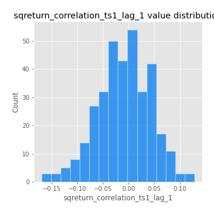
## Feature : sqreturn_correlation_ts1_lag_2
- **Feature type** : continous
- **Missing** : 0.0%
- **Unique** : 347
- **Count** :347.0
- **Mean** :-0.001710581362564804
- **Std** :0.04851629320465643
- **Min** :-0.21653581047581763
- **25%th Percentile** : -0.03358359257880604
- **50%th Percentile** : -0.002361900159584634
- **75%th Percentile** : 0.03653149962364305
- **Max** :0.11448758795392355

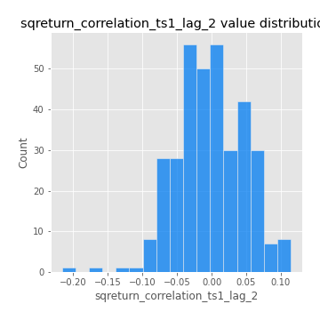
## Feature : sqreturn_correlation_ts1_lag_3
- **Feature type** : continous
- **Missing** : 0.0%
- **Unique** : 347
- **Count** :347.0
- **Mean** :-0.0008601744254020693
- **Std** :0.04838702947492067
- **Min** :-0.1270218498974763
- **25%th Percentile** : -0.03283332360604757
- **50%th Percentile** : 0.0035975265554300468
- **75%th Percentile** : 0.030734633271938358
- **Max** :0.1422809271770942

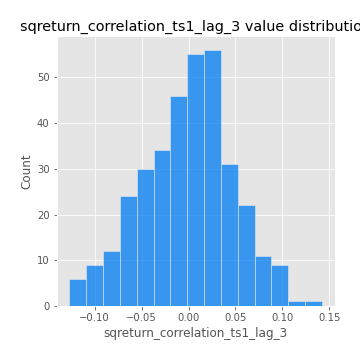
## Feature : sqreturn_correlation_ts2_lag_1
- **Feature type** : continous
- **Missing** : 0.0%
- **Unique** : 347
- **Count** :347.0
- **Mean** :-0.003841485909248366
- **Std** :0.05094187658475188
- **Min** :-0.2081139431093261
- **25%th Percentile** : -0.034525448568656567
- **50%th Percentile** : -0.008008843453569291
- **75%th Percentile** : 0.028438914807949515
- **Max** :0.17208763791364762

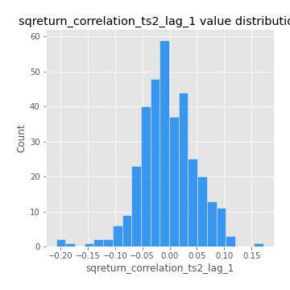
## Feature : sqreturn_correlation_ts2_lag_2
- **Feature type** : continous
- **Missing** : 0.0%
- **Unique** : 347
- **Count** :347.0
- **Mean** :-0.00015274499993085045
- **Std** :0.05178542725630419
- **Min** :-0.23751835475804678
- **25%th Percentile** : -0.03378030375320881
- **50%th Percentile** : -0.003186316216567342
- **75%th Percentile** : 0.0333067921754948
- **Max** :0.20772887392904255

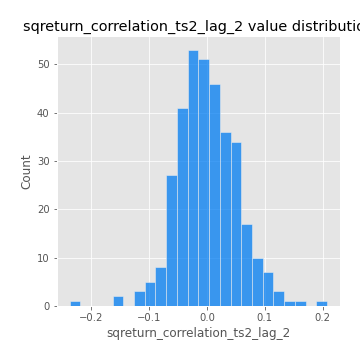
## Feature : sqreturn_correlation_ts2_lag_3
- **Feature type** : continous
- **Missing** : 0.0%
- **Unique** : 347
- **Count** :347.0
- **Mean** :-0.0040400143961067956
- **Std** :0.04990337815435416
- **Min** :-0.17564076057312866
- **25%th Percentile** : -0.03306805165854038
- **50%th Percentile** : -0.005562867684544915
- **75%th Percentile** : 0.027659060227187667
- **Max** :0.13128380114518473

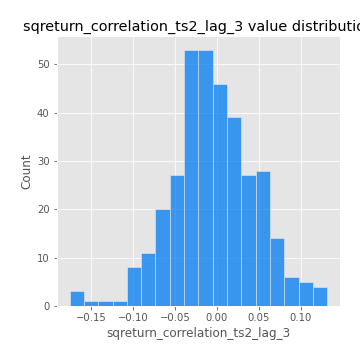
## Feature : price2_granger_cause_price1
- **Feature type** : continous
- **Missing** : 0.0%
- **Unique** : 347
- **Count** :347.0
- **Mean** :0.32734907019285003
- **Std** :0.2898508853540839
- **Min** :7.3825361857001595e-06
- **25%th Percentile** : 0.060451299987372434
- **50%th Percentile** : 0.25974629090192897
- **75%th Percentile** : 0.5607648586913117
- **Max** :0.9984682657530494

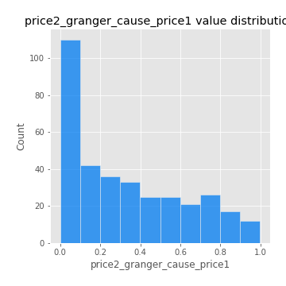
## Feature : price1_granger_cause_price2
- **Feature type** : continous
- **Missing** : 0.0%
- **Unique** : 347
- **Count** :347.0
- **Mean** :0.2858259052091293
- **Std** :0.28218669182314543
- **Min** :5.328311266518331e-08
- **25%th Percentile** : 0.03713726452346759
- **50%th Percentile** : 0.19969842012982517
- **75%th Percentile** : 0.47516786565107627
- **Max** :0.9951398266867577

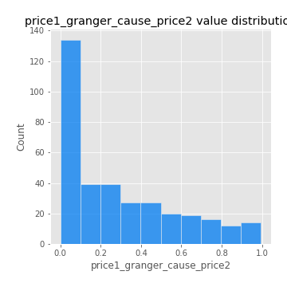

[<< Go back](../README.md)
