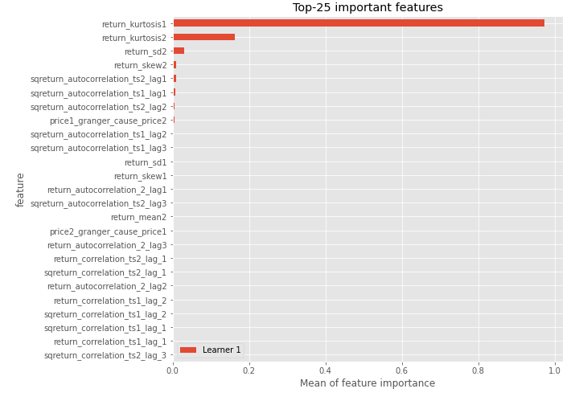
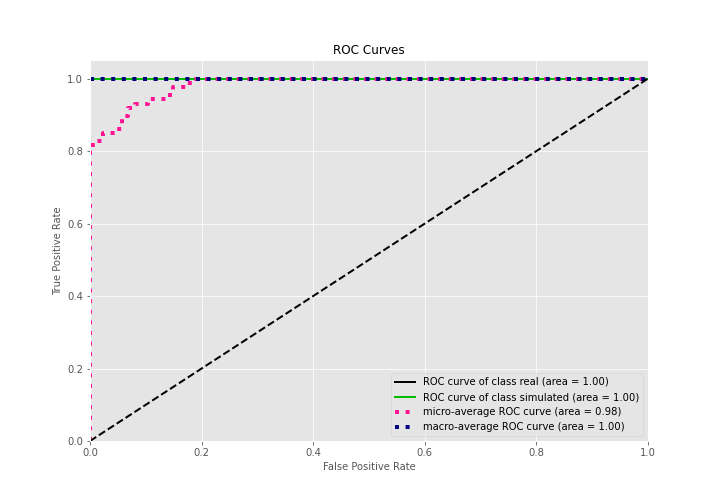

# Summary of 3_Linear

[<< Go back](../README.md)

## Logistic Regression (Linear)
- **n_jobs**: -1
- **explain_level**: 2

## Validation
 - **validation_type**: split
 - **train_ratio**: 0.75
 - **shuffle**: True
 - **stratify**: True

## Optimized metric
accuracy

## Training time

11.1 seconds

## Metric details
|           |    score |     threshold |
|:----------|---------:|--------------:|
| logloss   | 0.207954 | nan           |
| auc       | 1        | nan           |
| f1        | 1        |   0.839432    |
| accuracy  | 1        |   0.839432    |
| precision | 1        |   0.839432    |
| recall    | 1        |   1.76764e-13 |
| mcc       | 1        |   0.839432    |

## Confusion matrix (at threshold=0.839432)
|                      |   Predicted as real |   Predicted as simulated |
|:---------------------|--------------------:|-------------------------:|
| Labeled as real      |                  43 |                        0 |
| Labeled as simulated |                   0 |                       44 |

## Learning curves

## Coefficients
| feature                           |   Learner_1 |
|:----------------------------------|------------:|
| return_skew2                      |   0.555143  |
| return_autocorrelation_2_lag2     |   0.452596  |
| return_autocorrelation_2_lag3     |   0.330694  |
| return_autocorrelation_2_lag1     |   0.329882  |
| return_sd1                        |   0.279555  |
| return_correlation_ts2_lag_1      |   0.274731  |
| sqreturn_correlation_ts2_lag_1    |   0.274731  |
| sqreturn_correlation_ts1_lag_2    |   0.258471  |
| return_correlation_ts1_lag_2      |   0.258471  |
| return_autocorrelation_1_lag2     |   0.21867   |
| sqreturn_correlation_ts1_lag_3    |   0.217627  |
| return_correlation_ts1_lag_3      |   0.217627  |
| return_autocorrelation_1_lag3     |   0.213256  |
| return_correlation_ts1_lag_1      |   0.174968  |
| sqreturn_correlation_ts1_lag_1    |   0.174968  |
| return_skew1                      |   0.158798  |
| sqreturn_correlation_ts2_lag_2    |   0.116597  |
| return_correlation_ts2_lag_2      |   0.116597  |
| return_correlation_ts2_lag_3      |   0.108832  |
| sqreturn_correlation_ts2_lag_3    |   0.108832  |
| return_autocorrelation_1_lag1     |  -0.0131387 |
| sqreturn_correlation_ts1_lag_0    |  -0.1394    |
| return_correlation_ts1_lag_0      |  -0.1394    |
| price2_granger_cause_price1       |  -0.255963  |
| return_mean1                      |  -0.283317  |
| price1_granger_cause_price2       |  -0.342677  |
| return_mean2                      |  -0.386636  |
| return_sd2                        |  -0.565544  |
| sqreturn_autocorrelation_ts2_lag3 |  -0.703103  |
| sqreturn_autocorrelation_ts2_lag2 |  -0.815665  |
| sqreturn_autocorrelation_ts1_lag3 |  -0.925449  |
| sqreturn_autocorrelation_ts1_lag2 |  -1.07462   |
| sqreturn_autocorrelation_ts1_lag1 |  -1.23468   |
| sqreturn_autocorrelation_ts2_lag1 |  -1.25008   |
| intercept                         |  -1.30983   |
| return_kurtosis2                  |  -3.60386   |
| return_kurtosis1                  |  -4.41505   |

## Permutation-based Importance

## Confusion Matrix

## Normalized Confusion Matrix

## ROC Curve

## Kolmogorov-Smirnov Statistic

## Precision-Recall Curve

## Calibration Curve

## Cumulative Gains Curve

## Lift Curve

## SHAP Importance

## SHAP Dependence plots

### Dependence (Fold 1)

## SHAP Decision plots

### Top-10 Worst decisions for class 0 (Fold 1)

### Top-10 Best decisions for class 0 (Fold 1)

### Top-10 Worst decisions for class 1 (Fold 1)

### Top-10 Best decisions for class 1 (Fold 1)

[<< Go back](../README.md)
