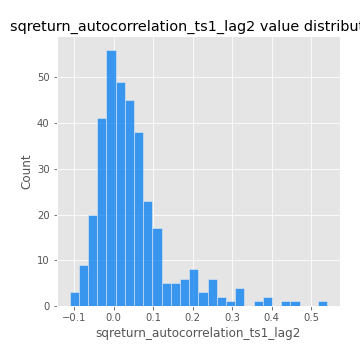

# Exploratory Data Analysis

[<< Go back](../README.md)
## Feature : target
- **Feature type** : categorical
- **Missing** : 0.0%
- **Unique** : 2
- **Count** :347
- **Unique** :2
- **Top** :simulated
- **Freq** :177

## Feature : return_mean1
- **Feature type** : continous
- **Missing** : 0.0%
- **Unique** : 347
- **Count** :347.0
- **Mean** :0.048473533693651795
- **Std** :0.07438434593434913
- **Min** :-0.22632637961920957
- **25%th Percentile** : 0.0024285183009629136
- **50%th Percentile** : 0.05312186492204548
- **75%th Percentile** : 0.09041818715021033
- **Max** :0.37175100008111034

## Feature : return_mean2
- **Feature type** : continous
- **Missing** : 0.0%
- **Unique** : 347
- **Count** :347.0
- **Mean** :0.052360896865009166
- **Std** :0.08963496603130562
- **Min** :-0.24205418062825398
- **25%th Percentile** : 0.006662096251870025
- **50%th Percentile** : 0.05500629532295908
- **75%th Percentile** : 0.10006586211162175
- **Max** :0.4797163658311741

## Feature : return_sd1
- **Feature type** : continous
- **Missing** : 0.0%
- **Unique** : 347
- **Count** :347.0
- **Mean** :1.7724013477356881
- **Std** :0.7720334899402528
- **Min** :0.7470080772831957
- **25%th Percentile** : 1.5369346490069486
- **50%th Percentile** : 1.595794022636184
- **75%th Percentile** : 1.7017506299138851
- **Max** :9.236766377527575

## Feature : return_sd2
- **Feature type** : continous
- **Missing** : 0.0%
- **Unique** : 347
- **Count** :347.0
- **Mean** :1.7750443906722095
- **Std** :0.7763766734649368
- **Min** :0.8455946193085045
- **25%th Percentile** : 1.5114897892646089
- **50%th Percentile** : 1.5955857639726887
- **75%th Percentile** : 1.6860901728641702
- **Max** :6.737618636746393

## Feature : return_skew1
- **Feature type** : continous
- **Missing** : 0.0%
- **Unique** : 347
- **Count** :347.0
- **Mean** :-0.12015796619959034
- **Std** :0.6010090095264519
- **Min** :-3.530116233761814
- **25%th Percentile** : -0.18572424643198693
- **50%th Percentile** : -0.03521310218995709
- **75%th Percentile** : 0.06391534456797195
- **Max** :2.5845963767725557

## Feature : return_skew2
- **Feature type** : continous
- **Missing** : 0.0%
- **Unique** : 347
- **Count** :347.0
- **Mean** :-0.18754937935570737
- **Std** :0.8060789499859059
- **Min** :-8.801502855292393
- **25%th Percentile** : -0.2432031360743815
- **50%th Percentile** : -0.055001348127400075
- **75%th Percentile** : 0.07887207344056141
- **Max** :1.9492855042693131

## Feature : return_kurtosis1
- **Feature type** : continous
- **Missing** : 0.0%
- **Unique** : 347
- **Count** :347.0
- **Mean** :3.285981654081018
- **Std** :6.575334562714437
- **Min** :-0.421994438071958
- **25%th Percentile** : -0.04122805019024711
- **50%th Percentile** : 0.4150954539093332
- **75%th Percentile** : 3.493977699762969
- **Max** :46.07507808162177

## Feature : return_kurtosis2
- **Feature type** : continous
- **Missing** : 0.0%
- **Unique** : 347
- **Count** :347.0
- **Mean** :3.9101830665500406
- **Std** :10.478922430706069
- **Min** :-0.4267597896718711
- **25%th Percentile** : -0.026176732801365565
- **50%th Percentile** : 0.47354223140711627
- **75%th Percentile** : 4.254571123998912
- **Max** :143.10871011533666

## Feature : return_autocorrelation_1_lag1
- **Feature type** : continous
- **Missing** : 0.0%
- **Unique** : 347
- **Count** :347.0
- **Mean** :-0.010756109754570274
- **Std** :0.05503456589962373
- **Min** :-0.2135576224968752
- **25%th Percentile** : -0.04011608557760907
- **50%th Percentile** : -0.00405334792353723
- **75%th Percentile** : 0.02388656718557175
- **Max** :0.12810656890648087

## Feature : return_autocorrelation_1_lag2
- **Feature type** : continous
- **Missing** : 0.0%
- **Unique** : 347
- **Count** :347.0
- **Mean** :-0.005342151283490524
- **Std** :0.04834739866431426
- **Min** :-0.1413561787896087
- **25%th Percentile** : -0.03627595248572946
- **50%th Percentile** : -0.004153501649170336
- **75%th Percentile** : 0.024068369814743577
- **Max** :0.1561488228015672

## Feature : return_autocorrelation_1_lag3
- **Feature type** : continous
- **Missing** : 0.0%
- **Unique** : 347
- **Count** :347.0
- **Mean** :-0.004031262047870484
- **Std** :0.051727062529599147
- **Min** :-0.1940836867390813
- **25%th Percentile** : -0.036444227137176335
- **50%th Percentile** : -0.0037399346828342773
- **75%th Percentile** : 0.02555400621273437
- **Max** :0.17805869530681923

## Feature : return_autocorrelation_2_lag1
- **Feature type** : continous
- **Missing** : 0.0%
- **Unique** : 347
- **Count** :347.0
- **Mean** :-0.006417948280382458
- **Std** :0.05955699663522814
- **Min** :-0.24590087874039124
- **25%th Percentile** : -0.037517651659031495
- **50%th Percentile** : -0.0004795251342804986
- **75%th Percentile** : 0.028207799551742928
- **Max** :0.31863413537898483

## Feature : return_autocorrelation_2_lag2
- **Feature type** : continous
- **Missing** : 0.0%
- **Unique** : 347
- **Count** :347.0
- **Mean** :0.003687547060663157
- **Std** :0.054158256124915885
- **Min** :-0.15323211089747296
- **25%th Percentile** : -0.03231187106302097
- **50%th Percentile** : -0.0021804593072609936
- **75%th Percentile** : 0.038895131583243626
- **Max** :0.20974504043791217

## Feature : return_autocorrelation_2_lag3
- **Feature type** : continous
- **Missing** : 0.0%
- **Unique** : 347
- **Count** :347.0
- **Mean** :-0.002707715129019707
- **Std** :0.0482455519336855
- **Min** :-0.1344316177078651
- **25%th Percentile** : -0.03684641490078929
- **50%th Percentile** : -0.002180243143539688
- **75%th Percentile** : 0.028188259864101416
- **Max** :0.1419999376914021

## Feature : return_correlation_ts1_lag_0
- **Feature type** : continous
- **Missing** : 0.0%
- **Unique** : 347
- **Count** :347.0
- **Mean** :0.3216099629242972
- **Std** :0.10924571601588251
- **Min** :-0.027089510445801036
- **25%th Percentile** : 0.27316986584093694
- **50%th Percentile** : 0.32254031861552385
- **75%th Percentile** : 0.3638399844018366
- **Max** :0.7041861626832071

## Feature : return_correlation_ts1_lag_1
- **Feature type** : continous
- **Missing** : 0.0%
- **Unique** : 347
- **Count** :347.0
- **Mean** :-0.006601888671850432
- **Std** :0.05206658995557565
- **Min** :-0.16985510949917193
- **25%th Percentile** : -0.040350587079412116
- **50%th Percentile** : -0.004542196387835808
- **75%th Percentile** : 0.028545122666277137
- **Max** :0.15499424718508623

## Feature : return_correlation_ts1_lag_2
- **Feature type** : continous
- **Missing** : 0.0%
- **Unique** : 347
- **Count** :347.0
- **Mean** :0.00011723064916838558
- **Std** :0.047371301660592564
- **Min** :-0.21653581047581763
- **25%th Percentile** : -0.030242300278440746
- **50%th Percentile** : 0.0005518114992432347
- **75%th Percentile** : 0.031501494033646826
- **Max** :0.1571519911990172

## Feature : return_correlation_ts1_lag_3
- **Feature type** : continous
- **Missing** : 0.0%
- **Unique** : 347
- **Count** :347.0
- **Mean** :-0.0009059180826202452
- **Std** :0.05070922812375774
- **Min** :-0.1335191142522137
- **25%th Percentile** : -0.033484238272945756
- **50%th Percentile** : 0.00028046654471411045
- **75%th Percentile** : 0.03525539676912086
- **Max** :0.1636773216468148

## Feature : return_correlation_ts2_lag_1
- **Feature type** : continous
- **Missing** : 0.0%
- **Unique** : 347
- **Count** :347.0
- **Mean** :-0.006801524272832409
- **Std** :0.05178694233550508
- **Min** :-0.2081139431093261
- **25%th Percentile** : -0.03607262425525477
- **50%th Percentile** : -0.0050514227174079055
- **75%th Percentile** : 0.025323132905756312
- **Max** :0.17208763791364762

## Feature : return_correlation_ts2_lag_2
- **Feature type** : continous
- **Missing** : 0.0%
- **Unique** : 347
- **Count** :347.0
- **Mean** :0.000488338318685985
- **Std** :0.04726171555165763
- **Min** :-0.15299951737180204
- **25%th Percentile** : -0.031377071489451486
- **50%th Percentile** : 0.0021764416713114455
- **75%th Percentile** : 0.02635750197761218
- **Max** :0.20772887392904255

## Feature : return_correlation_ts2_lag_3
- **Feature type** : continous
- **Missing** : 0.0%
- **Unique** : 347
- **Count** :347.0
- **Mean** :-0.0045808462189969
- **Std** :0.054319070111479115
- **Min** :-0.17564076057312866
- **25%th Percentile** : -0.03823853981725768
- **50%th Percentile** : -0.005131171745703576
- **75%th Percentile** : 0.03450388850357475
- **Max** :0.14299843975057897

## Feature : sqreturn_autocorrelation_ts1_lag1
- **Feature type** : continous
- **Missing** : 0.0%
- **Unique** : 347
- **Count** :347.0
- **Mean** :0.04804115501059879
- **Std** :0.0937423855579316
- **Min** :-0.09459159509443624
- **25%th Percentile** : -0.014514430071981228
- **50%th Percentile** : 0.025804580101189575
- **75%th Percentile** : 0.08077604747526154
- **Max** :0.4439086285737898

## Feature : sqreturn_autocorrelation_ts1_lag2
- **Feature type** : continous
- **Missing** : 0.0%
- **Unique** : 347
- **Count** :347.0
- **Mean** :0.047186517356051914
- **Std** :0.09386434057582499
- **Min** :-0.11118991429720311
- **25%th Percentile** : -0.010167259812630166
- **50%th Percentile** : 0.027174767844732828
- **75%th Percentile** : 0.07300217546161436
- **Max** :0.540735851444759

## Feature : sqreturn_autocorrelation_ts1_lag3
- **Feature type** : continous
- **Missing** : 0.0%
- **Unique** : 347
- **Count** :347.0
- **Mean** :0.036741990718212596
- **Std** :0.08194397782012729
- **Min** :-0.0940773858339617
- **25%th Percentile** : -0.01687825050393614
- **50%th Percentile** : 0.017412275669772066
- **75%th Percentile** : 0.06488334885665373
- **Max** :0.44755937369538146

## Feature : sqreturn_autocorrelation_ts2_lag1
- **Feature type** : continous
- **Missing** : 0.0%
- **Unique** : 347
- **Count** :347.0
- **Mean** :0.044019321420717045
- **Std** :0.08732202775673739
- **Min** :-0.10507135327767025
- **25%th Percentile** : -0.013543490810046365
- **50%th Percentile** : 0.0260017295481347
- **75%th Percentile** : 0.07395600250557574
- **Max** :0.4190090519891419

## Feature : sqreturn_autocorrelation_ts2_lag2
- **Feature type** : continous
- **Missing** : 0.0%
- **Unique** : 347
- **Count** :347.0
- **Mean** :0.03363273527339594
- **Std** :0.08747931049076833
- **Min** :-0.11020188558080275
- **25%th Percentile** : -0.014887324710194844
- **50%th Percentile** : 0.01314928052754864
- **75%th Percentile** : 0.05262560774728774
- **Max** :0.45676817892778204

## Feature : sqreturn_autocorrelation_ts2_lag3
- **Feature type** : continous
- **Missing** : 0.0%
- **Unique** : 347
- **Count** :347.0
- **Mean** :0.027581862834109516
- **Std** :0.0686478067638791
- **Min** :-0.11196776587757207
- **25%th Percentile** : -0.01612256579865269
- **50%th Percentile** : 0.015600659260481023
- **75%th Percentile** : 0.05575755005878127
- **Max** :0.31225727797735664

## Feature : sqreturn_correlation_ts1_lag_0
- **Feature type** : continous
- **Missing** : 0.0%
- **Unique** : 347
- **Count** :347.0
- **Mean** :0.3216099629242972
- **Std** :0.10924571601588251
- **Min** :-0.027089510445801036
- **25%th Percentile** : 0.27316986584093694
- **50%th Percentile** : 0.32254031861552385
- **75%th Percentile** : 0.3638399844018366
- **Max** :0.7041861626832071

## Feature : sqreturn_correlation_ts1_lag_1
- **Feature type** : continous
- **Missing** : 0.0%
- **Unique** : 347
- **Count** :347.0
- **Mean** :-0.006601888671850432
- **Std** :0.05206658995557565
- **Min** :-0.16985510949917193
- **25%th Percentile** : -0.040350587079412116
- **50%th Percentile** : -0.004542196387835808
- **75%th Percentile** : 0.028545122666277137
- **Max** :0.15499424718508623

## Feature : sqreturn_correlation_ts1_lag_2
- **Feature type** : continous
- **Missing** : 0.0%
- **Unique** : 347
- **Count** :347.0
- **Mean** :0.00011723064916838558
- **Std** :0.047371301660592564
- **Min** :-0.21653581047581763
- **25%th Percentile** : -0.030242300278440746
- **50%th Percentile** : 0.0005518114992432347
- **75%th Percentile** : 0.031501494033646826
- **Max** :0.1571519911990172

## Feature : sqreturn_correlation_ts1_lag_3
- **Feature type** : continous
- **Missing** : 0.0%
- **Unique** : 347
- **Count** :347.0
- **Mean** :-0.0009059180826202452
- **Std** :0.05070922812375774
- **Min** :-0.1335191142522137
- **25%th Percentile** : -0.033484238272945756
- **50%th Percentile** : 0.00028046654471411045
- **75%th Percentile** : 0.03525539676912086
- **Max** :0.1636773216468148

## Feature : sqreturn_correlation_ts2_lag_1
- **Feature type** : continous
- **Missing** : 0.0%
- **Unique** : 347
- **Count** :347.0
- **Mean** :-0.006801524272832409
- **Std** :0.05178694233550508
- **Min** :-0.2081139431093261
- **25%th Percentile** : -0.03607262425525477
- **50%th Percentile** : -0.0050514227174079055
- **75%th Percentile** : 0.025323132905756312
- **Max** :0.17208763791364762

## Feature : sqreturn_correlation_ts2_lag_2
- **Feature type** : continous
- **Missing** : 0.0%
- **Unique** : 347
- **Count** :347.0
- **Mean** :0.000488338318685985
- **Std** :0.04726171555165763
- **Min** :-0.15299951737180204
- **25%th Percentile** : -0.031377071489451486
- **50%th Percentile** : 0.0021764416713114455
- **75%th Percentile** : 0.02635750197761218
- **Max** :0.20772887392904255

## Feature : sqreturn_correlation_ts2_lag_3
- **Feature type** : continous
- **Missing** : 0.0%
- **Unique** : 347
- **Count** :347.0
- **Mean** :-0.0045808462189969
- **Std** :0.054319070111479115
- **Min** :-0.17564076057312866
- **25%th Percentile** : -0.03823853981725768
- **50%th Percentile** : -0.005131171745703576
- **75%th Percentile** : 0.03450388850357475
- **Max** :0.14299843975057897

## Feature : price2_granger_cause_price1
- **Feature type** : continous
- **Missing** : 0.0%
- **Unique** : 347
- **Count** :347.0
- **Mean** :0.3218361289894779
- **Std** :0.2889484591431388
- **Min** :1.1505642493585304e-05
- **25%th Percentile** : 0.05406684131956724
- **50%th Percentile** : 0.2478010777982621
- **75%th Percentile** : 0.5387792982803961
- **Max** :0.9885712803689185

## Feature : price1_granger_cause_price2
- **Feature type** : continous
- **Missing** : 0.0%
- **Unique** : 347
- **Count** :347.0
- **Mean** :0.29956481667350693
- **Std** :0.2871627480218666
- **Min** :9.235888893407489e-06
- **25%th Percentile** : 0.04206830639394152
- **50%th Percentile** : 0.21544702794312137
- **75%th Percentile** : 0.5367772650245259
- **Max** :0.9846208109046041

[<< Go back](../README.md)
