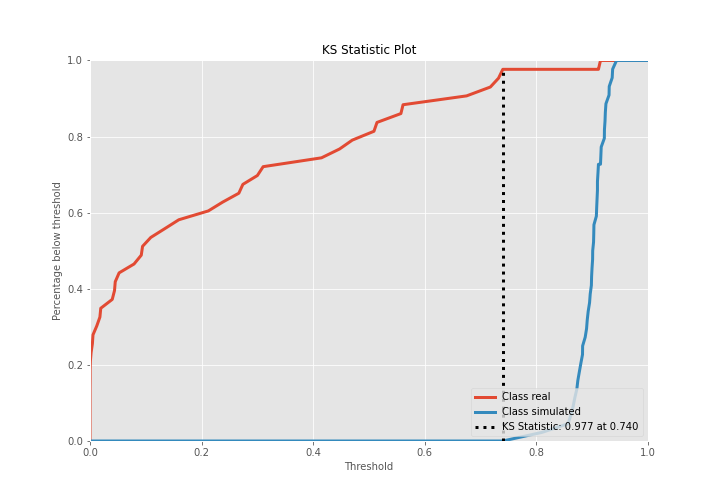
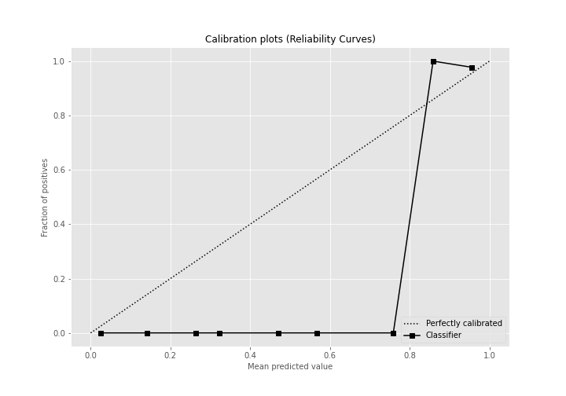

# Summary of 3_Linear

[<< Go back](../README.md)

## Logistic Regression (Linear)
- **n_jobs**: -1
- **explain_level**: 2

## Validation
 - **validation_type**: split
 - **train_ratio**: 0.75
 - **shuffle**: True
 - **stratify**: True

## Optimized metric
accuracy

## Training time

12.5 seconds

## Metric details
|           |    score |     threshold |
|:----------|---------:|--------------:|
| logloss   | 0.228171 | nan           |
| auc       | 0.983087 | nan           |
| f1        | 0.988764 |   0.791611    |
| accuracy  | 0.988506 |   0.791611    |
| precision | 1        |   0.917361    |
| recall    | 1        |   7.58353e-08 |
| mcc       | 0.977261 |   0.791611    |

## Confusion matrix (at threshold=0.791611)
|                      |   Predicted as real |   Predicted as simulated |
|:---------------------|--------------------:|-------------------------:|
| Labeled as real      |                  42 |                        1 |
| Labeled as simulated |                   0 |                       44 |

## Learning curves

## Coefficients
| feature                           |   Learner_1 |
|:----------------------------------|------------:|
| return_skew2                      |   0.940427  |
| return_autocorrelation_1_lag1     |   0.453186  |
| return_autocorrelation_2_lag1     |   0.428027  |
| return_autocorrelation_2_lag3     |   0.413858  |
| return_autocorrelation_2_lag2     |   0.405609  |
| sqreturn_correlation_ts2_lag_1    |   0.327416  |
| return_correlation_ts2_lag_1      |   0.327416  |
| return_correlation_ts1_lag_1      |   0.280889  |
| sqreturn_correlation_ts1_lag_1    |   0.280889  |
| sqreturn_correlation_ts2_lag_3    |   0.221366  |
| return_correlation_ts2_lag_3      |   0.221366  |
| return_skew1                      |   0.170632  |
| return_correlation_ts2_lag_2      |   0.165576  |
| sqreturn_correlation_ts2_lag_2    |   0.165576  |
| price2_granger_cause_price1       |   0.122333  |
| sqreturn_correlation_ts1_lag_3    |   0.116017  |
| return_correlation_ts1_lag_3      |   0.116017  |
| return_autocorrelation_1_lag2     |   0.111027  |
| return_correlation_ts1_lag_2      |   0.103929  |
| sqreturn_correlation_ts1_lag_2    |   0.103929  |
| return_autocorrelation_1_lag3     |   0.0672172 |
| return_sd1                        |  -0.168825  |
| return_correlation_ts1_lag_0      |  -0.178997  |
| sqreturn_correlation_ts1_lag_0    |  -0.178997  |
| return_mean1                      |  -0.186075  |
| return_sd2                        |  -0.371643  |
| return_mean2                      |  -0.452226  |
| price1_granger_cause_price2       |  -0.577587  |
| sqreturn_autocorrelation_ts1_lag3 |  -0.627553  |
| sqreturn_autocorrelation_ts2_lag3 |  -0.725809  |
| sqreturn_autocorrelation_ts2_lag2 |  -0.833736  |
| sqreturn_autocorrelation_ts2_lag1 |  -0.926601  |
| sqreturn_autocorrelation_ts1_lag1 |  -1.02317   |
| sqreturn_autocorrelation_ts1_lag2 |  -1.11465   |
| intercept                         |  -1.21707   |
| return_kurtosis2                  |  -3.35948   |
| return_kurtosis1                  |  -4.25847   |

## Permutation-based Importance

## Confusion Matrix

## Normalized Confusion Matrix

## ROC Curve

## Kolmogorov-Smirnov Statistic

## Precision-Recall Curve

## Calibration Curve

## Cumulative Gains Curve

## Lift Curve

## SHAP Importance

## SHAP Dependence plots

### Dependence (Fold 1)

## SHAP Decision plots

### Top-10 Worst decisions for class 0 (Fold 1)

### Top-10 Best decisions for class 0 (Fold 1)

### Top-10 Worst decisions for class 1 (Fold 1)

### Top-10 Best decisions for class 1 (Fold 1)

[<< Go back](../README.md)
