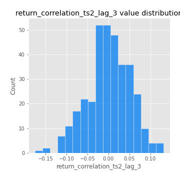

# Exploratory Data Analysis

[<< Go back](../README.md)
## Feature : target
- **Feature type** : categorical
- **Missing** : 0.0%
- **Unique** : 2
- **Count** :347
- **Unique** :2
- **Top** :simulated
- **Freq** :176

## Feature : return_mean1
- **Feature type** : continous
- **Missing** : 0.0%
- **Unique** : 347
- **Count** :347.0
- **Mean** :0.051754692050418195
- **Std** :0.07281485888588207
- **Min** :-0.17686457077756634
- **25%th Percentile** : 0.009325461350109886
- **50%th Percentile** : 0.052301949258172005
- **75%th Percentile** : 0.09096018428971735
- **Max** :0.3612366374600757

## Feature : return_mean2
- **Feature type** : continous
- **Missing** : 0.0%
- **Unique** : 347
- **Count** :347.0
- **Mean** :0.055178136962068344
- **Std** :0.09182175249361307
- **Min** :-0.24205418062825398
- **25%th Percentile** : -0.005699448225728774
- **50%th Percentile** : 0.056875843643821075
- **75%th Percentile** : 0.11350013692911977
- **Max** :0.45351262289956085

## Feature : return_sd1
- **Feature type** : continous
- **Missing** : 0.0%
- **Unique** : 347
- **Count** :347.0
- **Mean** :1.7164144770562442
- **Std** :0.5539901004295821
- **Min** :0.7620831696941981
- **25%th Percentile** : 1.5246353568880058
- **50%th Percentile** : 1.591733529106877
- **75%th Percentile** : 1.6929932853903618
- **Max** :5.996244884956102

## Feature : return_sd2
- **Feature type** : continous
- **Missing** : 0.0%
- **Unique** : 347
- **Count** :347.0
- **Mean** :1.7196276109759012
- **Std** :0.6188320575147052
- **Min** :0.8455946193085045
- **25%th Percentile** : 1.5274189360821246
- **50%th Percentile** : 1.5892722502596965
- **75%th Percentile** : 1.653249645212802
- **Max** :5.762808157208253

## Feature : return_skew1
- **Feature type** : continous
- **Missing** : 0.0%
- **Unique** : 347
- **Count** :347.0
- **Mean** :-0.07669088023966884
- **Std** :0.5596315261763927
- **Min** :-3.530116233761814
- **25%th Percentile** : -0.1563425437350639
- **50%th Percentile** : -0.018439368081566515
- **75%th Percentile** : 0.09552042540554569
- **Max** :2.5845963767725557

## Feature : return_skew2
- **Feature type** : continous
- **Missing** : 0.0%
- **Unique** : 347
- **Count** :347.0
- **Mean** :-0.1820437870312871
- **Std** :0.7900676867695767
- **Min** :-8.801502855292393
- **25%th Percentile** : -0.24205995684983467
- **50%th Percentile** : -0.056978776859732835
- **75%th Percentile** : 0.08356006303847274
- **Max** :2.123597625075353

## Feature : return_kurtosis1
- **Feature type** : continous
- **Missing** : 0.0%
- **Unique** : 347
- **Count** :347.0
- **Mean** :2.896939838671344
- **Std** :5.365575327067556
- **Min** :-0.39731581433631336
- **25%th Percentile** : -0.029610708274763198
- **50%th Percentile** : 0.4014434822797184
- **75%th Percentile** : 3.5326987255989466
- **Max** :31.614652972751188

## Feature : return_kurtosis2
- **Feature type** : continous
- **Missing** : 0.0%
- **Unique** : 347
- **Count** :347.0
- **Mean** :3.832275759733566
- **Std** :10.092276586186617
- **Min** :-0.4074120995187931
- **25%th Percentile** : -0.007584997699137119
- **50%th Percentile** : 0.5027584924384891
- **75%th Percentile** : 4.3612884611668505
- **Max** :143.10871011533666

## Feature : return_autocorrelation_1_lag1
- **Feature type** : continous
- **Missing** : 0.0%
- **Unique** : 347
- **Count** :347.0
- **Mean** :-0.012254844068142213
- **Std** :0.058885463161469885
- **Min** :-0.2135576224968752
- **25%th Percentile** : -0.04571797709113859
- **50%th Percentile** : -0.00574970023587355
- **75%th Percentile** : 0.02592601980416264
- **Max** :0.12810656890648087

## Feature : return_autocorrelation_1_lag2
- **Feature type** : continous
- **Missing** : 0.0%
- **Unique** : 347
- **Count** :347.0
- **Mean** :-0.005773641244257065
- **Std** :0.04828995927566376
- **Min** :-0.13309283796645122
- **25%th Percentile** : -0.03847251210960123
- **50%th Percentile** : -0.0036118734350910806
- **75%th Percentile** : 0.02508118637694043
- **Max** :0.1561488228015672

## Feature : return_autocorrelation_1_lag3
- **Feature type** : continous
- **Missing** : 0.0%
- **Unique** : 347
- **Count** :347.0
- **Mean** :-0.0043239800205262914
- **Std** :0.05320407895466449
- **Min** :-0.15806635192103805
- **25%th Percentile** : -0.038831974232205996
- **50%th Percentile** : -0.0037399346828342773
- **75%th Percentile** : 0.03411036411238788
- **Max** :0.12256105205231545

## Feature : return_autocorrelation_2_lag1
- **Feature type** : continous
- **Missing** : 0.0%
- **Unique** : 347
- **Count** :347.0
- **Mean** :-0.006463139093065908
- **Std** :0.06136660178514395
- **Min** :-0.25075531010123286
- **25%th Percentile** : -0.03691927683801462
- **50%th Percentile** : -0.0029870748996131424
- **75%th Percentile** : 0.031670133044633134
- **Max** :0.31863413537898483

## Feature : return_autocorrelation_2_lag2
- **Feature type** : continous
- **Missing** : 0.0%
- **Unique** : 347
- **Count** :347.0
- **Mean** :0.0029223093915291217
- **Std** :0.05117966843681122
- **Min** :-0.15323211089747296
- **25%th Percentile** : -0.03111369226208813
- **50%th Percentile** : 0.00232968168898049
- **75%th Percentile** : 0.037097523086012885
- **Max** :0.20974504043791217

## Feature : return_autocorrelation_2_lag3
- **Feature type** : continous
- **Missing** : 0.0%
- **Unique** : 347
- **Count** :347.0
- **Mean** :0.0012115637749590285
- **Std** :0.04930612571611695
- **Min** :-0.14200107169559698
- **25%th Percentile** : -0.03209282248501732
- **50%th Percentile** : 0.0014641031477040415
- **75%th Percentile** : 0.03487642523531918
- **Max** :0.1419999376914021

## Feature : return_correlation_ts1_lag_0
- **Feature type** : continous
- **Missing** : 0.0%
- **Unique** : 347
- **Count** :347.0
- **Mean** :0.32127715549537134
- **Std** :0.10436638539600873
- **Min** :-0.027089510445801036
- **25%th Percentile** : 0.2775048757251193
- **50%th Percentile** : 0.3264776981089774
- **75%th Percentile** : 0.3663087883160039
- **Max** :0.7041861626832071

## Feature : return_correlation_ts1_lag_1
- **Feature type** : continous
- **Missing** : 0.0%
- **Unique** : 347
- **Count** :347.0
- **Mean** :-0.007714884508391831
- **Std** :0.05008373553396033
- **Min** :-0.16985510949917193
- **25%th Percentile** : -0.03752822531210838
- **50%th Percentile** : -0.0018695109296376692
- **75%th Percentile** : 0.025718962749105966
- **Max** :0.11819480385322509

## Feature : return_correlation_ts1_lag_2
- **Feature type** : continous
- **Missing** : 0.0%
- **Unique** : 347
- **Count** :347.0
- **Mean** :0.0028344346126341125
- **Std** :0.04872148357936516
- **Min** :-0.21653581047581763
- **25%th Percentile** : -0.02585332487933174
- **50%th Percentile** : 0.004231113088337028
- **75%th Percentile** : 0.03773963612999533
- **Max** :0.10916944041387708

## Feature : return_correlation_ts1_lag_3
- **Feature type** : continous
- **Missing** : 0.0%
- **Unique** : 347
- **Count** :347.0
- **Mean** :-0.0012513540472722682
- **Std** :0.05007982625600526
- **Min** :-0.1270218498974763
- **25%th Percentile** : -0.035236245729674945
- **50%th Percentile** : -0.0018944668938554326
- **75%th Percentile** : 0.033080003930483645
- **Max** :0.1636773216468148

## Feature : return_correlation_ts2_lag_1
- **Feature type** : continous
- **Missing** : 0.0%
- **Unique** : 347
- **Count** :347.0
- **Mean** :-0.007028751044572141
- **Std** :0.05337976831348871
- **Min** :-0.2081139431093261
- **25%th Percentile** : -0.03646037672404334
- **50%th Percentile** : -0.006779065528909741
- **75%th Percentile** : 0.02669477071409667
- **Max** :0.11362582709757485

## Feature : return_correlation_ts2_lag_2
- **Feature type** : continous
- **Missing** : 0.0%
- **Unique** : 347
- **Count** :347.0
- **Mean** :-0.0006200677841621997
- **Std** :0.0505790421450972
- **Min** :-0.23751835475804678
- **25%th Percentile** : -0.03494775699885753
- **50%th Percentile** : 0.0003959128434386497
- **75%th Percentile** : 0.03311610800244754
- **Max** :0.20772887392904255

## Feature : return_correlation_ts2_lag_3
- **Feature type** : continous
- **Missing** : 0.0%
- **Unique** : 347
- **Count** :347.0
- **Mean** :-0.00046770416917672606
- **Std** :0.051965297146273244
- **Min** :-0.17564076057312866
- **25%th Percentile** : -0.030418137429744134
- **50%th Percentile** : -0.0007513723605027245
- **75%th Percentile** : 0.0358978211082525
- **Max** :0.13128380114518473

## Feature : sqreturn_autocorrelation_ts1_lag1
- **Feature type** : continous
- **Missing** : 0.0%
- **Unique** : 347
- **Count** :347.0
- **Mean** :0.049000983866400206
- **Std** :0.09069217944664226
- **Min** :-0.11069081360216657
- **25%th Percentile** : -0.008435977259149699
- **50%th Percentile** : 0.027526459453190984
- **75%th Percentile** : 0.08551843414560006
- **Max** :0.49414293176447355

## Feature : sqreturn_autocorrelation_ts1_lag2
- **Feature type** : continous
- **Missing** : 0.0%
- **Unique** : 347
- **Count** :347.0
- **Mean** :0.037794758454869196
- **Std** :0.09141511876998269
- **Min** :-0.11965652827172821
- **25%th Percentile** : -0.016985212185576658
- **50%th Percentile** : 0.013346386700580654
- **75%th Percentile** : 0.06510527068071117
- **Max** :0.540735851444759

## Feature : sqreturn_autocorrelation_ts1_lag3
- **Feature type** : continous
- **Missing** : 0.0%
- **Unique** : 347
- **Count** :347.0
- **Mean** :0.029421366319362954
- **Std** :0.0750272808738706
- **Min** :-0.09555971939717427
- **25%th Percentile** : -0.016279108668115348
- **50%th Percentile** : 0.012593715022244586
- **75%th Percentile** : 0.05779859015458809
- **Max** :0.3457940197475473

## Feature : sqreturn_autocorrelation_ts2_lag1
- **Feature type** : continous
- **Missing** : 0.0%
- **Unique** : 347
- **Count** :347.0
- **Mean** :0.04517558357183585
- **Std** :0.08709705219140786
- **Min** :-0.12705541846440782
- **25%th Percentile** : -0.008312693776822895
- **50%th Percentile** : 0.026888777106574537
- **75%th Percentile** : 0.07395600250557574
- **Max** :0.510085647437958

## Feature : sqreturn_autocorrelation_ts2_lag2
- **Feature type** : continous
- **Missing** : 0.0%
- **Unique** : 347
- **Count** :347.0
- **Mean** :0.037620202471581835
- **Std** :0.08336423930738758
- **Min** :-0.09976761556634581
- **25%th Percentile** : -0.010321397240553172
- **50%th Percentile** : 0.01698642553250617
- **75%th Percentile** : 0.057033099923109336
- **Max** :0.5373432415582473

## Feature : sqreturn_autocorrelation_ts2_lag3
- **Feature type** : continous
- **Missing** : 0.0%
- **Unique** : 347
- **Count** :347.0
- **Mean** :0.02676659223626925
- **Std** :0.06804109372157335
- **Min** :-0.10436941155428164
- **25%th Percentile** : -0.01708272691468882
- **50%th Percentile** : 0.016612205993699145
- **75%th Percentile** : 0.05072551628207648
- **Max** :0.31225727797735664

## Feature : sqreturn_correlation_ts1_lag_0
- **Feature type** : continous
- **Missing** : 0.0%
- **Unique** : 347
- **Count** :347.0
- **Mean** :0.32127715549537134
- **Std** :0.10436638539600873
- **Min** :-0.027089510445801036
- **25%th Percentile** : 0.2775048757251193
- **50%th Percentile** : 0.3264776981089774
- **75%th Percentile** : 0.3663087883160039
- **Max** :0.7041861626832071

## Feature : sqreturn_correlation_ts1_lag_1
- **Feature type** : continous
- **Missing** : 0.0%
- **Unique** : 347
- **Count** :347.0
- **Mean** :-0.007714884508391831
- **Std** :0.05008373553396033
- **Min** :-0.16985510949917193
- **25%th Percentile** : -0.03752822531210838
- **50%th Percentile** : -0.0018695109296376692
- **75%th Percentile** : 0.025718962749105966
- **Max** :0.11819480385322509

## Feature : sqreturn_correlation_ts1_lag_2
- **Feature type** : continous
- **Missing** : 0.0%
- **Unique** : 347
- **Count** :347.0
- **Mean** :0.0028344346126341125
- **Std** :0.04872148357936516
- **Min** :-0.21653581047581763
- **25%th Percentile** : -0.02585332487933174
- **50%th Percentile** : 0.004231113088337028
- **75%th Percentile** : 0.03773963612999533
- **Max** :0.10916944041387708

## Feature : sqreturn_correlation_ts1_lag_3
- **Feature type** : continous
- **Missing** : 0.0%
- **Unique** : 347
- **Count** :347.0
- **Mean** :-0.0012513540472722682
- **Std** :0.05007982625600526
- **Min** :-0.1270218498974763
- **25%th Percentile** : -0.035236245729674945
- **50%th Percentile** : -0.0018944668938554326
- **75%th Percentile** : 0.033080003930483645
- **Max** :0.1636773216468148

## Feature : sqreturn_correlation_ts2_lag_1
- **Feature type** : continous
- **Missing** : 0.0%
- **Unique** : 347
- **Count** :347.0
- **Mean** :-0.007028751044572141
- **Std** :0.05337976831348871
- **Min** :-0.2081139431093261
- **25%th Percentile** : -0.03646037672404334
- **50%th Percentile** : -0.006779065528909741
- **75%th Percentile** : 0.02669477071409667
- **Max** :0.11362582709757485

## Feature : sqreturn_correlation_ts2_lag_2
- **Feature type** : continous
- **Missing** : 0.0%
- **Unique** : 347
- **Count** :347.0
- **Mean** :-0.0006200677841621997
- **Std** :0.0505790421450972
- **Min** :-0.23751835475804678
- **25%th Percentile** : -0.03494775699885753
- **50%th Percentile** : 0.0003959128434386497
- **75%th Percentile** : 0.03311610800244754
- **Max** :0.20772887392904255

## Feature : sqreturn_correlation_ts2_lag_3
- **Feature type** : continous
- **Missing** : 0.0%
- **Unique** : 347
- **Count** :347.0
- **Mean** :-0.00046770416917672606
- **Std** :0.051965297146273244
- **Min** :-0.17564076057312866
- **25%th Percentile** : -0.030418137429744134
- **50%th Percentile** : -0.0007513723605027245
- **75%th Percentile** : 0.0358978211082525
- **Max** :0.13128380114518473

## Feature : price2_granger_cause_price1
- **Feature type** : continous
- **Missing** : 0.0%
- **Unique** : 347
- **Count** :347.0
- **Mean** :0.3170892616416778
- **Std** :0.2946184077593732
- **Min** :1.5118103101778138e-06
- **25%th Percentile** : 0.044454891104027366
- **50%th Percentile** : 0.23535832371206286
- **75%th Percentile** : 0.5311433801465453
- **Max** :0.9885712803689185

## Feature : price1_granger_cause_price2
- **Feature type** : continous
- **Missing** : 0.0%
- **Unique** : 347
- **Count** :347.0
- **Mean** :0.30358262388184615
- **Std** :0.282351473014133
- **Min** :2.1673274770370357e-06
- **25%th Percentile** : 0.04888393093370573
- **50%th Percentile** : 0.2176774341783571
- **75%th Percentile** : 0.5239522609631372
- **Max** :0.9992246035049978

[<< Go back](../README.md)
