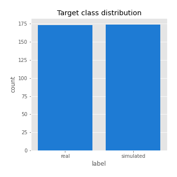
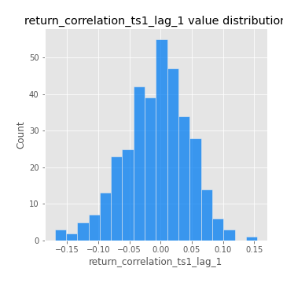

# Exploratory Data Analysis

[<< Go back](../README.md)
## Feature : target
- **Feature type** : categorical
- **Missing** : 0.0%
- **Unique** : 2
- **Count** :347
- **Unique** :2
- **Top** :simulated
- **Freq** :174

## Feature : return_mean1
- **Feature type** : continous
- **Missing** : 0.0%
- **Unique** : 347
- **Count** :347.0
- **Mean** :0.051173194224200406
- **Std** :0.0815398209772838
- **Min** :-0.22632637961920957
- **25%th Percentile** : 0.004005948851731984
- **50%th Percentile** : 0.0568732209979489
- **75%th Percentile** : 0.09976175582058205
- **Max** :0.37175100008111034

## Feature : return_mean2
- **Feature type** : continous
- **Missing** : 0.0%
- **Unique** : 347
- **Count** :347.0
- **Mean** :0.05745573238865765
- **Std** :0.08836638763934357
- **Min** :-0.24205418062825398
- **25%th Percentile** : 0.008500283037352719
- **50%th Percentile** : 0.05443053277736165
- **75%th Percentile** : 0.11162602880298067
- **Max** :0.37616608147096464

## Feature : return_sd1
- **Feature type** : continous
- **Missing** : 0.0%
- **Unique** : 347
- **Count** :347.0
- **Mean** :1.7658677740354065
- **Std** :0.753564354664402
- **Min** :0.7470080772831957
- **25%th Percentile** : 1.531411923585835
- **50%th Percentile** : 1.5964535091541217
- **75%th Percentile** : 1.7034863021232014
- **Max** :9.236766377527575

## Feature : return_sd2
- **Feature type** : continous
- **Missing** : 0.0%
- **Unique** : 347
- **Count** :347.0
- **Mean** :1.7558653279109038
- **Std** :0.666165612099179
- **Min** :0.8455946193085045
- **25%th Percentile** : 1.5105057171560095
- **50%th Percentile** : 1.5914551065686404
- **75%th Percentile** : 1.6774721930053467
- **Max** :5.872800253666788

## Feature : return_skew1
- **Feature type** : continous
- **Missing** : 0.0%
- **Unique** : 347
- **Count** :347.0
- **Mean** :-0.05446127967708024
- **Std** :0.580513593624752
- **Min** :-3.453087436558107
- **25%th Percentile** : -0.14190295095616626
- **50%th Percentile** : -0.010637317218515258
- **75%th Percentile** : 0.11667577938528628
- **Max** :2.5845963767725557

## Feature : return_skew2
- **Feature type** : continous
- **Missing** : 0.0%
- **Unique** : 347
- **Count** :347.0
- **Mean** :-0.17425452291965665
- **Std** :0.8120288685250567
- **Min** :-8.801502855292393
- **25%th Percentile** : -0.2476038621805744
- **50%th Percentile** : -0.053529466369567916
- **75%th Percentile** : 0.07887207344056141
- **Max** :2.2606839051517187

## Feature : return_kurtosis1
- **Feature type** : continous
- **Missing** : 0.0%
- **Unique** : 347
- **Count** :347.0
- **Mean** :3.1124536021579097
- **Std** :6.108967513238872
- **Min** :-0.5738270797956497
- **25%th Percentile** : -0.024718082128083685
- **50%th Percentile** : 0.543528339933733
- **75%th Percentile** : 3.601784904080982
- **Max** :46.07507808162177

## Feature : return_kurtosis2
- **Feature type** : continous
- **Missing** : 0.0%
- **Unique** : 347
- **Count** :347.0
- **Mean** :3.8115263851720402
- **Std** :10.369145180711602
- **Min** :-0.46881996927979985
- **25%th Percentile** : -0.008294671936878606
- **50%th Percentile** : 0.5936617182652233
- **75%th Percentile** : 4.042224598652708
- **Max** :143.10871011533666

## Feature : return_autocorrelation_1_lag1
- **Feature type** : continous
- **Missing** : 0.0%
- **Unique** : 347
- **Count** :347.0
- **Mean** :-0.010493913889156669
- **Std** :0.05580160054041498
- **Min** :-0.2135576224968752
- **25%th Percentile** : -0.04200601385557452
- **50%th Percentile** : -0.0036038998825459814
- **75%th Percentile** : 0.023902415928454747
- **Max** :0.1253959753011446

## Feature : return_autocorrelation_1_lag2
- **Feature type** : continous
- **Missing** : 0.0%
- **Unique** : 347
- **Count** :347.0
- **Mean** :-0.0079602071848854
- **Std** :0.04829026629786718
- **Min** :-0.13309283796645122
- **25%th Percentile** : -0.03887892150695759
- **50%th Percentile** : -0.008264133744369767
- **75%th Percentile** : 0.02245221677744142
- **Max** :0.1561488228015672

## Feature : return_autocorrelation_1_lag3
- **Feature type** : continous
- **Missing** : 0.0%
- **Unique** : 347
- **Count** :347.0
- **Mean** :-0.0027136299329034858
- **Std** :0.05034780190658191
- **Min** :-0.15806635192103805
- **25%th Percentile** : -0.03618712744686049
- **50%th Percentile** : -0.0037399346828342773
- **75%th Percentile** : 0.03196239267216361
- **Max** :0.12325615356842738

## Feature : return_autocorrelation_2_lag1
- **Feature type** : continous
- **Missing** : 0.0%
- **Unique** : 347
- **Count** :347.0
- **Mean** :-0.00290602112441933
- **Std** :0.061337650467326484
- **Min** :-0.25075531010123286
- **25%th Percentile** : -0.03613080011495033
- **50%th Percentile** : 0.0005794333293306052
- **75%th Percentile** : 0.035025385035669855
- **Max** :0.31863413537898483

## Feature : return_autocorrelation_2_lag2
- **Feature type** : continous
- **Missing** : 0.0%
- **Unique** : 347
- **Count** :347.0
- **Mean** :0.0024933881194605127
- **Std** :0.05173874595972318
- **Min** :-0.1495113937562178
- **25%th Percentile** : -0.03279094646816604
- **50%th Percentile** : 0.0019331227939847727
- **75%th Percentile** : 0.03557665327403917
- **Max** :0.20974504043791217

## Feature : return_autocorrelation_2_lag3
- **Feature type** : continous
- **Missing** : 0.0%
- **Unique** : 347
- **Count** :347.0
- **Mean** :0.001515993021675609
- **Std** :0.04908720234366627
- **Min** :-0.14200107169559698
- **25%th Percentile** : -0.028501422040691633
- **50%th Percentile** : 0.001168038911395616
- **75%th Percentile** : 0.03448165138320812
- **Max** :0.1419999376914021

## Feature : return_correlation_ts1_lag_0
- **Feature type** : continous
- **Missing** : 0.0%
- **Unique** : 347
- **Count** :347.0
- **Mean** :0.32169245026646537
- **Std** :0.11008544718181333
- **Min** :-0.027089510445801036
- **25%th Percentile** : 0.2753022928099559
- **50%th Percentile** : 0.32274495662150093
- **75%th Percentile** : 0.3659615764795454
- **Max** :0.7041861626832071

## Feature : return_correlation_ts1_lag_1
- **Feature type** : continous
- **Missing** : 0.0%
- **Unique** : 347
- **Count** :347.0
- **Mean** :-0.0071507415790553475
- **Std** :0.05166763068382051
- **Min** :-0.16985510949917193
- **25%th Percentile** : -0.039025384578158066
- **50%th Percentile** : -0.003641482989124893
- **75%th Percentile** : 0.027417088376009986
- **Max** :0.15499424718508623

## Feature : return_correlation_ts1_lag_2
- **Feature type** : continous
- **Missing** : 0.0%
- **Unique** : 347
- **Count** :347.0
- **Mean** :-0.00022020893853719976
- **Std** :0.047518053127324926
- **Min** :-0.21653581047581763
- **25%th Percentile** : -0.03205203974452111
- **50%th Percentile** : 0.0005518114992432347
- **75%th Percentile** : 0.033753909325465375
- **Max** :0.11523432515003149

## Feature : return_correlation_ts1_lag_3
- **Feature type** : continous
- **Missing** : 0.0%
- **Unique** : 347
- **Count** :347.0
- **Mean** :-0.00020578493826485766
- **Std** :0.05080384932805849
- **Min** :-0.162522403274679
- **25%th Percentile** : -0.032875082678532445
- **50%th Percentile** : 0.0015825898660981898
- **75%th Percentile** : 0.03217665724485953
- **Max** :0.1422809271770942

## Feature : return_correlation_ts2_lag_1
- **Feature type** : continous
- **Missing** : 0.0%
- **Unique** : 347
- **Count** :347.0
- **Mean** :-0.003086768436774845
- **Std** :0.05096490302263799
- **Min** :-0.2081139431093261
- **25%th Percentile** : -0.036566694464687494
- **50%th Percentile** : -0.001993654631531046
- **75%th Percentile** : 0.03129453255989506
- **Max** :0.17208763791364762

## Feature : return_correlation_ts2_lag_2
- **Feature type** : continous
- **Missing** : 0.0%
- **Unique** : 347
- **Count** :347.0
- **Mean** :0.0016414065843182383
- **Std** :0.05050892402282239
- **Min** :-0.23751835475804678
- **25%th Percentile** : -0.03014507697524319
- **50%th Percentile** : 0.0017491615307276315
- **75%th Percentile** : 0.032199862140710064
- **Max** :0.20772887392904255

## Feature : return_correlation_ts2_lag_3
- **Feature type** : continous
- **Missing** : 0.0%
- **Unique** : 347
- **Count** :347.0
- **Mean** :0.0005934903387142336
- **Std** :0.05022501494765294
- **Min** :-0.17564076057312866
- **25%th Percentile** : -0.027380723419256
- **50%th Percentile** : -0.0006673542034418449
- **75%th Percentile** : 0.03343000688333422
- **Max** :0.13128380114518473

## Feature : sqreturn_autocorrelation_ts1_lag1
- **Feature type** : continous
- **Missing** : 0.0%
- **Unique** : 347
- **Count** :347.0
- **Mean** :0.045754309104799565
- **Std** :0.09011482100165119
- **Min** :-0.10142408446193991
- **25%th Percentile** : -0.012100931150511047
- **50%th Percentile** : 0.026043216889428015
- **75%th Percentile** : 0.08119083388976021
- **Max** :0.49414293176447355

## Feature : sqreturn_autocorrelation_ts1_lag2
- **Feature type** : continous
- **Missing** : 0.0%
- **Unique** : 347
- **Count** :347.0
- **Mean** :0.03946459630167166
- **Std** :0.08822642645173083
- **Min** :-0.12332001359773716
- **25%th Percentile** : -0.012961280414297473
- **50%th Percentile** : 0.01626135840334948
- **75%th Percentile** : 0.0661901525911979
- **Max** :0.540735851444759

## Feature : sqreturn_autocorrelation_ts1_lag3
- **Feature type** : continous
- **Missing** : 0.0%
- **Unique** : 347
- **Count** :347.0
- **Mean** :0.036436171088935494
- **Std** :0.07516790434767029
- **Min** :-0.10070432865544568
- **25%th Percentile** : -0.010701548276410781
- **50%th Percentile** : 0.01822420319540782
- **75%th Percentile** : 0.06302625843491666
- **Max** :0.3457940197475473

## Feature : sqreturn_autocorrelation_ts2_lag1
- **Feature type** : continous
- **Missing** : 0.0%
- **Unique** : 347
- **Count** :347.0
- **Mean** :0.04936419806350414
- **Std** :0.08902215217838218
- **Min** :-0.0959451865695075
- **25%th Percentile** : -0.008085902941750071
- **50%th Percentile** : 0.02971261996037903
- **75%th Percentile** : 0.08825199666712785
- **Max** :0.510085647437958

## Feature : sqreturn_autocorrelation_ts2_lag2
- **Feature type** : continous
- **Missing** : 0.0%
- **Unique** : 347
- **Count** :347.0
- **Mean** :0.03675668829091636
- **Std** :0.08576632521723322
- **Min** :-0.11687588446812615
- **25%th Percentile** : -0.012680424269448458
- **50%th Percentile** : 0.017882055724033695
- **75%th Percentile** : 0.05722030548087261
- **Max** :0.5373432415582473

## Feature : sqreturn_autocorrelation_ts2_lag3
- **Feature type** : continous
- **Missing** : 0.0%
- **Unique** : 347
- **Count** :347.0
- **Mean** :0.025680883490294373
- **Std** :0.06941152870628901
- **Min** :-0.1186111847060049
- **25%th Percentile** : -0.020170637576724645
- **50%th Percentile** : 0.01478761655875294
- **75%th Percentile** : 0.056544416705374856
- **Max** :0.31225727797735664

## Feature : sqreturn_correlation_ts1_lag_0
- **Feature type** : continous
- **Missing** : 0.0%
- **Unique** : 347
- **Count** :347.0
- **Mean** :0.32169245026646537
- **Std** :0.11008544718181333
- **Min** :-0.027089510445801036
- **25%th Percentile** : 0.2753022928099559
- **50%th Percentile** : 0.32274495662150093
- **75%th Percentile** : 0.3659615764795454
- **Max** :0.7041861626832071

## Feature : sqreturn_correlation_ts1_lag_1
- **Feature type** : continous
- **Missing** : 0.0%
- **Unique** : 347
- **Count** :347.0
- **Mean** :-0.0071507415790553475
- **Std** :0.05166763068382051
- **Min** :-0.16985510949917193
- **25%th Percentile** : -0.039025384578158066
- **50%th Percentile** : -0.003641482989124893
- **75%th Percentile** : 0.027417088376009986
- **Max** :0.15499424718508623

## Feature : sqreturn_correlation_ts1_lag_2
- **Feature type** : continous
- **Missing** : 0.0%
- **Unique** : 347
- **Count** :347.0
- **Mean** :-0.00022020893853719976
- **Std** :0.047518053127324926
- **Min** :-0.21653581047581763
- **25%th Percentile** : -0.03205203974452111
- **50%th Percentile** : 0.0005518114992432347
- **75%th Percentile** : 0.033753909325465375
- **Max** :0.11523432515003149

## Feature : sqreturn_correlation_ts1_lag_3
- **Feature type** : continous
- **Missing** : 0.0%
- **Unique** : 347
- **Count** :347.0
- **Mean** :-0.00020578493826485766
- **Std** :0.05080384932805849
- **Min** :-0.162522403274679
- **25%th Percentile** : -0.032875082678532445
- **50%th Percentile** : 0.0015825898660981898
- **75%th Percentile** : 0.03217665724485953
- **Max** :0.1422809271770942

## Feature : sqreturn_correlation_ts2_lag_1
- **Feature type** : continous
- **Missing** : 0.0%
- **Unique** : 347
- **Count** :347.0
- **Mean** :-0.003086768436774845
- **Std** :0.05096490302263799
- **Min** :-0.2081139431093261
- **25%th Percentile** : -0.036566694464687494
- **50%th Percentile** : -0.001993654631531046
- **75%th Percentile** : 0.03129453255989506
- **Max** :0.17208763791364762

## Feature : sqreturn_correlation_ts2_lag_2
- **Feature type** : continous
- **Missing** : 0.0%
- **Unique** : 347
- **Count** :347.0
- **Mean** :0.0016414065843182383
- **Std** :0.05050892402282239
- **Min** :-0.23751835475804678
- **25%th Percentile** : -0.03014507697524319
- **50%th Percentile** : 0.0017491615307276315
- **75%th Percentile** : 0.032199862140710064
- **Max** :0.20772887392904255

## Feature : sqreturn_correlation_ts2_lag_3
- **Feature type** : continous
- **Missing** : 0.0%
- **Unique** : 347
- **Count** :347.0
- **Mean** :0.0005934903387142336
- **Std** :0.05022501494765294
- **Min** :-0.17564076057312866
- **25%th Percentile** : -0.027380723419256
- **50%th Percentile** : -0.0006673542034418449
- **75%th Percentile** : 0.03343000688333422
- **Max** :0.13128380114518473

## Feature : price2_granger_cause_price1
- **Feature type** : continous
- **Missing** : 0.0%
- **Unique** : 347
- **Count** :347.0
- **Mean** :0.34644931319027644
- **Std** :0.29869651226051624
- **Min** :1.1505642493585304e-05
- **25%th Percentile** : 0.07215198111900023
- **50%th Percentile** : 0.2805319534912962
- **75%th Percentile** : 0.5867707929575647
- **Max** :0.9956239169479897

## Feature : price1_granger_cause_price2
- **Feature type** : continous
- **Missing** : 0.0%
- **Unique** : 347
- **Count** :347.0
- **Mean** :0.28778373934283114
- **Std** :0.28319434167670887
- **Min** :7.864083144500261e-08
- **25%th Percentile** : 0.02802807408785072
- **50%th Percentile** : 0.22123400266911883
- **75%th Percentile** : 0.46450484238877304
- **Max** :0.9951398266867577

[<< Go back](../README.md)
