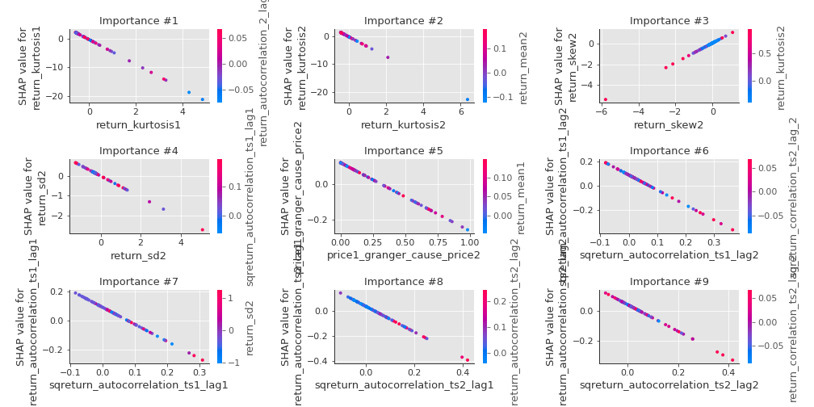

# Summary of 3_Linear

[<< Go back](../README.md)

## Logistic Regression (Linear)
- **n_jobs**: -1
- **explain_level**: 2

## Validation
 - **validation_type**: split
 - **train_ratio**: 0.75
 - **shuffle**: True
 - **stratify**: True

## Optimized metric
accuracy

## Training time

14.5 seconds

## Metric details
|           |    score |    threshold |
|:----------|---------:|-------------:|
| logloss   | 0.12504  | nan          |
| auc       | 1        | nan          |
| f1        | 0.988764 |   0.47224    |
| accuracy  | 0.988506 |   0.47224    |
| precision | 1        |   0.86206    |
| recall    | 1        |   2.9235e-13 |
| mcc       | 0.977261 |   0.47224    |

## Confusion matrix (at threshold=0.47224)
|                      |   Predicted as real |   Predicted as simulated |
|:---------------------|--------------------:|-------------------------:|
| Labeled as real      |                  42 |                        1 |
| Labeled as simulated |                   0 |                       44 |

## Learning curves

## Coefficients
| feature                           |   Learner_1 |
|:----------------------------------|------------:|
| return_skew2                      |   0.950309  |
| return_autocorrelation_2_lag1     |   0.343337  |
| sqreturn_correlation_ts2_lag_3    |   0.240929  |
| return_correlation_ts2_lag_3      |   0.240929  |
| sqreturn_correlation_ts2_lag_1    |   0.210874  |
| return_correlation_ts2_lag_1      |   0.210874  |
| return_autocorrelation_2_lag3     |   0.168645  |
| return_autocorrelation_1_lag2     |   0.166713  |
| return_correlation_ts1_lag_2      |   0.163066  |
| sqreturn_correlation_ts1_lag_2    |   0.163066  |
| return_correlation_ts1_lag_3      |   0.12587   |
| sqreturn_correlation_ts1_lag_3    |   0.12587   |
| sqreturn_correlation_ts2_lag_2    |   0.106939  |
| return_correlation_ts2_lag_2      |   0.106939  |
| return_skew1                      |   0.103673  |
| return_autocorrelation_2_lag2     |   0.0965601 |
| return_correlation_ts1_lag_1      |   0.0760303 |
| sqreturn_correlation_ts1_lag_1    |   0.0760303 |
| return_autocorrelation_1_lag1     |   0.0399908 |
| return_correlation_ts1_lag_0      |   0.036825  |
| sqreturn_correlation_ts1_lag_0    |   0.036825  |
| return_sd1                        |  -0.0125322 |
| return_autocorrelation_1_lag3     |  -0.0146802 |
| price2_granger_cause_price1       |  -0.0452243 |
| return_mean1                      |  -0.235269  |
| return_mean2                      |  -0.271921  |
| price1_granger_cause_price2       |  -0.38638   |
| sqreturn_autocorrelation_ts2_lag3 |  -0.507991  |
| return_sd2                        |  -0.534965  |
| sqreturn_autocorrelation_ts2_lag2 |  -0.876699  |
| sqreturn_autocorrelation_ts1_lag3 |  -0.8843    |
| sqreturn_autocorrelation_ts2_lag1 |  -1.03391   |
| sqreturn_autocorrelation_ts1_lag1 |  -1.18067   |
| sqreturn_autocorrelation_ts1_lag2 |  -1.23141   |
| intercept                         |  -1.49646   |
| return_kurtosis2                  |  -3.53568   |
| return_kurtosis1                  |  -4.25813   |

## Permutation-based Importance

## Confusion Matrix

## Normalized Confusion Matrix

## ROC Curve

## Kolmogorov-Smirnov Statistic

## Precision-Recall Curve

## Calibration Curve

## Cumulative Gains Curve

## Lift Curve

## SHAP Importance

## SHAP Dependence plots

### Dependence (Fold 1)

## SHAP Decision plots

### Top-10 Worst decisions for class 0 (Fold 1)

### Top-10 Best decisions for class 0 (Fold 1)

### Top-10 Worst decisions for class 1 (Fold 1)

### Top-10 Best decisions for class 1 (Fold 1)

[<< Go back](../README.md)
