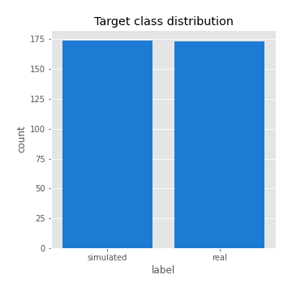
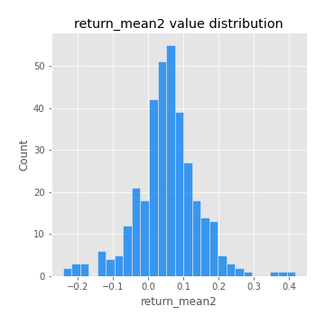
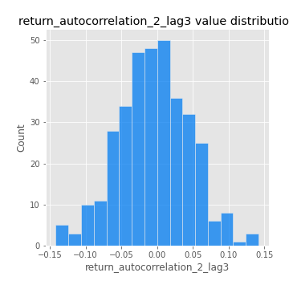

# Exploratory Data Analysis

[<< Go back](../README.md)
## Feature : target
- **Feature type** : categorical
- **Missing** : 0.0%
- **Unique** : 2
- **Count** :347
- **Unique** :2
- **Top** :simulated
- **Freq** :174

## Feature : return_mean1
- **Feature type** : continous
- **Missing** : 0.0%
- **Unique** : 347
- **Count** :347.0
- **Mean** :0.04659775745321684
- **Std** :0.07559698148619146
- **Min** :-0.22632637961920957
- **25%th Percentile** : 0.0012395762797351496
- **50%th Percentile** : 0.04734499663789314
- **75%th Percentile** : 0.09117887790485679
- **Max** :0.37175100008111034

## Feature : return_mean2
- **Feature type** : continous
- **Missing** : 0.0%
- **Unique** : 347
- **Count** :347.0
- **Mean** :0.05390603323967132
- **Std** :0.08881597542347115
- **Min** :-0.24205418062825398
- **25%th Percentile** : 0.011583736894355035
- **50%th Percentile** : 0.05516611444454279
- **75%th Percentile** : 0.09893564028884196
- **Max** :0.41747366257161356

## Feature : return_sd1
- **Feature type** : continous
- **Missing** : 0.0%
- **Unique** : 347
- **Count** :347.0
- **Mean** :1.7646915173986566
- **Std** :0.7301699462667537
- **Min** :0.7470080772831957
- **25%th Percentile** : 1.5375876336701042
- **50%th Percentile** : 1.6047068731507226
- **75%th Percentile** : 1.7049550609238837
- **Max** :9.236766377527575

## Feature : return_sd2
- **Feature type** : continous
- **Missing** : 0.0%
- **Unique** : 347
- **Count** :347.0
- **Mean** :1.7994206935091468
- **Std** :0.7528671725585192
- **Min** :0.8455946193085045
- **25%th Percentile** : 1.5338661629511958
- **50%th Percentile** : 1.5998490284914129
- **75%th Percentile** : 1.7120228265448767
- **Max** :6.737618636746393

## Feature : return_skew1
- **Feature type** : continous
- **Missing** : 0.0%
- **Unique** : 347
- **Count** :347.0
- **Mean** :-0.09721870022510218
- **Std** :0.5844425580569725
- **Min** :-3.530116233761814
- **25%th Percentile** : -0.17874210249859007
- **50%th Percentile** : -0.02708916911102374
- **75%th Percentile** : 0.08006239712584298
- **Max** :2.5845963767725557

## Feature : return_skew2
- **Feature type** : continous
- **Missing** : 0.0%
- **Unique** : 347
- **Count** :347.0
- **Mean** :-0.17047741958709392
- **Std** :0.821644088031625
- **Min** :-8.801502855292393
- **25%th Percentile** : -0.2452968390621972
- **50%th Percentile** : -0.033476742749552646
- **75%th Percentile** : 0.08860564007626709
- **Max** :2.2606839051517187

## Feature : return_kurtosis1
- **Feature type** : continous
- **Missing** : 0.0%
- **Unique** : 347
- **Count** :347.0
- **Mean** :3.1649629803141233
- **Std** :5.946213768749675
- **Min** :-0.46509505755950986
- **25%th Percentile** : -0.03301408488919444
- **50%th Percentile** : 0.5895212451733518
- **75%th Percentile** : 3.6512465710229476
- **Max** :36.91113889081053

## Feature : return_kurtosis2
- **Feature type** : continous
- **Missing** : 0.0%
- **Unique** : 347
- **Count** :347.0
- **Mean** :3.9305395181789287
- **Std** :10.140579676017639
- **Min** :-0.43859872859211313
- **25%th Percentile** : -0.009970678859462012
- **50%th Percentile** : 0.5406596273586755
- **75%th Percentile** : 4.466753057909188
- **Max** :143.10871011533666

## Feature : return_autocorrelation_1_lag1
- **Feature type** : continous
- **Missing** : 0.0%
- **Unique** : 347
- **Count** :347.0
- **Mean** :-0.013754163867156277
- **Std** :0.056757141601442955
- **Min** :-0.2135576224968752
- **25%th Percentile** : -0.0434608633804746
- **50%th Percentile** : -0.0073825539194493014
- **75%th Percentile** : 0.022202296811346774
- **Max** :0.12810656890648087

## Feature : return_autocorrelation_1_lag2
- **Feature type** : continous
- **Missing** : 0.0%
- **Unique** : 347
- **Count** :347.0
- **Mean** :-0.008180269389976048
- **Std** :0.052125919605996926
- **Min** :-0.15148240088801437
- **25%th Percentile** : -0.040645643725550296
- **50%th Percentile** : -0.008430642873500264
- **75%th Percentile** : 0.024995555614507982
- **Max** :0.1561488228015672

## Feature : return_autocorrelation_1_lag3
- **Feature type** : continous
- **Missing** : 0.0%
- **Unique** : 347
- **Count** :347.0
- **Mean** :-0.004783203054073859
- **Std** :0.05419791447657715
- **Min** :-0.1940836867390813
- **25%th Percentile** : -0.04213216833168088
- **50%th Percentile** : -0.0019042964578284448
- **75%th Percentile** : 0.032832156305385454
- **Max** :0.17805869530681923

## Feature : return_autocorrelation_2_lag1
- **Feature type** : continous
- **Missing** : 0.0%
- **Unique** : 347
- **Count** :347.0
- **Mean** :-0.008086391829418954
- **Std** :0.06378382089705478
- **Min** :-0.25075531010123286
- **25%th Percentile** : -0.040920181329551115
- **50%th Percentile** : -0.005938424014338073
- **75%th Percentile** : 0.031262596602094454
- **Max** :0.31863413537898483

## Feature : return_autocorrelation_2_lag2
- **Feature type** : continous
- **Missing** : 0.0%
- **Unique** : 347
- **Count** :347.0
- **Mean** :-0.000929809823212815
- **Std** :0.050697682217759284
- **Min** :-0.15323211089747296
- **25%th Percentile** : -0.03296605404696924
- **50%th Percentile** : -0.0019786601520114383
- **75%th Percentile** : 0.03178092375459153
- **Max** :0.20974504043791217

## Feature : return_autocorrelation_2_lag3
- **Feature type** : continous
- **Missing** : 0.0%
- **Unique** : 347
- **Count** :347.0
- **Mean** :-0.005435522116836561
- **Std** :0.05020082530912895
- **Min** :-0.14200107169559698
- **25%th Percentile** : -0.038586673491848994
- **50%th Percentile** : -0.00583522163450479
- **75%th Percentile** : 0.027643384917356656
- **Max** :0.1419999376914021

## Feature : return_correlation_ts1_lag_0
- **Feature type** : continous
- **Missing** : 0.0%
- **Unique** : 347
- **Count** :347.0
- **Mean** :0.32551926865880787
- **Std** :0.10960590458689742
- **Min** :0.005136598099876001
- **25%th Percentile** : 0.26834029522546415
- **50%th Percentile** : 0.33073707099367017
- **75%th Percentile** : 0.37272835414662364
- **Max** :0.7041861626832071

## Feature : return_correlation_ts1_lag_1
- **Feature type** : continous
- **Missing** : 0.0%
- **Unique** : 347
- **Count** :347.0
- **Mean** :-0.007192276392793651
- **Std** :0.05216302896776763
- **Min** :-0.16985510949917193
- **25%th Percentile** : -0.03921882591529696
- **50%th Percentile** : -0.0065776061526431175
- **75%th Percentile** : 0.028226317060900466
- **Max** :0.15499424718508623

## Feature : return_correlation_ts1_lag_2
- **Feature type** : continous
- **Missing** : 0.0%
- **Unique** : 347
- **Count** :347.0
- **Mean** :-0.0014794976481217555
- **Std** :0.049458733381096784
- **Min** :-0.21653581047581763
- **25%th Percentile** : -0.03345406388950995
- **50%th Percentile** : -0.0038537794177983488
- **75%th Percentile** : 0.03577225233171302
- **Max** :0.12016655800903414

## Feature : return_correlation_ts1_lag_3
- **Feature type** : continous
- **Missing** : 0.0%
- **Unique** : 347
- **Count** :347.0
- **Mean** :-0.0024778778828063
- **Std** :0.05459044461255563
- **Min** :-0.14760103676107986
- **25%th Percentile** : -0.04070849909297683
- **50%th Percentile** : -0.0037163223168421252
- **75%th Percentile** : 0.03450664505736821
- **Max** :0.1636773216468148

## Feature : return_correlation_ts2_lag_1
- **Feature type** : continous
- **Missing** : 0.0%
- **Unique** : 347
- **Count** :347.0
- **Mean** :-0.008923391814549278
- **Std** :0.05313500300315781
- **Min** :-0.20093919236581337
- **25%th Percentile** : -0.046346094825412215
- **50%th Percentile** : -0.009808558533080712
- **75%th Percentile** : 0.02486735545805983
- **Max** :0.17208763791364762

## Feature : return_correlation_ts2_lag_2
- **Feature type** : continous
- **Missing** : 0.0%
- **Unique** : 347
- **Count** :347.0
- **Mean** :-0.0014351370580404357
- **Std** :0.04965265930924815
- **Min** :-0.23751835475804678
- **25%th Percentile** : -0.03469411341013971
- **50%th Percentile** : -0.0022056445681773416
- **75%th Percentile** : 0.02673004624621271
- **Max** :0.20772887392904255

## Feature : return_correlation_ts2_lag_3
- **Feature type** : continous
- **Missing** : 0.0%
- **Unique** : 347
- **Count** :347.0
- **Mean** :-0.004383104633149684
- **Std** :0.05376620836181288
- **Min** :-0.17564076057312866
- **25%th Percentile** : -0.03527409396508897
- **50%th Percentile** : -0.0031909499053475194
- **75%th Percentile** : 0.02675156569432781
- **Max** :0.132026672285013

## Feature : sqreturn_autocorrelation_ts1_lag1
- **Feature type** : continous
- **Missing** : 0.0%
- **Unique** : 347
- **Count** :347.0
- **Mean** :0.05314948942762223
- **Std** :0.09485865104032938
- **Min** :-0.08700568295072436
- **25%th Percentile** : -0.009783992637905704
- **50%th Percentile** : 0.0312896276267799
- **75%th Percentile** : 0.08734031096560474
- **Max** :0.4439086285737898

## Feature : sqreturn_autocorrelation_ts1_lag2
- **Feature type** : continous
- **Missing** : 0.0%
- **Unique** : 347
- **Count** :347.0
- **Mean** :0.04858156269497968
- **Std** :0.09561273676994447
- **Min** :-0.09256548078470686
- **25%th Percentile** : -0.008707336557763096
- **50%th Percentile** : 0.019026525573813947
- **75%th Percentile** : 0.07112163628868673
- **Max** :0.540735851444759

## Feature : sqreturn_autocorrelation_ts1_lag3
- **Feature type** : continous
- **Missing** : 0.0%
- **Unique** : 347
- **Count** :347.0
- **Mean** :0.03542545690783192
- **Std** :0.08322937964832927
- **Min** :-0.105059998446823
- **25%th Percentile** : -0.015581536346854916
- **50%th Percentile** : 0.014017435951481198
- **75%th Percentile** : 0.062304227125142705
- **Max** :0.44755937369538146

## Feature : sqreturn_autocorrelation_ts2_lag1
- **Feature type** : continous
- **Missing** : 0.0%
- **Unique** : 347
- **Count** :347.0
- **Mean** :0.0428387645093042
- **Std** :0.0852167416096626
- **Min** :-0.15253791394850016
- **25%th Percentile** : -0.009363536122291748
- **50%th Percentile** : 0.024160072765343706
- **75%th Percentile** : 0.07391895622826458
- **Max** :0.4190090519891419

## Feature : sqreturn_autocorrelation_ts2_lag2
- **Feature type** : continous
- **Missing** : 0.0%
- **Unique** : 347
- **Count** :347.0
- **Mean** :0.038556948581598985
- **Std** :0.09169017914103421
- **Min** :-0.10985342400509995
- **25%th Percentile** : -0.012629480160282276
- **50%th Percentile** : 0.01515060581884224
- **75%th Percentile** : 0.056455985722211
- **Max** :0.5373432415582473

## Feature : sqreturn_autocorrelation_ts2_lag3
- **Feature type** : continous
- **Missing** : 0.0%
- **Unique** : 347
- **Count** :347.0
- **Mean** :0.02894834077736209
- **Std** :0.07054231403926883
- **Min** :-0.09996008551842205
- **25%th Percentile** : -0.014306027160360375
- **50%th Percentile** : 0.01376351017306938
- **75%th Percentile** : 0.055137853683781865
- **Max** :0.31225727797735664

## Feature : sqreturn_correlation_ts1_lag_0
- **Feature type** : continous
- **Missing** : 0.0%
- **Unique** : 347
- **Count** :347.0
- **Mean** :0.32551926865880787
- **Std** :0.10960590458689742
- **Min** :0.005136598099876001
- **25%th Percentile** : 0.26834029522546415
- **50%th Percentile** : 0.33073707099367017
- **75%th Percentile** : 0.37272835414662364
- **Max** :0.7041861626832071

## Feature : sqreturn_correlation_ts1_lag_1
- **Feature type** : continous
- **Missing** : 0.0%
- **Unique** : 347
- **Count** :347.0
- **Mean** :-0.007192276392793651
- **Std** :0.05216302896776763
- **Min** :-0.16985510949917193
- **25%th Percentile** : -0.03921882591529696
- **50%th Percentile** : -0.0065776061526431175
- **75%th Percentile** : 0.028226317060900466
- **Max** :0.15499424718508623

## Feature : sqreturn_correlation_ts1_lag_2
- **Feature type** : continous
- **Missing** : 0.0%
- **Unique** : 347
- **Count** :347.0
- **Mean** :-0.0014794976481217555
- **Std** :0.049458733381096784
- **Min** :-0.21653581047581763
- **25%th Percentile** : -0.03345406388950995
- **50%th Percentile** : -0.0038537794177983488
- **75%th Percentile** : 0.03577225233171302
- **Max** :0.12016655800903414

## Feature : sqreturn_correlation_ts1_lag_3
- **Feature type** : continous
- **Missing** : 0.0%
- **Unique** : 347
- **Count** :347.0
- **Mean** :-0.0024778778828063
- **Std** :0.05459044461255563
- **Min** :-0.14760103676107986
- **25%th Percentile** : -0.04070849909297683
- **50%th Percentile** : -0.0037163223168421252
- **75%th Percentile** : 0.03450664505736821
- **Max** :0.1636773216468148

## Feature : sqreturn_correlation_ts2_lag_1
- **Feature type** : continous
- **Missing** : 0.0%
- **Unique** : 347
- **Count** :347.0
- **Mean** :-0.008923391814549278
- **Std** :0.05313500300315781
- **Min** :-0.20093919236581337
- **25%th Percentile** : -0.046346094825412215
- **50%th Percentile** : -0.009808558533080712
- **75%th Percentile** : 0.02486735545805983
- **Max** :0.17208763791364762

## Feature : sqreturn_correlation_ts2_lag_2
- **Feature type** : continous
- **Missing** : 0.0%
- **Unique** : 347
- **Count** :347.0
- **Mean** :-0.0014351370580404357
- **Std** :0.04965265930924815
- **Min** :-0.23751835475804678
- **25%th Percentile** : -0.03469411341013971
- **50%th Percentile** : -0.0022056445681773416
- **75%th Percentile** : 0.02673004624621271
- **Max** :0.20772887392904255

## Feature : sqreturn_correlation_ts2_lag_3
- **Feature type** : continous
- **Missing** : 0.0%
- **Unique** : 347
- **Count** :347.0
- **Mean** :-0.004383104633149684
- **Std** :0.05376620836181288
- **Min** :-0.17564076057312866
- **25%th Percentile** : -0.03527409396508897
- **50%th Percentile** : -0.0031909499053475194
- **75%th Percentile** : 0.02675156569432781
- **Max** :0.132026672285013

## Feature : price2_granger_cause_price1
- **Feature type** : continous
- **Missing** : 0.0%
- **Unique** : 347
- **Count** :347.0
- **Mean** :0.3542198679005482
- **Std** :0.28986962223672963
- **Min** :1.1505642493585304e-05
- **25%th Percentile** : 0.09458374128504862
- **50%th Percentile** : 0.29336174252778185
- **75%th Percentile** : 0.5884864882775241
- **Max** :0.989262477590744

## Feature : price1_granger_cause_price2
- **Feature type** : continous
- **Missing** : 0.0%
- **Unique** : 347
- **Count** :347.0
- **Mean** :0.28629791245692693
- **Std** :0.2761141640617575
- **Min** :8.077366109323168e-06
- **25%th Percentile** : 0.03995067732286746
- **50%th Percentile** : 0.19564687889740323
- **75%th Percentile** : 0.4811758999712707
- **Max** :0.9803722163881184

[<< Go back](../README.md)
