# Exploratory Data Analysis

[<< Go back](../README.md)
## Feature : target
- **Feature type** : categorical
- **Missing** : 0.0%
- **Unique** : 2
- **Count** :347
- **Unique** :2
- **Top** :real
- **Freq** :174

## Feature : return_mean1
- **Feature type** : continous
- **Missing** : 0.0%
- **Unique** : 347
- **Count** :347.0
- **Mean** :0.04948839031651453
- **Std** :0.07273440459239341
- **Min** :-0.22632637961920957
- **25%th Percentile** : 0.005240357091720233
- **50%th Percentile** : 0.050938348852865314
- **75%th Percentile** : 0.09063994209351531
- **Max** :0.37175100008111034

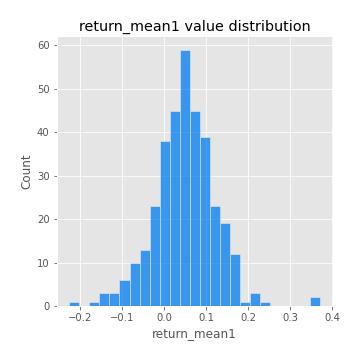
## Feature : return_mean2
- **Feature type** : continous
- **Missing** : 0.0%
- **Unique** : 347
- **Count** :347.0
- **Mean** :0.053598440995605796
- **Std** :0.0856433215234885
- **Min** :-0.2144814672643959
- **25%th Percentile** : 0.007047240413629606
- **50%th Percentile** : 0.05599985989481411
- **75%th Percentile** : 0.10213486722168064
- **Max** :0.44817255934635275

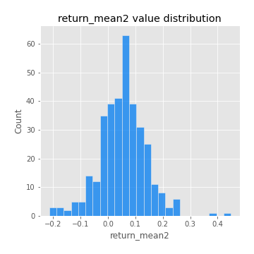
## Feature : return_sd1
- **Feature type** : continous
- **Missing** : 0.0%
- **Unique** : 347
- **Count** :347.0
- **Mean** :1.7559989931812157
- **Std** :0.74866928930531
- **Min** :0.7470080772831957
- **25%th Percentile** : 1.5360743958415806
- **50%th Percentile** : 1.6066080228040232
- **75%th Percentile** : 1.6946046395388512
- **Max** :9.236766377527575

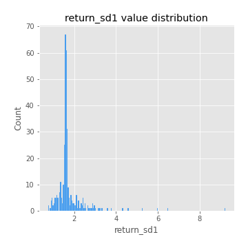
## Feature : return_sd2
- **Feature type** : continous
- **Missing** : 0.0%
- **Unique** : 347
- **Count** :347.0
- **Mean** :1.6990086437418823
- **Std** :0.6254514722142362
- **Min** :0.8455946193085045
- **25%th Percentile** : 1.5000555876175303
- **50%th Percentile** : 1.5850950098289023
- **75%th Percentile** : 1.658869421945809
- **Max** :6.737618636746393

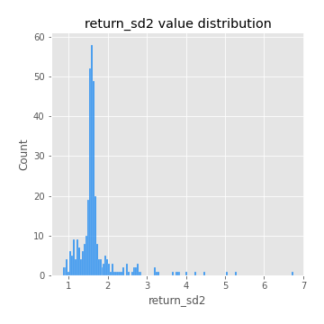
## Feature : return_skew1
- **Feature type** : continous
- **Missing** : 0.0%
- **Unique** : 347
- **Count** :347.0
- **Mean** :-0.11775651707464933
- **Std** :0.5873427229555288
- **Min** :-3.530116233761814
- **25%th Percentile** : -0.19273484257204793
- **50%th Percentile** : -0.03234314847100175
- **75%th Percentile** : 0.06906041015742116
- **Max** :2.5845963767725557

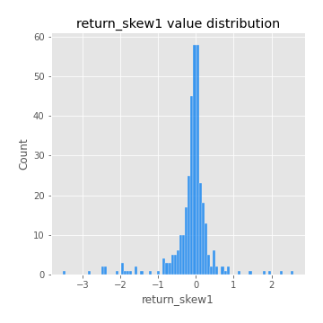
## Feature : return_skew2
- **Feature type** : continous
- **Missing** : 0.0%
- **Unique** : 347
- **Count** :347.0
- **Mean** :-0.18512619169970054
- **Std** :0.738556784223847
- **Min** :-8.801502855292393
- **25%th Percentile** : -0.2718179598535783
- **50%th Percentile** : -0.06174309356663796
- **75%th Percentile** : 0.0848569048453176
- **Max** :2.2606839051517187

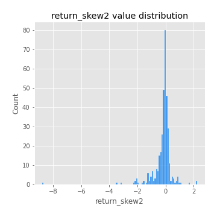
## Feature : return_kurtosis1
- **Feature type** : continous
- **Missing** : 0.0%
- **Unique** : 347
- **Count** :347.0
- **Mean** :3.3067529347089875
- **Std** :6.265238797458502
- **Min** :-0.5271308236766274
- **25%th Percentile** : -0.03347110450346835
- **50%th Percentile** : 0.5657690356908383
- **75%th Percentile** : 3.749242555655367
- **Max** :36.91113889081053

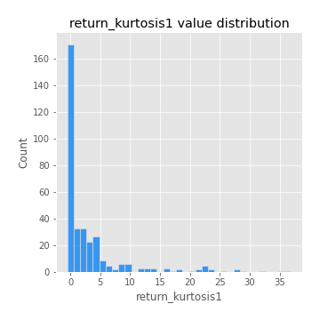
## Feature : return_kurtosis2
- **Feature type** : continous
- **Missing** : 0.0%
- **Unique** : 347
- **Count** :347.0
- **Mean** :3.631676371704845
- **Std** :9.415964153479926
- **Min** :-0.39997087719737445
- **25%th Percentile** : -0.024751012383442683
- **50%th Percentile** : 0.5440819178188381
- **75%th Percentile** : 4.202853905029984
- **Max** :143.10871011533666

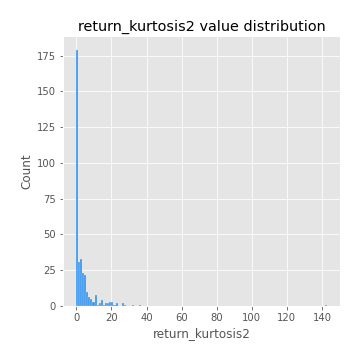
## Feature : return_autocorrelation_1_lag1
- **Feature type** : continous
- **Missing** : 0.0%
- **Unique** : 347
- **Count** :347.0
- **Mean** :-0.017434280945109112
- **Std** :0.05665010460178627
- **Min** :-0.20673896439036124
- **25%th Percentile** : -0.05077359840453388
- **50%th Percentile** : -0.016064385741632808
- **75%th Percentile** : 0.02227982986502277
- **Max** :0.12741308568953866

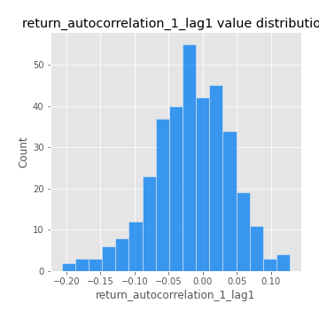
## Feature : return_autocorrelation_1_lag2
- **Feature type** : continous
- **Missing** : 0.0%
- **Unique** : 347
- **Count** :347.0
- **Mean** :-0.005132186545954589
- **Std** :0.04911758076070845
- **Min** :-0.12307463726007406
- **25%th Percentile** : -0.03733367077534049
- **50%th Percentile** : -0.00765732591605318
- **75%th Percentile** : 0.02613493245494737
- **Max** :0.1561488228015672

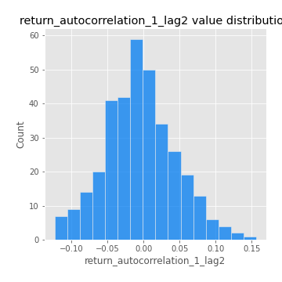
## Feature : return_autocorrelation_1_lag3
- **Feature type** : continous
- **Missing** : 0.0%
- **Unique** : 347
- **Count** :347.0
- **Mean** :-0.005993489081592712
- **Std** :0.051992123882389114
- **Min** :-0.1940836867390813
- **25%th Percentile** : -0.03797727459919428
- **50%th Percentile** : -0.005230672627303844
- **75%th Percentile** : 0.030578305535908054
- **Max** :0.17805869530681923

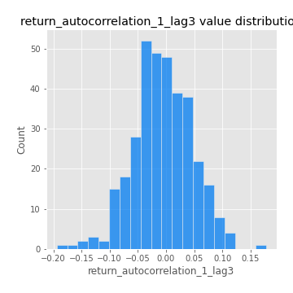
## Feature : return_autocorrelation_2_lag1
- **Feature type** : continous
- **Missing** : 0.0%
- **Unique** : 347
- **Count** :347.0
- **Mean** :-0.010707630158617336
- **Std** :0.05672037494189184
- **Min** :-0.25075531010123286
- **25%th Percentile** : -0.040159490808782755
- **50%th Percentile** : -0.0030429045321447566
- **75%th Percentile** : 0.02853790258325408
- **Max** :0.10556448129819512

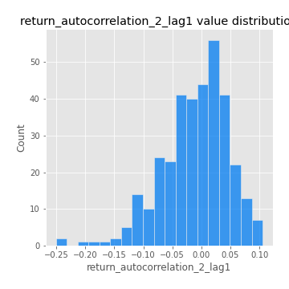
## Feature : return_autocorrelation_2_lag2
- **Feature type** : continous
- **Missing** : 0.0%
- **Unique** : 347
- **Count** :347.0
- **Mean** :0.0034706551085716087
- **Std** :0.04888063620378411
- **Min** :-0.1495113937562178
- **25%th Percentile** : -0.031447267624233124
- **50%th Percentile** : 0.0019331227939847727
- **75%th Percentile** : 0.03580151479123808
- **Max** :0.1735398560230086

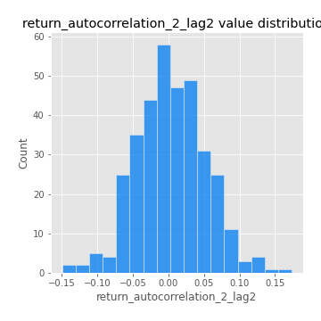
## Feature : return_autocorrelation_2_lag3
- **Feature type** : continous
- **Missing** : 0.0%
- **Unique** : 347
- **Count** :347.0
- **Mean** :-0.003251471152569906
- **Std** :0.050026591124071394
- **Min** :-0.14200107169559698
- **25%th Percentile** : -0.03335606831947229
- **50%th Percentile** : -0.0019493153965269426
- **75%th Percentile** : 0.027865219382895656
- **Max** :0.12489629575199976

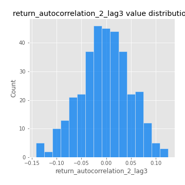
## Feature : return_correlation_ts1_lag_0
- **Feature type** : continous
- **Missing** : 0.0%
- **Unique** : 347
- **Count** :347.0
- **Mean** :0.3207386712741831
- **Std** :0.1087788172141851
- **Min** :-0.027089510445801036
- **25%th Percentile** : 0.27453480687444776
- **50%th Percentile** : 0.32152870589311827
- **75%th Percentile** : 0.37065233071361114
- **Max** :0.7028422087350163

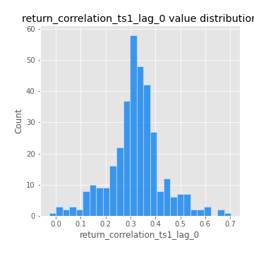
## Feature : return_correlation_ts1_lag_1
- **Feature type** : continous
- **Missing** : 0.0%
- **Unique** : 347
- **Count** :347.0
- **Mean** :-0.009301717725862345
- **Std** :0.052627080891653924
- **Min** :-0.1549695474991776
- **25%th Percentile** : -0.0437850791055197
- **50%th Percentile** : -0.006547141088951226
- **75%th Percentile** : 0.02911738002528596
- **Max** :0.15499424718508623

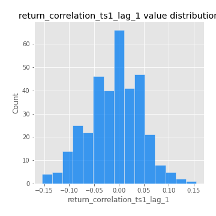
## Feature : return_correlation_ts1_lag_2
- **Feature type** : continous
- **Missing** : 0.0%
- **Unique** : 347
- **Count** :347.0
- **Mean** :0.0006464479396757556
- **Std** :0.047676419011128505
- **Min** :-0.1246451147068724
- **25%th Percentile** : -0.03289954218471382
- **50%th Percentile** : -0.0009681797294642787
- **75%th Percentile** : 0.035334225470029505
- **Max** :0.13020548252595998

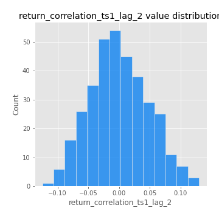
## Feature : return_correlation_ts1_lag_3
- **Feature type** : continous
- **Missing** : 0.0%
- **Unique** : 347
- **Count** :347.0
- **Mean** :-0.001542603173146686
- **Std** :0.050920394152954164
- **Min** :-0.13479063782772893
- **25%th Percentile** : -0.033084661206672666
- **50%th Percentile** : 0.0034511326649605627
- **75%th Percentile** : 0.03178915435991708
- **Max** :0.1636773216468148

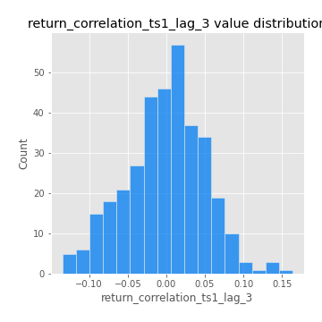
## Feature : return_correlation_ts2_lag_1
- **Feature type** : continous
- **Missing** : 0.0%
- **Unique** : 347
- **Count** :347.0
- **Mean** :-0.006752117685538262
- **Std** :0.05006670234494523
- **Min** :-0.2081139431093261
- **25%th Percentile** : -0.03823132832921762
- **50%th Percentile** : -0.006188664725855553
- **75%th Percentile** : 0.028480390683219024
- **Max** :0.11556235671885211

## Feature : return_correlation_ts2_lag_2
- **Feature type** : continous
- **Missing** : 0.0%
- **Unique** : 347
- **Count** :347.0
- **Mean** :-0.000866687156845157
- **Std** :0.05180150914071976
- **Min** :-0.23751835475804678
- **25%th Percentile** : -0.031983054929342614
- **50%th Percentile** : -0.003186316216567342
- **75%th Percentile** : 0.032948349866513835
- **Max** :0.20772887392904255

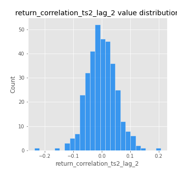
## Feature : return_correlation_ts2_lag_3
- **Feature type** : continous
- **Missing** : 0.0%
- **Unique** : 347
- **Count** :347.0
- **Mean** :-0.006086777401542833
- **Std** :0.0511649471119889
- **Min** :-0.17564076057312866
- **25%th Percentile** : -0.035016196561735505
- **50%th Percentile** : -0.004373852284171392
- **75%th Percentile** : 0.030949150265694548
- **Max** :0.13128380114518473

## Feature : sqreturn_autocorrelation_ts1_lag1
- **Feature type** : continous
- **Missing** : 0.0%
- **Unique** : 347
- **Count** :347.0
- **Mean** :0.04364807948701286
- **Std** :0.08882856501913204
- **Min** :-0.13120397298495534
- **25%th Percentile** : -0.01227036094993357
- **50%th Percentile** : 0.02459550803438465
- **75%th Percentile** : 0.07984953986941637
- **Max** :0.4439086285737898

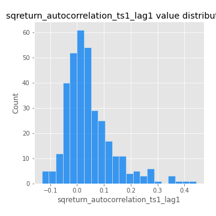
## Feature : sqreturn_autocorrelation_ts1_lag2
- **Feature type** : continous
- **Missing** : 0.0%
- **Unique** : 347
- **Count** :347.0
- **Mean** :0.04071528970471369
- **Std** :0.08996116668154157
- **Min** :-0.0993839984829799
- **25%th Percentile** : -0.014716617668138112
- **50%th Percentile** : 0.017619991493180505
- **75%th Percentile** : 0.06543610283233924
- **Max** :0.4522162366773919

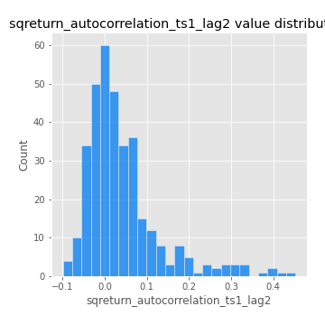
## Feature : sqreturn_autocorrelation_ts1_lag3
- **Feature type** : continous
- **Missing** : 0.0%
- **Unique** : 347
- **Count** :347.0
- **Mean** :0.03308766370205413
- **Std** :0.07717855818011787
- **Min** :-0.09294981245480578
- **25%th Percentile** : -0.013921529815290289
- **50%th Percentile** : 0.012680766069520899
- **75%th Percentile** : 0.059129592175566896
- **Max** :0.41030914918857014

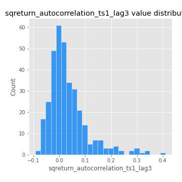
## Feature : sqreturn_autocorrelation_ts2_lag1
- **Feature type** : continous
- **Missing** : 0.0%
- **Unique** : 347
- **Count** :347.0
- **Mean** :0.047001068510566464
- **Std** :0.08766207872800298
- **Min** :-0.08960838199859175
- **25%th Percentile** : -0.010769047955056517
- **50%th Percentile** : 0.02428453606992012
- **75%th Percentile** : 0.07943521860714922
- **Max** :0.510085647437958

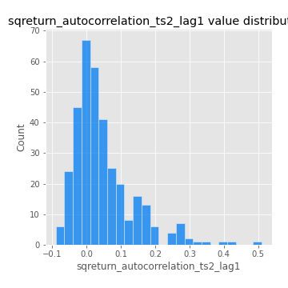
## Feature : sqreturn_autocorrelation_ts2_lag2
- **Feature type** : continous
- **Missing** : 0.0%
- **Unique** : 347
- **Count** :347.0
- **Mean** :0.038298213908763784
- **Std** :0.08870275959778874
- **Min** :-0.12447437738128396
- **25%th Percentile** : -0.011428761300269052
- **50%th Percentile** : 0.014281508437317972
- **75%th Percentile** : 0.05516901785558383
- **Max** :0.45676817892778204

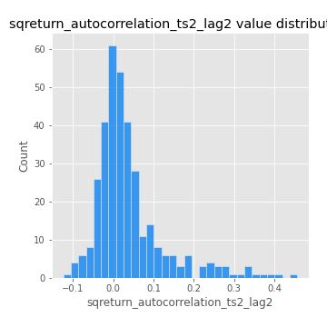
## Feature : sqreturn_autocorrelation_ts2_lag3
- **Feature type** : continous
- **Missing** : 0.0%
- **Unique** : 347
- **Count** :347.0
- **Mean** :0.027483953737404542
- **Std** :0.06868662642929044
- **Min** :-0.09537797445961523
- **25%th Percentile** : -0.017762016682774013
- **50%th Percentile** : 0.014600131380475641
- **75%th Percentile** : 0.05252766926922943
- **Max** :0.31225727797735664

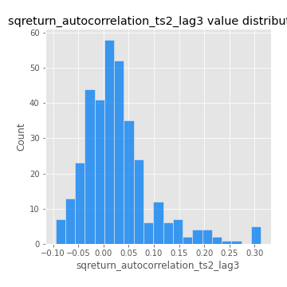
## Feature : sqreturn_correlation_ts1_lag_0
- **Feature type** : continous
- **Missing** : 0.0%
- **Unique** : 347
- **Count** :347.0
- **Mean** :0.3207386712741831
- **Std** :0.1087788172141851
- **Min** :-0.027089510445801036
- **25%th Percentile** : 0.27453480687444776
- **50%th Percentile** : 0.32152870589311827
- **75%th Percentile** : 0.37065233071361114
- **Max** :0.7028422087350163

## Feature : sqreturn_correlation_ts1_lag_1
- **Feature type** : continous
- **Missing** : 0.0%
- **Unique** : 347
- **Count** :347.0
- **Mean** :-0.009301717725862345
- **Std** :0.052627080891653924
- **Min** :-0.1549695474991776
- **25%th Percentile** : -0.0437850791055197
- **50%th Percentile** : -0.006547141088951226
- **75%th Percentile** : 0.02911738002528596
- **Max** :0.15499424718508623

## Feature : sqreturn_correlation_ts1_lag_2
- **Feature type** : continous
- **Missing** : 0.0%
- **Unique** : 347
- **Count** :347.0
- **Mean** :0.0006464479396757556
- **Std** :0.047676419011128505
- **Min** :-0.1246451147068724
- **25%th Percentile** : -0.03289954218471382
- **50%th Percentile** : -0.0009681797294642787
- **75%th Percentile** : 0.035334225470029505
- **Max** :0.13020548252595998

## Feature : sqreturn_correlation_ts1_lag_3
- **Feature type** : continous
- **Missing** : 0.0%
- **Unique** : 347
- **Count** :347.0
- **Mean** :-0.001542603173146686
- **Std** :0.050920394152954164
- **Min** :-0.13479063782772893
- **25%th Percentile** : -0.033084661206672666
- **50%th Percentile** : 0.0034511326649605627
- **75%th Percentile** : 0.03178915435991708
- **Max** :0.1636773216468148

## Feature : sqreturn_correlation_ts2_lag_1
- **Feature type** : continous
- **Missing** : 0.0%
- **Unique** : 347
- **Count** :347.0
- **Mean** :-0.006752117685538262
- **Std** :0.05006670234494523
- **Min** :-0.2081139431093261
- **25%th Percentile** : -0.03823132832921762
- **50%th Percentile** : -0.006188664725855553
- **75%th Percentile** : 0.028480390683219024
- **Max** :0.11556235671885211

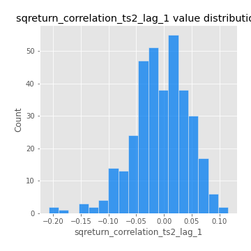
## Feature : sqreturn_correlation_ts2_lag_2
- **Feature type** : continous
- **Missing** : 0.0%
- **Unique** : 347
- **Count** :347.0
- **Mean** :-0.000866687156845157
- **Std** :0.05180150914071976
- **Min** :-0.23751835475804678
- **25%th Percentile** : -0.031983054929342614
- **50%th Percentile** : -0.003186316216567342
- **75%th Percentile** : 0.032948349866513835
- **Max** :0.20772887392904255

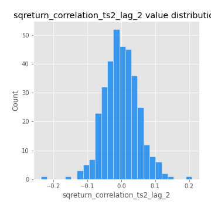
## Feature : sqreturn_correlation_ts2_lag_3
- **Feature type** : continous
- **Missing** : 0.0%
- **Unique** : 347
- **Count** :347.0
- **Mean** :-0.006086777401542833
- **Std** :0.0511649471119889
- **Min** :-0.17564076057312866
- **25%th Percentile** : -0.035016196561735505
- **50%th Percentile** : -0.004373852284171392
- **75%th Percentile** : 0.030949150265694548
- **Max** :0.13128380114518473

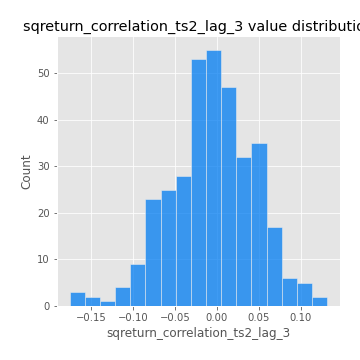
## Feature : price2_granger_cause_price1
- **Feature type** : continous
- **Missing** : 0.0%
- **Unique** : 347
- **Count** :347.0
- **Mean** :0.33957084149600697
- **Std** :0.3030938274886674
- **Min** :2.0794838567986908e-05
- **25%th Percentile** : 0.07074271365406375
- **50%th Percentile** : 0.2699074472283466
- **75%th Percentile** : 0.5772111325941033
- **Max** :0.9889468184422394

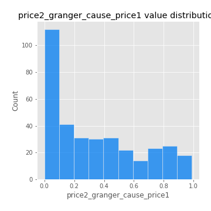
## Feature : price1_granger_cause_price2
- **Feature type** : continous
- **Missing** : 0.0%
- **Unique** : 347
- **Count** :347.0
- **Mean** :0.271606765236127
- **Std** :0.2771896809090695
- **Min** :1.7290587064541232e-05
- **25%th Percentile** : 0.03313345932264726
- **50%th Percentile** : 0.18168586061055772
- **75%th Percentile** : 0.4437196936170974
- **Max** :0.9799182767505903

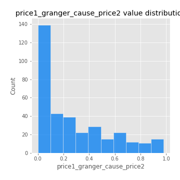

[<< Go back](../README.md)
