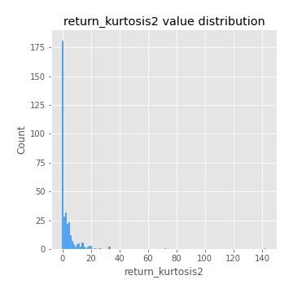
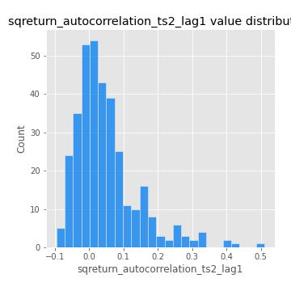

# Exploratory Data Analysis

[<< Go back](../README.md)
## Feature : target
- **Feature type** : categorical
- **Missing** : 0.0%
- **Unique** : 2
- **Count** :347
- **Unique** :2
- **Top** :simulated
- **Freq** :174

## Feature : return_mean1
- **Feature type** : continous
- **Missing** : 0.0%
- **Unique** : 347
- **Count** :347.0
- **Mean** :0.05570202946767307
- **Std** :0.07734323474211588
- **Min** :-0.22632637961920957
- **25%th Percentile** : 0.00831216742177356
- **50%th Percentile** : 0.055927044601015725
- **75%th Percentile** : 0.09869858096953488
- **Max** :0.37175100008111034

## Feature : return_mean2
- **Feature type** : continous
- **Missing** : 0.0%
- **Unique** : 347
- **Count** :347.0
- **Mean** :0.05711545005599244
- **Std** :0.08991063217114104
- **Min** :-0.24205418062825398
- **25%th Percentile** : 0.0052122220542746385
- **50%th Percentile** : 0.057928199993399085
- **75%th Percentile** : 0.10996811676061082
- **Max** :0.37616608147096464

## Feature : return_sd1
- **Feature type** : continous
- **Missing** : 0.0%
- **Unique** : 347
- **Count** :347.0
- **Mean** :1.7687241988769795
- **Std** :0.7430091987343038
- **Min** :0.7470080772831957
- **25%th Percentile** : 1.5386272932020253
- **50%th Percentile** : 1.6026944295009753
- **75%th Percentile** : 1.7096041633794963
- **Max** :9.236766377527575

## Feature : return_sd2
- **Feature type** : continous
- **Missing** : 0.0%
- **Unique** : 347
- **Count** :347.0
- **Mean** :1.7798759462620803
- **Std** :0.7687088228797921
- **Min** :0.8592887433004143
- **25%th Percentile** : 1.5264913115278542
- **50%th Percentile** : 1.596866670490167
- **75%th Percentile** : 1.6731412590873536
- **Max** :6.737618636746393

## Feature : return_skew1
- **Feature type** : continous
- **Missing** : 0.0%
- **Unique** : 347
- **Count** :347.0
- **Mean** :-0.0827290526677381
- **Std** :0.5784505235455552
- **Min** :-3.530116233761814
- **25%th Percentile** : -0.19710518688302525
- **50%th Percentile** : -0.03308060298517619
- **75%th Percentile** : 0.11871776681190219
- **Max** :2.5845963767725557

## Feature : return_skew2
- **Feature type** : continous
- **Missing** : 0.0%
- **Unique** : 347
- **Count** :347.0
- **Mean** :-0.1662854478800905
- **Std** :0.7987014731571977
- **Min** :-8.801502855292393
- **25%th Percentile** : -0.23746393825467937
- **50%th Percentile** : -0.06630251162557542
- **75%th Percentile** : 0.08071511238825077
- **Max** :2.2606839051517187

## Feature : return_kurtosis1
- **Feature type** : continous
- **Missing** : 0.0%
- **Unique** : 347
- **Count** :347.0
- **Mean** :3.0885586306726416
- **Std** :5.825890109554849
- **Min** :-0.44415168671156424
- **25%th Percentile** : -0.026190759815073017
- **50%th Percentile** : 0.5233987011308003
- **75%th Percentile** : 3.8405863563633806
- **Max** :36.91113889081053

## Feature : return_kurtosis2
- **Feature type** : continous
- **Missing** : 0.0%
- **Unique** : 347
- **Count** :347.0
- **Mean** :3.683334202946993
- **Std** :9.941278786293292
- **Min** :-0.4727140831458039
- **25%th Percentile** : -0.009648630413742643
- **50%th Percentile** : 0.5134070704774523
- **75%th Percentile** : 4.1488807640792835
- **Max** :143.10871011533666

## Feature : return_autocorrelation_1_lag1
- **Feature type** : continous
- **Missing** : 0.0%
- **Unique** : 347
- **Count** :347.0
- **Mean** :-0.01205613581753569
- **Std** :0.05717823210276377
- **Min** :-0.20673896439036124
- **25%th Percentile** : -0.04915771225171325
- **50%th Percentile** : -0.004417673661142481
- **75%th Percentile** : 0.02606714466616218
- **Max** :0.12579068890804943

## Feature : return_autocorrelation_1_lag2
- **Feature type** : continous
- **Missing** : 0.0%
- **Unique** : 347
- **Count** :347.0
- **Mean** :-0.006293216248541743
- **Std** :0.05059414219855453
- **Min** :-0.13309283796645122
- **25%th Percentile** : -0.03733367077534049
- **50%th Percentile** : -0.005767071814010877
- **75%th Percentile** : 0.02533960656262317
- **Max** :0.1561488228015672

## Feature : return_autocorrelation_1_lag3
- **Feature type** : continous
- **Missing** : 0.0%
- **Unique** : 347
- **Count** :347.0
- **Mean** :-0.002731206360534972
- **Std** :0.049663549318820895
- **Min** :-0.1940836867390813
- **25%th Percentile** : -0.034081425525851416
- **50%th Percentile** : -0.0031591317712452043
- **75%th Percentile** : 0.03149141906577777
- **Max** :0.17805869530681923

## Feature : return_autocorrelation_2_lag1
- **Feature type** : continous
- **Missing** : 0.0%
- **Unique** : 347
- **Count** :347.0
- **Mean** :-0.00929431077195075
- **Std** :0.06312701920402372
- **Min** :-0.25075531010123286
- **25%th Percentile** : -0.04215354867004447
- **50%th Percentile** : -0.0037911134105882713
- **75%th Percentile** : 0.029325712430318562
- **Max** :0.31863413537898483

## Feature : return_autocorrelation_2_lag2
- **Feature type** : continous
- **Missing** : 0.0%
- **Unique** : 347
- **Count** :347.0
- **Mean** :-0.00044498525629617727
- **Std** :0.05240808295690286
- **Min** :-0.15323211089747296
- **25%th Percentile** : -0.03313678367463123
- **50%th Percentile** : -0.004222190023486974
- **75%th Percentile** : 0.033944367843409665
- **Max** :0.20974504043791217

## Feature : return_autocorrelation_2_lag3
- **Feature type** : continous
- **Missing** : 0.0%
- **Unique** : 347
- **Count** :347.0
- **Mean** :-0.0003887464143994416
- **Std** :0.04950598516253136
- **Min** :-0.14200107169559698
- **25%th Percentile** : -0.031117940402332574
- **50%th Percentile** : 0.0007947118379053411
- **75%th Percentile** : 0.03216180586861755
- **Max** :0.1419999376914021

## Feature : return_correlation_ts1_lag_0
- **Feature type** : continous
- **Missing** : 0.0%
- **Unique** : 347
- **Count** :347.0
- **Mean** :0.32300625972892005
- **Std** :0.10820129559667573
- **Min** :0.005136598099876001
- **25%th Percentile** : 0.26601637626188734
- **50%th Percentile** : 0.32622398993220725
- **75%th Percentile** : 0.37328661396140345
- **Max** :0.7041861626832071

## Feature : return_correlation_ts1_lag_1
- **Feature type** : continous
- **Missing** : 0.0%
- **Unique** : 347
- **Count** :347.0
- **Mean** :-0.006594303964683389
- **Std** :0.04884133390591196
- **Min** :-0.1506680294614535
- **25%th Percentile** : -0.0365872924283893
- **50%th Percentile** : -0.002663137755292486
- **75%th Percentile** : 0.026686210689647622
- **Max** :0.15499424718508623

## Feature : return_correlation_ts1_lag_2
- **Feature type** : continous
- **Missing** : 0.0%
- **Unique** : 347
- **Count** :347.0
- **Mean** :-0.0023973898506350908
- **Std** :0.048314824249399126
- **Min** :-0.1246451147068724
- **25%th Percentile** : -0.03738257235735442
- **50%th Percentile** : -0.0019604855559830414
- **75%th Percentile** : 0.03400711545735327
- **Max** :0.1250496661238289

## Feature : return_correlation_ts1_lag_3
- **Feature type** : continous
- **Missing** : 0.0%
- **Unique** : 347
- **Count** :347.0
- **Mean** :-0.0013358797686181337
- **Std** :0.05146713880071259
- **Min** :-0.13484411030526727
- **25%th Percentile** : -0.03485610368847912
- **50%th Percentile** : -0.0020727862025896214
- **75%th Percentile** : 0.031183700061519777
- **Max** :0.1636773216468148

## Feature : return_correlation_ts2_lag_1
- **Feature type** : continous
- **Missing** : 0.0%
- **Unique** : 347
- **Count** :347.0
- **Mean** :-0.007981578933449565
- **Std** :0.055408607051566576
- **Min** :-0.2081139431093261
- **25%th Percentile** : -0.04230012068530524
- **50%th Percentile** : -0.00883613301997916
- **75%th Percentile** : 0.027846260011136246
- **Max** :0.17208763791364762

## Feature : return_correlation_ts2_lag_2
- **Feature type** : continous
- **Missing** : 0.0%
- **Unique** : 347
- **Count** :347.0
- **Mean** :0.0005465314237623282
- **Std** :0.050097694724572164
- **Min** :-0.15299951737180204
- **25%th Percentile** : -0.032781143499772125
- **50%th Percentile** : 0.0004129462091744467
- **75%th Percentile** : 0.029419456452108562
- **Max** :0.20772887392904255

## Feature : return_correlation_ts2_lag_3
- **Feature type** : continous
- **Missing** : 0.0%
- **Unique** : 347
- **Count** :347.0
- **Mean** :-0.0008724229436544303
- **Std** :0.049390545321899244
- **Min** :-0.17564076057312866
- **25%th Percentile** : -0.030493648206989576
- **50%th Percentile** : -0.0006815419806208479
- **75%th Percentile** : 0.03495722256532405
- **Max** :0.12502781355851633

## Feature : sqreturn_autocorrelation_ts1_lag1
- **Feature type** : continous
- **Missing** : 0.0%
- **Unique** : 347
- **Count** :347.0
- **Mean** :0.05400690594370781
- **Std** :0.09234293377894276
- **Min** :-0.10715309192828162
- **25%th Percentile** : -0.006597683005429576
- **50%th Percentile** : 0.03323348052570171
- **75%th Percentile** : 0.08729300866955939
- **Max** :0.49414293176447355

## Feature : sqreturn_autocorrelation_ts1_lag2
- **Feature type** : continous
- **Missing** : 0.0%
- **Unique** : 347
- **Count** :347.0
- **Mean** :0.04401673313377054
- **Std** :0.09584998617914722
- **Min** :-0.10404582971337081
- **25%th Percentile** : -0.01267705506127621
- **50%th Percentile** : 0.019579364604089808
- **75%th Percentile** : 0.07076931402466083
- **Max** :0.540735851444759

## Feature : sqreturn_autocorrelation_ts1_lag3
- **Feature type** : continous
- **Missing** : 0.0%
- **Unique** : 347
- **Count** :347.0
- **Mean** :0.0338095808742518
- **Std** :0.08391033624212979
- **Min** :-0.11924149142298833
- **25%th Percentile** : -0.018199607725246543
- **50%th Percentile** : 0.013187845856421965
- **75%th Percentile** : 0.06383692263705566
- **Max** :0.44755937369538146

## Feature : sqreturn_autocorrelation_ts2_lag1
- **Feature type** : continous
- **Missing** : 0.0%
- **Unique** : 347
- **Count** :347.0
- **Mean** :0.04777942402423431
- **Std** :0.09193450940571596
- **Min** :-0.09584784272957954
- **25%th Percentile** : -0.011225168553909452
- **50%th Percentile** : 0.02592723126527982
- **75%th Percentile** : 0.07582092568661684
- **Max** :0.510085647437958

## Feature : sqreturn_autocorrelation_ts2_lag2
- **Feature type** : continous
- **Missing** : 0.0%
- **Unique** : 347
- **Count** :347.0
- **Mean** :0.039722856345595935
- **Std** :0.09256920822300556
- **Min** :-0.14408161810605383
- **25%th Percentile** : -0.013260108632596197
- **50%th Percentile** : 0.015842004093379932
- **75%th Percentile** : 0.0610863918560735
- **Max** :0.5373432415582473

## Feature : sqreturn_autocorrelation_ts2_lag3
- **Feature type** : continous
- **Missing** : 0.0%
- **Unique** : 347
- **Count** :347.0
- **Mean** :0.02619004323469644
- **Std** :0.07198727036610918
- **Min** :-0.11391289319630117
- **25%th Percentile** : -0.02007118851376701
- **50%th Percentile** : 0.011449826065601248
- **75%th Percentile** : 0.05581422918683039
- **Max** :0.31225727797735664

## Feature : sqreturn_correlation_ts1_lag_0
- **Feature type** : continous
- **Missing** : 0.0%
- **Unique** : 347
- **Count** :347.0
- **Mean** :0.32300625972892005
- **Std** :0.10820129559667573
- **Min** :0.005136598099876001
- **25%th Percentile** : 0.26601637626188734
- **50%th Percentile** : 0.32622398993220725
- **75%th Percentile** : 0.37328661396140345
- **Max** :0.7041861626832071

## Feature : sqreturn_correlation_ts1_lag_1
- **Feature type** : continous
- **Missing** : 0.0%
- **Unique** : 347
- **Count** :347.0
- **Mean** :-0.006594303964683389
- **Std** :0.04884133390591196
- **Min** :-0.1506680294614535
- **25%th Percentile** : -0.0365872924283893
- **50%th Percentile** : -0.002663137755292486
- **75%th Percentile** : 0.026686210689647622
- **Max** :0.15499424718508623

## Feature : sqreturn_correlation_ts1_lag_2
- **Feature type** : continous
- **Missing** : 0.0%
- **Unique** : 347
- **Count** :347.0
- **Mean** :-0.0023973898506350908
- **Std** :0.048314824249399126
- **Min** :-0.1246451147068724
- **25%th Percentile** : -0.03738257235735442
- **50%th Percentile** : -0.0019604855559830414
- **75%th Percentile** : 0.03400711545735327
- **Max** :0.1250496661238289

## Feature : sqreturn_correlation_ts1_lag_3
- **Feature type** : continous
- **Missing** : 0.0%
- **Unique** : 347
- **Count** :347.0
- **Mean** :-0.0013358797686181337
- **Std** :0.05146713880071259
- **Min** :-0.13484411030526727
- **25%th Percentile** : -0.03485610368847912
- **50%th Percentile** : -0.0020727862025896214
- **75%th Percentile** : 0.031183700061519777
- **Max** :0.1636773216468148

## Feature : sqreturn_correlation_ts2_lag_1
- **Feature type** : continous
- **Missing** : 0.0%
- **Unique** : 347
- **Count** :347.0
- **Mean** :-0.007981578933449565
- **Std** :0.055408607051566576
- **Min** :-0.2081139431093261
- **25%th Percentile** : -0.04230012068530524
- **50%th Percentile** : -0.00883613301997916
- **75%th Percentile** : 0.027846260011136246
- **Max** :0.17208763791364762

## Feature : sqreturn_correlation_ts2_lag_2
- **Feature type** : continous
- **Missing** : 0.0%
- **Unique** : 347
- **Count** :347.0
- **Mean** :0.0005465314237623282
- **Std** :0.050097694724572164
- **Min** :-0.15299951737180204
- **25%th Percentile** : -0.032781143499772125
- **50%th Percentile** : 0.0004129462091744467
- **75%th Percentile** : 0.029419456452108562
- **Max** :0.20772887392904255

## Feature : sqreturn_correlation_ts2_lag_3
- **Feature type** : continous
- **Missing** : 0.0%
- **Unique** : 347
- **Count** :347.0
- **Mean** :-0.0008724229436544303
- **Std** :0.049390545321899244
- **Min** :-0.17564076057312866
- **25%th Percentile** : -0.030493648206989576
- **50%th Percentile** : -0.0006815419806208479
- **75%th Percentile** : 0.03495722256532405
- **Max** :0.12502781355851633

## Feature : price2_granger_cause_price1
- **Feature type** : continous
- **Missing** : 0.0%
- **Unique** : 347
- **Count** :347.0
- **Mean** :0.3330524404366945
- **Std** :0.29438538475482173
- **Min** :0.000789618091310917
- **25%th Percentile** : 0.07149861617257194
- **50%th Percentile** : 0.24993530971303018
- **75%th Percentile** : 0.5258741011380239
- **Max** :0.9904693848774306

## Feature : price1_granger_cause_price2
- **Feature type** : continous
- **Missing** : 0.0%
- **Unique** : 347
- **Count** :347.0
- **Mean** :0.2974042285487886
- **Std** :0.28592256697169727
- **Min** :1.9023280609417827e-05
- **25%th Percentile** : 0.04323354232008654
- **50%th Percentile** : 0.20551908712394326
- **75%th Percentile** : 0.4999200034112462
- **Max** :0.9963748806640943

[<< Go back](../README.md)
