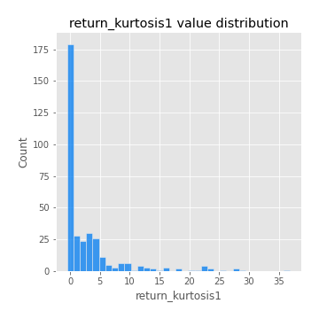

# Exploratory Data Analysis

[<< Go back](../README.md)
## Feature : target
- **Feature type** : categorical
- **Missing** : 0.0%
- **Unique** : 2
- **Count** :347
- **Unique** :2
- **Top** :simulated
- **Freq** :178

## Feature : return_mean1
- **Feature type** : continous
- **Missing** : 0.0%
- **Unique** : 347
- **Count** :347.0
- **Mean** :0.046237947028754944
- **Std** :0.08263675476141812
- **Min** :-0.22632637961920957
- **25%th Percentile** : 0.0016399890495822182
- **50%th Percentile** : 0.046963583011285684
- **75%th Percentile** : 0.08759396210085464
- **Max** :0.37175100008111034

## Feature : return_mean2
- **Feature type** : continous
- **Missing** : 0.0%
- **Unique** : 347
- **Count** :347.0
- **Mean** :0.05255106484909039
- **Std** :0.08780465120455838
- **Min** :-0.21818165578778434
- **25%th Percentile** : 0.005891912335218519
- **50%th Percentile** : 0.05516611444454279
- **75%th Percentile** : 0.10418085744907887
- **Max** :0.506832389585739

## Feature : return_sd1
- **Feature type** : continous
- **Missing** : 0.0%
- **Unique** : 347
- **Count** :347.0
- **Mean** :1.7743540454994997
- **Std** :0.8024347040445998
- **Min** :0.7470080772831957
- **25%th Percentile** : 1.5241794072752106
- **50%th Percentile** : 1.5927048801286043
- **75%th Percentile** : 1.671038756637026
- **Max** :9.236766377527575

## Feature : return_sd2
- **Feature type** : continous
- **Missing** : 0.0%
- **Unique** : 347
- **Count** :347.0
- **Mean** :1.7274801733768883
- **Std** :0.5942182132767099
- **Min** :0.8455946193085045
- **25%th Percentile** : 1.5149745482250032
- **50%th Percentile** : 1.5920735130527552
- **75%th Percentile** : 1.6714731535751546
- **Max** :5.042707010333888

## Feature : return_skew1
- **Feature type** : continous
- **Missing** : 0.0%
- **Unique** : 347
- **Count** :347.0
- **Mean** :-0.04906915333469348
- **Std** :0.5622819840866744
- **Min** :-2.817259764925239
- **25%th Percentile** : -0.1485052472614956
- **50%th Percentile** : -0.009138756143723004
- **75%th Percentile** : 0.10396089352969837
- **Max** :2.5845963767725557

## Feature : return_skew2
- **Feature type** : continous
- **Missing** : 0.0%
- **Unique** : 347
- **Count** :347.0
- **Mean** :-0.1364849090003842
- **Std** :0.7368851660947824
- **Min** :-8.801502855292393
- **25%th Percentile** : -0.21723661393280724
- **50%th Percentile** : -0.040468096838611994
- **75%th Percentile** : 0.07985669431646232
- **Max** :2.2606839051517187

## Feature : return_kurtosis1
- **Feature type** : continous
- **Missing** : 0.0%
- **Unique** : 347
- **Count** :347.0
- **Mean** :3.0630293894433525
- **Std** :5.6642253067721
- **Min** :-0.506370012580275
- **25%th Percentile** : -0.05831298426864562
- **50%th Percentile** : 0.4319992188004891
- **75%th Percentile** : 3.746268461128576
- **Max** :36.91113889081053

## Feature : return_kurtosis2
- **Feature type** : continous
- **Missing** : 0.0%
- **Unique** : 347
- **Count** :347.0
- **Mean** :3.549103627797831
- **Std** :9.349905164028351
- **Min** :-0.5332664801549618
- **25%th Percentile** : -0.028759047263044124
- **50%th Percentile** : 0.41688668057919154
- **75%th Percentile** : 4.109234780795159
- **Max** :143.10871011533666

## Feature : return_autocorrelation_1_lag1
- **Feature type** : continous
- **Missing** : 0.0%
- **Unique** : 347
- **Count** :347.0
- **Mean** :-0.011701413183722824
- **Std** :0.057780465177745544
- **Min** :-0.2135576224968752
- **25%th Percentile** : -0.044707364009781786
- **50%th Percentile** : -0.003654705826058786
- **75%th Percentile** : 0.02702322316760194
- **Max** :0.12810656890648087

## Feature : return_autocorrelation_1_lag2
- **Feature type** : continous
- **Missing** : 0.0%
- **Unique** : 347
- **Count** :347.0
- **Mean** :-0.0065225032118995255
- **Std** :0.04973452922944885
- **Min** :-0.12172858720259
- **25%th Percentile** : -0.03742185576225118
- **50%th Percentile** : -0.002793744512638099
- **75%th Percentile** : 0.025080287781525205
- **Max** :0.1561488228015672

## Feature : return_autocorrelation_1_lag3
- **Feature type** : continous
- **Missing** : 0.0%
- **Unique** : 347
- **Count** :347.0
- **Mean** :-0.004784492123605283
- **Std** :0.05022551919052627
- **Min** :-0.1940836867390813
- **25%th Percentile** : -0.03807586188992909
- **50%th Percentile** : -0.005164893751571868
- **75%th Percentile** : 0.02974427376265707
- **Max** :0.11165766667738901

## Feature : return_autocorrelation_2_lag1
- **Feature type** : continous
- **Missing** : 0.0%
- **Unique** : 347
- **Count** :347.0
- **Mean** :-0.008552082184246598
- **Std** :0.05716103795925206
- **Min** :-0.25075531010123286
- **25%th Percentile** : -0.041172780250225485
- **50%th Percentile** : -0.003382028102798371
- **75%th Percentile** : 0.031064629596155826
- **Max** :0.12235403572864123

## Feature : return_autocorrelation_2_lag2
- **Feature type** : continous
- **Missing** : 0.0%
- **Unique** : 347
- **Count** :347.0
- **Mean** :0.0011706025834089095
- **Std** :0.05061164054235228
- **Min** :-0.15323211089747296
- **25%th Percentile** : -0.03159786444751046
- **50%th Percentile** : -0.0014626364385642242
- **75%th Percentile** : 0.03672526955119873
- **Max** :0.1735398560230086

## Feature : return_autocorrelation_2_lag3
- **Feature type** : continous
- **Missing** : 0.0%
- **Unique** : 347
- **Count** :347.0
- **Mean** :-0.0010332929100817846
- **Std** :0.04912680868085587
- **Min** :-0.14200107169559698
- **25%th Percentile** : -0.03372514611960909
- **50%th Percentile** : -0.0007954854322127135
- **75%th Percentile** : 0.03346650086914622
- **Max** :0.1419999376914021

## Feature : return_correlation_ts1_lag_0
- **Feature type** : continous
- **Missing** : 0.0%
- **Unique** : 347
- **Count** :347.0
- **Mean** :0.31970548123127496
- **Std** :0.10438922331122479
- **Min** :-0.027089510445801036
- **25%th Percentile** : 0.27202411378780444
- **50%th Percentile** : 0.32078155428927846
- **75%th Percentile** : 0.36371600715917796
- **Max** :0.7041861626832071

## Feature : return_correlation_ts1_lag_1
- **Feature type** : continous
- **Missing** : 0.0%
- **Unique** : 347
- **Count** :347.0
- **Mean** :-0.006782995812442321
- **Std** :0.05122989108028772
- **Min** :-0.16985510949917193
- **25%th Percentile** : -0.037147819055568965
- **50%th Percentile** : -0.0007510302744104748
- **75%th Percentile** : 0.027429552749082427
- **Max** :0.15499424718508623

## Feature : return_correlation_ts1_lag_2
- **Feature type** : continous
- **Missing** : 0.0%
- **Unique** : 347
- **Count** :347.0
- **Mean** :0.0008868983573966428
- **Std** :0.04972609708159456
- **Min** :-0.21653581047581763
- **25%th Percentile** : -0.03126101149718206
- **50%th Percentile** : 0.0009685707217309875
- **75%th Percentile** : 0.03480805962651598
- **Max** :0.15513305241460418

## Feature : return_correlation_ts1_lag_3
- **Feature type** : continous
- **Missing** : 0.0%
- **Unique** : 347
- **Count** :347.0
- **Mean** :-0.00024746866397345297
- **Std** :0.05150768375881978
- **Min** :-0.135621688060011
- **25%th Percentile** : -0.033136044336565626
- **50%th Percentile** : -0.0014573215147489639
- **75%th Percentile** : 0.032450314134367
- **Max** :0.1636773216468148

## Feature : return_correlation_ts2_lag_1
- **Feature type** : continous
- **Missing** : 0.0%
- **Unique** : 347
- **Count** :347.0
- **Mean** :-0.003141243985604617
- **Std** :0.050027518924786844
- **Min** :-0.2081139431093261
- **25%th Percentile** : -0.03456022495605074
- **50%th Percentile** : -0.001844079208259638
- **75%th Percentile** : 0.02830803335804747
- **Max** :0.17208763791364762

## Feature : return_correlation_ts2_lag_2
- **Feature type** : continous
- **Missing** : 0.0%
- **Unique** : 347
- **Count** :347.0
- **Mean** :-9.981996616504106e-06
- **Std** :0.05208233728890059
- **Min** :-0.23751835475804678
- **25%th Percentile** : -0.03278690350571123
- **50%th Percentile** : -0.00016553792162788547
- **75%th Percentile** : 0.03505945174271892
- **Max** :0.20772887392904255

## Feature : return_correlation_ts2_lag_3
- **Feature type** : continous
- **Missing** : 0.0%
- **Unique** : 347
- **Count** :347.0
- **Mean** :-0.0012625168822982544
- **Std** :0.049945350150413376
- **Min** :-0.17564076057312866
- **25%th Percentile** : -0.02597100432801512
- **50%th Percentile** : -0.0037964538152876486
- **75%th Percentile** : 0.03170786584751914
- **Max** :0.13128380114518473

## Feature : sqreturn_autocorrelation_ts1_lag1
- **Feature type** : continous
- **Missing** : 0.0%
- **Unique** : 347
- **Count** :347.0
- **Mean** :0.04928158860576518
- **Std** :0.09381135541070623
- **Min** :-0.1139152252198836
- **25%th Percentile** : -0.011294629335668379
- **50%th Percentile** : 0.028983821151283635
- **75%th Percentile** : 0.08275392635482448
- **Max** :0.4439086285737898

## Feature : sqreturn_autocorrelation_ts1_lag2
- **Feature type** : continous
- **Missing** : 0.0%
- **Unique** : 347
- **Count** :347.0
- **Mean** :0.040435557812143266
- **Std** :0.08453841314131046
- **Min** :-0.10664918477852954
- **25%th Percentile** : -0.012290281216226464
- **50%th Percentile** : 0.019007860770351874
- **75%th Percentile** : 0.06352479703874594
- **Max** :0.42719220751700526

## Feature : sqreturn_autocorrelation_ts1_lag3
- **Feature type** : continous
- **Missing** : 0.0%
- **Unique** : 347
- **Count** :347.0
- **Mean** :0.030021121439105028
- **Std** :0.07995382268500288
- **Min** :-0.13693151762603048
- **25%th Percentile** : -0.017075239984037018
- **50%th Percentile** : 0.014269743043924777
- **75%th Percentile** : 0.055480251530936095
- **Max** :0.34857575772959026

## Feature : sqreturn_autocorrelation_ts2_lag1
- **Feature type** : continous
- **Missing** : 0.0%
- **Unique** : 347
- **Count** :347.0
- **Mean** :0.0448562664099251
- **Std** :0.08218720321649742
- **Min** :-0.08938650713739499
- **25%th Percentile** : -0.008265042455854707
- **50%th Percentile** : 0.025695549370206412
- **75%th Percentile** : 0.07395600250557574
- **Max** :0.4190090519891419

## Feature : sqreturn_autocorrelation_ts2_lag2
- **Feature type** : continous
- **Missing** : 0.0%
- **Unique** : 347
- **Count** :347.0
- **Mean** :0.033705939925779055
- **Std** :0.09090292609923825
- **Min** :-0.11531927724119553
- **25%th Percentile** : -0.016337469854184394
- **50%th Percentile** : 0.014042846486316828
- **75%th Percentile** : 0.056113396653701283
- **Max** :0.5373432415582473

## Feature : sqreturn_autocorrelation_ts2_lag3
- **Feature type** : continous
- **Missing** : 0.0%
- **Unique** : 347
- **Count** :347.0
- **Mean** :0.025626264597897977
- **Std** :0.07360201974925486
- **Min** :-0.11776567895264871
- **25%th Percentile** : -0.017254087553131868
- **50%th Percentile** : 0.013928509829793058
- **75%th Percentile** : 0.05033999536980195
- **Max** :0.31225727797735664

## Feature : sqreturn_correlation_ts1_lag_0
- **Feature type** : continous
- **Missing** : 0.0%
- **Unique** : 347
- **Count** :347.0
- **Mean** :0.31970548123127496
- **Std** :0.10438922331122479
- **Min** :-0.027089510445801036
- **25%th Percentile** : 0.27202411378780444
- **50%th Percentile** : 0.32078155428927846
- **75%th Percentile** : 0.36371600715917796
- **Max** :0.7041861626832071

## Feature : sqreturn_correlation_ts1_lag_1
- **Feature type** : continous
- **Missing** : 0.0%
- **Unique** : 347
- **Count** :347.0
- **Mean** :-0.006782995812442321
- **Std** :0.05122989108028772
- **Min** :-0.16985510949917193
- **25%th Percentile** : -0.037147819055568965
- **50%th Percentile** : -0.0007510302744104748
- **75%th Percentile** : 0.027429552749082427
- **Max** :0.15499424718508623

## Feature : sqreturn_correlation_ts1_lag_2
- **Feature type** : continous
- **Missing** : 0.0%
- **Unique** : 347
- **Count** :347.0
- **Mean** :0.0008868983573966428
- **Std** :0.04972609708159456
- **Min** :-0.21653581047581763
- **25%th Percentile** : -0.03126101149718206
- **50%th Percentile** : 0.0009685707217309875
- **75%th Percentile** : 0.03480805962651598
- **Max** :0.15513305241460418

## Feature : sqreturn_correlation_ts1_lag_3
- **Feature type** : continous
- **Missing** : 0.0%
- **Unique** : 347
- **Count** :347.0
- **Mean** :-0.00024746866397345297
- **Std** :0.05150768375881978
- **Min** :-0.135621688060011
- **25%th Percentile** : -0.033136044336565626
- **50%th Percentile** : -0.0014573215147489639
- **75%th Percentile** : 0.032450314134367
- **Max** :0.1636773216468148

## Feature : sqreturn_correlation_ts2_lag_1
- **Feature type** : continous
- **Missing** : 0.0%
- **Unique** : 347
- **Count** :347.0
- **Mean** :-0.003141243985604617
- **Std** :0.050027518924786844
- **Min** :-0.2081139431093261
- **25%th Percentile** : -0.03456022495605074
- **50%th Percentile** : -0.001844079208259638
- **75%th Percentile** : 0.02830803335804747
- **Max** :0.17208763791364762

## Feature : sqreturn_correlation_ts2_lag_2
- **Feature type** : continous
- **Missing** : 0.0%
- **Unique** : 347
- **Count** :347.0
- **Mean** :-9.981996616504106e-06
- **Std** :0.05208233728890059
- **Min** :-0.23751835475804678
- **25%th Percentile** : -0.03278690350571123
- **50%th Percentile** : -0.00016553792162788547
- **75%th Percentile** : 0.03505945174271892
- **Max** :0.20772887392904255

## Feature : sqreturn_correlation_ts2_lag_3
- **Feature type** : continous
- **Missing** : 0.0%
- **Unique** : 347
- **Count** :347.0
- **Mean** :-0.0012625168822982544
- **Std** :0.049945350150413376
- **Min** :-0.17564076057312866
- **25%th Percentile** : -0.02597100432801512
- **50%th Percentile** : -0.0037964538152876486
- **75%th Percentile** : 0.03170786584751914
- **Max** :0.13128380114518473

## Feature : price2_granger_cause_price1
- **Feature type** : continous
- **Missing** : 0.0%
- **Unique** : 347
- **Count** :347.0
- **Mean** :0.3103666499560072
- **Std** :0.28770860039474405
- **Min** :3.4087133770027145e-06
- **25%th Percentile** : 0.04983305475894162
- **50%th Percentile** : 0.22257283904659042
- **75%th Percentile** : 0.5267072651828208
- **Max** :0.9982317995566445

## Feature : price1_granger_cause_price2
- **Feature type** : continous
- **Missing** : 0.0%
- **Unique** : 347
- **Count** :347.0
- **Mean** :0.2871765565725822
- **Std** :0.2831103089018543
- **Min** :1.410262651943047e-06
- **25%th Percentile** : 0.032538879504210756
- **50%th Percentile** : 0.19607845904533072
- **75%th Percentile** : 0.48491122515950313
- **Max** :0.9951398266867577

[<< Go back](../README.md)
