# Summary of 3_Linear

[<< Go back](../README.md)

## Logistic Regression (Linear)
- **n_jobs**: -1
- **explain_level**: 2

## Validation
 - **validation_type**: split
 - **train_ratio**: 0.75
 - **shuffle**: True
 - **stratify**: True

## Optimized metric
accuracy

## Training time

18.5 seconds

## Metric details
|           |    score |     threshold |
|:----------|---------:|--------------:|
| logloss   | 0.147977 | nan           |
| auc       | 1        | nan           |
| f1        | 1        |   0.697453    |
| accuracy  | 1        |   0.697453    |
| precision | 1        |   0.880321    |
| recall    | 1        |   3.59692e-12 |
| mcc       | 1        |   0.697453    |

## Confusion matrix (at threshold=0.697453)
|                      |   Predicted as real |   Predicted as simulated |
|:---------------------|--------------------:|-------------------------:|
| Labeled as real      |                  46 |                        0 |
| Labeled as simulated |                   0 |                       41 |

## Learning curves

## Coefficients
| feature                           |   Learner_1 |
|:----------------------------------|------------:|
| return_skew2                      |   0.541452  |
| sqreturn_correlation_ts2_lag_1    |   0.392554  |
| return_correlation_ts2_lag_1      |   0.392554  |
| return_autocorrelation_2_lag1     |   0.390225  |
| return_skew1                      |   0.327862  |
| return_autocorrelation_2_lag3     |   0.317431  |
| return_autocorrelation_2_lag2     |   0.31483   |
| return_correlation_ts1_lag_1      |   0.288379  |
| sqreturn_correlation_ts1_lag_1    |   0.288379  |
| sqreturn_correlation_ts1_lag_0    |   0.173813  |
| return_correlation_ts1_lag_0      |   0.173813  |
| sqreturn_correlation_ts2_lag_3    |   0.0921894 |
| return_correlation_ts2_lag_3      |   0.0921894 |
| sqreturn_correlation_ts1_lag_3    |   0.079787  |
| return_correlation_ts1_lag_3      |   0.079787  |
| sqreturn_correlation_ts2_lag_2    |   0.0797665 |
| return_correlation_ts2_lag_2      |   0.0797665 |
| return_sd1                        |   0.0689536 |
| return_autocorrelation_1_lag1     |   0.0609615 |
| price2_granger_cause_price1       |   0.0515709 |
| return_autocorrelation_1_lag3     |   0.0424218 |
| return_correlation_ts1_lag_2      |   0.0397127 |
| sqreturn_correlation_ts1_lag_2    |   0.0397127 |
| return_autocorrelation_1_lag2     |   0.038618  |
| return_mean1                      |  -0.215033  |
| price1_granger_cause_price2       |  -0.289834  |
| return_mean2                      |  -0.317187  |
| return_sd2                        |  -0.341661  |
| sqreturn_autocorrelation_ts2_lag3 |  -0.808665  |
| sqreturn_autocorrelation_ts2_lag2 |  -0.903351  |
| sqreturn_autocorrelation_ts1_lag3 |  -0.932667  |
| sqreturn_autocorrelation_ts1_lag1 |  -1.11108   |
| sqreturn_autocorrelation_ts1_lag2 |  -1.28954   |
| sqreturn_autocorrelation_ts2_lag1 |  -1.46084   |
| intercept                         |  -1.98188   |
| return_kurtosis2                  |  -3.40805   |
| return_kurtosis1                  |  -4.46265   |

## Permutation-based Importance
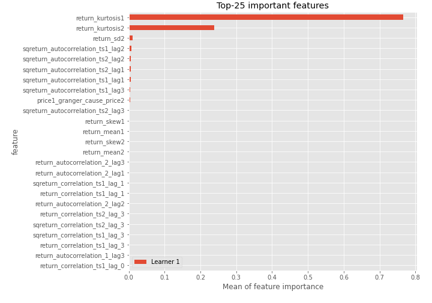
## Confusion Matrix

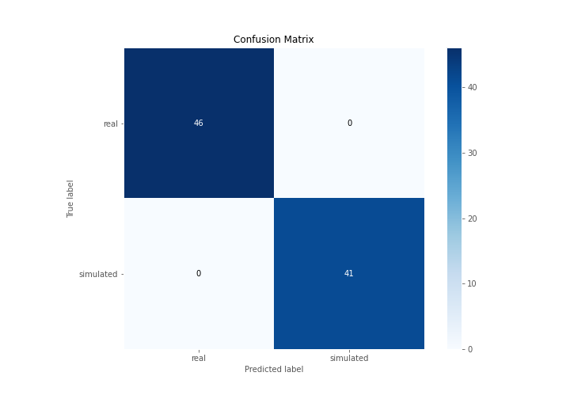

## Normalized Confusion Matrix

## ROC Curve

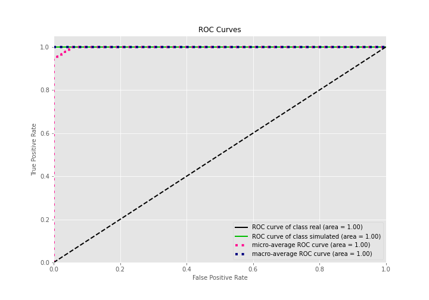

## Kolmogorov-Smirnov Statistic

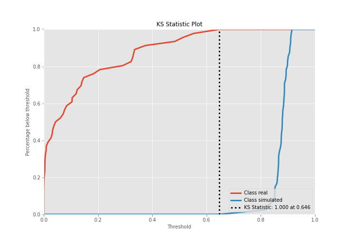

## Precision-Recall Curve

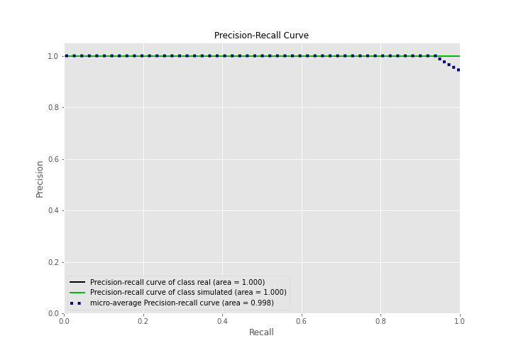

## Calibration Curve

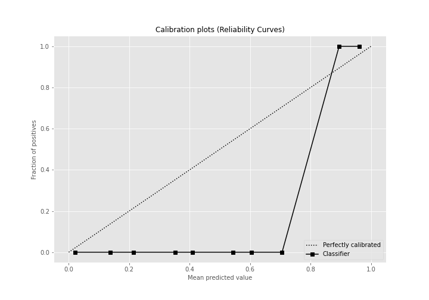

## Cumulative Gains Curve

## Lift Curve

## SHAP Importance
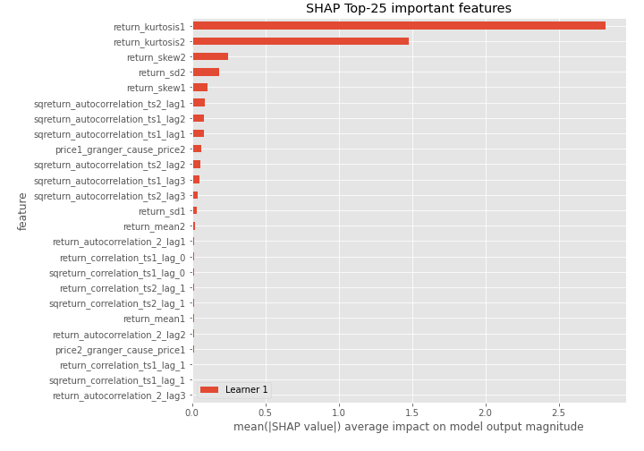

## SHAP Dependence plots

### Dependence (Fold 1)
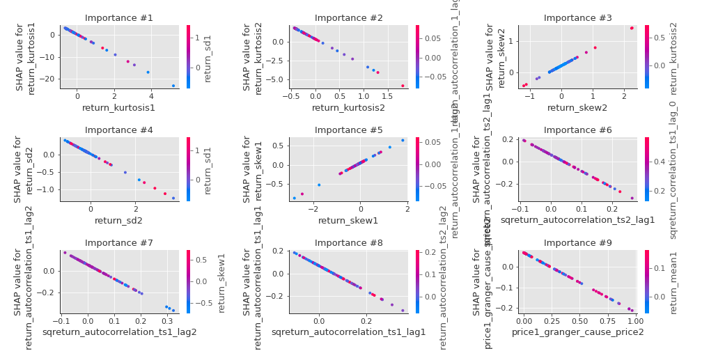

## SHAP Decision plots

### Top-10 Worst decisions for class 0 (Fold 1)
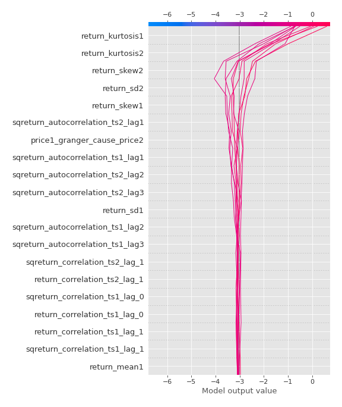
### Top-10 Best decisions for class 0 (Fold 1)
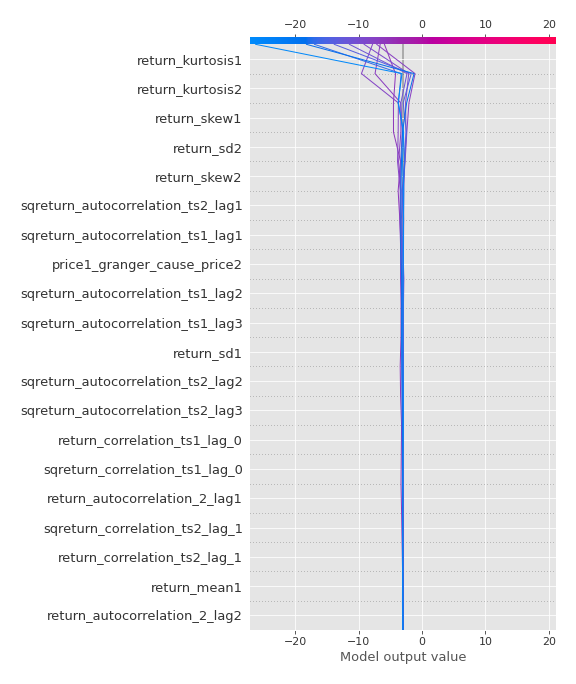
### Top-10 Worst decisions for class 1 (Fold 1)
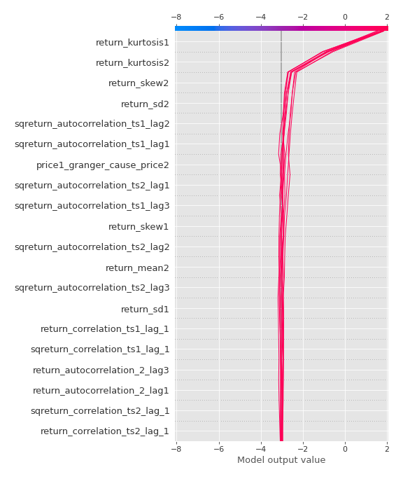
### Top-10 Best decisions for class 1 (Fold 1)
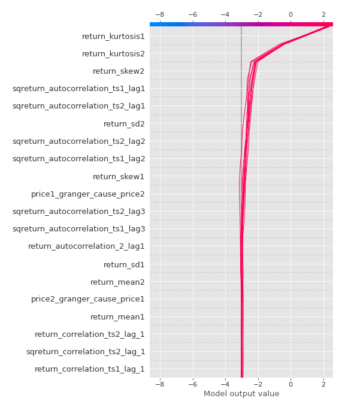

[<< Go back](../README.md)
