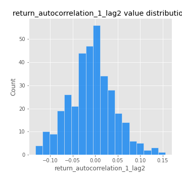
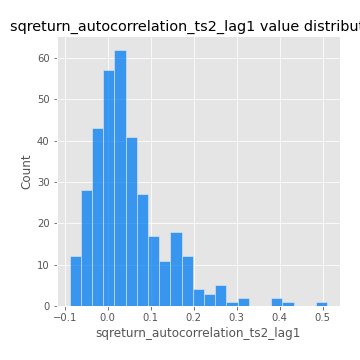
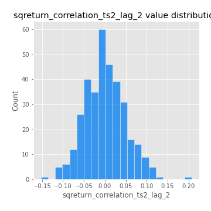
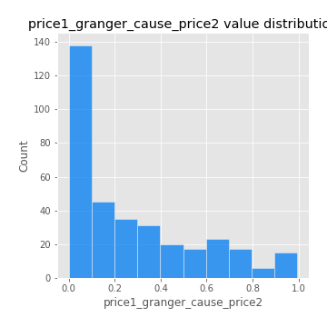

# Exploratory Data Analysis

[<< Go back](../README.md)
## Feature : target
- **Feature type** : categorical
- **Missing** : 0.0%
- **Unique** : 2
- **Count** :347
- **Unique** :2
- **Top** :real
- **Freq** :183

## Feature : return_mean1
- **Feature type** : continous
- **Missing** : 0.0%
- **Unique** : 347
- **Count** :347.0
- **Mean** :0.0457778597903738
- **Std** :0.0768722249811756
- **Min** :-0.22632637961920957
- **25%th Percentile** : -0.0007534599864896772
- **50%th Percentile** : 0.05108094777383779
- **75%th Percentile** : 0.09732697549737619
- **Max** :0.3612366374600757

## Feature : return_mean2
- **Feature type** : continous
- **Missing** : 0.0%
- **Unique** : 347
- **Count** :347.0
- **Mean** :0.04929195069416956
- **Std** :0.09276111275072269
- **Min** :-0.2717864613154694
- **25%th Percentile** : 0.007234541471473271
- **50%th Percentile** : 0.05147143048570743
- **75%th Percentile** : 0.09712494274979735
- **Max** :0.5105320496106962

## Feature : return_sd1
- **Feature type** : continous
- **Missing** : 0.0%
- **Unique** : 347
- **Count** :347.0
- **Mean** :1.7640479937378981
- **Std** :0.742132359861945
- **Min** :0.7470080772831957
- **25%th Percentile** : 1.5251599701360905
- **50%th Percentile** : 1.6001305832042996
- **75%th Percentile** : 1.7017592633017347
- **Max** :9.236766377527575

## Feature : return_sd2
- **Feature type** : continous
- **Missing** : 0.0%
- **Unique** : 347
- **Count** :347.0
- **Mean** :1.7501947946020684
- **Std** :0.6794223036435466
- **Min** :0.8592887433004143
- **25%th Percentile** : 1.513396069219419
- **50%th Percentile** : 1.5921761361818612
- **75%th Percentile** : 1.6820706002965111
- **Max** :5.762808157208253

## Feature : return_skew1
- **Feature type** : continous
- **Missing** : 0.0%
- **Unique** : 347
- **Count** :347.0
- **Mean** :-0.13502198025729928
- **Std** :0.6209095896434778
- **Min** :-3.530116233761814
- **25%th Percentile** : -0.220113359672915
- **50%th Percentile** : -0.04617106524017351
- **75%th Percentile** : 0.08849660689837821
- **Max** :2.5845963767725557

## Feature : return_skew2
- **Feature type** : continous
- **Missing** : 0.0%
- **Unique** : 347
- **Count** :347.0
- **Mean** :-0.17324794243021957
- **Std** :0.8378625513428836
- **Min** :-8.801502855292393
- **25%th Percentile** : -0.24205995684983467
- **50%th Percentile** : -0.04914499165489331
- **75%th Percentile** : 0.09768693359294764
- **Max** :2.2606839051517187

## Feature : return_kurtosis1
- **Feature type** : continous
- **Missing** : 0.0%
- **Unique** : 347
- **Count** :347.0
- **Mean** :3.49720042618307
- **Std** :6.391204104062654
- **Min** :-0.5737607505572799
- **25%th Percentile** : 0.01893149593641774
- **50%th Percentile** : 1.036885937644493
- **75%th Percentile** : 3.991611060155577
- **Max** :46.07507808162177

## Feature : return_kurtosis2
- **Feature type** : continous
- **Missing** : 0.0%
- **Unique** : 347
- **Count** :347.0
- **Mean** :4.247805197441199
- **Std** :10.66448993489473
- **Min** :-0.4553501403832607
- **25%th Percentile** : 0.02955361087955377
- **50%th Percentile** : 1.0180535884625033
- **75%th Percentile** : 4.393039424201936
- **Max** :143.10871011533666

## Feature : return_autocorrelation_1_lag1
- **Feature type** : continous
- **Missing** : 0.0%
- **Unique** : 347
- **Count** :347.0
- **Mean** :-0.013832560743700628
- **Std** :0.055832396521261506
- **Min** :-0.2135576224968752
- **25%th Percentile** : -0.04570609477708519
- **50%th Percentile** : -0.009897810803975601
- **75%th Percentile** : 0.022971006224665507
- **Max** :0.12810656890648087

## Feature : return_autocorrelation_1_lag2
- **Feature type** : continous
- **Missing** : 0.0%
- **Unique** : 347
- **Count** :347.0
- **Mean** :-0.00787300686677108
- **Std** :0.05024482578018873
- **Min** :-0.13309283796645122
- **25%th Percentile** : -0.03733367077534049
- **50%th Percentile** : -0.006053352581127035
- **75%th Percentile** : 0.022277374114322603
- **Max** :0.1561488228015672

## Feature : return_autocorrelation_1_lag3
- **Feature type** : continous
- **Missing** : 0.0%
- **Unique** : 347
- **Count** :347.0
- **Mean** :-0.002672485069710309
- **Std** :0.052872081165528925
- **Min** :-0.1940836867390813
- **25%th Percentile** : -0.03661245024696724
- **50%th Percentile** : -0.0006017800023255181
- **75%th Percentile** : 0.031142658784767963
- **Max** :0.17805869530681923

## Feature : return_autocorrelation_2_lag1
- **Feature type** : continous
- **Missing** : 0.0%
- **Unique** : 347
- **Count** :347.0
- **Mean** :-0.005987847692383904
- **Std** :0.06197288338624717
- **Min** :-0.24590087874039124
- **25%th Percentile** : -0.037263771314391105
- **50%th Percentile** : -0.002249764690042738
- **75%th Percentile** : 0.032970675570875616
- **Max** :0.31863413537898483

## Feature : return_autocorrelation_2_lag2
- **Feature type** : continous
- **Missing** : 0.0%
- **Unique** : 347
- **Count** :347.0
- **Mean** :0.0006822899119834896
- **Std** :0.0501766207918642
- **Min** :-0.13300063901033632
- **25%th Percentile** : -0.03460658267809594
- **50%th Percentile** : -0.002929928360732404
- **75%th Percentile** : 0.032971506537967626
- **Max** :0.20974504043791217

## Feature : return_autocorrelation_2_lag3
- **Feature type** : continous
- **Missing** : 0.0%
- **Unique** : 347
- **Count** :347.0
- **Mean** :-0.0014014814556178115
- **Std** :0.050975640451802716
- **Min** :-0.1651975372315209
- **25%th Percentile** : -0.03099500757965982
- **50%th Percentile** : -0.0003904222372115092
- **75%th Percentile** : 0.031303563596266244
- **Max** :0.12489629575199976

## Feature : return_correlation_ts1_lag_0
- **Feature type** : continous
- **Missing** : 0.0%
- **Unique** : 347
- **Count** :347.0
- **Mean** :0.3226793934074296
- **Std** :0.11304671454600963
- **Min** :-0.027089510445801036
- **25%th Percentile** : 0.266247248665264
- **50%th Percentile** : 0.32598878105302487
- **75%th Percentile** : 0.36644745875701035
- **Max** :0.7041861626832071

## Feature : return_correlation_ts1_lag_1
- **Feature type** : continous
- **Missing** : 0.0%
- **Unique** : 347
- **Count** :347.0
- **Mean** :-0.006703101561683993
- **Std** :0.0527843193822915
- **Min** :-0.16985510949917193
- **25%th Percentile** : -0.03884371450054926
- **50%th Percentile** : 0.0010620299042451622
- **75%th Percentile** : 0.02763763967281714
- **Max** :0.15499424718508623

## Feature : return_correlation_ts1_lag_2
- **Feature type** : continous
- **Missing** : 0.0%
- **Unique** : 347
- **Count** :347.0
- **Mean** :-0.005298337216962663
- **Std** :0.050811085883435844
- **Min** :-0.21653581047581763
- **25%th Percentile** : -0.03625973031398716
- **50%th Percentile** : -0.0037917112102554803
- **75%th Percentile** : 0.025855827439259287
- **Max** :0.14313051098359855

## Feature : return_correlation_ts1_lag_3
- **Feature type** : continous
- **Missing** : 0.0%
- **Unique** : 347
- **Count** :347.0
- **Mean** :-0.0032582629767014754
- **Std** :0.0521825265358722
- **Min** :-0.1270218498974763
- **25%th Percentile** : -0.038850787742442716
- **50%th Percentile** : -0.00468077505976925
- **75%th Percentile** : 0.032398884237815104
- **Max** :0.1636773216468148

## Feature : return_correlation_ts2_lag_1
- **Feature type** : continous
- **Missing** : 0.0%
- **Unique** : 347
- **Count** :347.0
- **Mean** :-0.005466729465401474
- **Std** :0.05033381751492352
- **Min** :-0.20093919236581337
- **25%th Percentile** : -0.03718363462512027
- **50%th Percentile** : -0.005908538225282491
- **75%th Percentile** : 0.027331759211857647
- **Max** :0.11556235671885211

## Feature : return_correlation_ts2_lag_2
- **Feature type** : continous
- **Missing** : 0.0%
- **Unique** : 347
- **Count** :347.0
- **Mean** :8.1914758458932e-05
- **Std** :0.04905362223212825
- **Min** :-0.15299951737180204
- **25%th Percentile** : -0.03313167404374927
- **50%th Percentile** : -0.003186316216567342
- **75%th Percentile** : 0.0291691234964298
- **Max** :0.20772887392904255

## Feature : return_correlation_ts2_lag_3
- **Feature type** : continous
- **Missing** : 0.0%
- **Unique** : 347
- **Count** :347.0
- **Mean** :-0.0013742491089489156
- **Std** :0.05297783630132873
- **Min** :-0.17564076057312866
- **25%th Percentile** : -0.030983856177913584
- **50%th Percentile** : -0.0006673542034418449
- **75%th Percentile** : 0.036861410861043595
- **Max** :0.13128380114518473

## Feature : sqreturn_autocorrelation_ts1_lag1
- **Feature type** : continous
- **Missing** : 0.0%
- **Unique** : 347
- **Count** :347.0
- **Mean** :0.05298264177808532
- **Std** :0.09206857107382097
- **Min** :-0.10433382002538058
- **25%th Percentile** : -0.006803250544938903
- **50%th Percentile** : 0.03293070985705266
- **75%th Percentile** : 0.08626020282751887
- **Max** :0.4439086285737898

## Feature : sqreturn_autocorrelation_ts1_lag2
- **Feature type** : continous
- **Missing** : 0.0%
- **Unique** : 347
- **Count** :347.0
- **Mean** :0.038916169795645474
- **Std** :0.09496044574418763
- **Min** :-0.1226330380754222
- **25%th Percentile** : -0.016393642108287105
- **50%th Percentile** : 0.012317256354460881
- **75%th Percentile** : 0.06420564692038422
- **Max** :0.540735851444759

## Feature : sqreturn_autocorrelation_ts1_lag3
- **Feature type** : continous
- **Missing** : 0.0%
- **Unique** : 347
- **Count** :347.0
- **Mean** :0.03246892597513944
- **Std** :0.08238899923417999
- **Min** :-0.09712999512866781
- **25%th Percentile** : -0.01785354172634835
- **50%th Percentile** : 0.01184291139196473
- **75%th Percentile** : 0.056831289985062955
- **Max** :0.44755937369538146

## Feature : sqreturn_autocorrelation_ts2_lag1
- **Feature type** : continous
- **Missing** : 0.0%
- **Unique** : 347
- **Count** :347.0
- **Mean** :0.04841633909563014
- **Std** :0.08803503590000222
- **Min** :-0.08889144172102625
- **25%th Percentile** : -0.009417196509675737
- **50%th Percentile** : 0.028799284522873014
- **75%th Percentile** : 0.08340966532386881
- **Max** :0.510085647437958

## Feature : sqreturn_autocorrelation_ts2_lag2
- **Feature type** : continous
- **Missing** : 0.0%
- **Unique** : 347
- **Count** :347.0
- **Mean** :0.03896172678615888
- **Std** :0.09166700586219431
- **Min** :-0.12730085275958786
- **25%th Percentile** : -0.01204232815119979
- **50%th Percentile** : 0.013717832175119488
- **75%th Percentile** : 0.0699033668991818
- **Max** :0.5373432415582473

## Feature : sqreturn_autocorrelation_ts2_lag3
- **Feature type** : continous
- **Missing** : 0.0%
- **Unique** : 347
- **Count** :347.0
- **Mean** :0.027166191396795145
- **Std** :0.07055830863996639
- **Min** :-0.09272813860801718
- **25%th Percentile** : -0.01891669917942252
- **50%th Percentile** : 0.013928509829793058
- **75%th Percentile** : 0.05416034161206201
- **Max** :0.31225727797735664

## Feature : sqreturn_correlation_ts1_lag_0
- **Feature type** : continous
- **Missing** : 0.0%
- **Unique** : 347
- **Count** :347.0
- **Mean** :0.3226793934074296
- **Std** :0.11304671454600963
- **Min** :-0.027089510445801036
- **25%th Percentile** : 0.266247248665264
- **50%th Percentile** : 0.32598878105302487
- **75%th Percentile** : 0.36644745875701035
- **Max** :0.7041861626832071

## Feature : sqreturn_correlation_ts1_lag_1
- **Feature type** : continous
- **Missing** : 0.0%
- **Unique** : 347
- **Count** :347.0
- **Mean** :-0.006703101561683993
- **Std** :0.0527843193822915
- **Min** :-0.16985510949917193
- **25%th Percentile** : -0.03884371450054926
- **50%th Percentile** : 0.0010620299042451622
- **75%th Percentile** : 0.02763763967281714
- **Max** :0.15499424718508623

## Feature : sqreturn_correlation_ts1_lag_2
- **Feature type** : continous
- **Missing** : 0.0%
- **Unique** : 347
- **Count** :347.0
- **Mean** :-0.005298337216962663
- **Std** :0.050811085883435844
- **Min** :-0.21653581047581763
- **25%th Percentile** : -0.03625973031398716
- **50%th Percentile** : -0.0037917112102554803
- **75%th Percentile** : 0.025855827439259287
- **Max** :0.14313051098359855

## Feature : sqreturn_correlation_ts1_lag_3
- **Feature type** : continous
- **Missing** : 0.0%
- **Unique** : 347
- **Count** :347.0
- **Mean** :-0.0032582629767014754
- **Std** :0.0521825265358722
- **Min** :-0.1270218498974763
- **25%th Percentile** : -0.038850787742442716
- **50%th Percentile** : -0.00468077505976925
- **75%th Percentile** : 0.032398884237815104
- **Max** :0.1636773216468148

## Feature : sqreturn_correlation_ts2_lag_1
- **Feature type** : continous
- **Missing** : 0.0%
- **Unique** : 347
- **Count** :347.0
- **Mean** :-0.005466729465401474
- **Std** :0.05033381751492352
- **Min** :-0.20093919236581337
- **25%th Percentile** : -0.03718363462512027
- **50%th Percentile** : -0.005908538225282491
- **75%th Percentile** : 0.027331759211857647
- **Max** :0.11556235671885211

## Feature : sqreturn_correlation_ts2_lag_2
- **Feature type** : continous
- **Missing** : 0.0%
- **Unique** : 347
- **Count** :347.0
- **Mean** :8.1914758458932e-05
- **Std** :0.04905362223212825
- **Min** :-0.15299951737180204
- **25%th Percentile** : -0.03313167404374927
- **50%th Percentile** : -0.003186316216567342
- **75%th Percentile** : 0.0291691234964298
- **Max** :0.20772887392904255

## Feature : sqreturn_correlation_ts2_lag_3
- **Feature type** : continous
- **Missing** : 0.0%
- **Unique** : 347
- **Count** :347.0
- **Mean** :-0.0013742491089489156
- **Std** :0.05297783630132873
- **Min** :-0.17564076057312866
- **25%th Percentile** : -0.030983856177913584
- **50%th Percentile** : -0.0006673542034418449
- **75%th Percentile** : 0.036861410861043595
- **Max** :0.13128380114518473

## Feature : price2_granger_cause_price1
- **Feature type** : continous
- **Missing** : 0.0%
- **Unique** : 347
- **Count** :347.0
- **Mean** :0.32083733557365357
- **Std** :0.303830136387021
- **Min** :1.1505642493585304e-05
- **25%th Percentile** : 0.05182736934649812
- **50%th Percentile** : 0.22927600170723084
- **75%th Percentile** : 0.5303157003266483
- **Max** :0.9967967316104489

## Feature : price1_granger_cause_price2
- **Feature type** : continous
- **Missing** : 0.0%
- **Unique** : 347
- **Count** :347.0
- **Mean** :0.2767153790285994
- **Std** :0.28118935548511204
- **Min** :8.824403237295442e-07
- **25%th Percentile** : 0.030400313426018306
- **50%th Percentile** : 0.179982543139626
- **75%th Percentile** : 0.45066781724305094
- **Max** :0.9951398266867577

[<< Go back](../README.md)
