# Summary of 3_Linear

[<< Go back](../README.md)

## Logistic Regression (Linear)
- **n_jobs**: -1
- **explain_level**: 2

## Validation
 - **validation_type**: split
 - **train_ratio**: 0.75
 - **shuffle**: True
 - **stratify**: True

## Optimized metric
accuracy

## Training time

19.1 seconds

## Metric details
|           |    score |     threshold |
|:----------|---------:|--------------:|
| logloss   | 0.150259 | nan           |
| auc       | 1        | nan           |
| f1        | 1        |   0.81725     |
| accuracy  | 1        |   0.81725     |
| precision | 1        |   0.915527    |
| recall    | 1        |   1.49586e-14 |
| mcc       | 1        |   0.81725     |

## Confusion matrix (at threshold=0.81725)
|                      |   Predicted as real |   Predicted as simulated |
|:---------------------|--------------------:|-------------------------:|
| Labeled as real      |                  43 |                        0 |
| Labeled as simulated |                   0 |                       44 |

## Learning curves
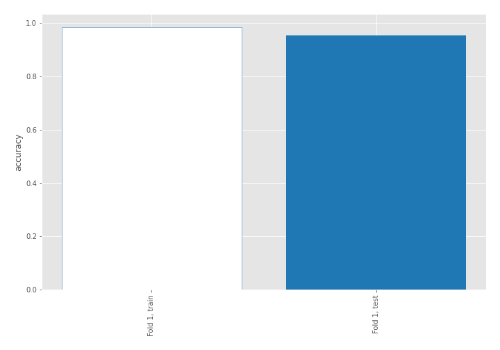

## Coefficients
| feature                           |   Learner_1 |
|:----------------------------------|------------:|
| return_skew2                      |   0.885565  |
| return_skew1                      |   0.537323  |
| return_autocorrelation_2_lag1     |   0.340561  |
| return_correlation_ts2_lag_3      |   0.312307  |
| sqreturn_correlation_ts2_lag_3    |   0.312307  |
| return_autocorrelation_2_lag3     |   0.234306  |
| sqreturn_correlation_ts1_lag_2    |   0.229954  |
| return_correlation_ts1_lag_2      |   0.229954  |
| sqreturn_correlation_ts1_lag_1    |   0.160875  |
| return_correlation_ts1_lag_1      |   0.160875  |
| sqreturn_correlation_ts2_lag_1    |   0.147225  |
| return_correlation_ts2_lag_1      |   0.147225  |
| return_autocorrelation_2_lag2     |   0.121322  |
| return_autocorrelation_1_lag2     |   0.0928221 |
| sqreturn_correlation_ts1_lag_3    |   0.0636161 |
| return_correlation_ts1_lag_3      |   0.0636161 |
| sqreturn_correlation_ts1_lag_0    |   0.0346333 |
| return_correlation_ts1_lag_0      |   0.0346333 |
| return_autocorrelation_1_lag3     |   0.0263266 |
| return_correlation_ts2_lag_2      |  -0.0173201 |
| sqreturn_correlation_ts2_lag_2    |  -0.0173201 |
| return_sd1                        |  -0.0445972 |
| return_autocorrelation_1_lag1     |  -0.0695467 |
| price2_granger_cause_price1       |  -0.132218  |
| return_mean1                      |  -0.225851  |
| return_mean2                      |  -0.279375  |
| return_sd2                        |  -0.296401  |
| price1_granger_cause_price2       |  -0.381082  |
| sqreturn_autocorrelation_ts2_lag3 |  -0.452287  |
| sqreturn_autocorrelation_ts1_lag3 |  -0.859256  |
| sqreturn_autocorrelation_ts1_lag1 |  -0.970049  |
| sqreturn_autocorrelation_ts1_lag2 |  -0.988966  |
| sqreturn_autocorrelation_ts2_lag2 |  -1.03862   |
| sqreturn_autocorrelation_ts2_lag1 |  -1.15469   |
| intercept                         |  -1.45823   |
| return_kurtosis2                  |  -3.59201   |
| return_kurtosis1                  |  -4.09353   |

## Permutation-based Importance
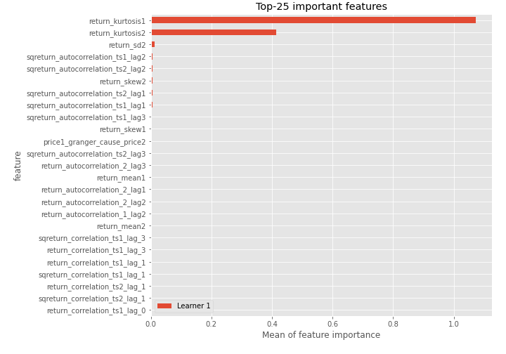
## Confusion Matrix

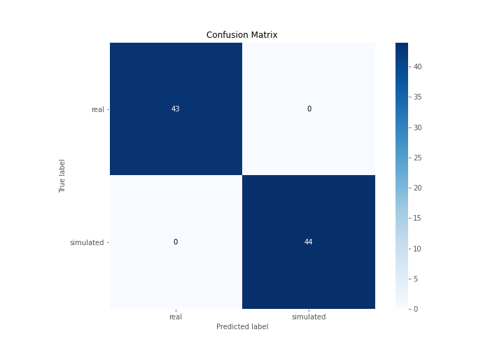

## Normalized Confusion Matrix

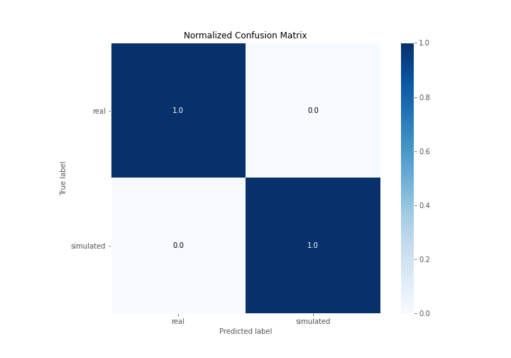

## ROC Curve

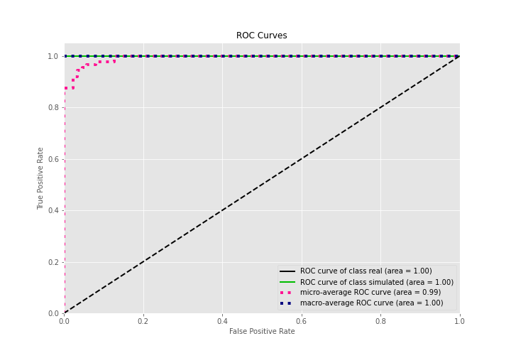

## Kolmogorov-Smirnov Statistic

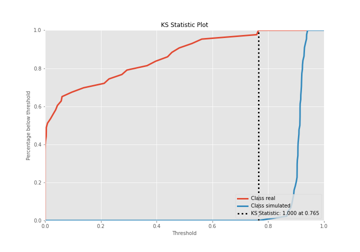

## Precision-Recall Curve

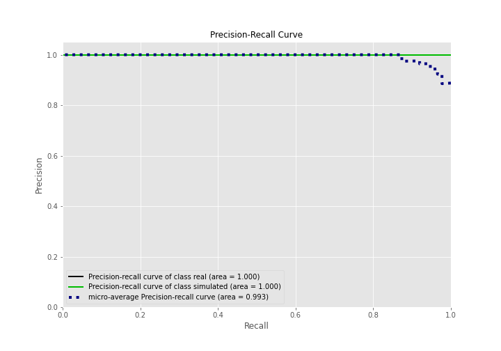

## Calibration Curve

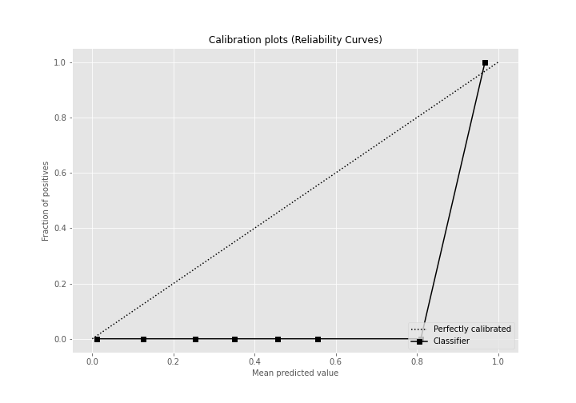

## Cumulative Gains Curve

## Lift Curve

## SHAP Importance
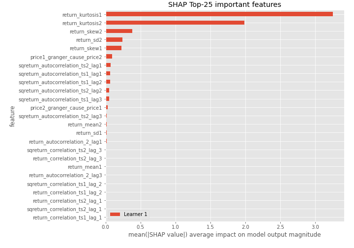

## SHAP Dependence plots

### Dependence (Fold 1)
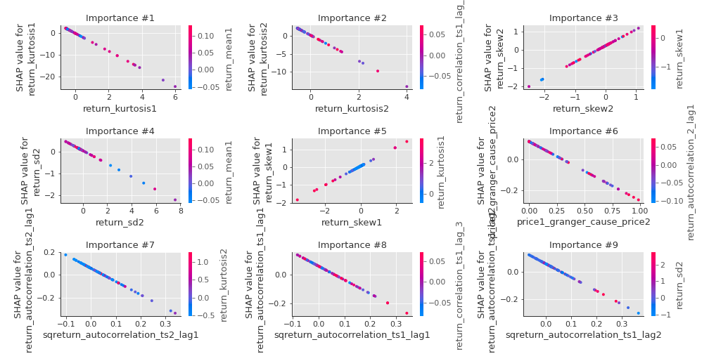

## SHAP Decision plots

### Top-10 Worst decisions for class 0 (Fold 1)
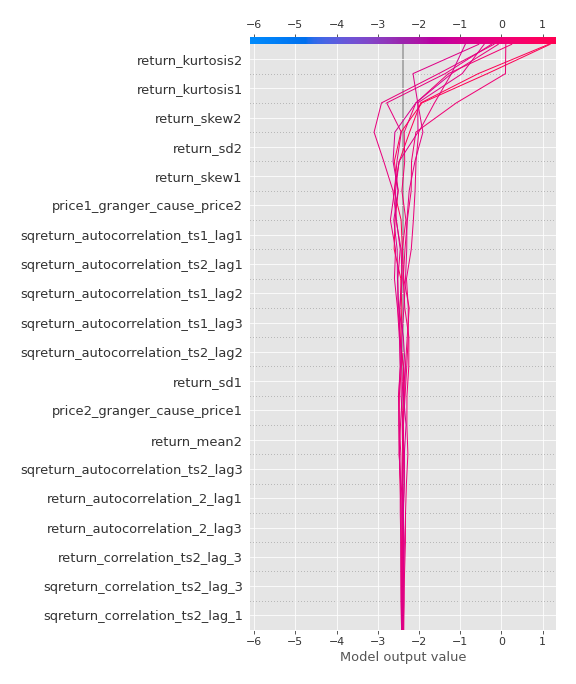
### Top-10 Best decisions for class 0 (Fold 1)
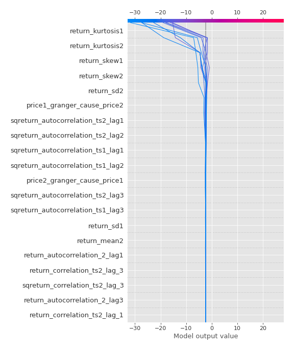
### Top-10 Worst decisions for class 1 (Fold 1)
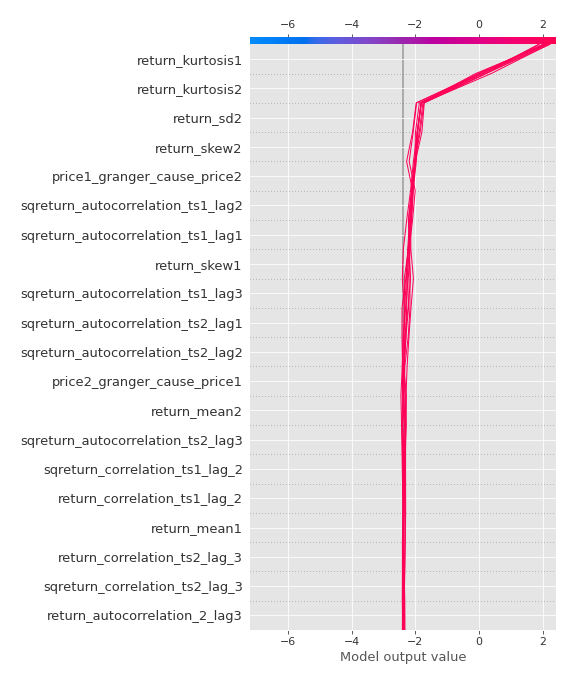
### Top-10 Best decisions for class 1 (Fold 1)
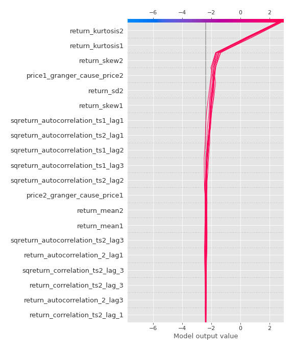

[<< Go back](../README.md)
