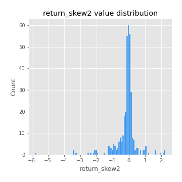
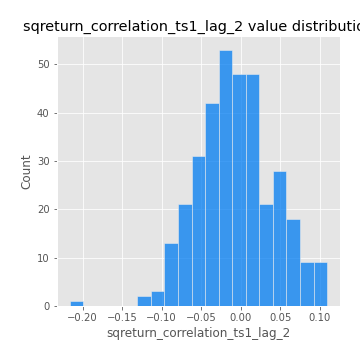
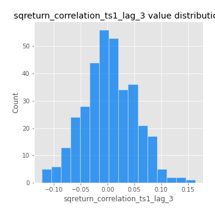
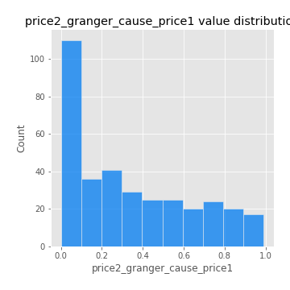

# Exploratory Data Analysis

[<< Go back](../README.md)
## Feature : target
- **Feature type** : categorical
- **Missing** : 0.0%
- **Unique** : 2
- **Count** :347
- **Unique** :2
- **Top** :simulated
- **Freq** :177

## Feature : return_mean1
- **Feature type** : continous
- **Missing** : 0.0%
- **Unique** : 347
- **Count** :347.0
- **Mean** :0.04505963215739239
- **Std** :0.07324902856974393
- **Min** :-0.22632637961920957
- **25%th Percentile** : 0.0034748487960946763
- **50%th Percentile** : 0.04735241840903316
- **75%th Percentile** : 0.08746533110420385
- **Max** :0.37175100008111034

## Feature : return_mean2
- **Feature type** : continous
- **Missing** : 0.0%
- **Unique** : 347
- **Count** :347.0
- **Mean** :0.05542910995215179
- **Std** :0.08931219069479635
- **Min** :-0.2937912473535297
- **25%th Percentile** : 0.006471774689041265
- **50%th Percentile** : 0.05496033167592653
- **75%th Percentile** : 0.10397859936082865
- **Max** :0.37616608147096464

## Feature : return_sd1
- **Feature type** : continous
- **Missing** : 0.0%
- **Unique** : 347
- **Count** :347.0
- **Mean** :1.7536596514615452
- **Std** :0.742265041122684
- **Min** :0.8382061051466024
- **25%th Percentile** : 1.5356925119310447
- **50%th Percentile** : 1.6081703843733677
- **75%th Percentile** : 1.684711512147079
- **Max** :9.236766377527575

## Feature : return_sd2
- **Feature type** : continous
- **Missing** : 0.0%
- **Unique** : 347
- **Count** :347.0
- **Mean** :1.778264366380281
- **Std** :0.7342259273791325
- **Min** :0.8455946193085045
- **25%th Percentile** : 1.517417190082878
- **50%th Percentile** : 1.5971616652142842
- **75%th Percentile** : 1.6986737225280546
- **Max** :6.737618636746393

## Feature : return_skew1
- **Feature type** : continous
- **Missing** : 0.0%
- **Unique** : 347
- **Count** :347.0
- **Mean** :-0.11793781180019863
- **Std** :0.5798415681091319
- **Min** :-3.530116233761814
- **25%th Percentile** : -0.1974003896828494
- **50%th Percentile** : -0.03059124198050329
- **75%th Percentile** : 0.09125383038982011
- **Max** :2.5845963767725557

## Feature : return_skew2
- **Feature type** : continous
- **Missing** : 0.0%
- **Unique** : 347
- **Count** :347.0
- **Mean** :-0.1479473780992798
- **Std** :0.7095888629917259
- **Min** :-5.778144124281153
- **25%th Percentile** : -0.2155998916328487
- **50%th Percentile** : -0.04507599024925819
- **75%th Percentile** : 0.07712417342209088
- **Max** :2.2606839051517187

## Feature : return_kurtosis1
- **Feature type** : continous
- **Missing** : 0.0%
- **Unique** : 347
- **Count** :347.0
- **Mean** :3.071166607560057
- **Std** :6.0346923141183355
- **Min** :-0.4985769710653827
- **25%th Percentile** : -0.011663991230860704
- **50%th Percentile** : 0.42977502486788843
- **75%th Percentile** : 3.4722373045745223
- **Max** :46.07507808162177

## Feature : return_kurtosis2
- **Feature type** : continous
- **Missing** : 0.0%
- **Unique** : 347
- **Count** :347.0
- **Mean** :3.773946898512449
- **Std** :7.612268576728308
- **Min** :-0.45425925953550816
- **25%th Percentile** : -0.034218866179302365
- **50%th Percentile** : 0.5567163202427889
- **75%th Percentile** : 4.45777438765429
- **Max** :71.39844769176813

## Feature : return_autocorrelation_1_lag1
- **Feature type** : continous
- **Missing** : 0.0%
- **Unique** : 347
- **Count** :347.0
- **Mean** :-0.013878230603801115
- **Std** :0.05634582130793649
- **Min** :-0.2135576224968752
- **25%th Percentile** : -0.04264622024518665
- **50%th Percentile** : -0.010101497057991118
- **75%th Percentile** : 0.022730818852315315
- **Max** :0.12810656890648087

## Feature : return_autocorrelation_1_lag2
- **Feature type** : continous
- **Missing** : 0.0%
- **Unique** : 347
- **Count** :347.0
- **Mean** :-0.008835782408597517
- **Std** :0.047573881037563
- **Min** :-0.14548293336192095
- **25%th Percentile** : -0.03880387441213439
- **50%th Percentile** : -0.01003734502155644
- **75%th Percentile** : 0.02145258500524134
- **Max** :0.13974986309997453

## Feature : return_autocorrelation_1_lag3
- **Feature type** : continous
- **Missing** : 0.0%
- **Unique** : 347
- **Count** :347.0
- **Mean** :-0.002450969562666463
- **Std** :0.04959595546611721
- **Min** :-0.1940836867390813
- **25%th Percentile** : -0.03243271238885632
- **50%th Percentile** : -0.003162210545392699
- **75%th Percentile** : 0.029409376358724794
- **Max** :0.17805869530681923

## Feature : return_autocorrelation_2_lag1
- **Feature type** : continous
- **Missing** : 0.0%
- **Unique** : 347
- **Count** :347.0
- **Mean** :-0.006228071294890905
- **Std** :0.06382325074996266
- **Min** :-0.24590087874039124
- **25%th Percentile** : -0.04032114967669197
- **50%th Percentile** : -0.0026797033400814078
- **75%th Percentile** : 0.03380138872734753
- **Max** :0.31863413537898483

## Feature : return_autocorrelation_2_lag2
- **Feature type** : continous
- **Missing** : 0.0%
- **Unique** : 347
- **Count** :347.0
- **Mean** :-0.003754564458085315
- **Std** :0.051780291207062165
- **Min** :-0.15323211089747296
- **25%th Percentile** : -0.03919622598470319
- **50%th Percentile** : -0.0073852656839891555
- **75%th Percentile** : 0.030950951012111195
- **Max** :0.20974504043791217

## Feature : return_autocorrelation_2_lag3
- **Feature type** : continous
- **Missing** : 0.0%
- **Unique** : 347
- **Count** :347.0
- **Mean** :0.0004605240879740033
- **Std** :0.05026150865747557
- **Min** :-0.14200107169559698
- **25%th Percentile** : -0.033081246418118215
- **50%th Percentile** : -0.0003904222372115092
- **75%th Percentile** : 0.03278398636541098
- **Max** :0.1419999376914021

## Feature : return_correlation_ts1_lag_0
- **Feature type** : continous
- **Missing** : 0.0%
- **Unique** : 347
- **Count** :347.0
- **Mean** :0.3159633403398735
- **Std** :0.10598227342425452
- **Min** :-0.027089510445801036
- **25%th Percentile** : 0.2657185734178735
- **50%th Percentile** : 0.31926692532554934
- **75%th Percentile** : 0.36328794192006925
- **Max** :0.7041861626832071

## Feature : return_correlation_ts1_lag_1
- **Feature type** : continous
- **Missing** : 0.0%
- **Unique** : 347
- **Count** :347.0
- **Mean** :-0.006093993694142764
- **Std** :0.04906525450376204
- **Min** :-0.16985510949917193
- **25%th Percentile** : -0.03729648101610081
- **50%th Percentile** : -0.0033191428202869475
- **75%th Percentile** : 0.027514961941583677
- **Max** :0.15499424718508623

## Feature : return_correlation_ts1_lag_2
- **Feature type** : continous
- **Missing** : 0.0%
- **Unique** : 347
- **Count** :347.0
- **Mean** :-0.006036655480770567
- **Std** :0.04779040457626222
- **Min** :-0.21653581047581763
- **25%th Percentile** : -0.03830567183411149
- **50%th Percentile** : -0.00790984021372761
- **75%th Percentile** : 0.022672885186036162
- **Max** :0.10916944041387708

## Feature : return_correlation_ts1_lag_3
- **Feature type** : continous
- **Missing** : 0.0%
- **Unique** : 347
- **Count** :347.0
- **Mean** :0.002674466575391879
- **Std** :0.048890260472681246
- **Min** :-0.12306593817498207
- **25%th Percentile** : -0.02788484333958402
- **50%th Percentile** : 0.0016272903736618905
- **75%th Percentile** : 0.03581291687605298
- **Max** :0.1636773216468148

## Feature : return_correlation_ts2_lag_1
- **Feature type** : continous
- **Missing** : 0.0%
- **Unique** : 347
- **Count** :347.0
- **Mean** :-0.006258119477001011
- **Std** :0.052078097502229866
- **Min** :-0.2081139431093261
- **25%th Percentile** : -0.038718859181438886
- **50%th Percentile** : -0.006965606495560585
- **75%th Percentile** : 0.0262003862507009
- **Max** :0.13000744969056402

## Feature : return_correlation_ts2_lag_2
- **Feature type** : continous
- **Missing** : 0.0%
- **Unique** : 347
- **Count** :347.0
- **Mean** :-0.002327088749128217
- **Std** :0.049005693142954186
- **Min** :-0.23751835475804678
- **25%th Percentile** : -0.03158121552550065
- **50%th Percentile** : 0.00017685560311833616
- **75%th Percentile** : 0.023170407063990463
- **Max** :0.15388933426238696

## Feature : return_correlation_ts2_lag_3
- **Feature type** : continous
- **Missing** : 0.0%
- **Unique** : 347
- **Count** :347.0
- **Mean** :0.0027869116667218717
- **Std** :0.04692107072062882
- **Min** :-0.15490495486968472
- **25%th Percentile** : -0.02495459021351029
- **50%th Percentile** : 0.0023562354187243667
- **75%th Percentile** : 0.034154841106853684
- **Max** :0.13128380114518473

## Feature : sqreturn_autocorrelation_ts1_lag1
- **Feature type** : continous
- **Missing** : 0.0%
- **Unique** : 347
- **Count** :347.0
- **Mean** :0.05187671781675686
- **Std** :0.09382749499576999
- **Min** :-0.10483619166732361
- **25%th Percentile** : -0.009310032576167797
- **50%th Percentile** : 0.027669307176337657
- **75%th Percentile** : 0.08583923718928968
- **Max** :0.49414293176447355

## Feature : sqreturn_autocorrelation_ts1_lag2
- **Feature type** : continous
- **Missing** : 0.0%
- **Unique** : 347
- **Count** :347.0
- **Mean** :0.040735320438578575
- **Std** :0.09388274118630278
- **Min** :-0.12031106133947464
- **25%th Percentile** : -0.015957001935151253
- **50%th Percentile** : 0.01846933200122211
- **75%th Percentile** : 0.06606918478632223
- **Max** :0.540735851444759

## Feature : sqreturn_autocorrelation_ts1_lag3
- **Feature type** : continous
- **Missing** : 0.0%
- **Unique** : 347
- **Count** :347.0
- **Mean** :0.033482603665083
- **Std** :0.08374699214231275
- **Min** :-0.11622294038013246
- **25%th Percentile** : -0.018460272952544064
- **50%th Percentile** : 0.013671356447919194
- **75%th Percentile** : 0.05837947459058129
- **Max** :0.44755937369538146

## Feature : sqreturn_autocorrelation_ts2_lag1
- **Feature type** : continous
- **Missing** : 0.0%
- **Unique** : 347
- **Count** :347.0
- **Mean** :0.04762058123893757
- **Std** :0.08877451917453026
- **Min** :-0.10204322789584688
- **25%th Percentile** : -0.008037471902376588
- **50%th Percentile** : 0.028799284522873014
- **75%th Percentile** : 0.07858842986691716
- **Max** :0.510085647437958

## Feature : sqreturn_autocorrelation_ts2_lag2
- **Feature type** : continous
- **Missing** : 0.0%
- **Unique** : 347
- **Count** :347.0
- **Mean** :0.0346626964461707
- **Std** :0.08725285103397258
- **Min** :-0.11175887532032845
- **25%th Percentile** : -0.013668503416112128
- **50%th Percentile** : 0.01100466491058592
- **75%th Percentile** : 0.05083123248605485
- **Max** :0.5373432415582473

## Feature : sqreturn_autocorrelation_ts2_lag3
- **Feature type** : continous
- **Missing** : 0.0%
- **Unique** : 347
- **Count** :347.0
- **Mean** :0.026647016962030833
- **Std** :0.06665469756796824
- **Min** :-0.10463081992190017
- **25%th Percentile** : -0.012477424724420608
- **50%th Percentile** : 0.011567780735970992
- **75%th Percentile** : 0.04741626276603089
- **Max** :0.30256115637327263

## Feature : sqreturn_correlation_ts1_lag_0
- **Feature type** : continous
- **Missing** : 0.0%
- **Unique** : 347
- **Count** :347.0
- **Mean** :0.3159633403398735
- **Std** :0.10598227342425452
- **Min** :-0.027089510445801036
- **25%th Percentile** : 0.2657185734178735
- **50%th Percentile** : 0.31926692532554934
- **75%th Percentile** : 0.36328794192006925
- **Max** :0.7041861626832071

## Feature : sqreturn_correlation_ts1_lag_1
- **Feature type** : continous
- **Missing** : 0.0%
- **Unique** : 347
- **Count** :347.0
- **Mean** :-0.006093993694142764
- **Std** :0.04906525450376204
- **Min** :-0.16985510949917193
- **25%th Percentile** : -0.03729648101610081
- **50%th Percentile** : -0.0033191428202869475
- **75%th Percentile** : 0.027514961941583677
- **Max** :0.15499424718508623

## Feature : sqreturn_correlation_ts1_lag_2
- **Feature type** : continous
- **Missing** : 0.0%
- **Unique** : 347
- **Count** :347.0
- **Mean** :-0.006036655480770567
- **Std** :0.04779040457626222
- **Min** :-0.21653581047581763
- **25%th Percentile** : -0.03830567183411149
- **50%th Percentile** : -0.00790984021372761
- **75%th Percentile** : 0.022672885186036162
- **Max** :0.10916944041387708

## Feature : sqreturn_correlation_ts1_lag_3
- **Feature type** : continous
- **Missing** : 0.0%
- **Unique** : 347
- **Count** :347.0
- **Mean** :0.002674466575391879
- **Std** :0.048890260472681246
- **Min** :-0.12306593817498207
- **25%th Percentile** : -0.02788484333958402
- **50%th Percentile** : 0.0016272903736618905
- **75%th Percentile** : 0.03581291687605298
- **Max** :0.1636773216468148

## Feature : sqreturn_correlation_ts2_lag_1
- **Feature type** : continous
- **Missing** : 0.0%
- **Unique** : 347
- **Count** :347.0
- **Mean** :-0.006258119477001011
- **Std** :0.052078097502229866
- **Min** :-0.2081139431093261
- **25%th Percentile** : -0.038718859181438886
- **50%th Percentile** : -0.006965606495560585
- **75%th Percentile** : 0.0262003862507009
- **Max** :0.13000744969056402

## Feature : sqreturn_correlation_ts2_lag_2
- **Feature type** : continous
- **Missing** : 0.0%
- **Unique** : 347
- **Count** :347.0
- **Mean** :-0.002327088749128217
- **Std** :0.049005693142954186
- **Min** :-0.23751835475804678
- **25%th Percentile** : -0.03158121552550065
- **50%th Percentile** : 0.00017685560311833616
- **75%th Percentile** : 0.023170407063990463
- **Max** :0.15388933426238696

## Feature : sqreturn_correlation_ts2_lag_3
- **Feature type** : continous
- **Missing** : 0.0%
- **Unique** : 347
- **Count** :347.0
- **Mean** :0.0027869116667218717
- **Std** :0.04692107072062882
- **Min** :-0.15490495486968472
- **25%th Percentile** : -0.02495459021351029
- **50%th Percentile** : 0.0023562354187243667
- **75%th Percentile** : 0.034154841106853684
- **Max** :0.13128380114518473

## Feature : price2_granger_cause_price1
- **Feature type** : continous
- **Missing** : 0.0%
- **Unique** : 347
- **Count** :347.0
- **Mean** :0.3398393678379297
- **Std** :0.2972017810971647
- **Min** :8.284430340372522e-05
- **25%th Percentile** : 0.0718194323008606
- **50%th Percentile** : 0.2732699774755509
- **75%th Percentile** : 0.5687749116890713
- **Max** :0.991743225079033

## Feature : price1_granger_cause_price2
- **Feature type** : continous
- **Missing** : 0.0%
- **Unique** : 347
- **Count** :347.0
- **Mean** :0.28250215355365477
- **Std** :0.28101953528404433
- **Min** :2.8615881184896026e-07
- **25%th Percentile** : 0.03860394565828354
- **50%th Percentile** : 0.185168992635971
- **75%th Percentile** : 0.4825894808441968
- **Max** :0.9840324677369909

[<< Go back](../README.md)
