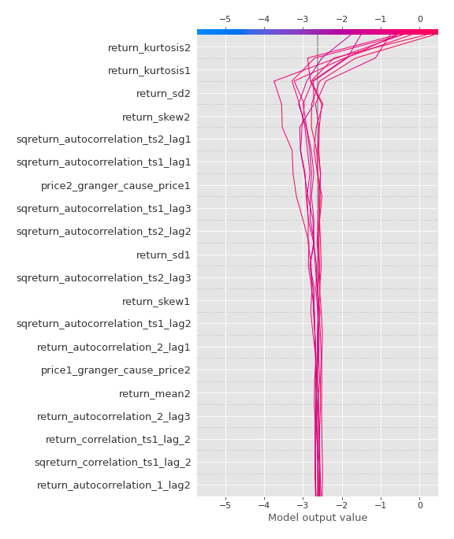

# Summary of 3_Linear

[<< Go back](../README.md)

## Logistic Regression (Linear)
- **n_jobs**: -1
- **explain_level**: 2

## Validation
 - **validation_type**: split
 - **train_ratio**: 0.75
 - **shuffle**: True
 - **stratify**: True

## Optimized metric
accuracy

## Training time

20.3 seconds

## Metric details
|           |    score |     threshold |
|:----------|---------:|--------------:|
| logloss   | 0.116967 | nan           |
| auc       | 1        | nan           |
| f1        | 1        |   0.621599    |
| accuracy  | 1        |   0.621599    |
| precision | 1        |   0.621599    |
| recall    | 1        |   1.10654e-08 |
| mcc       | 1        |   0.621599    |

## Confusion matrix (at threshold=0.621599)
|                      |   Predicted as real |   Predicted as simulated |
|:---------------------|--------------------:|-------------------------:|
| Labeled as real      |                  43 |                        0 |
| Labeled as simulated |                   0 |                       44 |

## Learning curves

## Coefficients
| feature                           |   Learner_1 |
|:----------------------------------|------------:|
| return_skew2                      |  0.801325   |
| return_autocorrelation_2_lag2     |  0.442319   |
| return_autocorrelation_2_lag3     |  0.386907   |
| return_correlation_ts1_lag_2      |  0.329672   |
| sqreturn_correlation_ts1_lag_2    |  0.329672   |
| return_correlation_ts2_lag_1      |  0.297876   |
| sqreturn_correlation_ts2_lag_1    |  0.297876   |
| return_autocorrelation_2_lag1     |  0.285819   |
| sqreturn_correlation_ts2_lag_3    |  0.231879   |
| return_correlation_ts2_lag_3      |  0.231879   |
| return_correlation_ts1_lag_1      |  0.230821   |
| sqreturn_correlation_ts1_lag_1    |  0.230821   |
| return_autocorrelation_1_lag3     |  0.227574   |
| return_autocorrelation_1_lag2     |  0.225197   |
| return_autocorrelation_1_lag1     |  0.187157   |
| return_skew1                      |  0.165292   |
| sqreturn_correlation_ts1_lag_3    |  0.135931   |
| return_correlation_ts1_lag_3      |  0.135931   |
| return_correlation_ts2_lag_2      |  0.118813   |
| sqreturn_correlation_ts2_lag_2    |  0.118813   |
| price1_granger_cause_price2       |  0.0850232  |
| return_sd1                        |  0.0599927  |
| sqreturn_correlation_ts1_lag_0    |  0.00881464 |
| return_correlation_ts1_lag_0      |  0.00881464 |
| return_mean1                      | -0.149339   |
| price2_granger_cause_price1       | -0.199389   |
| return_sd2                        | -0.289888   |
| return_mean2                      | -0.300491   |
| sqreturn_autocorrelation_ts2_lag3 | -0.761743   |
| sqreturn_autocorrelation_ts2_lag2 | -0.801492   |
| sqreturn_autocorrelation_ts2_lag1 | -0.903525   |
| sqreturn_autocorrelation_ts1_lag3 | -0.908438   |
| sqreturn_autocorrelation_ts1_lag2 | -0.9548     |
| sqreturn_autocorrelation_ts1_lag1 | -0.973386   |
| intercept                         | -1.89246    |
| return_kurtosis1                  | -3.73204    |
| return_kurtosis2                  | -3.8269     |

## Permutation-based Importance

## Confusion Matrix

## Normalized Confusion Matrix

## ROC Curve

## Kolmogorov-Smirnov Statistic

## Precision-Recall Curve

## Calibration Curve

## Cumulative Gains Curve

## Lift Curve

## SHAP Importance

## SHAP Dependence plots

### Dependence (Fold 1)

## SHAP Decision plots

### Top-10 Worst decisions for class 0 (Fold 1)

### Top-10 Best decisions for class 0 (Fold 1)

### Top-10 Worst decisions for class 1 (Fold 1)

### Top-10 Best decisions for class 1 (Fold 1)

[<< Go back](../README.md)
