# Exploratory Data Analysis

[<< Go back](../README.md)
## Feature : target
- **Feature type** : categorical
- **Missing** : 0.0%
- **Unique** : 2
- **Count** :347
- **Unique** :2
- **Top** :simulated
- **Freq** :174

## Feature : return_mean1
- **Feature type** : continous
- **Missing** : 0.0%
- **Unique** : 347
- **Count** :347.0
- **Mean** :0.050648236227433724
- **Std** :0.07836047436126481
- **Min** :-0.22632637961920957
- **25%th Percentile** : 0.0018640198999980246
- **50%th Percentile** : 0.04912987029805134
- **75%th Percentile** : 0.09643810421096681
- **Max** :0.37175100008111034

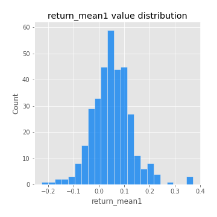
## Feature : return_mean2
- **Feature type** : continous
- **Missing** : 0.0%
- **Unique** : 347
- **Count** :347.0
- **Mean** :0.053231025192109566
- **Std** :0.08871815701974366
- **Min** :-0.21818165578778434
- **25%th Percentile** : 0.005591338728395996
- **50%th Percentile** : 0.050746476006068325
- **75%th Percentile** : 0.10196750885057894
- **Max** :0.4034808150608345

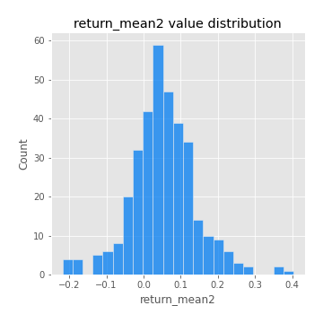
## Feature : return_sd1
- **Feature type** : continous
- **Missing** : 0.0%
- **Unique** : 347
- **Count** :347.0
- **Mean** :1.7825637255401048
- **Std** :0.773439418469867
- **Min** :0.7620831696941981
- **25%th Percentile** : 1.5302408606835818
- **50%th Percentile** : 1.6028080796154638
- **75%th Percentile** : 1.7116084841884331
- **Max** :9.236766377527575

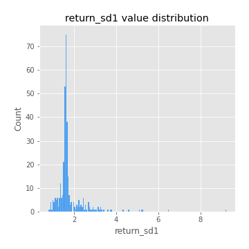
## Feature : return_sd2
- **Feature type** : continous
- **Missing** : 0.0%
- **Unique** : 347
- **Count** :347.0
- **Mean** :1.7553193434067678
- **Std** :0.6862394695850473
- **Min** :0.8592887433004143
- **25%th Percentile** : 1.5096052373411744
- **50%th Percentile** : 1.5826536751779616
- **75%th Percentile** : 1.6714566366005985
- **Max** :6.737618636746393

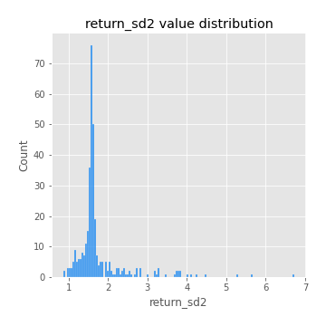
## Feature : return_skew1
- **Feature type** : continous
- **Missing** : 0.0%
- **Unique** : 347
- **Count** :347.0
- **Mean** :-0.07756700105169084
- **Std** :0.6096750754595822
- **Min** :-3.530116233761814
- **25%th Percentile** : -0.1696534179705692
- **50%th Percentile** : -0.01328863512675986
- **75%th Percentile** : 0.11265706517239062
- **Max** :2.5845963767725557

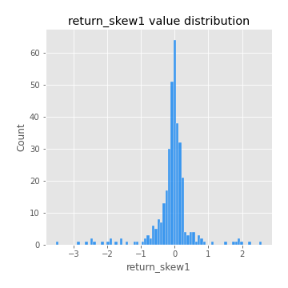
## Feature : return_skew2
- **Feature type** : continous
- **Missing** : 0.0%
- **Unique** : 347
- **Count** :347.0
- **Mean** :-0.11739625881125018
- **Std** :0.5879511707386854
- **Min** :-3.436088288137694
- **25%th Percentile** : -0.24413157929344093
- **50%th Percentile** : -0.04553802965373287
- **75%th Percentile** : 0.08485139090421917
- **Max** :2.2606839051517187

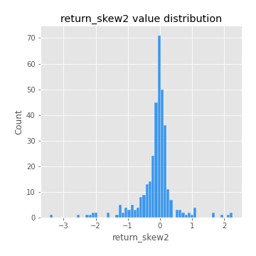
## Feature : return_kurtosis1
- **Feature type** : continous
- **Missing** : 0.0%
- **Unique** : 347
- **Count** :347.0
- **Mean** :3.24110124467997
- **Std** :6.118042749363375
- **Min** :-0.46809888450219406
- **25%th Percentile** : -0.02549599612481046
- **50%th Percentile** : 0.5038926224145643
- **75%th Percentile** : 3.691025264972352
- **Max** :36.91113889081053

## Feature : return_kurtosis2
- **Feature type** : continous
- **Missing** : 0.0%
- **Unique** : 347
- **Count** :347.0
- **Mean** :3.315502418464669
- **Std** :5.947652221741981
- **Min** :-0.46119138323461195
- **25%th Percentile** : -0.019511643292549286
- **50%th Percentile** : 0.47253299918271363
- **75%th Percentile** : 4.1488807640792835
- **Max** :36.023880269969645

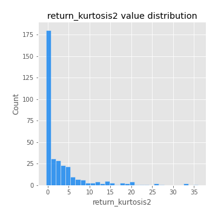
## Feature : return_autocorrelation_1_lag1
- **Feature type** : continous
- **Missing** : 0.0%
- **Unique** : 347
- **Count** :347.0
- **Mean** :-0.012324142419349525
- **Std** :0.0571113189342273
- **Min** :-0.2135576224968752
- **25%th Percentile** : -0.04232212753097779
- **50%th Percentile** : -0.008724120676805882
- **75%th Percentile** : 0.02414259991376802
- **Max** :0.12810656890648087

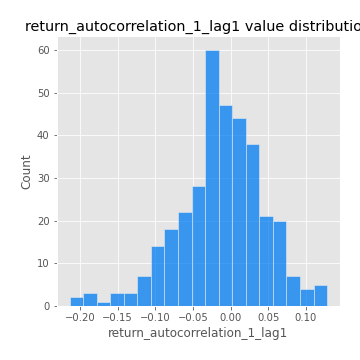
## Feature : return_autocorrelation_1_lag2
- **Feature type** : continous
- **Missing** : 0.0%
- **Unique** : 347
- **Count** :347.0
- **Mean** :-0.009497954583777243
- **Std** :0.04931222813468205
- **Min** :-0.12172858720259
- **25%th Percentile** : -0.03823559411520931
- **50%th Percentile** : -0.009445872679491719
- **75%th Percentile** : 0.023732981153030287
- **Max** :0.1561488228015672

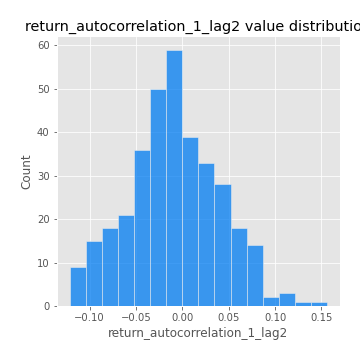
## Feature : return_autocorrelation_1_lag3
- **Feature type** : continous
- **Missing** : 0.0%
- **Unique** : 347
- **Count** :347.0
- **Mean** :-0.003677032805071483
- **Std** :0.052218375861110305
- **Min** :-0.1940836867390813
- **25%th Percentile** : -0.038185353575664424
- **50%th Percentile** : -0.0016731811330038778
- **75%th Percentile** : 0.029920969490710235
- **Max** :0.17805869530681923

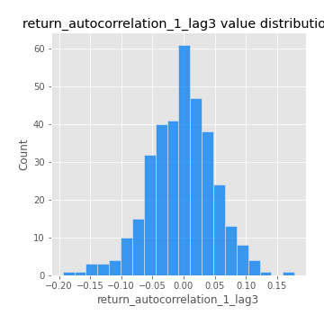
## Feature : return_autocorrelation_2_lag1
- **Feature type** : continous
- **Missing** : 0.0%
- **Unique** : 347
- **Count** :347.0
- **Mean** :-0.007625943017123692
- **Std** :0.05890642444142878
- **Min** :-0.25075531010123286
- **25%th Percentile** : -0.03746729775200523
- **50%th Percentile** : -0.004588482175128214
- **75%th Percentile** : 0.030260343635749296
- **Max** :0.16349871797309318

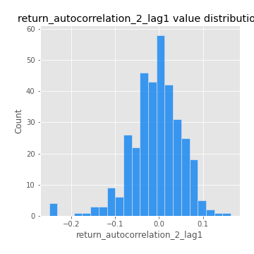
## Feature : return_autocorrelation_2_lag2
- **Feature type** : continous
- **Missing** : 0.0%
- **Unique** : 347
- **Count** :347.0
- **Mean** :-0.0009327243078937316
- **Std** :0.051510774427799756
- **Min** :-0.15323211089747296
- **25%th Percentile** : -0.03497121928020978
- **50%th Percentile** : -0.004081427935014871
- **75%th Percentile** : 0.03319421571171093
- **Max** :0.1735398560230086

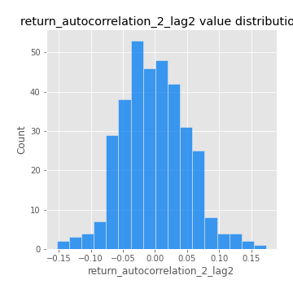
## Feature : return_autocorrelation_2_lag3
- **Feature type** : continous
- **Missing** : 0.0%
- **Unique** : 347
- **Count** :347.0
- **Mean** :-0.0016242307681516132
- **Std** :0.04710679147042412
- **Min** :-0.14200107169559698
- **25%th Percentile** : -0.030584591054820906
- **50%th Percentile** : 0.0026790259892069254
- **75%th Percentile** : 0.031638211393713325
- **Max** :0.12103978207043897

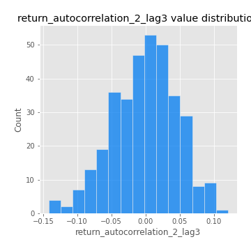
## Feature : return_correlation_ts1_lag_0
- **Feature type** : continous
- **Missing** : 0.0%
- **Unique** : 347
- **Count** :347.0
- **Mean** :0.3235106873765509
- **Std** :0.11297977439280565
- **Min** :-0.027089510445801036
- **25%th Percentile** : 0.2709910305317824
- **50%th Percentile** : 0.322924824644648
- **75%th Percentile** : 0.37259908457051527
- **Max** :0.7041861626832071

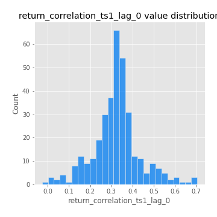
## Feature : return_correlation_ts1_lag_1
- **Feature type** : continous
- **Missing** : 0.0%
- **Unique** : 347
- **Count** :347.0
- **Mean** :-0.009801434203228637
- **Std** :0.05057541656378276
- **Min** :-0.16985510949917193
- **25%th Percentile** : -0.04360503978848734
- **50%th Percentile** : -0.007150196431358936
- **75%th Percentile** : 0.024222187825361126
- **Max** :0.15499424718508623

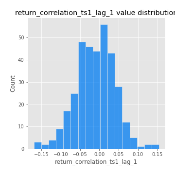
## Feature : return_correlation_ts1_lag_2
- **Feature type** : continous
- **Missing** : 0.0%
- **Unique** : 347
- **Count** :347.0
- **Mean** :-0.0011044618581210752
- **Std** :0.0479031260450809
- **Min** :-0.21653581047581763
- **25%th Percentile** : -0.033086523139860644
- **50%th Percentile** : -0.0037460202566904216
- **75%th Percentile** : 0.03586226893126318
- **Max** :0.11392271463244032

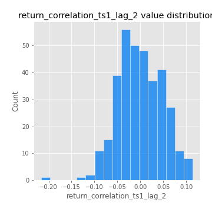
## Feature : return_correlation_ts1_lag_3
- **Feature type** : continous
- **Missing** : 0.0%
- **Unique** : 347
- **Count** :347.0
- **Mean** :-0.001930012636637873
- **Std** :0.05059528051486148
- **Min** :-0.13520896206543764
- **25%th Percentile** : -0.03398855318421229
- **50%th Percentile** : -0.004179797020357867
- **75%th Percentile** : 0.0326193983328751
- **Max** :0.1422809271770942

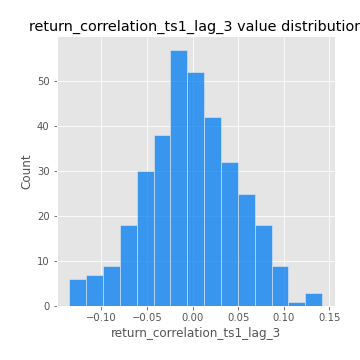
## Feature : return_correlation_ts2_lag_1
- **Feature type** : continous
- **Missing** : 0.0%
- **Unique** : 347
- **Count** :347.0
- **Mean** :-0.005676753681577673
- **Std** :0.05167191879496366
- **Min** :-0.19671969155495325
- **25%th Percentile** : -0.03979153620573264
- **50%th Percentile** : -0.006765557810026143
- **75%th Percentile** : 0.0318932922882058
- **Max** :0.12622627055767424

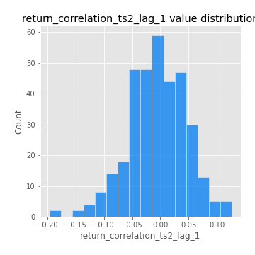
## Feature : return_correlation_ts2_lag_2
- **Feature type** : continous
- **Missing** : 0.0%
- **Unique** : 347
- **Count** :347.0
- **Mean** :-0.0030380347878740015
- **Std** :0.04889327769068821
- **Min** :-0.23751835475804678
- **25%th Percentile** : -0.03252178310382683
- **50%th Percentile** : -0.0045217443780367975
- **75%th Percentile** : 0.020822601299750464
- **Max** :0.20772887392904255

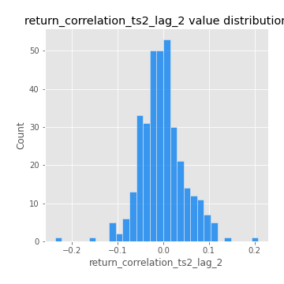
## Feature : return_correlation_ts2_lag_3
- **Feature type** : continous
- **Missing** : 0.0%
- **Unique** : 347
- **Count** :347.0
- **Mean** :-0.004808262486131881
- **Std** :0.05094939846008841
- **Min** :-0.17564076057312866
- **25%th Percentile** : -0.033518510810090496
- **50%th Percentile** : -0.005549569530732531
- **75%th Percentile** : 0.03180881941860279
- **Max** :0.12578577770423086

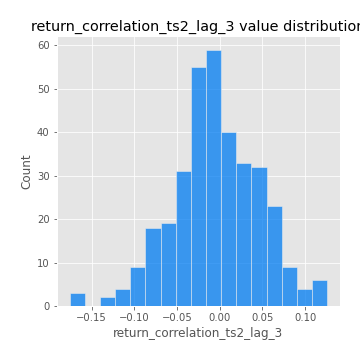
## Feature : sqreturn_autocorrelation_ts1_lag1
- **Feature type** : continous
- **Missing** : 0.0%
- **Unique** : 347
- **Count** :347.0
- **Mean** :0.05148457055804637
- **Std** :0.0942098300860931
- **Min** :-0.09602097651466714
- **25%th Percentile** : -0.009320212522036235
- **50%th Percentile** : 0.024968226547798972
- **75%th Percentile** : 0.0864527404118913
- **Max** :0.4439086285737898

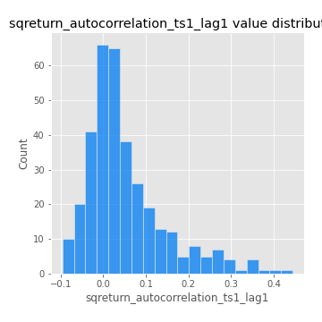
## Feature : sqreturn_autocorrelation_ts1_lag2
- **Feature type** : continous
- **Missing** : 0.0%
- **Unique** : 347
- **Count** :347.0
- **Mean** :0.04464429399877542
- **Std** :0.0969016399725615
- **Min** :-0.10026045426854024
- **25%th Percentile** : -0.012407780548055308
- **50%th Percentile** : 0.01649803501044467
- **75%th Percentile** : 0.07038118959680979
- **Max** :0.540735851444759

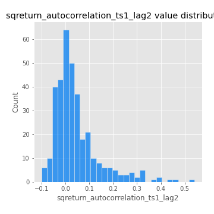
## Feature : sqreturn_autocorrelation_ts1_lag3
- **Feature type** : continous
- **Missing** : 0.0%
- **Unique** : 347
- **Count** :347.0
- **Mean** :0.03419596922213597
- **Std** :0.08431528718067954
- **Min** :-0.09630250371152424
- **25%th Percentile** : -0.01885819687710991
- **50%th Percentile** : 0.012481804473644399
- **75%th Percentile** : 0.062485623007986116
- **Max** :0.44755937369538146

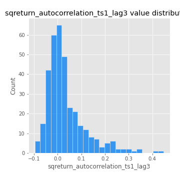
## Feature : sqreturn_autocorrelation_ts2_lag1
- **Feature type** : continous
- **Missing** : 0.0%
- **Unique** : 347
- **Count** :347.0
- **Mean** :0.04737833073519597
- **Std** :0.08425262122035564
- **Min** :-0.1096174764483254
- **25%th Percentile** : -0.009585734720688821
- **50%th Percentile** : 0.028799284522873014
- **75%th Percentile** : 0.08311599375667086
- **Max** :0.510085647437958

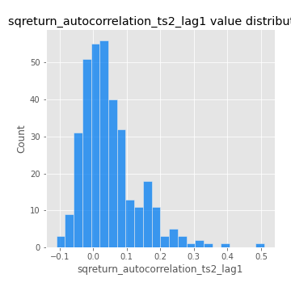
## Feature : sqreturn_autocorrelation_ts2_lag2
- **Feature type** : continous
- **Missing** : 0.0%
- **Unique** : 347
- **Count** :347.0
- **Mean** :0.04165257827812025
- **Std** :0.08790665186622365
- **Min** :-0.11044420605350534
- **25%th Percentile** : -0.00893099828458202
- **50%th Percentile** : 0.02220869683078531
- **75%th Percentile** : 0.06146583553245674
- **Max** :0.5373432415582473

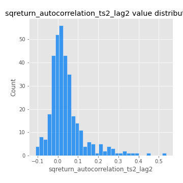
## Feature : sqreturn_autocorrelation_ts2_lag3
- **Feature type** : continous
- **Missing** : 0.0%
- **Unique** : 347
- **Count** :347.0
- **Mean** :0.027321452972566353
- **Std** :0.0684892008817254
- **Min** :-0.09659077116974889
- **25%th Percentile** : -0.015601535225430667
- **50%th Percentile** : 0.010674848682306184
- **75%th Percentile** : 0.05072551628207648
- **Max** :0.31225727797735664

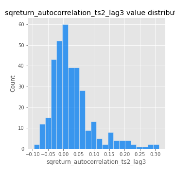
## Feature : sqreturn_correlation_ts1_lag_0
- **Feature type** : continous
- **Missing** : 0.0%
- **Unique** : 347
- **Count** :347.0
- **Mean** :0.3235106873765509
- **Std** :0.11297977439280565
- **Min** :-0.027089510445801036
- **25%th Percentile** : 0.2709910305317824
- **50%th Percentile** : 0.322924824644648
- **75%th Percentile** : 0.37259908457051527
- **Max** :0.7041861626832071

## Feature : sqreturn_correlation_ts1_lag_1
- **Feature type** : continous
- **Missing** : 0.0%
- **Unique** : 347
- **Count** :347.0
- **Mean** :-0.009801434203228637
- **Std** :0.05057541656378276
- **Min** :-0.16985510949917193
- **25%th Percentile** : -0.04360503978848734
- **50%th Percentile** : -0.007150196431358936
- **75%th Percentile** : 0.024222187825361126
- **Max** :0.15499424718508623

## Feature : sqreturn_correlation_ts1_lag_2
- **Feature type** : continous
- **Missing** : 0.0%
- **Unique** : 347
- **Count** :347.0
- **Mean** :-0.0011044618581210752
- **Std** :0.0479031260450809
- **Min** :-0.21653581047581763
- **25%th Percentile** : -0.033086523139860644
- **50%th Percentile** : -0.0037460202566904216
- **75%th Percentile** : 0.03586226893126318
- **Max** :0.11392271463244032

## Feature : sqreturn_correlation_ts1_lag_3
- **Feature type** : continous
- **Missing** : 0.0%
- **Unique** : 347
- **Count** :347.0
- **Mean** :-0.001930012636637873
- **Std** :0.05059528051486148
- **Min** :-0.13520896206543764
- **25%th Percentile** : -0.03398855318421229
- **50%th Percentile** : -0.004179797020357867
- **75%th Percentile** : 0.0326193983328751
- **Max** :0.1422809271770942

## Feature : sqreturn_correlation_ts2_lag_1
- **Feature type** : continous
- **Missing** : 0.0%
- **Unique** : 347
- **Count** :347.0
- **Mean** :-0.005676753681577673
- **Std** :0.05167191879496366
- **Min** :-0.19671969155495325
- **25%th Percentile** : -0.03979153620573264
- **50%th Percentile** : -0.006765557810026143
- **75%th Percentile** : 0.0318932922882058
- **Max** :0.12622627055767424

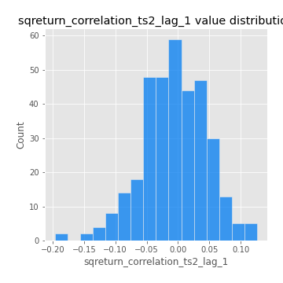
## Feature : sqreturn_correlation_ts2_lag_2
- **Feature type** : continous
- **Missing** : 0.0%
- **Unique** : 347
- **Count** :347.0
- **Mean** :-0.0030380347878740015
- **Std** :0.04889327769068821
- **Min** :-0.23751835475804678
- **25%th Percentile** : -0.03252178310382683
- **50%th Percentile** : -0.0045217443780367975
- **75%th Percentile** : 0.020822601299750464
- **Max** :0.20772887392904255

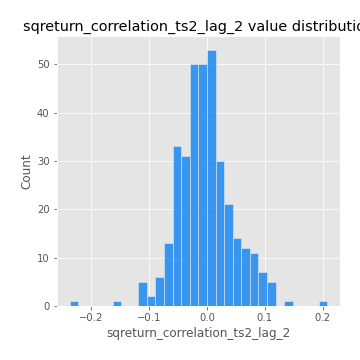
## Feature : sqreturn_correlation_ts2_lag_3
- **Feature type** : continous
- **Missing** : 0.0%
- **Unique** : 347
- **Count** :347.0
- **Mean** :-0.004808262486131881
- **Std** :0.05094939846008841
- **Min** :-0.17564076057312866
- **25%th Percentile** : -0.033518510810090496
- **50%th Percentile** : -0.005549569530732531
- **75%th Percentile** : 0.03180881941860279
- **Max** :0.12578577770423086

## Feature : price2_granger_cause_price1
- **Feature type** : continous
- **Missing** : 0.0%
- **Unique** : 347
- **Count** :347.0
- **Mean** :0.351081674793089
- **Std** :0.3016392565522144
- **Min** :1.3762491806146697e-07
- **25%th Percentile** : 0.08176218071547217
- **50%th Percentile** : 0.2681510485352282
- **75%th Percentile** : 0.5915306086311131
- **Max** :0.9885712803689185

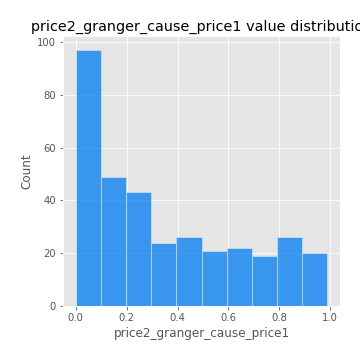
## Feature : price1_granger_cause_price2
- **Feature type** : continous
- **Missing** : 0.0%
- **Unique** : 347
- **Count** :347.0
- **Mean** :0.29385500606999376
- **Std** :0.28405559030503946
- **Min** :6.229481013319811e-05
- **25%th Percentile** : 0.041616607616279944
- **50%th Percentile** : 0.2176774341783571
- **75%th Percentile** : 0.48561533662077633
- **Max** :0.9942437996057599

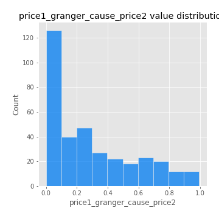

[<< Go back](../README.md)
