# Exploratory Data Analysis

[<< Go back](../README.md)
## Feature : target
- **Feature type** : categorical
- **Missing** : 0.0%
- **Unique** : 2
- **Count** :347
- **Unique** :2
- **Top** :real
- **Freq** :176

## Feature : return_mean1
- **Feature type** : continous
- **Missing** : 0.0%
- **Unique** : 347
- **Count** :347.0
- **Mean** :0.04495873117754313
- **Std** :0.07705534312223795
- **Min** :-0.22632637961920957
- **25%th Percentile** : -0.0011537885565797894
- **50%th Percentile** : 0.04626202517766344
- **75%th Percentile** : 0.08885682612065816
- **Max** :0.3612366374600757

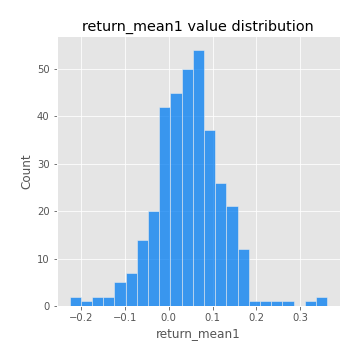
## Feature : return_mean2
- **Feature type** : continous
- **Missing** : 0.0%
- **Unique** : 347
- **Count** :347.0
- **Mean** :0.049747095121929895
- **Std** :0.08422828988244542
- **Min** :-0.21818165578778434
- **25%th Percentile** : 0.00547087678315712
- **50%th Percentile** : 0.05152102051580963
- **75%th Percentile** : 0.09791419168648316
- **Max** :0.37616608147096464

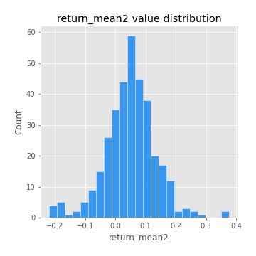
## Feature : return_sd1
- **Feature type** : continous
- **Missing** : 0.0%
- **Unique** : 347
- **Count** :347.0
- **Mean** :1.7752456260439335
- **Std** :0.7202219189068124
- **Min** :0.8382061051466024
- **25%th Percentile** : 1.5433531135673468
- **50%th Percentile** : 1.6119132344006977
- **75%th Percentile** : 1.7265557281019923
- **Max** :9.236766377527575

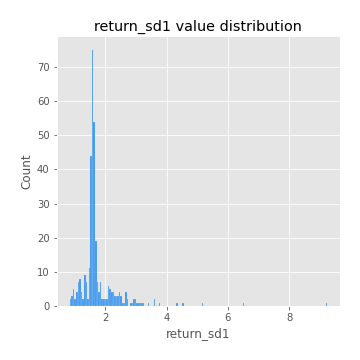
## Feature : return_sd2
- **Feature type** : continous
- **Missing** : 0.0%
- **Unique** : 347
- **Count** :347.0
- **Mean** :1.768982866974787
- **Std** :0.7267909418943892
- **Min** :0.8592887433004143
- **25%th Percentile** : 1.51365584397045
- **50%th Percentile** : 1.591815083433001
- **75%th Percentile** : 1.6825220359893729
- **Max** :6.737618636746393

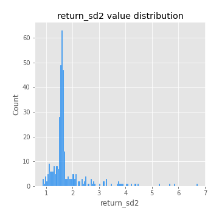
## Feature : return_skew1
- **Feature type** : continous
- **Missing** : 0.0%
- **Unique** : 347
- **Count** :347.0
- **Mean** :-0.08378567881006913
- **Std** :0.5969798753035919
- **Min** :-3.530116233761814
- **25%th Percentile** : -0.1908310929885007
- **50%th Percentile** : -0.03982887423143614
- **75%th Percentile** : 0.09321767291222521
- **Max** :2.5845963767725557

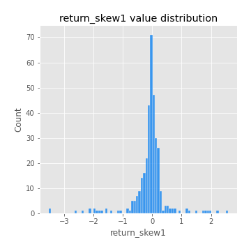
## Feature : return_skew2
- **Feature type** : continous
- **Missing** : 0.0%
- **Unique** : 347
- **Count** :347.0
- **Mean** :-0.1850530893393865
- **Std** :0.7816683554328501
- **Min** :-8.801502855292393
- **25%th Percentile** : -0.24205995684983467
- **50%th Percentile** : -0.06240228614786629
- **75%th Percentile** : 0.07562670879765614
- **Max** :2.242019525651531

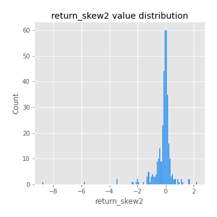
## Feature : return_kurtosis1
- **Feature type** : continous
- **Missing** : 0.0%
- **Unique** : 347
- **Count** :347.0
- **Mean** :3.3117457170642517
- **Std** :6.348358933616512
- **Min** :-0.4572442015461262
- **25%th Percentile** : 0.0028923897087591577
- **50%th Percentile** : 0.6933208451099584
- **75%th Percentile** : 3.454449566137388
- **Max** :46.07507808162177

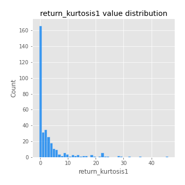
## Feature : return_kurtosis2
- **Feature type** : continous
- **Missing** : 0.0%
- **Unique** : 347
- **Count** :347.0
- **Mean** :3.873297970355625
- **Std** :10.519617938268995
- **Min** :-0.5668319212072173
- **25%th Percentile** : -0.0386056712637175
- **50%th Percentile** : 0.6208695975279284
- **75%th Percentile** : 4.102201922691857
- **Max** :143.10871011533666

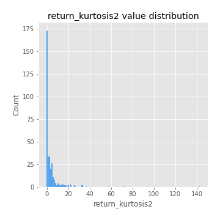
## Feature : return_autocorrelation_1_lag1
- **Feature type** : continous
- **Missing** : 0.0%
- **Unique** : 347
- **Count** :347.0
- **Mean** :-0.012894273137454304
- **Std** :0.059840099690579726
- **Min** :-0.2135576224968752
- **25%th Percentile** : -0.04515236363043122
- **50%th Percentile** : -0.007054660251095188
- **75%th Percentile** : 0.024969569530766744
- **Max** :0.12810656890648087

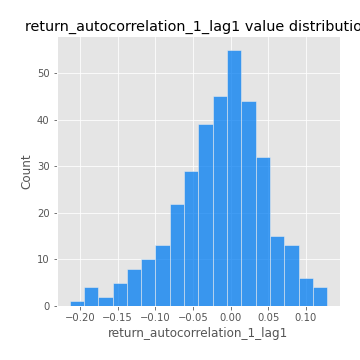
## Feature : return_autocorrelation_1_lag2
- **Feature type** : continous
- **Missing** : 0.0%
- **Unique** : 347
- **Count** :347.0
- **Mean** :-0.005988674094531829
- **Std** :0.04958208957125469
- **Min** :-0.14503402859931547
- **25%th Percentile** : -0.03730734391872996
- **50%th Percentile** : -0.0021470561401504117
- **75%th Percentile** : 0.024861465599024392
- **Max** :0.1561488228015672

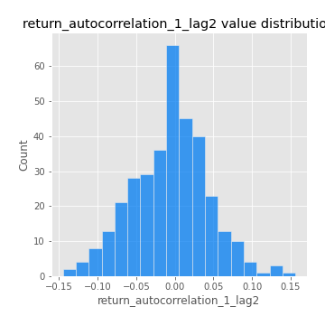
## Feature : return_autocorrelation_1_lag3
- **Feature type** : continous
- **Missing** : 0.0%
- **Unique** : 347
- **Count** :347.0
- **Mean** :-0.0008210384712430161
- **Std** :0.05204474225370209
- **Min** :-0.1940836867390813
- **25%th Percentile** : -0.030436903826085288
- **50%th Percentile** : 0.00010684383579549596
- **75%th Percentile** : 0.03292955283603497
- **Max** :0.17805869530681923

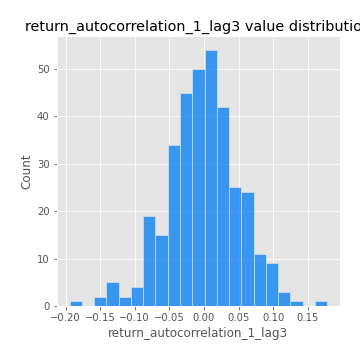
## Feature : return_autocorrelation_2_lag1
- **Feature type** : continous
- **Missing** : 0.0%
- **Unique** : 347
- **Count** :347.0
- **Mean** :-0.009886638207941573
- **Std** :0.05910231580114734
- **Min** :-0.24590087874039124
- **25%th Percentile** : -0.041234654075727795
- **50%th Percentile** : -0.005528990699066865
- **75%th Percentile** : 0.026063812426014604
- **Max** :0.31863413537898483

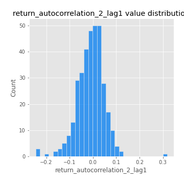
## Feature : return_autocorrelation_2_lag2
- **Feature type** : continous
- **Missing** : 0.0%
- **Unique** : 347
- **Count** :347.0
- **Mean** :-0.0001671643598206198
- **Std** :0.05144568825007803
- **Min** :-0.1495113937562178
- **25%th Percentile** : -0.03459042868748592
- **50%th Percentile** : -0.0025866898415605527
- **75%th Percentile** : 0.033107417598368494
- **Max** :0.20974504043791217

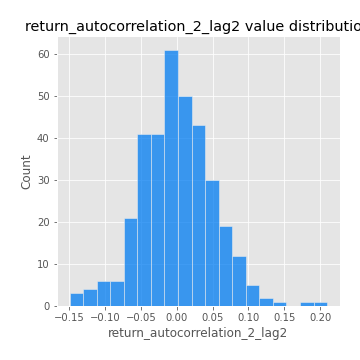
## Feature : return_autocorrelation_2_lag3
- **Feature type** : continous
- **Missing** : 0.0%
- **Unique** : 347
- **Count** :347.0
- **Mean** :0.0009738819730044225
- **Std** :0.0501576901450284
- **Min** :-0.13493058794216015
- **25%th Percentile** : -0.028064730612819326
- **50%th Percentile** : 0.0013407856623013307
- **75%th Percentile** : 0.03457748839299372
- **Max** :0.1419999376914021

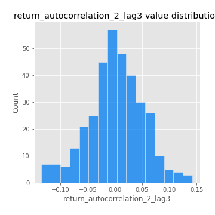
## Feature : return_correlation_ts1_lag_0
- **Feature type** : continous
- **Missing** : 0.0%
- **Unique** : 347
- **Count** :347.0
- **Mean** :0.32326810637147096
- **Std** :0.10689125866628019
- **Min** :-0.027089510445801036
- **25%th Percentile** : 0.269247658003223
- **50%th Percentile** : 0.32851365649135594
- **75%th Percentile** : 0.3680605439858158
- **Max** :0.7028422087350163

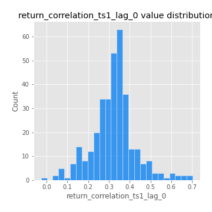
## Feature : return_correlation_ts1_lag_1
- **Feature type** : continous
- **Missing** : 0.0%
- **Unique** : 347
- **Count** :347.0
- **Mean** :-0.008254416738682246
- **Std** :0.053203833727624765
- **Min** :-0.16985510949917193
- **25%th Percentile** : -0.03920610894242551
- **50%th Percentile** : -0.0033191428202869475
- **75%th Percentile** : 0.025881314463960116
- **Max** :0.15499424718508623

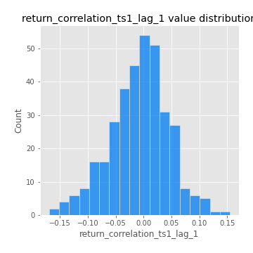
## Feature : return_correlation_ts1_lag_2
- **Feature type** : continous
- **Missing** : 0.0%
- **Unique** : 347
- **Count** :347.0
- **Mean** :-0.003262939274887686
- **Std** :0.04981946357506635
- **Min** :-0.21653581047581763
- **25%th Percentile** : -0.035864617897418835
- **50%th Percentile** : -0.0020126584596116674
- **75%th Percentile** : 0.02830073758819035
- **Max** :0.13678424391700872

## Feature : return_correlation_ts1_lag_3
- **Feature type** : continous
- **Missing** : 0.0%
- **Unique** : 347
- **Count** :347.0
- **Mean** :-0.00019214491378038398
- **Std** :0.05147992024112687
- **Min** :-0.1362922926986773
- **25%th Percentile** : -0.032327107369194114
- **50%th Percentile** : -0.0018944668938554326
- **75%th Percentile** : 0.030376998570119475
- **Max** :0.18540466219855375

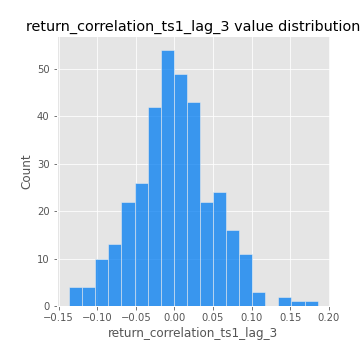
## Feature : return_correlation_ts2_lag_1
- **Feature type** : continous
- **Missing** : 0.0%
- **Unique** : 347
- **Count** :347.0
- **Mean** :-0.006326516316691801
- **Std** :0.051725060487438176
- **Min** :-0.2081139431093261
- **25%th Percentile** : -0.03477761368429372
- **50%th Percentile** : -0.004032328475867339
- **75%th Percentile** : 0.025873173724861802
- **Max** :0.11556235671885211

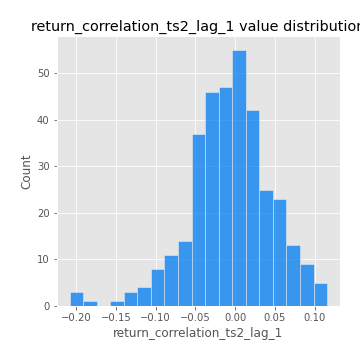
## Feature : return_correlation_ts2_lag_2
- **Feature type** : continous
- **Missing** : 0.0%
- **Unique** : 347
- **Count** :347.0
- **Mean** :-0.0031299180316869137
- **Std** :0.0492289242951848
- **Min** :-0.23751835475804678
- **25%th Percentile** : -0.03153906190902388
- **50%th Percentile** : -0.005012987103514181
- **75%th Percentile** : 0.0261850615258025
- **Max** :0.20772887392904255

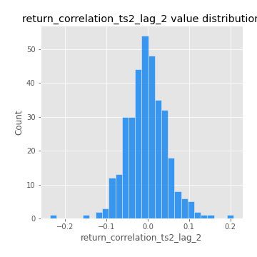
## Feature : return_correlation_ts2_lag_3
- **Feature type** : continous
- **Missing** : 0.0%
- **Unique** : 347
- **Count** :347.0
- **Mean** :-0.0030852069662265246
- **Std** :0.052368576373271206
- **Min** :-0.17564076057312866
- **25%th Percentile** : -0.03404808753667214
- **50%th Percentile** : -0.001140755234808062
- **75%th Percentile** : 0.033842563935608694
- **Max** :0.12578577770423086

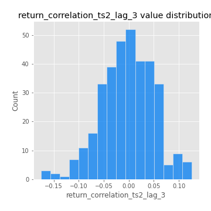
## Feature : sqreturn_autocorrelation_ts1_lag1
- **Feature type** : continous
- **Missing** : 0.0%
- **Unique** : 347
- **Count** :347.0
- **Mean** :0.05043560594056064
- **Std** :0.09115968858603621
- **Min** :-0.11314659328992768
- **25%th Percentile** : -0.011185730139817877
- **50%th Percentile** : 0.028232667311884372
- **75%th Percentile** : 0.08623378295539519
- **Max** :0.4439086285737898

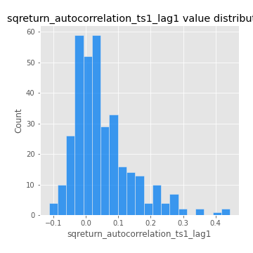
## Feature : sqreturn_autocorrelation_ts1_lag2
- **Feature type** : continous
- **Missing** : 0.0%
- **Unique** : 347
- **Count** :347.0
- **Mean** :0.045054422114118586
- **Std** :0.09179227083366556
- **Min** :-0.09191018214293495
- **25%th Percentile** : -0.011318139698215327
- **50%th Percentile** : 0.019026525573813947
- **75%th Percentile** : 0.07094213139199904
- **Max** :0.4522162366773919

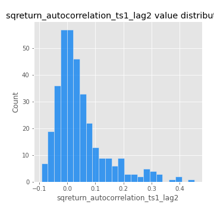
## Feature : sqreturn_autocorrelation_ts1_lag3
- **Feature type** : continous
- **Missing** : 0.0%
- **Unique** : 347
- **Count** :347.0
- **Mean** :0.033115874580417475
- **Std** :0.08443421616006347
- **Min** :-0.12801175786809793
- **25%th Percentile** : -0.018398771033506685
- **50%th Percentile** : 0.012593715022244586
- **75%th Percentile** : 0.062449287297595385
- **Max** :0.44755937369538146

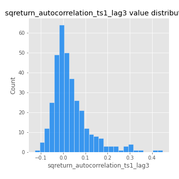
## Feature : sqreturn_autocorrelation_ts2_lag1
- **Feature type** : continous
- **Missing** : 0.0%
- **Unique** : 347
- **Count** :347.0
- **Mean** :0.04848641314008329
- **Std** :0.08772418588581908
- **Min** :-0.11662147901082173
- **25%th Percentile** : -0.005493371566972057
- **50%th Percentile** : 0.028024673012368214
- **75%th Percentile** : 0.08144608890215105
- **Max** :0.4190090519891419

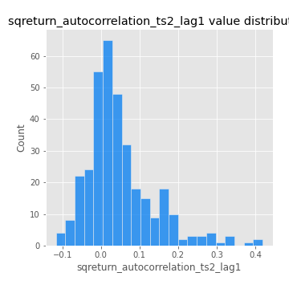
## Feature : sqreturn_autocorrelation_ts2_lag2
- **Feature type** : continous
- **Missing** : 0.0%
- **Unique** : 347
- **Count** :347.0
- **Mean** :0.038106851633172796
- **Std** :0.09053257013090935
- **Min** :-0.10503895248463524
- **25%th Percentile** : -0.014420375535586748
- **50%th Percentile** : 0.013614858683498285
- **75%th Percentile** : 0.06208217593917534
- **Max** :0.45676817892778204

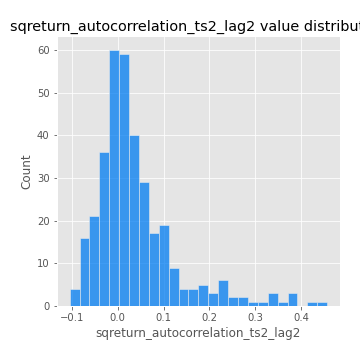
## Feature : sqreturn_autocorrelation_ts2_lag3
- **Feature type** : continous
- **Missing** : 0.0%
- **Unique** : 347
- **Count** :347.0
- **Mean** :0.032831128789703616
- **Std** :0.07166513006270832
- **Min** :-0.11253510066739542
- **25%th Percentile** : -0.015669119904988607
- **50%th Percentile** : 0.017754331608716898
- **75%th Percentile** : 0.05890010676578478
- **Max** :0.31225727797735664

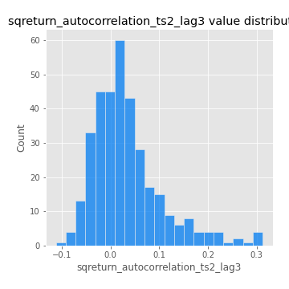
## Feature : sqreturn_correlation_ts1_lag_0
- **Feature type** : continous
- **Missing** : 0.0%
- **Unique** : 347
- **Count** :347.0
- **Mean** :0.32326810637147096
- **Std** :0.10689125866628019
- **Min** :-0.027089510445801036
- **25%th Percentile** : 0.269247658003223
- **50%th Percentile** : 0.32851365649135594
- **75%th Percentile** : 0.3680605439858158
- **Max** :0.7028422087350163

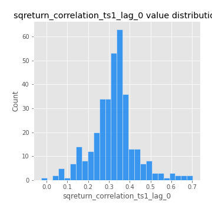
## Feature : sqreturn_correlation_ts1_lag_1
- **Feature type** : continous
- **Missing** : 0.0%
- **Unique** : 347
- **Count** :347.0
- **Mean** :-0.008254416738682246
- **Std** :0.053203833727624765
- **Min** :-0.16985510949917193
- **25%th Percentile** : -0.03920610894242551
- **50%th Percentile** : -0.0033191428202869475
- **75%th Percentile** : 0.025881314463960116
- **Max** :0.15499424718508623

## Feature : sqreturn_correlation_ts1_lag_2
- **Feature type** : continous
- **Missing** : 0.0%
- **Unique** : 347
- **Count** :347.0
- **Mean** :-0.003262939274887686
- **Std** :0.04981946357506635
- **Min** :-0.21653581047581763
- **25%th Percentile** : -0.035864617897418835
- **50%th Percentile** : -0.0020126584596116674
- **75%th Percentile** : 0.02830073758819035
- **Max** :0.13678424391700872

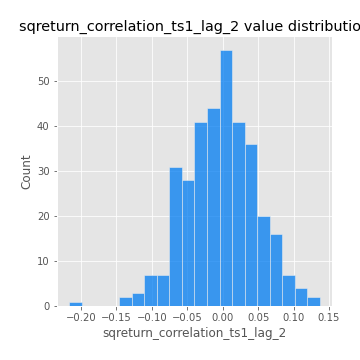
## Feature : sqreturn_correlation_ts1_lag_3
- **Feature type** : continous
- **Missing** : 0.0%
- **Unique** : 347
- **Count** :347.0
- **Mean** :-0.00019214491378038398
- **Std** :0.05147992024112687
- **Min** :-0.1362922926986773
- **25%th Percentile** : -0.032327107369194114
- **50%th Percentile** : -0.0018944668938554326
- **75%th Percentile** : 0.030376998570119475
- **Max** :0.18540466219855375

## Feature : sqreturn_correlation_ts2_lag_1
- **Feature type** : continous
- **Missing** : 0.0%
- **Unique** : 347
- **Count** :347.0
- **Mean** :-0.006326516316691801
- **Std** :0.051725060487438176
- **Min** :-0.2081139431093261
- **25%th Percentile** : -0.03477761368429372
- **50%th Percentile** : -0.004032328475867339
- **75%th Percentile** : 0.025873173724861802
- **Max** :0.11556235671885211

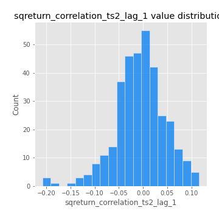
## Feature : sqreturn_correlation_ts2_lag_2
- **Feature type** : continous
- **Missing** : 0.0%
- **Unique** : 347
- **Count** :347.0
- **Mean** :-0.0031299180316869137
- **Std** :0.0492289242951848
- **Min** :-0.23751835475804678
- **25%th Percentile** : -0.03153906190902388
- **50%th Percentile** : -0.005012987103514181
- **75%th Percentile** : 0.0261850615258025
- **Max** :0.20772887392904255

## Feature : sqreturn_correlation_ts2_lag_3
- **Feature type** : continous
- **Missing** : 0.0%
- **Unique** : 347
- **Count** :347.0
- **Mean** :-0.0030852069662265246
- **Std** :0.052368576373271206
- **Min** :-0.17564076057312866
- **25%th Percentile** : -0.03404808753667214
- **50%th Percentile** : -0.001140755234808062
- **75%th Percentile** : 0.033842563935608694
- **Max** :0.12578577770423086

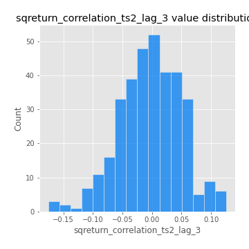
## Feature : price2_granger_cause_price1
- **Feature type** : continous
- **Missing** : 0.0%
- **Unique** : 347
- **Count** :347.0
- **Mean** :0.3477811538777078
- **Std** :0.30217515093525904
- **Min** :1.1505642493585304e-05
- **25%th Percentile** : 0.07425934910991636
- **50%th Percentile** : 0.27631599535807866
- **75%th Percentile** : 0.579171803352696
- **Max** :0.9911048543309305

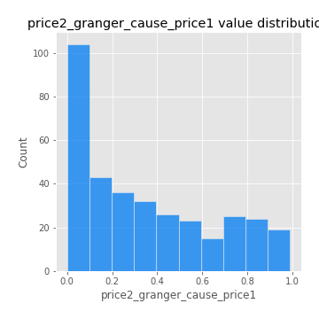
## Feature : price1_granger_cause_price2
- **Feature type** : continous
- **Missing** : 0.0%
- **Unique** : 347
- **Count** :347.0
- **Mean** :0.29851382523283615
- **Std** :0.29418775616882975
- **Min** :9.619737063353763e-07
- **25%th Percentile** : 0.03426000070112155
- **50%th Percentile** : 0.19799661169626034
- **75%th Percentile** : 0.5043446593126379
- **Max** :0.9951398266867577

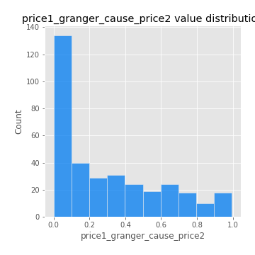

[<< Go back](../README.md)
