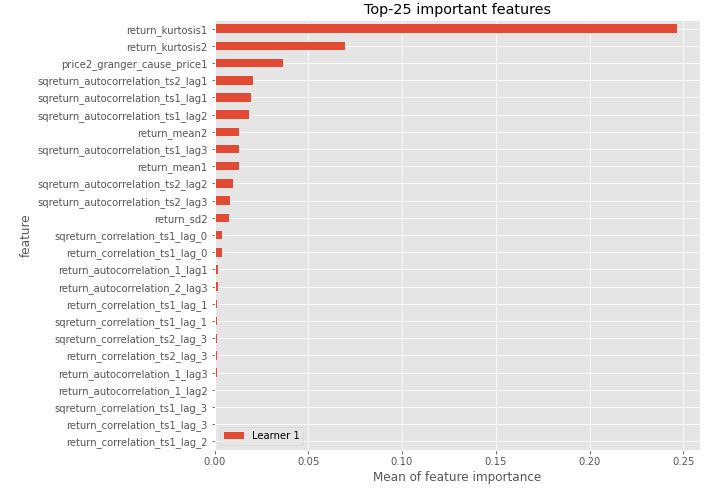

# Summary of 3_Linear

[<< Go back](../README.md)

## Logistic Regression (Linear)
- **n_jobs**: -1
- **explain_level**: 2

## Validation
 - **validation_type**: split
 - **train_ratio**: 0.75
 - **shuffle**: True
 - **stratify**: True

## Optimized metric
accuracy

## Training time

2.9 seconds

## Metric details
|           |    score |     threshold |
|:----------|---------:|--------------:|
| logloss   | 0.286974 | nan           |
| auc       | 0.966138 | nan           |
| f1        | 0.902439 |   0.71426     |
| accuracy  | 0.908046 |   0.71426     |
| precision | 1        |   0.807523    |
| recall    | 1        |   0.000231118 |
| mcc       | 0.831064 |   0.71426     |

## Confusion matrix (at threshold=0.71426)
|                      |   Predicted as real |   Predicted as simulated |
|:---------------------|--------------------:|-------------------------:|
| Labeled as real      |                  42 |                        0 |
| Labeled as simulated |                   8 |                       37 |

## Learning curves

## Coefficients
| feature                           |   Learner_1 |
|:----------------------------------|------------:|
| return_mean2                      |   2.13819   |
| return_autocorrelation_1_lag1     |   0.762672  |
| return_autocorrelation_2_lag2     |   0.614691  |
| return_correlation_ts2_lag_1      |   0.584766  |
| sqreturn_correlation_ts2_lag_1    |   0.584766  |
| return_autocorrelation_1_lag3     |   0.572701  |
| return_autocorrelation_1_lag2     |   0.544308  |
| return_autocorrelation_2_lag3     |   0.5186    |
| sqreturn_correlation_ts1_lag_0    |   0.492954  |
| return_correlation_ts1_lag_0      |   0.492954  |
| return_correlation_ts1_lag_1      |   0.441248  |
| sqreturn_correlation_ts1_lag_1    |   0.441248  |
| return_correlation_ts1_lag_2      |   0.384053  |
| sqreturn_correlation_ts1_lag_2    |   0.384053  |
| return_autocorrelation_2_lag1     |   0.370445  |
| sqreturn_correlation_ts2_lag_3    |   0.364297  |
| return_correlation_ts2_lag_3      |   0.364297  |
| sqreturn_correlation_ts1_lag_3    |   0.32341   |
| return_correlation_ts1_lag_3      |   0.32341   |
| sqreturn_correlation_ts2_lag_2    |   0.320316  |
| return_correlation_ts2_lag_2      |   0.320316  |
| return_sd2                        |   0.184562  |
| return_skew1                      |  -0.0156273 |
| price1_granger_cause_price2       |  -0.0681417 |
| return_skew2                      |  -0.151804  |
| return_sd1                        |  -0.34639   |
| intercept                         |  -0.448061  |
| price2_granger_cause_price1       |  -0.948706  |
| sqreturn_autocorrelation_ts2_lag3 |  -1.27523   |
| return_mean1                      |  -1.45115   |
| return_kurtosis2                  |  -1.46515   |
| sqreturn_autocorrelation_ts1_lag3 |  -1.66382   |
| sqreturn_autocorrelation_ts2_lag2 |  -1.69331   |
| sqreturn_autocorrelation_ts2_lag1 |  -1.84326   |
| sqreturn_autocorrelation_ts1_lag2 |  -2.0288    |
| sqreturn_autocorrelation_ts1_lag1 |  -2.11145   |
| return_kurtosis1                  |  -2.12666   |

## Permutation-based Importance

## Confusion Matrix

## Normalized Confusion Matrix

## ROC Curve

## Kolmogorov-Smirnov Statistic

## Precision-Recall Curve

## Calibration Curve

## Cumulative Gains Curve

## Lift Curve

## SHAP Importance

## SHAP Dependence plots

### Dependence (Fold 1)

## SHAP Decision plots

### Top-10 Worst decisions for class 0 (Fold 1)

### Top-10 Best decisions for class 0 (Fold 1)

### Top-10 Worst decisions for class 1 (Fold 1)

### Top-10 Best decisions for class 1 (Fold 1)

[<< Go back](../README.md)
