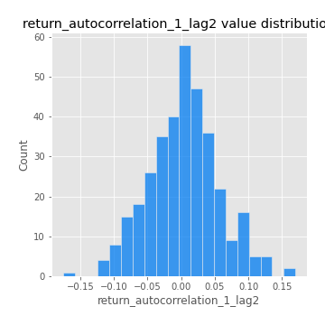
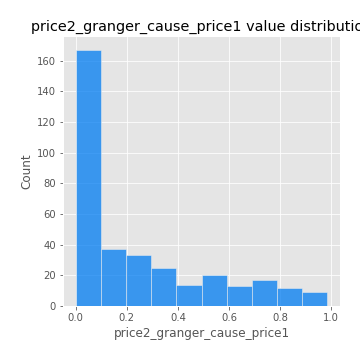

# Exploratory Data Analysis

[<< Go back](../README.md)
## Feature : target
- **Feature type** : categorical
- **Missing** : 0.0%
- **Unique** : 2
- **Count** :347
- **Unique** :2
- **Top** :simulated
- **Freq** :178

## Feature : return_mean1
- **Feature type** : continous
- **Missing** : 0.0%
- **Unique** : 347
- **Count** :347.0
- **Mean** :0.01825651663222162
- **Std** :0.10342567524848385
- **Min** :-0.3699838160950276
- **25%th Percentile** : -0.03926824621893625
- **50%th Percentile** : 0.023378160699767222
- **75%th Percentile** : 0.08421546856949104
- **Max** :0.3981985840483118

## Feature : return_mean2
- **Feature type** : continous
- **Missing** : 0.0%
- **Unique** : 347
- **Count** :347.0
- **Mean** :0.10167801687906303
- **Std** :0.10104020883657373
- **Min** :-0.21818165578778434
- **25%th Percentile** : 0.04445086475106747
- **50%th Percentile** : 0.09822058238526712
- **75%th Percentile** : 0.1633543847732673
- **Max** :0.37616608147096464

## Feature : return_sd1
- **Feature type** : continous
- **Missing** : 0.0%
- **Unique** : 347
- **Count** :347.0
- **Mean** :1.771734860674586
- **Std** :0.6439140177518796
- **Min** :0.7470080772831957
- **25%th Percentile** : 1.5612672901978186
- **50%th Percentile** : 1.639400253280428
- **75%th Percentile** : 1.7276474042653578
- **Max** :6.495661311240861

## Feature : return_sd2
- **Feature type** : continous
- **Missing** : 0.0%
- **Unique** : 347
- **Count** :347.0
- **Mean** :1.827959971253016
- **Std** :0.571793802138268
- **Min** :0.8455946193085045
- **25%th Percentile** : 1.6289176039267481
- **50%th Percentile** : 1.7680149167675039
- **75%th Percentile** : 1.883005879416276
- **Max** :5.042707010333888

## Feature : return_skew1
- **Feature type** : continous
- **Missing** : 0.0%
- **Unique** : 347
- **Count** :347.0
- **Mean** :-0.08295085977544502
- **Std** :0.6387843031938468
- **Min** :-3.530116233761814
- **25%th Percentile** : -0.25262517515743665
- **50%th Percentile** : -0.035094053830410143
- **75%th Percentile** : 0.1551279474076713
- **Max** :2.5845963767725557

## Feature : return_skew2
- **Feature type** : continous
- **Missing** : 0.0%
- **Unique** : 347
- **Count** :347.0
- **Mean** :-0.17325004565514346
- **Std** :0.8599587228801827
- **Min** :-8.801502855292393
- **25%th Percentile** : -0.4076710738556908
- **50%th Percentile** : -0.09382673714292505
- **75%th Percentile** : 0.17950163776392997
- **Max** :2.2606839051517187

## Feature : return_kurtosis1
- **Feature type** : continous
- **Missing** : 0.0%
- **Unique** : 347
- **Count** :347.0
- **Mean** :3.78097211159303
- **Std** :5.7724885493893945
- **Min** :-0.22764402955628116
- **25%th Percentile** : 0.8023379753631239
- **50%th Percentile** : 1.7417930932084906
- **75%th Percentile** : 4.074159428955649
- **Max** :46.07507808162177

## Feature : return_kurtosis2
- **Feature type** : continous
- **Missing** : 0.0%
- **Unique** : 347
- **Count** :347.0
- **Mean** :4.851717925356768
- **Std** :10.06400716075135
- **Min** :-0.044586752068035196
- **25%th Percentile** : 1.1863987686110224
- **50%th Percentile** : 2.490402872458438
- **75%th Percentile** : 4.8191840213736095
- **Max** :143.10871011533666

## Feature : return_autocorrelation_1_lag1
- **Feature type** : continous
- **Missing** : 0.0%
- **Unique** : 347
- **Count** :347.0
- **Mean** :-0.007350171839579524
- **Std** :0.05694562847911719
- **Min** :-0.2135576224968752
- **25%th Percentile** : -0.03383746716215904
- **50%th Percentile** : -0.0003986500096667489
- **75%th Percentile** : 0.028640517132900868
- **Max** :0.11850153722855035

## Feature : return_autocorrelation_1_lag2
- **Feature type** : continous
- **Missing** : 0.0%
- **Unique** : 347
- **Count** :347.0
- **Mean** :0.0034063935239771097
- **Std** :0.052454671678962644
- **Min** :-0.17590699247804545
- **25%th Percentile** : -0.029422551447933258
- **50%th Percentile** : 0.004067041038000954
- **75%th Percentile** : 0.034456720162647114
- **Max** :0.16982097356575035

## Feature : return_autocorrelation_1_lag3
- **Feature type** : continous
- **Missing** : 0.0%
- **Unique** : 347
- **Count** :347.0
- **Mean** :0.005303866800291832
- **Std** :0.05193268714504822
- **Min** :-0.15806635192103805
- **25%th Percentile** : -0.028631717020695474
- **50%th Percentile** : 0.0077211936287295896
- **75%th Percentile** : 0.045024350284074546
- **Max** :0.12131960673015267

## Feature : return_autocorrelation_2_lag1
- **Feature type** : continous
- **Missing** : 0.0%
- **Unique** : 347
- **Count** :347.0
- **Mean** :-0.008657853352084209
- **Std** :0.05890088828095115
- **Min** :-0.25075531010123286
- **25%th Percentile** : -0.0396244404345404
- **50%th Percentile** : -0.007854783342513421
- **75%th Percentile** : 0.02650796119220132
- **Max** :0.31863413537898483

## Feature : return_autocorrelation_2_lag2
- **Feature type** : continous
- **Missing** : 0.0%
- **Unique** : 347
- **Count** :347.0
- **Mean** :-0.0014887317985274413
- **Std** :0.049558439817088615
- **Min** :-0.1495113937562178
- **25%th Percentile** : -0.03369236536492992
- **50%th Percentile** : -0.0012370196935426883
- **75%th Percentile** : 0.028680781598332088
- **Max** :0.20974504043791217

## Feature : return_autocorrelation_2_lag3
- **Feature type** : continous
- **Missing** : 0.0%
- **Unique** : 347
- **Count** :347.0
- **Mean** :0.00113287038899631
- **Std** :0.04879683679787698
- **Min** :-0.14200107169559698
- **25%th Percentile** : -0.03141884606209897
- **50%th Percentile** : 0.0006787100266464529
- **75%th Percentile** : 0.035418788905008616
- **Max** :0.1419999376914021

## Feature : return_correlation_ts1_lag_0
- **Feature type** : continous
- **Missing** : 0.0%
- **Unique** : 347
- **Count** :347.0
- **Mean** :0.34183342945888
- **Std** :0.11166792760757516
- **Min** :0.005136598099876001
- **25%th Percentile** : 0.2857300345366275
- **50%th Percentile** : 0.3438947143821985
- **75%th Percentile** : 0.3951326825832374
- **Max** :0.7028422087350163

## Feature : return_correlation_ts1_lag_1
- **Feature type** : continous
- **Missing** : 0.0%
- **Unique** : 347
- **Count** :347.0
- **Mean** :-0.006376592409611331
- **Std** :0.05242297613789386
- **Min** :-0.16985510949917193
- **25%th Percentile** : -0.03999341732044954
- **50%th Percentile** : -2.377646402126443e-05
- **75%th Percentile** : 0.03487253003026777
- **Max** :0.10570952104390723

## Feature : return_correlation_ts1_lag_2
- **Feature type** : continous
- **Missing** : 0.0%
- **Unique** : 347
- **Count** :347.0
- **Mean** :0.0063066635881850975
- **Std** :0.04877889284118123
- **Min** :-0.21653581047581763
- **25%th Percentile** : -0.026999273531177943
- **50%th Percentile** : 0.0027320506618656246
- **75%th Percentile** : 0.04238027351170545
- **Max** :0.11663454518919356

## Feature : return_correlation_ts1_lag_3
- **Feature type** : continous
- **Missing** : 0.0%
- **Unique** : 347
- **Count** :347.0
- **Mean** :0.004412262911192956
- **Std** :0.05288844545967291
- **Min** :-0.1270218498974763
- **25%th Percentile** : -0.03236233517110686
- **50%th Percentile** : 0.004734539103992928
- **75%th Percentile** : 0.03961708393226744
- **Max** :0.1422809271770942

## Feature : return_correlation_ts2_lag_1
- **Feature type** : continous
- **Missing** : 0.0%
- **Unique** : 347
- **Count** :347.0
- **Mean** :0.0015014058015394214
- **Std** :0.05220364089558412
- **Min** :-0.2081139431093261
- **25%th Percentile** : -0.029531422786293664
- **50%th Percentile** : -0.002148506714879542
- **75%th Percentile** : 0.03768442961945355
- **Max** :0.17208763791364762

## Feature : return_correlation_ts2_lag_2
- **Feature type** : continous
- **Missing** : 0.0%
- **Unique** : 347
- **Count** :347.0
- **Mean** :0.0015488815595421698
- **Std** :0.05300209188883211
- **Min** :-0.23751835475804678
- **25%th Percentile** : -0.031683926549417346
- **50%th Percentile** : -0.0002696739528801751
- **75%th Percentile** : 0.0310429347335545
- **Max** :0.20772887392904255

## Feature : return_correlation_ts2_lag_3
- **Feature type** : continous
- **Missing** : 0.0%
- **Unique** : 347
- **Count** :347.0
- **Mean** :0.007199824602221588
- **Std** :0.051919023603173436
- **Min** :-0.17564076057312866
- **25%th Percentile** : -0.02402972533011003
- **50%th Percentile** : 0.005205566517259729
- **75%th Percentile** : 0.04410430518526283
- **Max** :0.13150875849624785

## Feature : sqreturn_autocorrelation_ts1_lag1
- **Feature type** : continous
- **Missing** : 0.0%
- **Unique** : 347
- **Count** :347.0
- **Mean** :0.045242623190695275
- **Std** :0.08672444249414167
- **Min** :-0.10400144389546283
- **25%th Percentile** : -0.010314319399693992
- **50%th Percentile** : 0.02417154477171563
- **75%th Percentile** : 0.08085961286039967
- **Max** :0.4439086285737898

## Feature : sqreturn_autocorrelation_ts1_lag2
- **Feature type** : continous
- **Missing** : 0.0%
- **Unique** : 347
- **Count** :347.0
- **Mean** :0.037923767674629925
- **Std** :0.0879483684663968
- **Min** :-0.08943952154400595
- **25%th Percentile** : -0.01574036513887382
- **50%th Percentile** : 0.014238241848486604
- **75%th Percentile** : 0.060535402605714314
- **Max** :0.540735851444759

## Feature : sqreturn_autocorrelation_ts1_lag3
- **Feature type** : continous
- **Missing** : 0.0%
- **Unique** : 347
- **Count** :347.0
- **Mean** :0.03254731680965646
- **Std** :0.07610807218509694
- **Min** :-0.07348687503607615
- **25%th Percentile** : -0.017470816383737757
- **50%th Percentile** : 0.012494184649338274
- **75%th Percentile** : 0.05639283036545699
- **Max** :0.3457940197475473

## Feature : sqreturn_autocorrelation_ts2_lag1
- **Feature type** : continous
- **Missing** : 0.0%
- **Unique** : 347
- **Count** :347.0
- **Mean** :0.04799704207950021
- **Std** :0.0847396706880288
- **Min** :-0.10142753126822922
- **25%th Percentile** : -0.010769047955056517
- **50%th Percentile** : 0.025064663625994105
- **75%th Percentile** : 0.07472999510584083
- **Max** :0.3965571120415088

## Feature : sqreturn_autocorrelation_ts2_lag2
- **Feature type** : continous
- **Missing** : 0.0%
- **Unique** : 347
- **Count** :347.0
- **Mean** :0.039878230818663915
- **Std** :0.08698550052961769
- **Min** :-0.1055132422074215
- **25%th Percentile** : -0.01125790392678323
- **50%th Percentile** : 0.012886350539526274
- **75%th Percentile** : 0.05751007560397034
- **Max** :0.5373432415582473

## Feature : sqreturn_autocorrelation_ts2_lag3
- **Feature type** : continous
- **Missing** : 0.0%
- **Unique** : 347
- **Count** :347.0
- **Mean** :0.02951448835143364
- **Std** :0.07217198592109585
- **Min** :-0.09884925070417176
- **25%th Percentile** : -0.018268863822653324
- **50%th Percentile** : 0.010183227334158442
- **75%th Percentile** : 0.05581422918683039
- **Max** :0.31225727797735664

## Feature : sqreturn_correlation_ts1_lag_0
- **Feature type** : continous
- **Missing** : 0.0%
- **Unique** : 347
- **Count** :347.0
- **Mean** :0.34183342945888
- **Std** :0.11166792760757516
- **Min** :0.005136598099876001
- **25%th Percentile** : 0.2857300345366275
- **50%th Percentile** : 0.3438947143821985
- **75%th Percentile** : 0.3951326825832374
- **Max** :0.7028422087350163

## Feature : sqreturn_correlation_ts1_lag_1
- **Feature type** : continous
- **Missing** : 0.0%
- **Unique** : 347
- **Count** :347.0
- **Mean** :-0.006376592409611331
- **Std** :0.05242297613789386
- **Min** :-0.16985510949917193
- **25%th Percentile** : -0.03999341732044954
- **50%th Percentile** : -2.377646402126443e-05
- **75%th Percentile** : 0.03487253003026777
- **Max** :0.10570952104390723

## Feature : sqreturn_correlation_ts1_lag_2
- **Feature type** : continous
- **Missing** : 0.0%
- **Unique** : 347
- **Count** :347.0
- **Mean** :0.0063066635881850975
- **Std** :0.04877889284118123
- **Min** :-0.21653581047581763
- **25%th Percentile** : -0.026999273531177943
- **50%th Percentile** : 0.0027320506618656246
- **75%th Percentile** : 0.04238027351170545
- **Max** :0.11663454518919356

## Feature : sqreturn_correlation_ts1_lag_3
- **Feature type** : continous
- **Missing** : 0.0%
- **Unique** : 347
- **Count** :347.0
- **Mean** :0.004412262911192956
- **Std** :0.05288844545967291
- **Min** :-0.1270218498974763
- **25%th Percentile** : -0.03236233517110686
- **50%th Percentile** : 0.004734539103992928
- **75%th Percentile** : 0.03961708393226744
- **Max** :0.1422809271770942

## Feature : sqreturn_correlation_ts2_lag_1
- **Feature type** : continous
- **Missing** : 0.0%
- **Unique** : 347
- **Count** :347.0
- **Mean** :0.0015014058015394214
- **Std** :0.05220364089558412
- **Min** :-0.2081139431093261
- **25%th Percentile** : -0.029531422786293664
- **50%th Percentile** : -0.002148506714879542
- **75%th Percentile** : 0.03768442961945355
- **Max** :0.17208763791364762

## Feature : sqreturn_correlation_ts2_lag_2
- **Feature type** : continous
- **Missing** : 0.0%
- **Unique** : 347
- **Count** :347.0
- **Mean** :0.0015488815595421698
- **Std** :0.05300209188883211
- **Min** :-0.23751835475804678
- **25%th Percentile** : -0.031683926549417346
- **50%th Percentile** : -0.0002696739528801751
- **75%th Percentile** : 0.0310429347335545
- **Max** :0.20772887392904255

## Feature : sqreturn_correlation_ts2_lag_3
- **Feature type** : continous
- **Missing** : 0.0%
- **Unique** : 347
- **Count** :347.0
- **Mean** :0.007199824602221588
- **Std** :0.051919023603173436
- **Min** :-0.17564076057312866
- **25%th Percentile** : -0.02402972533011003
- **50%th Percentile** : 0.005205566517259729
- **75%th Percentile** : 0.04410430518526283
- **Max** :0.13150875849624785

## Feature : price2_granger_cause_price1
- **Feature type** : continous
- **Missing** : 0.0%
- **Unique** : 347
- **Count** :347.0
- **Mean** :0.23783736676860356
- **Std** :0.2768150280723513
- **Min** :1.371074475372166e-08
- **25%th Percentile** : 0.01214792658216815
- **50%th Percentile** : 0.11010021627179814
- **75%th Percentile** : 0.37997561705445
- **Max** :0.9853666024514321

## Feature : price1_granger_cause_price2
- **Feature type** : continous
- **Missing** : 0.0%
- **Unique** : 347
- **Count** :347.0
- **Mean** :0.32220199560288343
- **Std** :0.2817221203109834
- **Min** :6.229481013319811e-05
- **25%th Percentile** : 0.06150394422789544
- **50%th Percentile** : 0.25911355233688016
- **75%th Percentile** : 0.5306424539004339
- **Max** :0.9951398266867577

[<< Go back](../README.md)
