# Summary of 3_Linear

[<< Go back](../README.md)

## Logistic Regression (Linear)
- **n_jobs**: -1
- **explain_level**: 2

## Validation
 - **validation_type**: split
 - **train_ratio**: 0.75
 - **shuffle**: True
 - **stratify**: True

## Optimized metric
accuracy

## Training time

3.1 seconds

## Metric details
|           |    score |    threshold |
|:----------|---------:|-------------:|
| logloss   | 0.425974 | nan          |
| auc       | 0.934461 | nan          |
| f1        | 0.876404 |   0.618843   |
| accuracy  | 0.873563 |   0.618843   |
| precision | 1        |   0.787744   |
| recall    | 1        |   0.00143347 |
| mcc       | 0.749075 |   0.618843   |

## Confusion matrix (at threshold=0.618843)
|                      |   Predicted as real |   Predicted as simulated |
|:---------------------|--------------------:|-------------------------:|
| Labeled as real      |                  37 |                        7 |
| Labeled as simulated |                   4 |                       39 |

## Learning curves
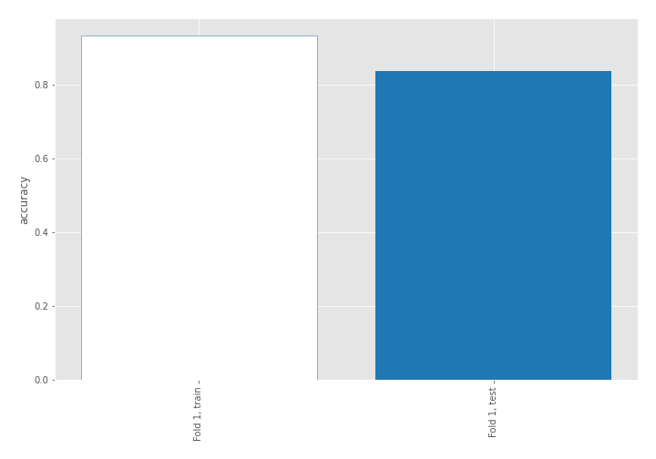

## Coefficients
| feature                           |   Learner_1 |
|:----------------------------------|------------:|
| return_mean2                      |   1.87797   |
| sqreturn_correlation_ts1_lag_0    |   1.56186   |
| return_correlation_ts1_lag_0      |   1.56186   |
| return_autocorrelation_1_lag1     |   0.95384   |
| return_autocorrelation_1_lag2     |   0.759557  |
| sqreturn_correlation_ts1_lag_1    |   0.70936   |
| return_correlation_ts1_lag_1      |   0.70936   |
| return_autocorrelation_2_lag2     |   0.660317  |
| return_autocorrelation_1_lag3     |   0.578087  |
| sqreturn_correlation_ts1_lag_2    |   0.554001  |
| return_correlation_ts1_lag_2      |   0.554001  |
| return_autocorrelation_2_lag3     |   0.533122  |
| return_autocorrelation_2_lag1     |   0.387146  |
| sqreturn_correlation_ts1_lag_3    |   0.368637  |
| return_correlation_ts1_lag_3      |   0.368637  |
| sqreturn_correlation_ts2_lag_1    |   0.361225  |
| return_correlation_ts2_lag_1      |   0.361225  |
| return_correlation_ts2_lag_3      |   0.359696  |
| sqreturn_correlation_ts2_lag_3    |   0.359696  |
| sqreturn_correlation_ts2_lag_2    |   0.240397  |
| return_correlation_ts2_lag_2      |   0.240397  |
| return_skew1                      |   0.1292    |
| return_sd2                        |   0.0367516 |
| return_skew2                      |  -0.0587041 |
| price1_granger_cause_price2       |  -0.275417  |
| return_kurtosis2                  |  -0.316556  |
| return_sd1                        |  -0.368488  |
| intercept                         |  -0.663394  |
| price2_granger_cause_price1       |  -1.04927   |
| sqreturn_autocorrelation_ts2_lag3 |  -1.09892   |
| return_kurtosis1                  |  -1.35176   |
| sqreturn_autocorrelation_ts1_lag3 |  -1.47723   |
| sqreturn_autocorrelation_ts2_lag2 |  -1.80913   |
| return_mean1                      |  -2.08842   |
| sqreturn_autocorrelation_ts1_lag2 |  -2.13876   |
| sqreturn_autocorrelation_ts2_lag1 |  -2.30131   |
| sqreturn_autocorrelation_ts1_lag1 |  -2.71027   |

## Permutation-based Importance
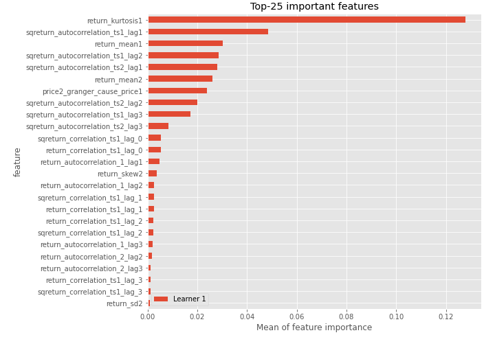
## Confusion Matrix

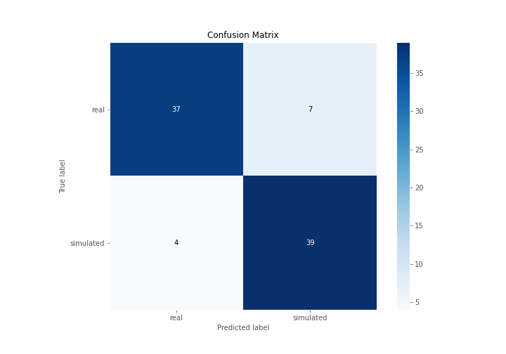

## Normalized Confusion Matrix

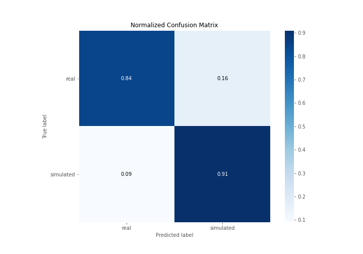

## ROC Curve

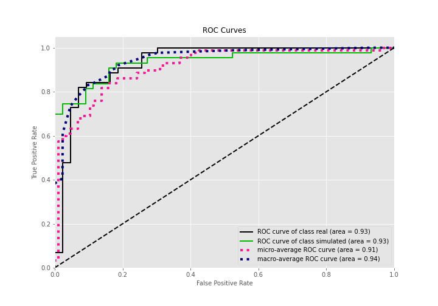

## Kolmogorov-Smirnov Statistic

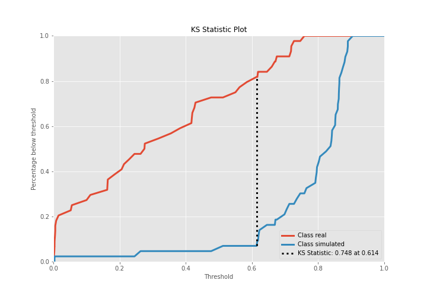

## Precision-Recall Curve

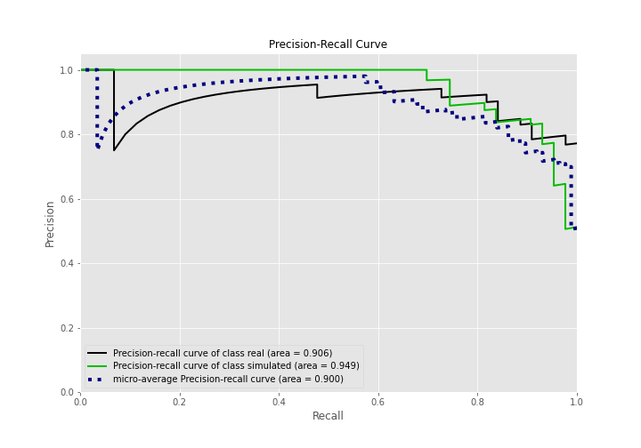

## Calibration Curve

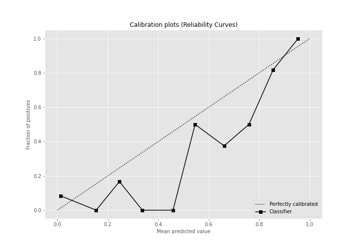

## Cumulative Gains Curve

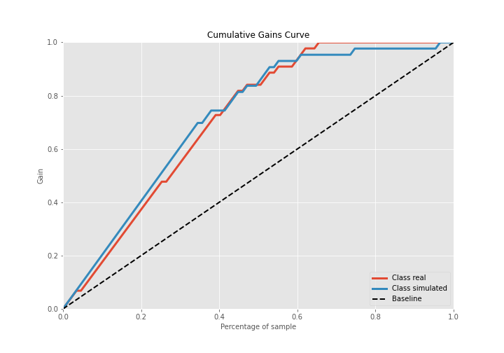

## Lift Curve

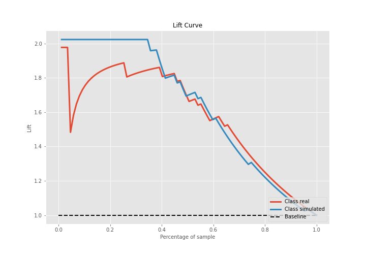

## SHAP Importance
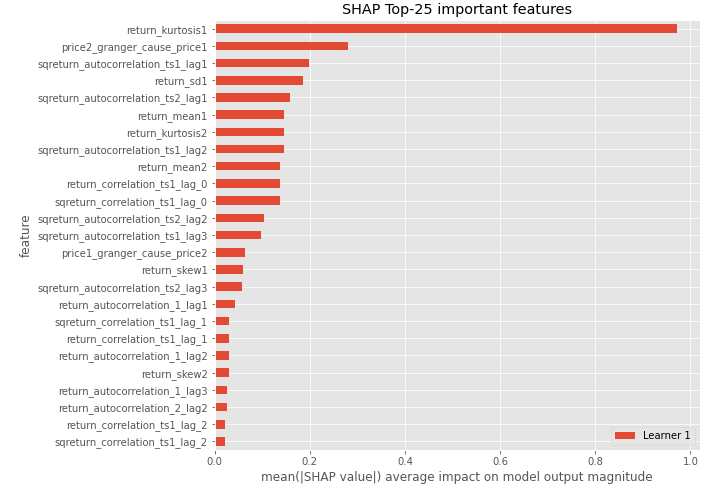

## SHAP Dependence plots

### Dependence (Fold 1)
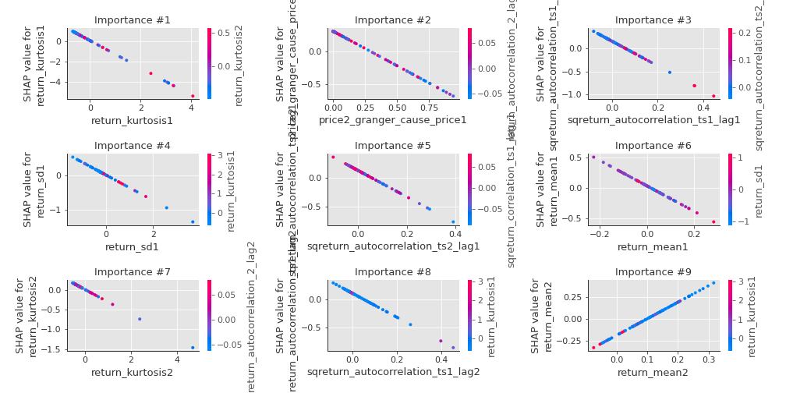

## SHAP Decision plots

### Top-10 Worst decisions for class 0 (Fold 1)
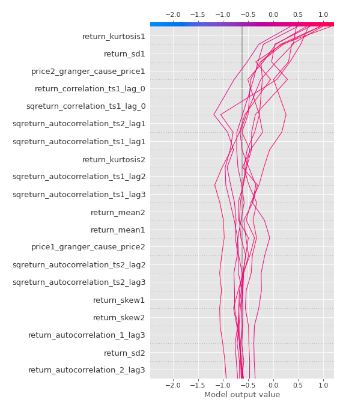
### Top-10 Best decisions for class 0 (Fold 1)
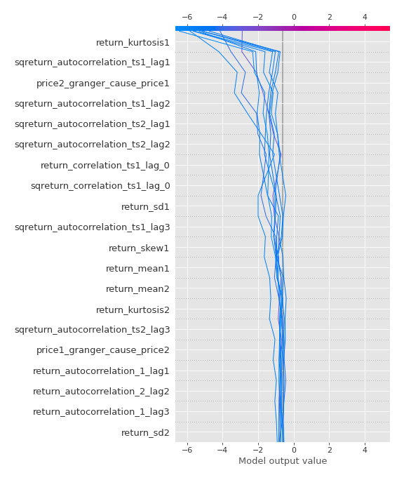
### Top-10 Worst decisions for class 1 (Fold 1)
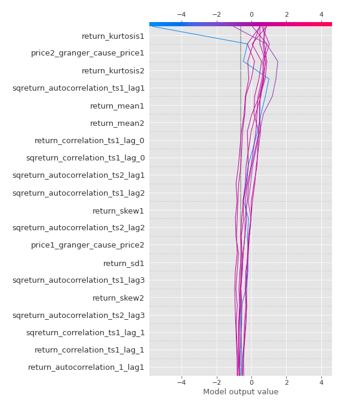
### Top-10 Best decisions for class 1 (Fold 1)
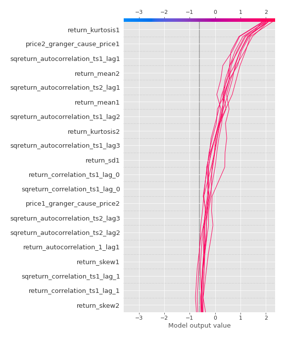

[<< Go back](../README.md)
