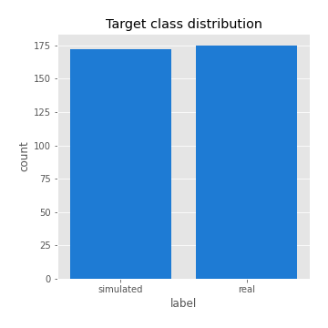
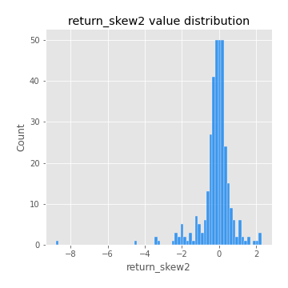
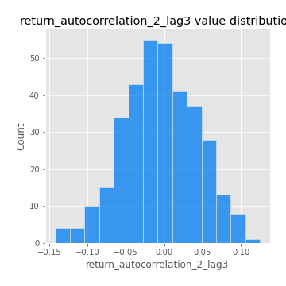

# Exploratory Data Analysis

[<< Go back](../README.md)
## Feature : target
- **Feature type** : categorical
- **Missing** : 0.0%
- **Unique** : 2
- **Count** :347
- **Unique** :2
- **Top** :real
- **Freq** :175

## Feature : return_mean1
- **Feature type** : continous
- **Missing** : 0.0%
- **Unique** : 347
- **Count** :347.0
- **Mean** :0.016439438635324682
- **Std** :0.10338162691126386
- **Min** :-0.27433127561330983
- **25%th Percentile** : -0.039334176840093785
- **50%th Percentile** : 0.02678261832024687
- **75%th Percentile** : 0.08394490599281391
- **Max** :0.3612366374600757

## Feature : return_mean2
- **Feature type** : continous
- **Missing** : 0.0%
- **Unique** : 347
- **Count** :347.0
- **Mean** :0.10917184849628764
- **Std** :0.09886475819659468
- **Min** :-0.24205418062825398
- **25%th Percentile** : 0.04876704140048752
- **50%th Percentile** : 0.10678950534606133
- **75%th Percentile** : 0.17411632937009786
- **Max** :0.37616608147096464

## Feature : return_sd1
- **Feature type** : continous
- **Missing** : 0.0%
- **Unique** : 347
- **Count** :347.0
- **Mean** :1.7868174274267288
- **Std** :0.706165112860023
- **Min** :0.7620831696941981
- **25%th Percentile** : 1.5587025123965448
- **50%th Percentile** : 1.649765400424066
- **75%th Percentile** : 1.7780295286770156
- **Max** :9.236766377527575

## Feature : return_sd2
- **Feature type** : continous
- **Missing** : 0.0%
- **Unique** : 347
- **Count** :347.0
- **Mean** :1.8634695287047292
- **Std** :0.6694622899954124
- **Min** :0.8967691504919791
- **25%th Percentile** : 1.624708738075506
- **50%th Percentile** : 1.7719809751069264
- **75%th Percentile** : 1.9092286492809758
- **Max** :5.872800253666788

## Feature : return_skew1
- **Feature type** : continous
- **Missing** : 0.0%
- **Unique** : 347
- **Count** :347.0
- **Mean** :-0.11085686554043392
- **Std** :0.6457657310964003
- **Min** :-3.530116233761814
- **25%th Percentile** : -0.295002905200069
- **50%th Percentile** : -0.04198287634980366
- **75%th Percentile** : 0.1485124799501005
- **Max** :1.989411030028313

## Feature : return_skew2
- **Feature type** : continous
- **Missing** : 0.0%
- **Unique** : 347
- **Count** :347.0
- **Mean** :-0.1478084498264667
- **Std** :0.9138513334231912
- **Min** :-8.801502855292393
- **25%th Percentile** : -0.32891891269290663
- **50%th Percentile** : -0.04780462648400617
- **75%th Percentile** : 0.22439379356500036
- **Max** :2.3022624185112135

## Feature : return_kurtosis1
- **Feature type** : continous
- **Missing** : 0.0%
- **Unique** : 347
- **Count** :347.0
- **Mean** :4.074138469499441
- **Std** :6.010703447197987
- **Min** :-0.318781639288531
- **25%th Percentile** : 0.7813600668638014
- **50%th Percentile** : 1.8256175776943908
- **75%th Percentile** : 4.187074787823749
- **Max** :46.07507808162177

## Feature : return_kurtosis2
- **Feature type** : continous
- **Missing** : 0.0%
- **Unique** : 347
- **Count** :347.0
- **Mean** :5.537711669201331
- **Std** :10.59804215300275
- **Min** :-0.29746176752940157
- **25%th Percentile** : 1.1904711516538558
- **50%th Percentile** : 2.580307348726985
- **75%th Percentile** : 5.029594203664637
- **Max** :143.10871011533666

## Feature : return_autocorrelation_1_lag1
- **Feature type** : continous
- **Missing** : 0.0%
- **Unique** : 347
- **Count** :347.0
- **Mean** :0.0013637666564422781
- **Std** :0.060541778005746054
- **Min** :-0.20673896439036124
- **25%th Percentile** : -0.03334946830545233
- **50%th Percentile** : 0.006056885329069524
- **75%th Percentile** : 0.042201897441585035
- **Max** :0.1391464036481147

## Feature : return_autocorrelation_1_lag2
- **Feature type** : continous
- **Missing** : 0.0%
- **Unique** : 347
- **Count** :347.0
- **Mean** :0.002339314092290122
- **Std** :0.0500906365184168
- **Min** :-0.13309283796645122
- **25%th Percentile** : -0.02843749456313025
- **50%th Percentile** : 0.004211968518567907
- **75%th Percentile** : 0.03181252409171444
- **Max** :0.1561488228015672

## Feature : return_autocorrelation_1_lag3
- **Feature type** : continous
- **Missing** : 0.0%
- **Unique** : 347
- **Count** :347.0
- **Mean** :0.008139867273853208
- **Std** :0.05349949995327433
- **Min** :-0.15806635192103805
- **25%th Percentile** : -0.025273194916942424
- **50%th Percentile** : 0.009869409326879828
- **75%th Percentile** : 0.04605878253035332
- **Max** :0.17805869530681923

## Feature : return_autocorrelation_2_lag1
- **Feature type** : continous
- **Missing** : 0.0%
- **Unique** : 347
- **Count** :347.0
- **Mean** :-0.010074100916233725
- **Std** :0.057864742375081095
- **Min** :-0.25075531010123286
- **25%th Percentile** : -0.04044118742080616
- **50%th Percentile** : -0.005528990699066865
- **75%th Percentile** : 0.027416113123382945
- **Max** :0.125798519142397

## Feature : return_autocorrelation_2_lag2
- **Feature type** : continous
- **Missing** : 0.0%
- **Unique** : 347
- **Count** :347.0
- **Mean** :0.0005934133753890101
- **Std** :0.05026801650179935
- **Min** :-0.15323211089747296
- **25%th Percentile** : -0.03242637077431702
- **50%th Percentile** : 0.0018785238113544211
- **75%th Percentile** : 0.03472469945488688
- **Max** :0.14734721826682337

## Feature : return_autocorrelation_2_lag3
- **Feature type** : continous
- **Missing** : 0.0%
- **Unique** : 347
- **Count** :347.0
- **Mean** :-0.004425338922630576
- **Std** :0.048097012902422465
- **Min** :-0.14200107169559698
- **25%th Percentile** : -0.03780167461620576
- **50%th Percentile** : -0.006131611122682539
- **75%th Percentile** : 0.029561417344385867
- **Max** :0.12489629575199976

## Feature : return_correlation_ts1_lag_0
- **Feature type** : continous
- **Missing** : 0.0%
- **Unique** : 347
- **Count** :347.0
- **Mean** :0.33895864462778325
- **Std** :0.11173010595983472
- **Min** :-0.027089510445801036
- **25%th Percentile** : 0.2751509409450126
- **50%th Percentile** : 0.34171689479883377
- **75%th Percentile** : 0.40183018418530747
- **Max** :0.7041861626832071

## Feature : return_correlation_ts1_lag_1
- **Feature type** : continous
- **Missing** : 0.0%
- **Unique** : 347
- **Count** :347.0
- **Mean** :0.000682156598271589
- **Std** :0.05379647868744556
- **Min** :-0.15776193292681923
- **25%th Percentile** : -0.033896819478477905
- **50%th Percentile** : 0.0021906464331713296
- **75%th Percentile** : 0.037076813784513295
- **Max** :0.16599929303538674

## Feature : return_correlation_ts1_lag_2
- **Feature type** : continous
- **Missing** : 0.0%
- **Unique** : 347
- **Count** :347.0
- **Mean** :0.0035807116288691485
- **Std** :0.0474810998739271
- **Min** :-0.12864410180561703
- **25%th Percentile** : -0.025259807514930087
- **50%th Percentile** : 0.005253262040229166
- **75%th Percentile** : 0.037399683943791104
- **Max** :0.10925794766608564

## Feature : return_correlation_ts1_lag_3
- **Feature type** : continous
- **Missing** : 0.0%
- **Unique** : 347
- **Count** :347.0
- **Mean** :0.004430639732510618
- **Std** :0.051682515214784404
- **Min** :-0.1270218498974763
- **25%th Percentile** : -0.027868413318550375
- **50%th Percentile** : 0.0034010283811706523
- **75%th Percentile** : 0.03713010260368005
- **Max** :0.1636773216468148

## Feature : return_correlation_ts2_lag_1
- **Feature type** : continous
- **Missing** : 0.0%
- **Unique** : 347
- **Count** :347.0
- **Mean** :-0.00016915337557011232
- **Std** :0.0577061480565083
- **Min** :-0.2081139431093261
- **25%th Percentile** : -0.030845839010015398
- **50%th Percentile** : -0.001052307586426952
- **75%th Percentile** : 0.03832726905939726
- **Max** :0.17208763791364762

## Feature : return_correlation_ts2_lag_2
- **Feature type** : continous
- **Missing** : 0.0%
- **Unique** : 347
- **Count** :347.0
- **Mean** :0.003220057731904078
- **Std** :0.047397421466188104
- **Min** :-0.15299951737180204
- **25%th Percentile** : -0.024931068870878766
- **50%th Percentile** : -0.0003449019640725187
- **75%th Percentile** : 0.03070990790496183
- **Max** :0.20772887392904255

## Feature : return_correlation_ts2_lag_3
- **Feature type** : continous
- **Missing** : 0.0%
- **Unique** : 347
- **Count** :347.0
- **Mean** :-0.0008513374707611384
- **Std** :0.051952166542858336
- **Min** :-0.17564076057312866
- **25%th Percentile** : -0.030698968802299935
- **50%th Percentile** : 0.0005156439438987019
- **75%th Percentile** : 0.03549763167344745
- **Max** :0.158488526602098

## Feature : sqreturn_autocorrelation_ts1_lag1
- **Feature type** : continous
- **Missing** : 0.0%
- **Unique** : 347
- **Count** :347.0
- **Mean** :0.047736058284464006
- **Std** :0.09770209434257203
- **Min** :-0.08963737664978197
- **25%th Percentile** : -0.02075539537193362
- **50%th Percentile** : 0.018437200011052722
- **75%th Percentile** : 0.08476889035149268
- **Max** :0.49414293176447355

## Feature : sqreturn_autocorrelation_ts1_lag2
- **Feature type** : continous
- **Missing** : 0.0%
- **Unique** : 347
- **Count** :347.0
- **Mean** :0.040281251027796526
- **Std** :0.0877250136111705
- **Min** :-0.10330272134936826
- **25%th Percentile** : -0.014065055272850863
- **50%th Percentile** : 0.013818742207942509
- **75%th Percentile** : 0.06957437287881435
- **Max** :0.4522162366773919

## Feature : sqreturn_autocorrelation_ts1_lag3
- **Feature type** : continous
- **Missing** : 0.0%
- **Unique** : 347
- **Count** :347.0
- **Mean** :0.03382422680996183
- **Std** :0.07617200640236656
- **Min** :-0.08604924350024169
- **25%th Percentile** : -0.012654046967936667
- **50%th Percentile** : 0.012724272394039293
- **75%th Percentile** : 0.05639283036545699
- **Max** :0.41030914918857014

## Feature : sqreturn_autocorrelation_ts2_lag1
- **Feature type** : continous
- **Missing** : 0.0%
- **Unique** : 347
- **Count** :347.0
- **Mean** :0.04711332971495398
- **Std** :0.08884390712711392
- **Min** :-0.10906608124238473
- **25%th Percentile** : -0.011372657856447081
- **50%th Percentile** : 0.01854371057518952
- **75%th Percentile** : 0.08343447905876857
- **Max** :0.510085647437958

## Feature : sqreturn_autocorrelation_ts2_lag2
- **Feature type** : continous
- **Missing** : 0.0%
- **Unique** : 347
- **Count** :347.0
- **Mean** :0.03898369769034475
- **Std** :0.08102348769337098
- **Min** :-0.07597671655348222
- **25%th Percentile** : -0.009237916456603726
- **50%th Percentile** : 0.012375866706371325
- **75%th Percentile** : 0.053643188292230956
- **Max** :0.45676817892778204

## Feature : sqreturn_autocorrelation_ts2_lag3
- **Feature type** : continous
- **Missing** : 0.0%
- **Unique** : 347
- **Count** :347.0
- **Mean** :0.026716545565386697
- **Std** :0.06803038822605628
- **Min** :-0.09785059358425532
- **25%th Percentile** : -0.016308365720826272
- **50%th Percentile** : 0.00850737373633446
- **75%th Percentile** : 0.05183065765108166
- **Max** :0.31225727797735664

## Feature : sqreturn_correlation_ts1_lag_0
- **Feature type** : continous
- **Missing** : 0.0%
- **Unique** : 347
- **Count** :347.0
- **Mean** :0.33895864462778325
- **Std** :0.11173010595983472
- **Min** :-0.027089510445801036
- **25%th Percentile** : 0.2751509409450126
- **50%th Percentile** : 0.34171689479883377
- **75%th Percentile** : 0.40183018418530747
- **Max** :0.7041861626832071

## Feature : sqreturn_correlation_ts1_lag_1
- **Feature type** : continous
- **Missing** : 0.0%
- **Unique** : 347
- **Count** :347.0
- **Mean** :0.000682156598271589
- **Std** :0.05379647868744556
- **Min** :-0.15776193292681923
- **25%th Percentile** : -0.033896819478477905
- **50%th Percentile** : 0.0021906464331713296
- **75%th Percentile** : 0.037076813784513295
- **Max** :0.16599929303538674

## Feature : sqreturn_correlation_ts1_lag_2
- **Feature type** : continous
- **Missing** : 0.0%
- **Unique** : 347
- **Count** :347.0
- **Mean** :0.0035807116288691485
- **Std** :0.0474810998739271
- **Min** :-0.12864410180561703
- **25%th Percentile** : -0.025259807514930087
- **50%th Percentile** : 0.005253262040229166
- **75%th Percentile** : 0.037399683943791104
- **Max** :0.10925794766608564

## Feature : sqreturn_correlation_ts1_lag_3
- **Feature type** : continous
- **Missing** : 0.0%
- **Unique** : 347
- **Count** :347.0
- **Mean** :0.004430639732510618
- **Std** :0.051682515214784404
- **Min** :-0.1270218498974763
- **25%th Percentile** : -0.027868413318550375
- **50%th Percentile** : 0.0034010283811706523
- **75%th Percentile** : 0.03713010260368005
- **Max** :0.1636773216468148

## Feature : sqreturn_correlation_ts2_lag_1
- **Feature type** : continous
- **Missing** : 0.0%
- **Unique** : 347
- **Count** :347.0
- **Mean** :-0.00016915337557011232
- **Std** :0.0577061480565083
- **Min** :-0.2081139431093261
- **25%th Percentile** : -0.030845839010015398
- **50%th Percentile** : -0.001052307586426952
- **75%th Percentile** : 0.03832726905939726
- **Max** :0.17208763791364762

## Feature : sqreturn_correlation_ts2_lag_2
- **Feature type** : continous
- **Missing** : 0.0%
- **Unique** : 347
- **Count** :347.0
- **Mean** :0.003220057731904078
- **Std** :0.047397421466188104
- **Min** :-0.15299951737180204
- **25%th Percentile** : -0.024931068870878766
- **50%th Percentile** : -0.0003449019640725187
- **75%th Percentile** : 0.03070990790496183
- **Max** :0.20772887392904255

## Feature : sqreturn_correlation_ts2_lag_3
- **Feature type** : continous
- **Missing** : 0.0%
- **Unique** : 347
- **Count** :347.0
- **Mean** :-0.0008513374707611384
- **Std** :0.051952166542858336
- **Min** :-0.17564076057312866
- **25%th Percentile** : -0.030698968802299935
- **50%th Percentile** : 0.0005156439438987019
- **75%th Percentile** : 0.03549763167344745
- **Max** :0.158488526602098

## Feature : price2_granger_cause_price1
- **Feature type** : continous
- **Missing** : 0.0%
- **Unique** : 347
- **Count** :347.0
- **Mean** :0.2569753495953571
- **Std** :0.2892504330024657
- **Min** :1.0698473038213778e-07
- **25%th Percentile** : 0.013074702934012902
- **50%th Percentile** : 0.11131255633967038
- **75%th Percentile** : 0.43866789536936446
- **Max** :0.9885712803689185

## Feature : price1_granger_cause_price2
- **Feature type** : continous
- **Missing** : 0.0%
- **Unique** : 347
- **Count** :347.0
- **Mean** :0.32802047358647274
- **Std** :0.2875292749334644
- **Min** :1.1380102141157817e-05
- **25%th Percentile** : 0.05768017926248012
- **50%th Percentile** : 0.26601069481099415
- **75%th Percentile** : 0.5377568566831489
- **Max** :0.9985982225341805

[<< Go back](../README.md)
