# Summary of 3_Linear

[<< Go back](../README.md)

## Logistic Regression (Linear)
- **n_jobs**: -1
- **explain_level**: 2

## Validation
 - **validation_type**: split
 - **train_ratio**: 0.75
 - **shuffle**: True
 - **stratify**: True

## Optimized metric
accuracy

## Training time

3.5 seconds

## Metric details
|           |    score |     threshold |
|:----------|---------:|--------------:|
| logloss   | 0.308115 | nan           |
| auc       | 0.967126 | nan           |
| f1        | 0.91954  |   0.454691    |
| accuracy  | 0.91954  |   0.454691    |
| precision | 1        |   0.885607    |
| recall    | 1        |   3.38762e-05 |
| mcc       | 0.845175 |   0.454691    |

## Confusion matrix (at threshold=0.454691)
|                      |   Predicted as real |   Predicted as simulated |
|:---------------------|--------------------:|-------------------------:|
| Labeled as real      |                  40 |                        6 |
| Labeled as simulated |                   1 |                       40 |

## Learning curves
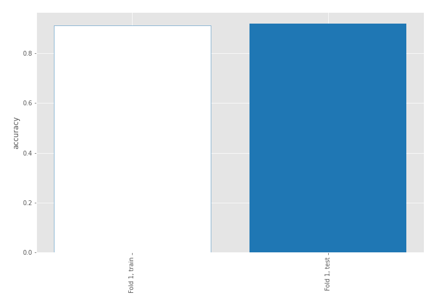

## Coefficients
| feature                           |   Learner_1 |
|:----------------------------------|------------:|
| return_mean2                      |  1.7765     |
| return_correlation_ts1_lag_0      |  1.35571    |
| sqreturn_correlation_ts1_lag_0    |  1.35571    |
| return_autocorrelation_1_lag1     |  0.933806   |
| return_autocorrelation_1_lag2     |  0.843195   |
| sqreturn_correlation_ts1_lag_2    |  0.780688   |
| return_correlation_ts1_lag_2      |  0.780688   |
| return_autocorrelation_2_lag2     |  0.657717   |
| return_autocorrelation_1_lag3     |  0.548809   |
| return_correlation_ts2_lag_2      |  0.523562   |
| sqreturn_correlation_ts2_lag_2    |  0.523562   |
| return_autocorrelation_2_lag1     |  0.507052   |
| return_correlation_ts1_lag_1      |  0.502979   |
| sqreturn_correlation_ts1_lag_1    |  0.502979   |
| return_autocorrelation_2_lag3     |  0.491624   |
| sqreturn_correlation_ts2_lag_1    |  0.422938   |
| return_correlation_ts2_lag_1      |  0.422938   |
| sqreturn_correlation_ts1_lag_3    |  0.406813   |
| return_correlation_ts1_lag_3      |  0.406813   |
| return_skew2                      |  0.283843   |
| return_skew1                      |  0.224419   |
| sqreturn_correlation_ts2_lag_3    |  0.205155   |
| return_correlation_ts2_lag_3      |  0.205155   |
| return_sd1                        |  0.0376162  |
| return_sd2                        | -0.00548132 |
| price1_granger_cause_price2       | -0.346708   |
| intercept                         | -0.506698   |
| return_kurtosis2                  | -0.756263   |
| sqreturn_autocorrelation_ts2_lag3 | -1.28518    |
| return_kurtosis1                  | -1.34163    |
| price2_granger_cause_price1       | -1.47118    |
| sqreturn_autocorrelation_ts1_lag3 | -1.6637     |
| sqreturn_autocorrelation_ts2_lag2 | -1.67145    |
| return_mean1                      | -1.99592    |
| sqreturn_autocorrelation_ts1_lag2 | -2.0841     |
| sqreturn_autocorrelation_ts1_lag1 | -2.09509    |
| sqreturn_autocorrelation_ts2_lag1 | -2.0974     |

## Permutation-based Importance
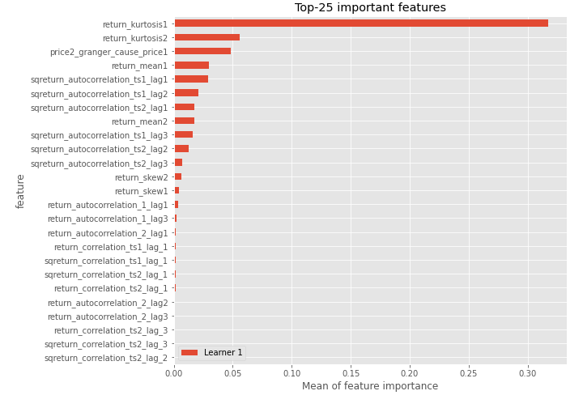
## Confusion Matrix

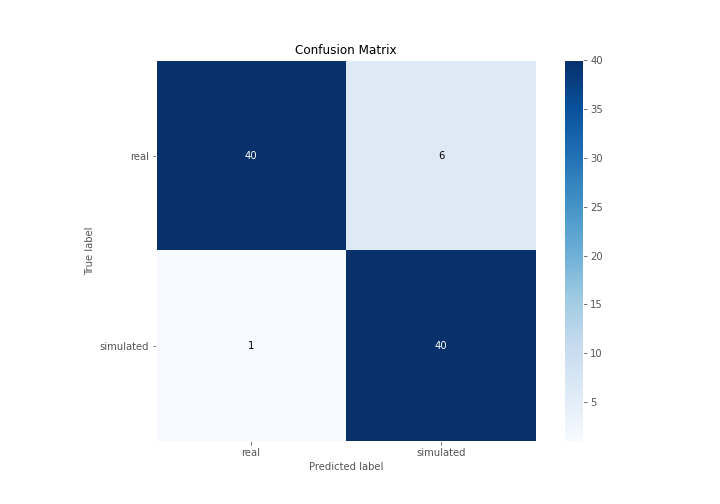

## Normalized Confusion Matrix

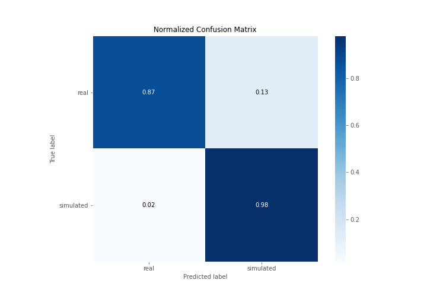

## ROC Curve

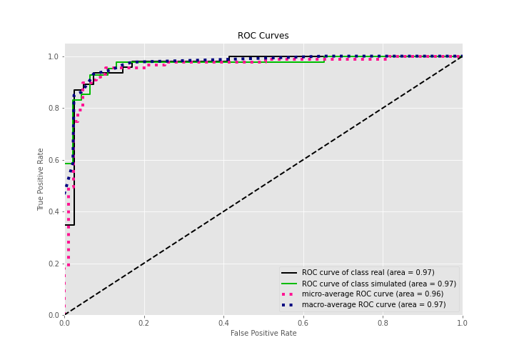

## Kolmogorov-Smirnov Statistic

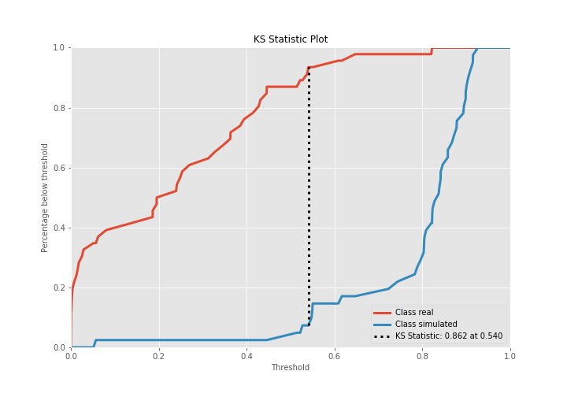

## Precision-Recall Curve

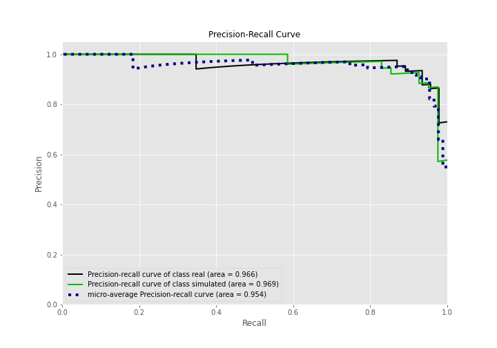

## Calibration Curve

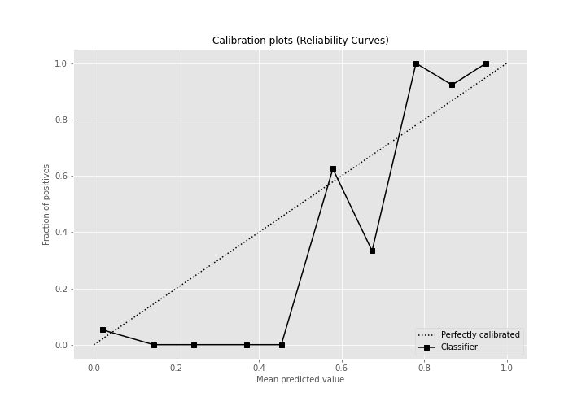

## Cumulative Gains Curve

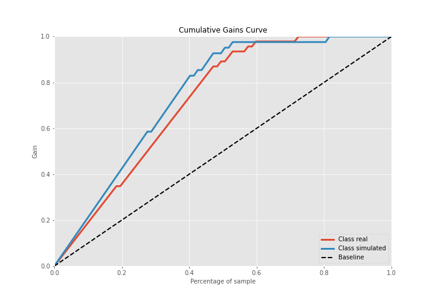

## Lift Curve

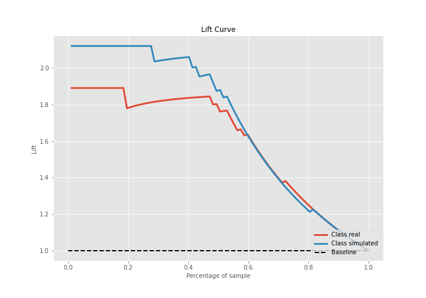

## SHAP Importance
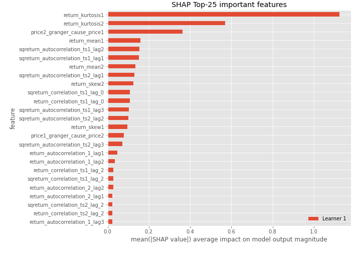

## SHAP Dependence plots

### Dependence (Fold 1)
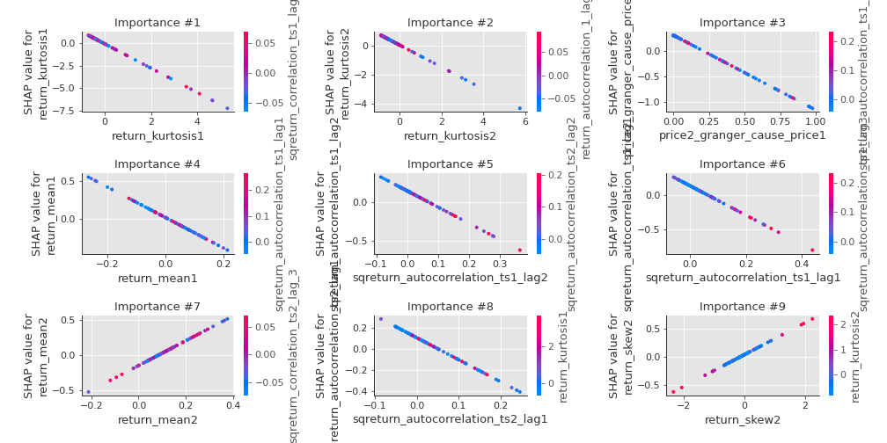

## SHAP Decision plots

### Top-10 Worst decisions for class 0 (Fold 1)
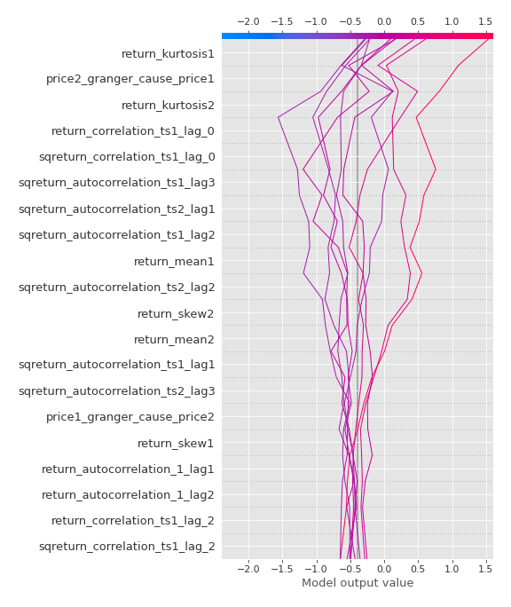
### Top-10 Best decisions for class 0 (Fold 1)
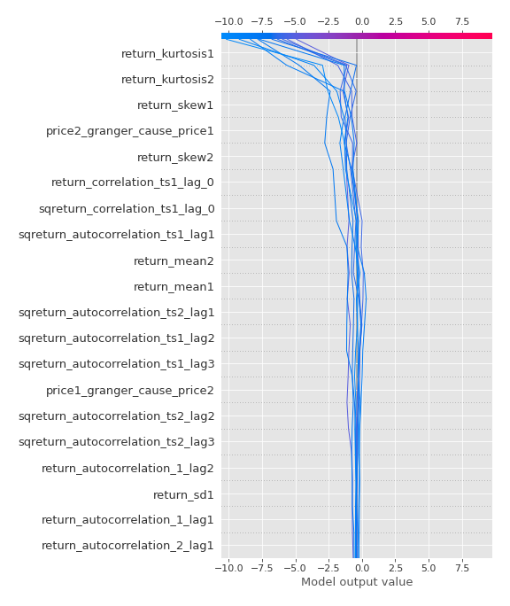
### Top-10 Worst decisions for class 1 (Fold 1)
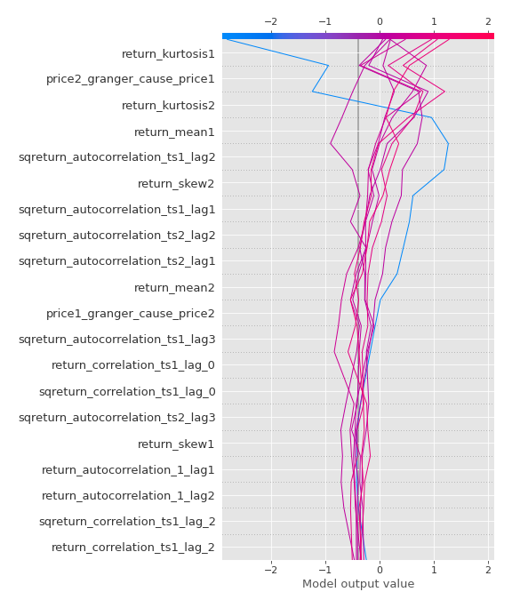
### Top-10 Best decisions for class 1 (Fold 1)
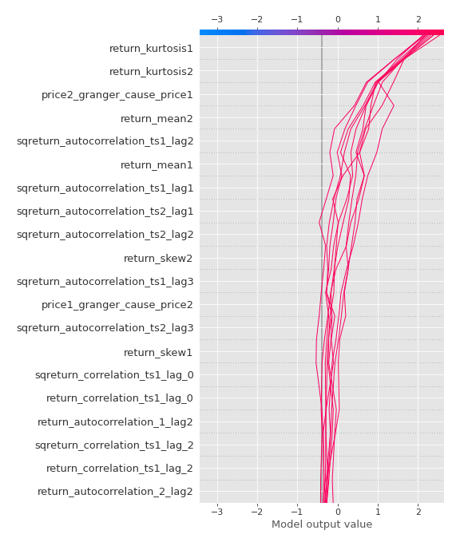

[<< Go back](../README.md)
