# Exploratory Data Analysis

[<< Go back](../README.md)
## Feature : target
- **Feature type** : categorical
- **Missing** : 0.0%
- **Unique** : 2
- **Count** :347
- **Unique** :2
- **Top** :real
- **Freq** :183

## Feature : return_mean1
- **Feature type** : continous
- **Missing** : 0.0%
- **Unique** : 347
- **Count** :347.0
- **Mean** :0.01966582775225528
- **Std** :0.10512809550791265
- **Min** :-0.28107045961166566
- **25%th Percentile** : -0.0402014356555558
- **50%th Percentile** : 0.032678169179179234
- **75%th Percentile** : 0.0842234608375998
- **Max** :0.37175100008111034

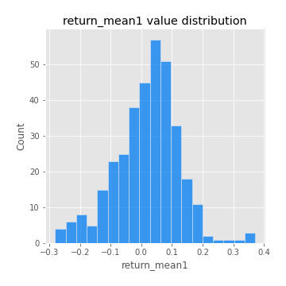
## Feature : return_mean2
- **Feature type** : continous
- **Missing** : 0.0%
- **Unique** : 347
- **Count** :347.0
- **Mean** :0.09797434209921226
- **Std** :0.1015143156729315
- **Min** :-0.24205418062825398
- **25%th Percentile** : 0.0388291720535858
- **50%th Percentile** : 0.0934654020409858
- **75%th Percentile** : 0.15809599015703885
- **Max** :0.38419848553377534

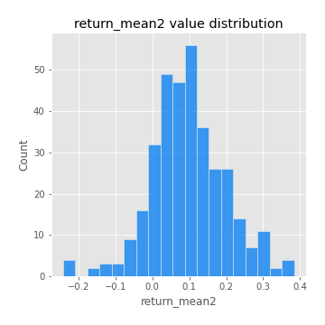
## Feature : return_sd1
- **Feature type** : continous
- **Missing** : 0.0%
- **Unique** : 347
- **Count** :347.0
- **Mean** :1.7878010063851875
- **Std** :0.7486733670630666
- **Min** :0.7470080772831957
- **25%th Percentile** : 1.5448332431081297
- **50%th Percentile** : 1.6414001692906923
- **75%th Percentile** : 1.7678091211903526
- **Max** :9.236766377527575

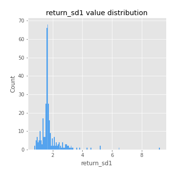
## Feature : return_sd2
- **Feature type** : continous
- **Missing** : 0.0%
- **Unique** : 347
- **Count** :347.0
- **Mean** :1.8994166510618988
- **Std** :0.7618990364873621
- **Min** :0.8592887433004143
- **25%th Percentile** : 1.6074296533544798
- **50%th Percentile** : 1.7727558541569433
- **75%th Percentile** : 1.8939569805719072
- **Max** :6.737618636746393

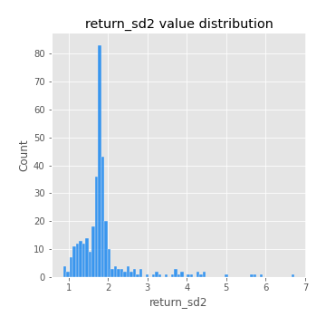
## Feature : return_skew1
- **Feature type** : continous
- **Missing** : 0.0%
- **Unique** : 347
- **Count** :347.0
- **Mean** :-0.09577179005903738
- **Std** :0.607916200885898
- **Min** :-3.530116233761814
- **25%th Percentile** : -0.28720033459526234
- **50%th Percentile** : -0.06119596623236936
- **75%th Percentile** : 0.1841133102840961
- **Max** :2.224942816365292

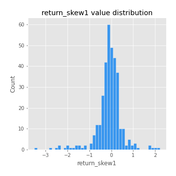
## Feature : return_skew2
- **Feature type** : continous
- **Missing** : 0.0%
- **Unique** : 347
- **Count** :347.0
- **Mean** :-0.0886558698683035
- **Std** :0.6586306877160865
- **Min** :-2.5169062744473636
- **25%th Percentile** : -0.38102414482583147
- **50%th Percentile** : -0.06634660629515715
- **75%th Percentile** : 0.17621515109298658
- **Max** :2.2606839051517187

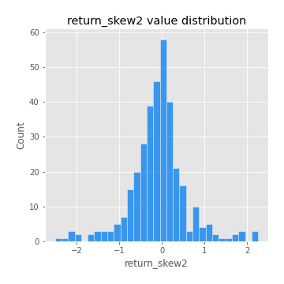
## Feature : return_kurtosis1
- **Feature type** : continous
- **Missing** : 0.0%
- **Unique** : 347
- **Count** :347.0
- **Mean** :4.008375629225741
- **Std** :5.839604617762584
- **Min** :-0.12774115715045875
- **25%th Percentile** : 0.8267684889440687
- **50%th Percentile** : 1.9677773743006974
- **75%th Percentile** : 4.314074263669278
- **Max** :36.91113889081053

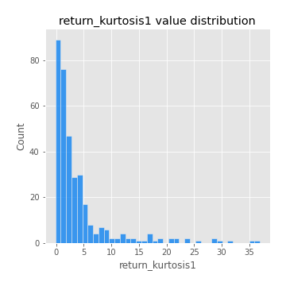
## Feature : return_kurtosis2
- **Feature type** : continous
- **Missing** : 0.0%
- **Unique** : 347
- **Count** :347.0
- **Mean** :4.648600193319896
- **Std** :5.594405805586231
- **Min** :-0.11445675811918532
- **25%th Percentile** : 1.2920398527923833
- **50%th Percentile** : 2.8779692565888593
- **75%th Percentile** : 5.2997733300595335
- **Max** :36.023880269969645

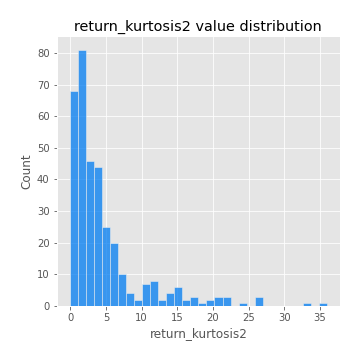
## Feature : return_autocorrelation_1_lag1
- **Feature type** : continous
- **Missing** : 0.0%
- **Unique** : 347
- **Count** :347.0
- **Mean** :-0.004987439940181101
- **Std** :0.06177248304284466
- **Min** :-0.20673896439036124
- **25%th Percentile** : -0.040819486307842615
- **50%th Percentile** : 0.0008081543088830152
- **75%th Percentile** : 0.033266209957406666
- **Max** :0.1372875467802571

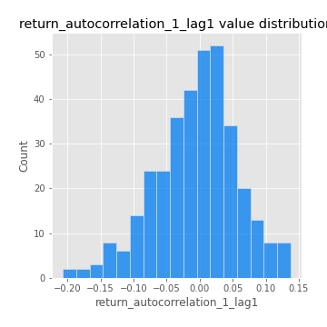
## Feature : return_autocorrelation_1_lag2
- **Feature type** : continous
- **Missing** : 0.0%
- **Unique** : 347
- **Count** :347.0
- **Mean** :0.0006765162570746653
- **Std** :0.05311915256923662
- **Min** :-0.13309283796645122
- **25%th Percentile** : -0.03529667076173612
- **50%th Percentile** : 1.731147300643271e-05
- **75%th Percentile** : 0.038158347006142346
- **Max** :0.1460021454571721

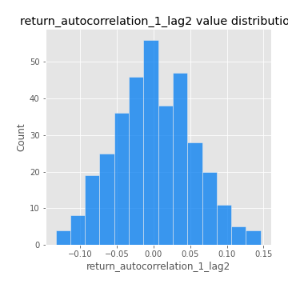
## Feature : return_autocorrelation_1_lag3
- **Feature type** : continous
- **Missing** : 0.0%
- **Unique** : 347
- **Count** :347.0
- **Mean** :0.008718038168359246
- **Std** :0.05011342186645978
- **Min** :-0.1940836867390813
- **25%th Percentile** : -0.023376209910294005
- **50%th Percentile** : 0.010292585628236864
- **75%th Percentile** : 0.0423706987171875
- **Max** :0.1275267199140229

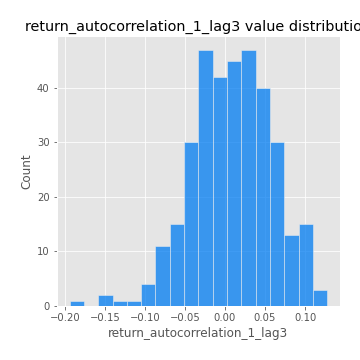
## Feature : return_autocorrelation_2_lag1
- **Feature type** : continous
- **Missing** : 0.0%
- **Unique** : 347
- **Count** :347.0
- **Mean** :-0.012407330700691709
- **Std** :0.05932436990914303
- **Min** :-0.25075531010123286
- **25%th Percentile** : -0.04431011523998623
- **50%th Percentile** : -0.009294596964635112
- **75%th Percentile** : 0.024881574232653265
- **Max** :0.16349871797309318

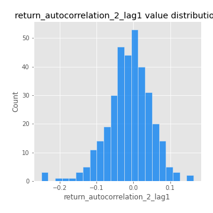
## Feature : return_autocorrelation_2_lag2
- **Feature type** : continous
- **Missing** : 0.0%
- **Unique** : 347
- **Count** :347.0
- **Mean** :-0.0003616820008806974
- **Std** :0.05195527913413506
- **Min** :-0.15323211089747296
- **25%th Percentile** : -0.03560119908667086
- **50%th Percentile** : -0.0017392404091831693
- **75%th Percentile** : 0.037591439657940935
- **Max** :0.1735398560230086

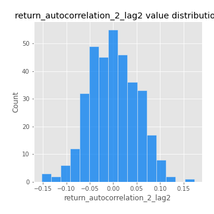
## Feature : return_autocorrelation_2_lag3
- **Feature type** : continous
- **Missing** : 0.0%
- **Unique** : 347
- **Count** :347.0
- **Mean** :-0.0017652240245879622
- **Std** :0.04944506742780953
- **Min** :-0.14200107169559698
- **25%th Percentile** : -0.035396358454653484
- **50%th Percentile** : -0.00035094100459436846
- **75%th Percentile** : 0.031382074174012
- **Max** :0.14618561423813045

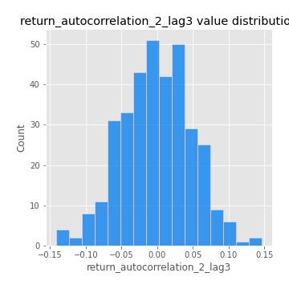
## Feature : return_correlation_ts1_lag_0
- **Feature type** : continous
- **Missing** : 0.0%
- **Unique** : 347
- **Count** :347.0
- **Mean** :0.3366228233465714
- **Std** :0.11498693818057557
- **Min** :-0.027089510445801036
- **25%th Percentile** : 0.2745809316731725
- **50%th Percentile** : 0.342828728416685
- **75%th Percentile** : 0.3946485463878955
- **Max** :0.6949986865664105

## Feature : return_correlation_ts1_lag_1
- **Feature type** : continous
- **Missing** : 0.0%
- **Unique** : 347
- **Count** :347.0
- **Mean** :-0.0028856984097799824
- **Std** :0.05213736529200653
- **Min** :-0.15776193292681923
- **25%th Percentile** : -0.035470239518950966
- **50%th Percentile** : -2.377646402126443e-05
- **75%th Percentile** : 0.03614306398126607
- **Max** :0.15499424718508623

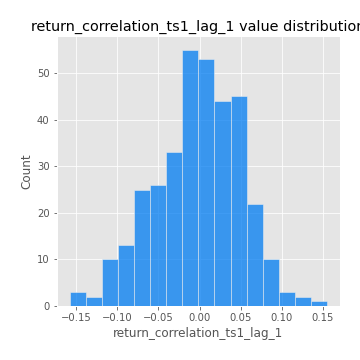
## Feature : return_correlation_ts1_lag_2
- **Feature type** : continous
- **Missing** : 0.0%
- **Unique** : 347
- **Count** :347.0
- **Mean** :0.0058915101286599785
- **Std** :0.05034287884726057
- **Min** :-0.12864410180561703
- **25%th Percentile** : -0.028025574619225287
- **50%th Percentile** : 0.005501815813235068
- **75%th Percentile** : 0.0411204014724232
- **Max** :0.17012525059346462

## Feature : return_correlation_ts1_lag_3
- **Feature type** : continous
- **Missing** : 0.0%
- **Unique** : 347
- **Count** :347.0
- **Mean** :0.00343068965944535
- **Std** :0.05068083177441463
- **Min** :-0.12306593817498207
- **25%th Percentile** : -0.0305739567445927
- **50%th Percentile** : 0.00472618870785728
- **75%th Percentile** : 0.03615622333905502
- **Max** :0.1636773216468148

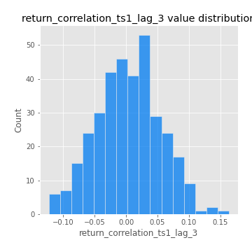
## Feature : return_correlation_ts2_lag_1
- **Feature type** : continous
- **Missing** : 0.0%
- **Unique** : 347
- **Count** :347.0
- **Mean** :-0.0015893965297248637
- **Std** :0.054760674160896514
- **Min** :-0.2081139431093261
- **25%th Percentile** : -0.03197670268558981
- **50%th Percentile** : -0.001052307586426952
- **75%th Percentile** : 0.03504478621752603
- **Max** :0.17208763791364762

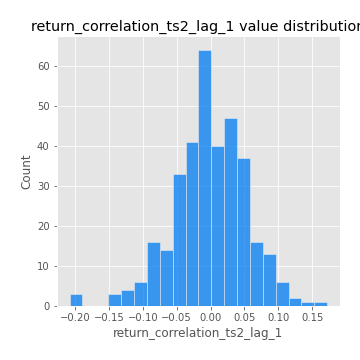
## Feature : return_correlation_ts2_lag_2
- **Feature type** : continous
- **Missing** : 0.0%
- **Unique** : 347
- **Count** :347.0
- **Mean** :0.003837756303015817
- **Std** :0.05178599768397469
- **Min** :-0.23751835475804678
- **25%th Percentile** : -0.03140300873855703
- **50%th Percentile** : 0.0031353414704733433
- **75%th Percentile** : 0.03934472344633811
- **Max** :0.15388933426238696

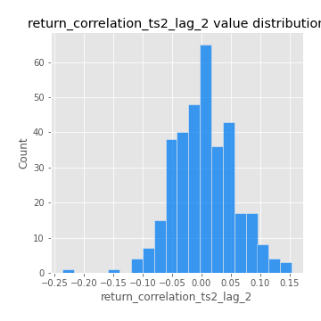
## Feature : return_correlation_ts2_lag_3
- **Feature type** : continous
- **Missing** : 0.0%
- **Unique** : 347
- **Count** :347.0
- **Mean** :0.0029816411843259175
- **Std** :0.05012923893028571
- **Min** :-0.16212823605110202
- **25%th Percentile** : -0.026947310179170895
- **50%th Percentile** : 0.0005156439438987019
- **75%th Percentile** : 0.041201217988109565
- **Max** :0.12578577770423086

## Feature : sqreturn_autocorrelation_ts1_lag1
- **Feature type** : continous
- **Missing** : 0.0%
- **Unique** : 347
- **Count** :347.0
- **Mean** :0.052900432776018094
- **Std** :0.09238957964927492
- **Min** :-0.07868276089150611
- **25%th Percentile** : -0.010012918971317949
- **50%th Percentile** : 0.031410194101034926
- **75%th Percentile** : 0.0879243935161117
- **Max** :0.49414293176447355

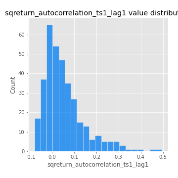
## Feature : sqreturn_autocorrelation_ts1_lag2
- **Feature type** : continous
- **Missing** : 0.0%
- **Unique** : 347
- **Count** :347.0
- **Mean** :0.045576496786118276
- **Std** :0.09043761584202209
- **Min** :-0.08457170084928592
- **25%th Percentile** : -0.011358466574390609
- **50%th Percentile** : 0.017030635823992456
- **75%th Percentile** : 0.07289157923188289
- **Max** :0.540735851444759

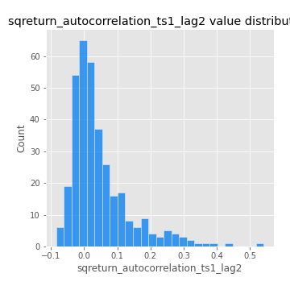
## Feature : sqreturn_autocorrelation_ts1_lag3
- **Feature type** : continous
- **Missing** : 0.0%
- **Unique** : 347
- **Count** :347.0
- **Mean** :0.03276424836928427
- **Std** :0.07946363080307706
- **Min** :-0.10172628860874787
- **25%th Percentile** : -0.015978823300210873
- **50%th Percentile** : 0.011710548254852042
- **75%th Percentile** : 0.05639283036545699
- **Max** :0.44755937369538146

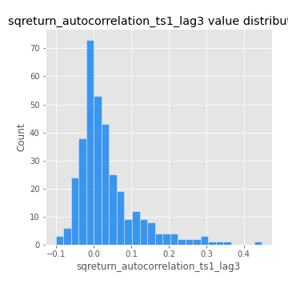
## Feature : sqreturn_autocorrelation_ts2_lag1
- **Feature type** : continous
- **Missing** : 0.0%
- **Unique** : 347
- **Count** :347.0
- **Mean** :0.046549334195425014
- **Std** :0.08745799304312461
- **Min** :-0.0868112649459376
- **25%th Percentile** : -0.01270012035353468
- **50%th Percentile** : 0.020681759813863734
- **75%th Percentile** : 0.08825199666712785
- **Max** :0.510085647437958

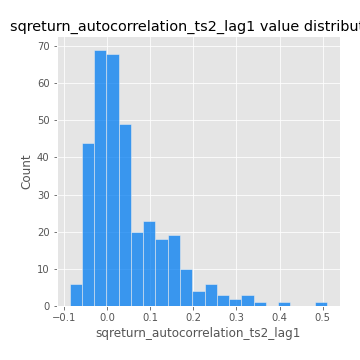
## Feature : sqreturn_autocorrelation_ts2_lag2
- **Feature type** : continous
- **Missing** : 0.0%
- **Unique** : 347
- **Count** :347.0
- **Mean** :0.03856855538399093
- **Std** :0.08912860979763684
- **Min** :-0.11559487567654123
- **25%th Percentile** : -0.013417196223070787
- **50%th Percentile** : 0.012239267024428074
- **75%th Percentile** : 0.05591037196298745
- **Max** :0.5373432415582473

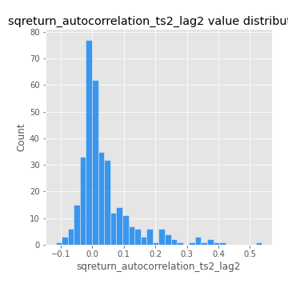
## Feature : sqreturn_autocorrelation_ts2_lag3
- **Feature type** : continous
- **Missing** : 0.0%
- **Unique** : 347
- **Count** :347.0
- **Mean** :0.023778114233440745
- **Std** :0.06950950677505138
- **Min** :-0.10757681221748441
- **25%th Percentile** : -0.018815230305138538
- **50%th Percentile** : 0.004452252391023508
- **75%th Percentile** : 0.044347627974293855
- **Max** :0.30256115637327263

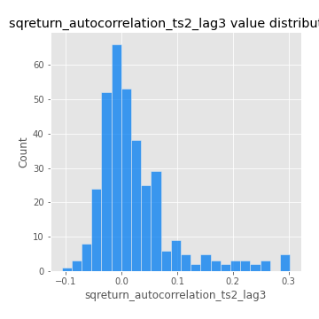
## Feature : sqreturn_correlation_ts1_lag_0
- **Feature type** : continous
- **Missing** : 0.0%
- **Unique** : 347
- **Count** :347.0
- **Mean** :0.3366228233465714
- **Std** :0.11498693818057557
- **Min** :-0.027089510445801036
- **25%th Percentile** : 0.2745809316731725
- **50%th Percentile** : 0.342828728416685
- **75%th Percentile** : 0.3946485463878955
- **Max** :0.6949986865664105

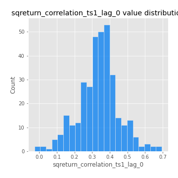
## Feature : sqreturn_correlation_ts1_lag_1
- **Feature type** : continous
- **Missing** : 0.0%
- **Unique** : 347
- **Count** :347.0
- **Mean** :-0.0028856984097799824
- **Std** :0.05213736529200653
- **Min** :-0.15776193292681923
- **25%th Percentile** : -0.035470239518950966
- **50%th Percentile** : -2.377646402126443e-05
- **75%th Percentile** : 0.03614306398126607
- **Max** :0.15499424718508623

## Feature : sqreturn_correlation_ts1_lag_2
- **Feature type** : continous
- **Missing** : 0.0%
- **Unique** : 347
- **Count** :347.0
- **Mean** :0.0058915101286599785
- **Std** :0.05034287884726057
- **Min** :-0.12864410180561703
- **25%th Percentile** : -0.028025574619225287
- **50%th Percentile** : 0.005501815813235068
- **75%th Percentile** : 0.0411204014724232
- **Max** :0.17012525059346462

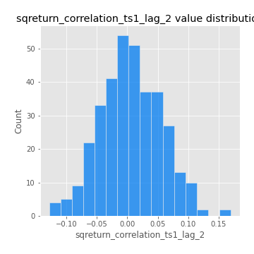
## Feature : sqreturn_correlation_ts1_lag_3
- **Feature type** : continous
- **Missing** : 0.0%
- **Unique** : 347
- **Count** :347.0
- **Mean** :0.00343068965944535
- **Std** :0.05068083177441463
- **Min** :-0.12306593817498207
- **25%th Percentile** : -0.0305739567445927
- **50%th Percentile** : 0.00472618870785728
- **75%th Percentile** : 0.03615622333905502
- **Max** :0.1636773216468148

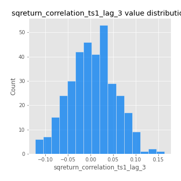
## Feature : sqreturn_correlation_ts2_lag_1
- **Feature type** : continous
- **Missing** : 0.0%
- **Unique** : 347
- **Count** :347.0
- **Mean** :-0.0015893965297248637
- **Std** :0.054760674160896514
- **Min** :-0.2081139431093261
- **25%th Percentile** : -0.03197670268558981
- **50%th Percentile** : -0.001052307586426952
- **75%th Percentile** : 0.03504478621752603
- **Max** :0.17208763791364762

## Feature : sqreturn_correlation_ts2_lag_2
- **Feature type** : continous
- **Missing** : 0.0%
- **Unique** : 347
- **Count** :347.0
- **Mean** :0.003837756303015817
- **Std** :0.05178599768397469
- **Min** :-0.23751835475804678
- **25%th Percentile** : -0.03140300873855703
- **50%th Percentile** : 0.0031353414704733433
- **75%th Percentile** : 0.03934472344633811
- **Max** :0.15388933426238696

## Feature : sqreturn_correlation_ts2_lag_3
- **Feature type** : continous
- **Missing** : 0.0%
- **Unique** : 347
- **Count** :347.0
- **Mean** :0.0029816411843259175
- **Std** :0.05012923893028571
- **Min** :-0.16212823605110202
- **25%th Percentile** : -0.026947310179170895
- **50%th Percentile** : 0.0005156439438987019
- **75%th Percentile** : 0.041201217988109565
- **Max** :0.12578577770423086

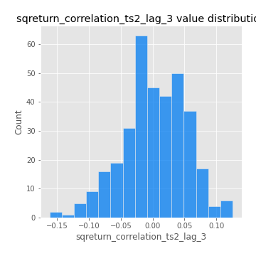
## Feature : price2_granger_cause_price1
- **Feature type** : continous
- **Missing** : 0.0%
- **Unique** : 347
- **Count** :347.0
- **Mean** :0.25917092782164936
- **Std** :0.29163551281473366
- **Min** :2.5091061535769788e-12
- **25%th Percentile** : 0.011697495730137203
- **50%th Percentile** : 0.1321862260221771
- **75%th Percentile** : 0.4405128101292429
- **Max** :0.9979553937700073

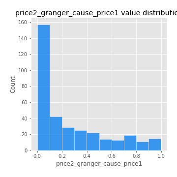
## Feature : price1_granger_cause_price2
- **Feature type** : continous
- **Missing** : 0.0%
- **Unique** : 347
- **Count** :347.0
- **Mean** :0.31117469903799616
- **Std** :0.2860311291787
- **Min** :3.895491857667972e-06
- **25%th Percentile** : 0.05274525723980105
- **50%th Percentile** : 0.22440917159906373
- **75%th Percentile** : 0.5378824031032216
- **Max** :0.9951398266867577

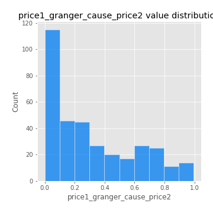

[<< Go back](../README.md)
