# Summary of 2_DecisionTree

[<< Go back](../README.md)

## Decision Tree
- **n_jobs**: -1
- **criterion**: gini
- **max_depth**: 3
- **explain_level**: 2

## Validation
 - **validation_type**: split
 - **train_ratio**: 0.75
 - **shuffle**: True
 - **stratify**: True

## Optimized metric
accuracy

## Training time

4.8 seconds

## Metric details
|           |    score |   threshold |
|:----------|---------:|------------:|
| logloss   | 0.346793 |  nan        |
| auc       | 0.948732 |  nan        |
| f1        | 0.895833 |    0.470588 |
| accuracy  | 0.885057 |    0.470588 |
| precision | 0.826923 |    0.470588 |
| recall    | 1        |    0        |
| mcc       | 0.783014 |    0.470588 |

## Confusion matrix (at threshold=0.470588)
|                      |   Predicted as real |   Predicted as simulated |
|:---------------------|--------------------:|-------------------------:|
| Labeled as real      |                  34 |                        9 |
| Labeled as simulated |                   1 |                       43 |

## Learning curves
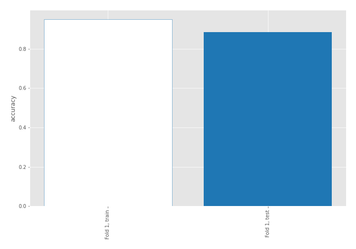

## Decision Tree 

### Tree #1
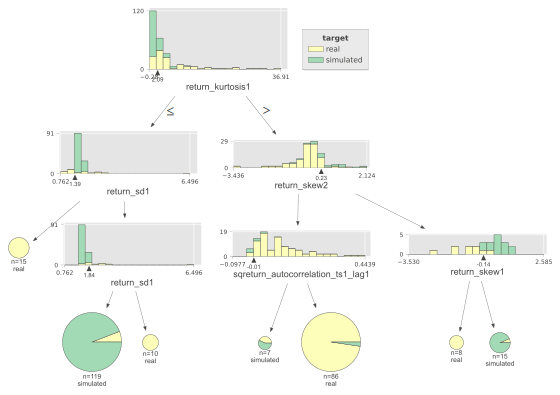

### Rules

if (return_kurtosis1 <= 2.094) and (return_sd1 > 1.394) and (return_sd1 <= 1.844) then class: simulated (proba: 94.12%) | based on 119 samples

if (return_kurtosis1 > 2.094) and (return_skew2 <= 0.226) and (sqreturn_autocorrelation_ts1_lag1 > -0.01) then class: real (proba: 97.67%) | based on 86 samples

if (return_kurtosis1 > 2.094) and (return_skew2 > 0.226) and (return_skew1 > -0.141) then class: simulated (proba: 93.33%) | based on 15 samples

if (return_kurtosis1 <= 2.094) and (return_sd1 <= 1.394) then class: real (proba: 100.0%) | based on 15 samples

if (return_kurtosis1 <= 2.094) and (return_sd1 > 1.394) and (return_sd1 > 1.844) then class: real (proba: 100.0%) | based on 10 samples

if (return_kurtosis1 > 2.094) and (return_skew2 > 0.226) and (return_skew1 <= -0.141) then class: real (proba: 100.0%) | based on 8 samples

if (return_kurtosis1 > 2.094) and (return_skew2 <= 0.226) and (sqreturn_autocorrelation_ts1_lag1 <= -0.01) then class: simulated (proba: 57.14%) | based on 7 samples

## Permutation-based Importance
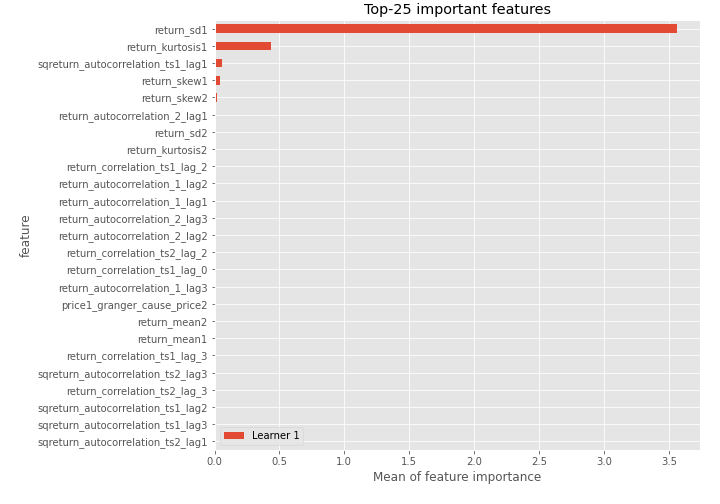
## Confusion Matrix

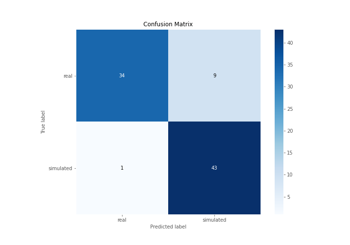

## Normalized Confusion Matrix

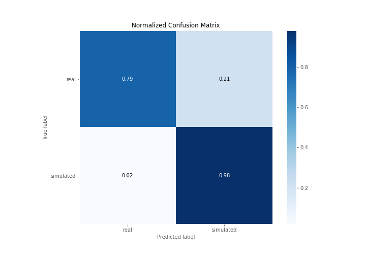

## ROC Curve

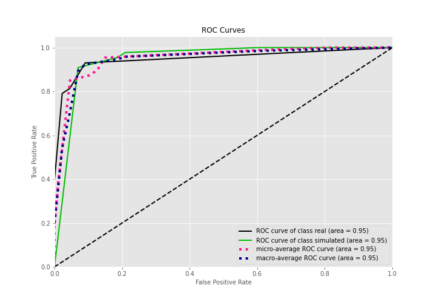

## Kolmogorov-Smirnov Statistic

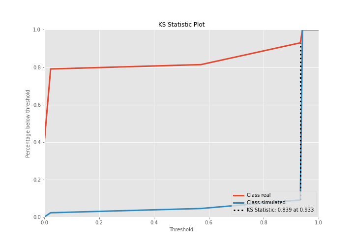

## Precision-Recall Curve

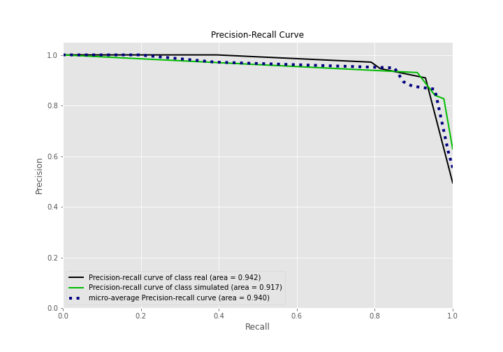

## Calibration Curve

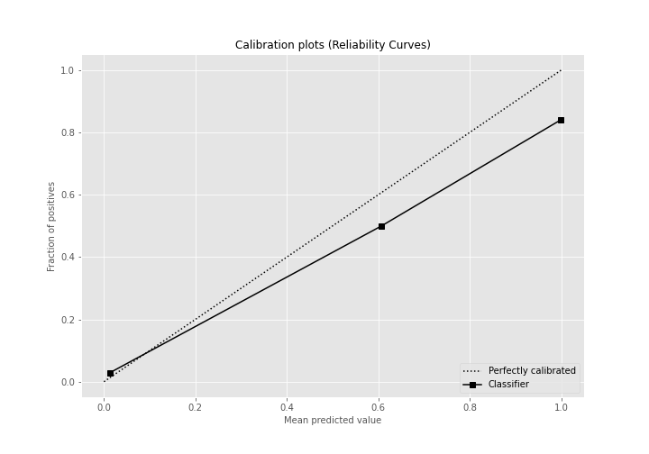

## Cumulative Gains Curve

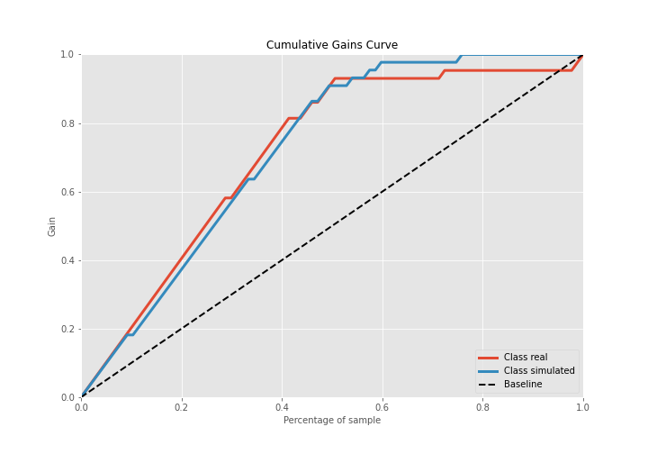

## Lift Curve

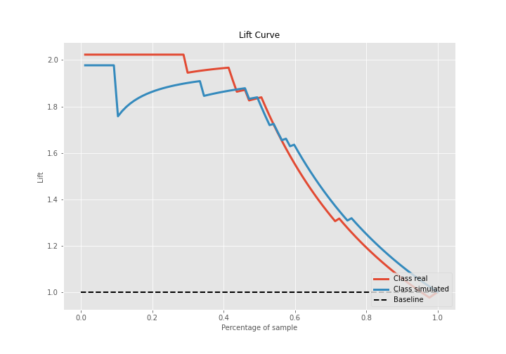

## SHAP Importance
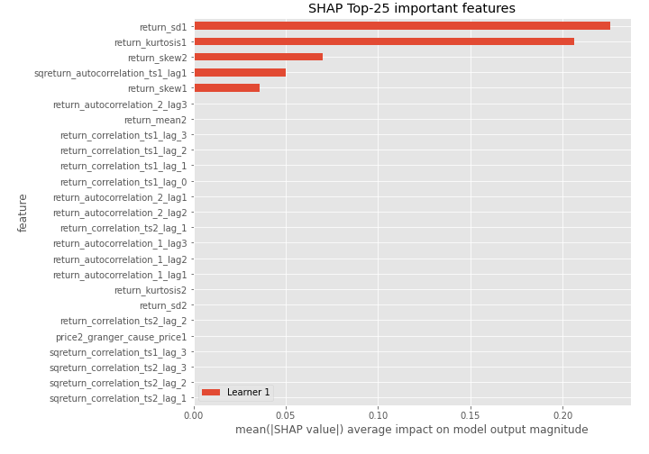

## SHAP Dependence plots

### Dependence (Fold 1)
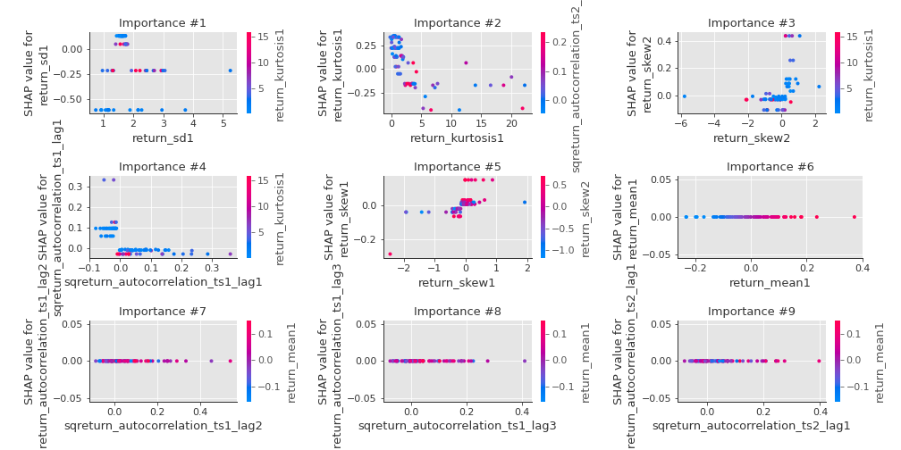

## SHAP Decision plots

### Top-10 Worst decisions for class 0 (Fold 1)
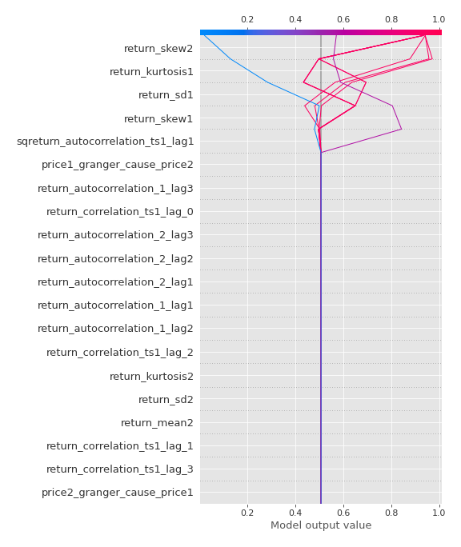
### Top-10 Best decisions for class 0 (Fold 1)
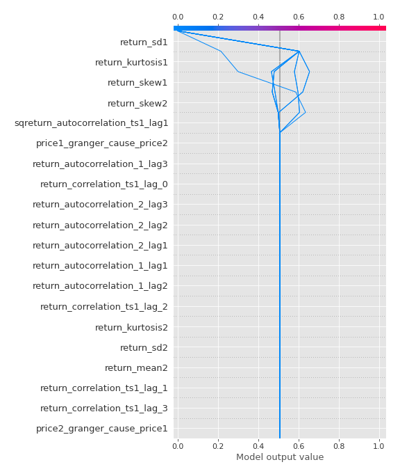
### Top-10 Worst decisions for class 1 (Fold 1)
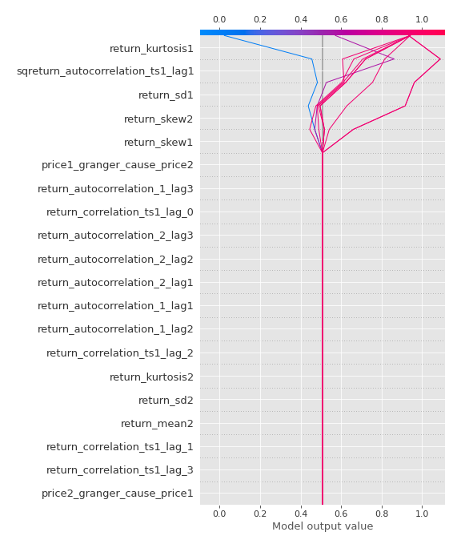
### Top-10 Best decisions for class 1 (Fold 1)
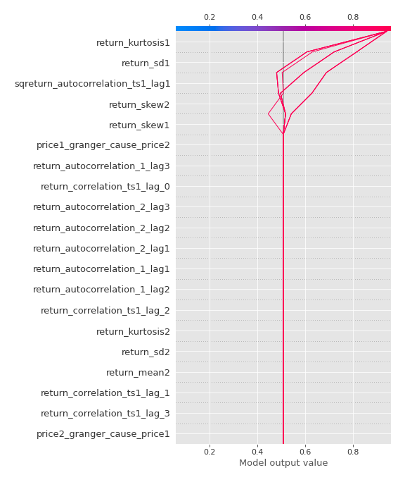

[<< Go back](../README.md)
